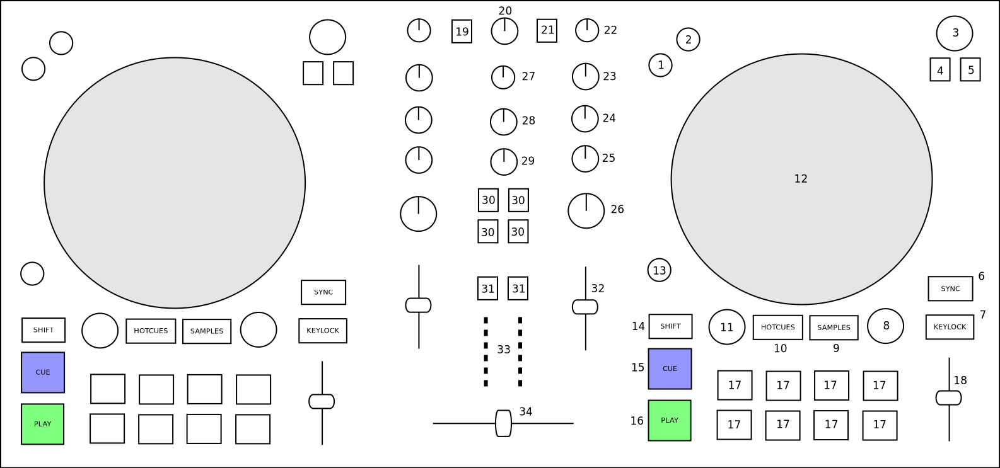

Native Instruments Traktor Kontrol S2 MK3
=========================================

The Kontrol S2 MK3 is a two-channel controller with an integrated sound card. It has two integrated stereo outputs (line and 1/8" / 3.5 mm TRS), headphone outputs (1/8" / 3.5 mm TRS) and microphone
inputs (1/4" / 6.3 mm TRS). The MK3 uses the standard HID protocol to send and receive signals from a computer, so it can work with Mixxx. The Kontrol S2 MK3 can run from USB bus power,
and using a separate power supply has no impact on the output level or LED brightness (`as opposed to the MK2 <https://support.native-instruments.com/hc/en-us/articles/360001108518>`__).

-  `Manufacturer’s product page <https://www.native-instruments.com/en/products/traktor/dj-controllers/traktor-kontrol-s2/>`__

.. versionadded:: 2.2.4

Mixxx Sound Hardware Preferences
~~~~~~~~~~~~~~~~~~~~~~~~~~~~~~~~

-  Master output: channels 1-2
-  Headphone output: channels 3-4

Mixxx mapping
~~~~~~~~~~~~~

Since v2.3 the Master knob is intentionally not linked to Mixxx's Main Gain,
`following NI's suggestions <https://support.native-instruments.com/hc/en-us/community/posts/360005413857-The-Traktor-S2MK3-Low-output-issue-en-us-?page=1#community_comment_360000742537>`__.
Indeed this knob also sets the hardware gain, and mosts sets require a high setting.

   Native Instruments Traktor Kontrol S2 MK3 (schematic view)

+------------------+-----------------------------------------------------------------------------------------------------------------------------+-----------------------------------------------------+
| Element          | Primary function                                                                                                            | Secondary function (+ SHIFT)                        |
+==================+=============================================================================================================================+=====================================================+
| (1) REV Button   | Reverse play while held                                                                                                     | Reverse play + slip mode while held                 |
+------------------+-----------------------------------------------------------------------------------------------------------------------------+-----------------------------------------------------+
| (2) FLX Button   | Enable and disable slip mode                                                                                                |                                                     |
+------------------+-----------------------------------------------------------------------------------------------------------------------------+-----------------------------------------------------+
| (3) Browse knob  | Scroll vertically in library                                                                                                | Scroll horizontally in library                      |
| (turn)           |                                                                                                                             |                                                     |
+------------------+-----------------------------------------------------------------------------------------------------------------------------+-----------------------------------------------------+
| (3) Browse knob  | Load selected track into deck                                                                                               | Eject current track                                 |
| (press)          |                                                                                                                             |                                                     |
+------------------+-----------------------------------------------------------------------------------------------------------------------------+-----------------------------------------------------+
| (4) Preparation  | Add selected track to AutoDJ queue (bottom)                                                                                 | Add selected track to AutoDJ queue (top)            |
| button           |                                                                                                                             |                                                     |
+------------------+-----------------------------------------------------------------------------------------------------------------------------+-----------------------------------------------------+
| (5) List view    | Toggles maximizing the library                                                                                              |                                                     |
| button           |                                                                                                                             |                                                     |
+------------------+-----------------------------------------------------------------------------------------------------------------------------+-----------------------------------------------------+
| (6) Sync button  | Syncs the BPM and phase (depending on quantize). Press longer to activate master sync on that deck.                         | Syncs the phase to that of the other track          |
+------------------+-----------------------------------------------------------------------------------------------------------------------------+-----------------------------------------------------+
| (7) Keylock      | Enable keylock for the deck                                                                                                 |                                                     |
| button           |                                                                                                                             |                                                     |
+------------------+-----------------------------------------------------------------------------------------------------------------------------+-----------------------------------------------------+
| (8) Loop knob    | Halve or double loop size                                                                                                   |                                                     |
| (turn)           |                                                                                                                             |                                                     |
+------------------+-----------------------------------------------------------------------------------------------------------------------------+-----------------------------------------------------+
| (8) Loop knob    | Set a loop of the defined number of beats and enables the loop                                                              | Toggles the current loop on or off                  |
| (press)          |                                                                                                                             |                                                     |
+------------------+-----------------------------------------------------------------------------------------------------------------------------+-----------------------------------------------------+
| (9) Samples      | Active sampler mode (for the number buttons)                                                                                |                                                     |
| button           |                                                                                                                             |                                                     |
+------------------+-----------------------------------------------------------------------------------------------------------------------------+-----------------------------------------------------+
| (10) Hotcues     | Activate hotcue mode (for the number buttons)                                                                               |                                                     |
| button           |                                                                                                                             |                                                     |
+------------------+-----------------------------------------------------------------------------------------------------------------------------+-----------------------------------------------------+
| (11) Move knob   | Beatjump backwards/forwards                                                                                                 | Halve or double beatjump size                       |
| (turn)           |                                                                                                                             |                                                     |
+------------------+-----------------------------------------------------------------------------------------------------------------------------+-----------------------------------------------------+
| (11) Move knob   | Activates a rolling loop of the defined number of beats. Once disabled, playback will resume where the track would have     | Activate current loop, jump to its loop in point,   |
| (press)          | been if it had not entered the loop                                                                                         | and stop playback                                   |
+------------------+-----------------------------------------------------------------------------------------------------------------------------+-----------------------------------------------------+
| (12) Jog wheels  | Control scratching when touched from the top *(Missing: temporarily bend the pitch when touched from the side)*             |                                                     |
+------------------+-----------------------------------------------------------------------------------------------------------------------------+-----------------------------------------------------+
| (13) Grid button | Adjust beatgrid so closest beat is aligned with the current play position                                                   | Adjust beatgrid to match another playing deck       |
+------------------+-----------------------------------------------------------------------------------------------------------------------------+-----------------------------------------------------+
| (14) Shift       | Activates secondary functions when pressed                                                                                  |                                                     |
| button           |                                                                                                                             |                                                     |
+------------------+-----------------------------------------------------------------------------------------------------------------------------+-----------------------------------------------------+
| (15) CUE button  | CUE default                                                                                                                 | If the CUE point is set, jump to it and stops       |
+------------------+-----------------------------------------------------------------------------------------------------------------------------+-----------------------------------------------------+
| (16) Play button | Toggles playing                                                                                                             | Seeks a player to the start and then stops it       |
+------------------+-----------------------------------------------------------------------------------------------------------------------------+-----------------------------------------------------+
| (17) Number      | Function depends on current mode                                                                                            |                                                     |
| buttons          |                                                                                                                             |                                                     |
+------------------+-----------------------------------------------------------------------------------------------------------------------------+-----------------------------------------------------+
| Hotcue mode      | If hotcue is set, seeks the player to hotcue position. Otherwise set hotcue at current position                             | Clear the hotcue                                    |
+------------------+-----------------------------------------------------------------------------------------------------------------------------+-----------------------------------------------------+
| Samples mode     | If track is loaded into corresponding slot, go to CUE point and play                                                        | If track is playing, CUE default behaviour.         |
|                  |                                                                                                                             | Otherwise eject track                               |
+------------------+-----------------------------------------------------------------------------------------------------------------------------+-----------------------------------------------------+
| (18) Tempo fader | Speed control                                                                                                               |                                                     |
+------------------+-----------------------------------------------------------------------------------------------------------------------------+-----------------------------------------------------+
| (19) Quantize    | Toggles quantization for both decks                                                                                         |                                                     |
| button           |                                                                                                                             |                                                     |
+------------------+-----------------------------------------------------------------------------------------------------------------------------+-----------------------------------------------------+
| (20) Gain knob   | Adjusts the hardware gain - it is unlinked to the software main gain since v2.3                                             |                                                     |
+------------------+-----------------------------------------------------------------------------------------------------------------------------+-----------------------------------------------------+
| (21) Microphone  | Toggles microphone talkover, long press for permanent activation                                                            |                                                     |
| button           |                                                                                                                             |                                                     |
+------------------+-----------------------------------------------------------------------------------------------------------------------------+-----------------------------------------------------+
| (22) Pre-Gain    | Adjusts the pre-fader gain of the deck                                                                                      |                                                     |
| knob             |                                                                                                                             |                                                     |
+------------------+-----------------------------------------------------------------------------------------------------------------------------+-----------------------------------------------------+
| (23) HI knob     | High frequency filter                                                                                                       |                                                     |
+------------------+-----------------------------------------------------------------------------------------------------------------------------+-----------------------------------------------------+
| (24) MID knob    | Middle frequency filter                                                                                                     |                                                     |
+------------------+-----------------------------------------------------------------------------------------------------------------------------+-----------------------------------------------------+
| (25) LOW knob    | Low frequency filter                                                                                                        |                                                     |
+------------------+-----------------------------------------------------------------------------------------------------------------------------+-----------------------------------------------------+
| (26) Effect      | Quick effect superknob for the corresponding deck                                                                           |                                                     |
| Superknob        |                                                                                                                             |                                                     |
+------------------+-----------------------------------------------------------------------------------------------------------------------------+-----------------------------------------------------+
| (27) Sample knob | Adjusts the pregain for all the sample decks combined                                                                       |                                                     |
+------------------+-----------------------------------------------------------------------------------------------------------------------------+-----------------------------------------------------+
| (28) Headphone   | Adjusts the cue/main mix in the headphone output                                                                            |                                                     |
| mix knob         |                                                                                                                             |                                                     |
+------------------+-----------------------------------------------------------------------------------------------------------------------------+-----------------------------------------------------+
| (29) Headphone   | Adjusts the headphone output gain                                                                                           |                                                     |
| gain knob        |                                                                                                                             |                                                     |
+------------------+-----------------------------------------------------------------------------------------------------------------------------+-----------------------------------------------------+
| (30) Effect      | Enable or disable effect units for both decks                                                                               |                                                     |
| buttons          |                                                                                                                             |                                                     |
+------------------+-----------------------------------------------------------------------------------------------------------------------------+-----------------------------------------------------+
| (31) Headphone   | Toggles headphone cueing                                                                                                    |                                                     |
| buttons          |                                                                                                                             |                                                     |
+------------------+-----------------------------------------------------------------------------------------------------------------------------+-----------------------------------------------------+
| (32) Volume      | Adjusts the channel volume fader for the corresponding deck                                                                 |                                                     |
| fader            |                                                                                                                             |                                                     |
+------------------+-----------------------------------------------------------------------------------------------------------------------------+-----------------------------------------------------+
| (33) VuMeter     | Show the current instantaneous deck volume                                                                                  |                                                     |
| LEDs             |                                                                                                                             |                                                     |
+------------------+-----------------------------------------------------------------------------------------------------------------------------+-----------------------------------------------------+
| (34) Crossfader  | Adjusts the crossfader between both decks                                                                                   |                                                     |
+------------------+-----------------------------------------------------------------------------------------------------------------------------+-----------------------------------------------------+
