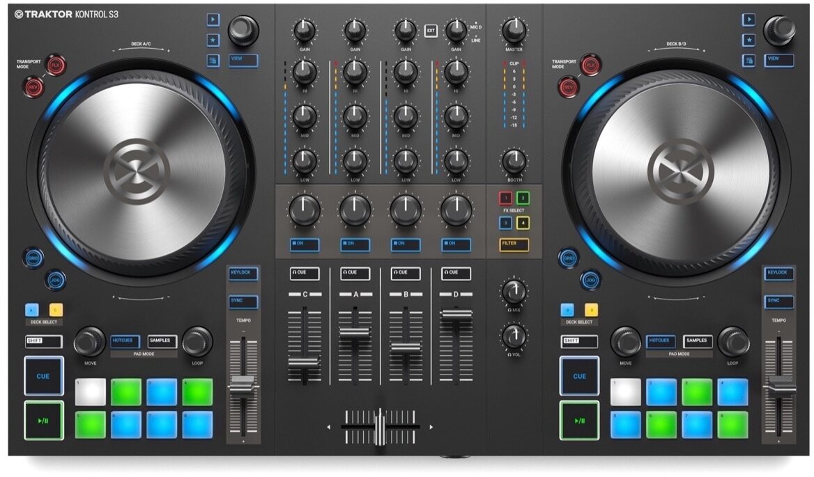

Native Instruments Traktor Kontrol S3
=====================================

.. versionadded:: 2.3.0

   Native Instruments Traktor Kontrol S3 (top view)

References:

  - `Manufacturer's product
    page <https://www.native-instruments.com/en/products/traktor/dj-controllers/traktor-kontrol-s3/>`__
  - `DJTechTools
    review <https://djtechtools.com/2019/10/16/traktor-kontrol-s3-the-middle-child-for-the-mk3-traktor-generation/>`__
  - `DJWORX
    overview <https://djworx.com/the-traktor-kontrol-s3-we-have-it-but-not-the-software/>`__

The Kontrol S3 is an introductory 4 deck controller with good build
quality and integrated sound card. This is the first controller released
with the "S3" name.

The Kontrol S3 can run from USB bus power. Using the separate power
supply increases the brightness of the LEDs, which is helpful for using
it in daylight, and increases the volume of the headphone output.

Compatibility
-------------

Controller
~~~~~~~~~~

The Kontrol S3 is a USB class compliant audio and HID device,
so it is compatible with Mixxx without any proprietary drivers on
GNU/Linux and Mac OS X. On Windows, it is recommended to install the
`driver from Native
Instruments <https://www.native-instruments.com/en/support/downloads/drivers-other-files/>`__
and select the ASIO sound API in the Sound Hardware section of Mixxx's
Preferences.

With the S3 plugged in, a MIDI device is listed as an available
controller in Mixxx's Preferences. The controller uses
HID for the knobs, buttons, and other components on the device, so the
mapping can only be loaded when you select the HID device on the left
side of Mixxx's Preferences.

Mapping description
-------------------

Note that Mixxx doesn't have the concept of a single "master" deck for
sync. Instead, push and hold the sync button to "lock" sync on for all
decks you want to remain in sync. Or you can push Shift + Sync to lock
sync on. Refer to `the Mixxx
manual <http://www.mixxx.org/manual/2.0/chapters/djing_with_mixxx.html#master-sync>`__
for details.

Mixer
~~~~~

  - Gain, equalizer high/mid/low, and cue (headphones)
    behave as labelled.
  - FX Enable buttons: See Effect section below.
  - Filter: controls QuickEffect superknob. This controls the Filter
    effect by default, but a different effect can be chosen in the
    Equalizer section of Mixxs's Preferences.
  - EXT: The EXT button changes the fourth channel pregain (knob), pfl, and volume (slider) adjustments to operate with the Microphone input.  The microphone does not respond to EQ or effects.
  - Shift + EXT: Switches input from Mic to Line and back again.

The Master Volume knob on the S3 controls the volume of the S3's master
output in hardware, so it does not affect the software master gain knob
in Mixxx by default. You can hold shift and turn the knob to adjust Mixxx's
master gain.  Note that this will still also adjust the hardware gain, so
after you release shift you'll need to adjust the knob again.

Peak display is only generated from software. So if
you see clipping indicated, lower the gain of the playing decks or use Shift + Master Volume.

Decks
~~~~~

  - Pressing the library knob: Load track selected in library to the deck.
  - Shift + pressing knob: Eject track.
  - Small play button: While held, plays the current track in the preview deck.  If you rotate the library knob while you hold the play button, Mixxx will scan through the track being previewed.
  - Star button: This button is not used (yet).
  - List-plus button: Adds the current track to the Auto DJ list.
  - View button: move focus of library control between left-hand tree and main list.

Transport Mode Buttons
~~~~~~~~~~~~~~~~~~~~~~

  - REV: Activates a reverse-roll (aka "censor") effect.
  - Shift + REV: Turns on reverse playback mode.
  - GRID: Turns on Quantize mode.
  - FLUX: Turns on Slip mode.
  - JOG: Hold to use the wheels to quickly scroll through the track

Looping
~~~~~~~

  - Right Encoder Turn: double/halve loop size.
  - Right Encoder Press: activate loop of set size from current position.
  - Shift + Right Encoder Press: Toggles the existing loop on and off.
  - Left Encoder Turn: Beatjump forward/backward.
  - Shift + Left Encoder Turn: Adjust beatjump size.
  - Left Encoder Press: Activates beatloop roll.
  - Shift + Left Encoder Press: Activates a loop and then stops.

Rate / Keylock
~~~~~~~~~~~~~~

There are two ways the rate sliders can be mapped: Absolute, and Relative.  Absolute mode is the default. In this mode, the position of the pitch slider matches the on-screen pitch slider position.  If the sliders are misaligned, Mixxx engages "soft takeover mode" -- Mixxx won't update the value of the slider until the controller matches the GUI. In Relative mode, moving the slider always adjusts the value of the pitch slider, even if they don't match.

  - Absolute Mode:
    - Keylock: Press to toggle keylock mode.
    - Sync: Press to beatsync, or press and hold to activate Sync Lock Mode.
    - Pitch slider: Adjusts playback speed.
    - Shift + Pitch slider: Adjusts musical key
  - Relative Mode:
    - Keylock: Press to toggle keylock mode.
    - Sync: Press to beatsync, or press and hold to activate Sync Lock Mode.
    - Pitch slider: Adjusts playback speed.
    - Keylock + Pitch Slider: adjusts musical key
    - Shift + Pitch Slider: Allows the user to move the slider without any effect.

Effects
~~~~~~~

The FX setup is unusual on this controller.  Each deck has a single toggle button for effects, and on the right-hand side of the mixer there are five buttons that determine which effects are applied to every channel that has effects on.  This means it is not possible to use the controller to select one effect for one deck, and another effect for another.  You can still make these choices in the Mixxx UI, however.

When the Filter Enable button is off, the knob still controls the default QuickEffect, even if that button is not lit in the FX section. When the Filter Enable button is on, the QuickEffect is only enabled if the Filter FX Select button is on.  This means the QuickEffect is available on channels that don't have any other effects active.

When turning Filter Enable off, Mixxx will use soft takeover so the QuickEffect doesn't suddenly activate.

Mapping options
~~~~~~~~~~~~~~~

There are two user-friendly customizations possible on the S3:

  1. Toggle between Absolute and Relative pitch slider mode.
  2. Customize the colors for decks A, B, C, and D.

Making these changes is still a little awkward and we will be making
controller preferences easier to change in the future. For now you'll
have to make a small change to the mapping script file. Don't worry, the
actual edit only involves replacing a single word in a text file.

1.  Open Mixxx Preferences and select the Kontrol S3 in the side list.
2.  You should see a series of tabs at the top of the preferences
    window, one of which is "Scripts". Select that tab.
3.  Select "Traktor-Kontrol-S3-hid-scripts.js".
4.  Click "Open Selected File."
5.  Either the file should open in an editor, or you should see a file
    browser window with that file selected. If you see a file browser,
    right click the file and select an option to edit it.
6.  At the top of the file will be short instructions explaining what to
    do.
