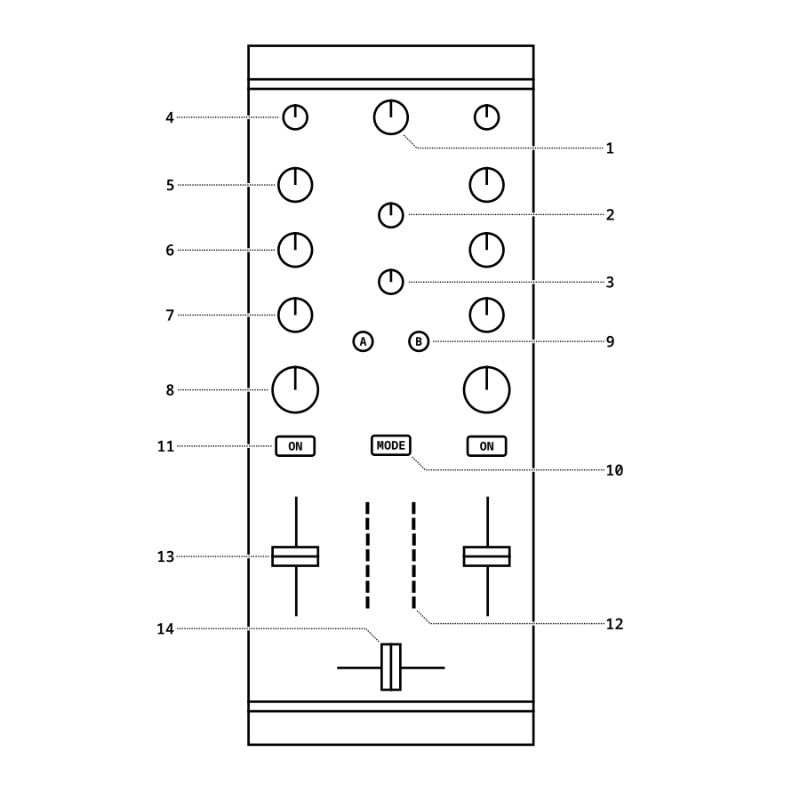

.. _native-instruments-traktor-kontrol-z1:

Native Instruments Traktor Kontrol Z1
=====================================

Native Instruments Traktor Kontrol Z1 is a two-deck ultra-compact DJ controller with an integrated sound card. It features stereo sound output using two unbalanced RCA connectors and a standard headphone output (1/8" / 3.5 mm TRS) jack. The controller can be powered directly from the USB bus or by using an external power adapter.

- `Manufacturer’s product page <https://www.native-instruments.com/en/products/traktor/dj-controllers/traktor-kontrol-z1/>`__

Compatibility
~~~~~~~~~~~~~

The Kontrol Z1 is a HID and USB audio class compliant device, which makes it fully compatible with Mixxx. It requires no proprietary drivers when used on Linux or macOS. For Windows, download and install the latest driver from `the manufacturer's website <https://www.native-instruments.com/en/support/downloads/drivers-other-files/>`__.

Audio hardware setup
~~~~~~~~~~~~~~~~~~~~

The Z1 has a standard 4-channel sound card. Configure the channels in Mixxx as follows:

============  =====================
Audio output  Channel configuration
============  =====================
Main          Channel 1-2
Headphones    Channel 3-4
============  =====================

Controller overview
~~~~~~~~~~~~~~~~~~~

   Native Instruments Traktor Kontrol Z1 (schematic view)

Mapping description
~~~~~~~~~~~~~~~~~~~

Mixxx mapping for the Kontrol Z1 differs slightly from the manufacturer's standard mapping. Various tweaks have been implemented to make the Kontrol Z1 more usable as a single controller.

+----+-----------------------+-------------------------------------------------------------------------------------------------------------------+-----------------------------------------------------+
| No | Element               | Primary function                                                                                                  | Secondary function (+ Mode)                         |
+====+=======================+===================================================================================================================+=====================================================+
| 1  | Main knob             | Hardware main output volume (not mapped)                                                                          |                                                     |
+----+-----------------------+-------------------------------------------------------------------------------------------------------------------+-----------------------------------------------------+
| 2  | Cue vol knob          | Hardware headphone output volume (not mapped)                                                                     |                                                     |
+----+-----------------------+-------------------------------------------------------------------------------------------------------------------+-----------------------------------------------------+
| 3  | Cue mix knob          | Adjusts the cue / main mix in the headphone output                                                                |                                                     |
+----+-----------------------+-------------------------------------------------------------------------------------------------------------------+-----------------------------------------------------+
| 4  | Gain knob             | Adjusts the pre-fader gain of the deck                                                                            |                                                     |
+----+-----------------------+-------------------------------------------------------------------------------------------------------------------+-----------------------------------------------------+
| 5  | Hi knob               | High frequency filter                                                                                             |                                                     |
+----+-----------------------+-------------------------------------------------------------------------------------------------------------------+-----------------------------------------------------+
| 6  | Mid knob              | Middle frequency filter                                                                                           |                                                     |
+----+-----------------------+-------------------------------------------------------------------------------------------------------------------+-----------------------------------------------------+
| 7  | Low knob              | Low frequency filter                                                                                              |                                                     |
+----+-----------------------+-------------------------------------------------------------------------------------------------------------------+-----------------------------------------------------+
| 8  | Filter / FX knob      | Adjusts quick effect superknob for the deck                                                                       |                                                     |
+----+-----------------------+-------------------------------------------------------------------------------------------------------------------+-----------------------------------------------------+
| 9  | Headphone button      | Toggles headphone cueing on / off                                                                                 | Seek track to cue and stop                          |
+----+-----------------------+-------------------------------------------------------------------------------------------------------------------+-----------------------------------------------------+
| 10 | Mode button           | Activates secondary functions when pressed                                                                        |                                                     |
+----+-----------------------+-------------------------------------------------------------------------------------------------------------------+-----------------------------------------------------+
| 11 | Filter / FX On button | Toggles quick effect on / off                                                                                     | Start / stop track playback                         |
+----+-----------------------+-------------------------------------------------------------------------------------------------------------------+-----------------------------------------------------+
| 12 | VU Meters             | Show the current instantaneous deck volume                                                                        |                                                     |
+----+-----------------------+-------------------------------------------------------------------------------------------------------------------+-----------------------------------------------------+
| 13 | Volume faders         | Adjusts the channel volume fader for the corresponding deck                                                       |                                                     |
+----+-----------------------+-------------------------------------------------------------------------------------------------------------------+-----------------------------------------------------+
| 14 | Crossfader            | Adjusts the crossfader between both decks                                                                         |                                                     |
+----+-----------------------+-------------------------------------------------------------------------------------------------------------------+-----------------------------------------------------+
