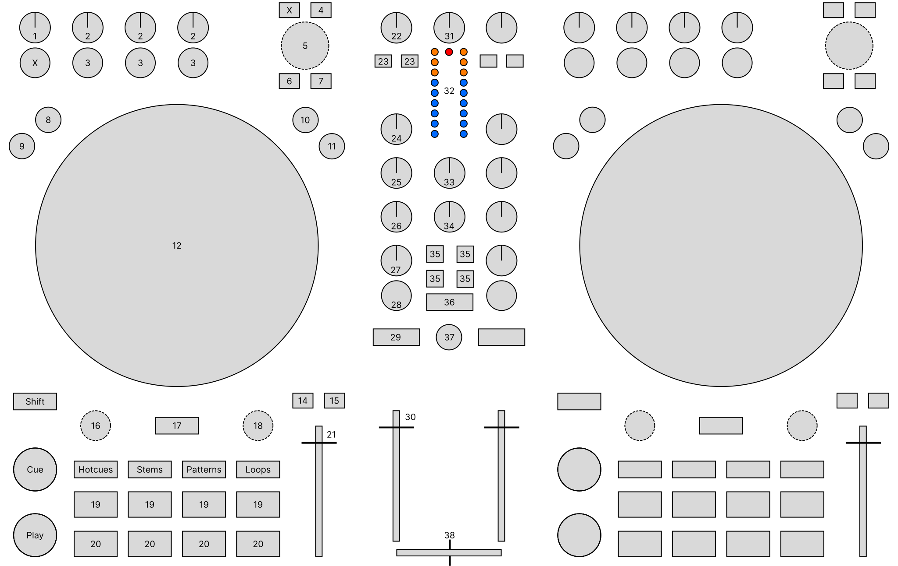

(native-instruments-traktor-mx2)=

# Native Instruments Traktor MX2


The MX2 is a two-channel controller with an integrated sound card. It has two integrated stereo outputs (line and 1/8" / 3.5 mm TRS), headphone outputs (1/8" / 3.5 mm TRS) and microphone inputs (1/4" / 6.3 mm TRS). The MX2 uses the standard HID protocol to send and receive signals from a computer, so it can work with Mixxx.

- [Manufacturer’s product page](https://www.native-instruments.com/de/products/traktor/dj-controllers/traktor-mx2/)
- [Mapping forum thread](https://mixxx.discourse.group/t/native-instruments-traktor-mx2/33225)

:::{versionadded} 2.6.0
:::

## Mixxx Sound Hardware Preferences


- Main output: channels 1-2
- Headphone output: channels 3-4

## Controller Preferences


- **Use Pattern Mode for Samplers**: Allows the Pattern mode to take control of Mixxx's sampler decks instead of remaining unused.

## Mixxx Mapping


The Mixxx mapping for the MX2 is designed to mirror Native Instruments' original layout as closely as possible, while replacing some Traktor only features with Mixxx's ones like Patterns (Traktor) → Samplers (Mixxx). For a reference to the original Traktor layout, you can consult [section 4 of their manual](https://www.native-instruments.com/fileadmin/ni_media/downloads/manuals/traktor/Traktor_MX2_user_guide-en.pdf).

Please refer to the sections below for the exact mapping of all elements:

- [Effect Units](#effect-units)
- [Overview](#overview)
- [Channel Controls (1-30)](#channel-controls-1-30)
- [Multi-Function Controls](#multi-function-controls)
- [Mixer Controls (31-38)](#mixer-controls-31-38)

### Effect Units


The effect units support cycling through four distinct modes by pressing {kbd}`SHIFT` + Misc (leftmost button in the FX section): **Group Mode**, **Single 1**, **Single 2**, and **Single 3**.

- **Group Mode**: Controls three independent effects. The three effect buttons toggle their respective effects on or off. The three effect parameter knobs control the 'meta' parameter for the effects.
- **Single Mode (1, 2, or 3)**: Focuses the controller on one specific effect slot. The Misc button acts as an on/off toggle for the focused effect. It lights up in red (Single 1), blue (Single 2), or green (Single 3) to clearly indicate the active slot. The three effect buttons control the first, second, and third button parameters of the focused effect, respectively. The three parameter knobs control the first, second, and third parameters of the focused effect, respectively.

In all modes, {kbd}`SHIFT` + Effect Button cycles the selected effect in the button's effect slot. The `Mix` knob (leftmost) controls the 'dry/wet' parameter for the whole unit.

### Overview


```{figure-md}
:align: center



Native Instruments Traktor MX2 (schematic view)
```

### Channel Controls (1-30)


| Element | Primary function | Secondary function (+ SHIFT) |
| --- | --- | --- |
| **1**. FX Main knob | *See Multi-Function Controls table below* | |
| **2**. FX Param knob | *See Multi-Function Controls table below* | |
| **3**. FX Toggle button | *See Multi-Function Controls table below* | |
| **4**. Preparation button | Add selected track to AutoDJ queue (bottom) | Add selected track to AutoDJ queue (top) |
| **5**. Browse knob | *See Multi-Function Controls table below* | |
| **6**. Preview button | Load selected track into preview deck, or play/pause if already loaded<br><br>Buttons are linked: preview on channels 1 & 2 control the same preview deck | |
| **7**. List view button | Toggle maximizing the library | |
| **8**. FLX button | Enable and disable slip mode | |
| **9**. REV button | Reverse play while held | Reverse play + slip mode while held |
| **10**. Turntable button | Set jog wheel to **Turntable Mode** | |
| **11**. Jog button | Set jog wheel to **Jog Mode** | |
| **12**. Jog wheel | **Turntable Mode**: Control scratching when touched from the top (bend the pitch when touched from the side)<br><br>**Jog Mode**: Temporarily bend the pitch | |
| **Shift** button | Activates secondary functions when pressed | |
| **14**. Sync button | Sync the BPM and phase (depending on quantize). Press longer to activate sync lock on that deck | Sync the phase to that of the other track |
| **15**. Sync master button | Set the deck as sync leader | |
| **16**. Move knob | *See Multi-Function Controls table below* | |
| **17**. Keylock | *See Multi-Function Controls table below* | |
| **18**. Loop knob | *See Multi-Function Controls table below* | |
| **CUE** button | CUE default | If the CUE point is set, jump to it and stop |
| **Play** button | Toggle playing | Seek the player to the start and then stop it |
| **Hotcues** button | Activate **Hotcue Mode** (for the number buttons) | |
| **Stems** button | Activate **Stems Mode** (for the number buttons) | |
| **Patterns** button | Activate **Sampler Mode** (if enabled in Controller Preferences) (for the number buttons) | |
| **Loops** button | Activate **Loops Mode** (for the number buttons) | |
| **19**. Number buttons 1-4 | *See Multi-Function Controls table below* | |
| **20**. Number buttons 5-8 | *See Multi-Function Controls table below* | |
| **21**. Tempo fader | Adjust tempo and (if not keylocked) speed | |
| **22**. Pre-Gain knob | Adjust the pre-fader gain of the deck | |
| **23**. FX select button | Select whether FX1 / FX2 should be applied to the deck | |
| **24**. HI knob | High frequency filter | |
| **25**. MID knob | Middle frequency filter | |
| **26**. LOW knob | Low frequency filter | |
| **27**. GFX parameter knob | Quick effect (**35**, **36**) 'meta' parameter knob for the deck | |
| **28**. GFX toggle button | Toggle whether GFX (**35**, **36**) should be applied to the deck. Hold while pressing **35** or **36** to enable the effect only on this channel | |
| **29**. Headphone button | Toggle headphone cueing | |
| **30**. Volume fader | Adjust the channel volume fader for the corresponding deck | |

### Multi-Function Controls


| Element | Primary function | Secondary function (+ SHIFT) |
| --- | --- | --- |
| **1**. FX Main knob | **All modes**: Control the 'dry/wet' parameter of FX1 / FX2 | |
| **2**. FX Param knob | **Group Mode**: Control the 'meta' parameter of effects 1-3 in FX1 / FX2<br><br>**Single Mode (1-3)**: Control the 1st, 2nd, and 3rd parameters of the focused effect, respectively | |
| **3**. FX Toggle button | **Group Mode**: Toggle effects 1-3 in FX1 / FX2<br><br>**Single Mode (1-3)**: Control the 1st, 2nd, and 3rd button parameters of the focused effect, respectively | **All modes**: Cycle through effects |
| **X** Misc button (leftmost in FX) | **Group Mode**: (No primary function)<br><br>**Single Mode (1-3)**: Toggle the focused effect on/off | **All modes**: Cycle through effect unit modes (Group → Single 1 → Single 2 → Single 3 → Group) |
| **5**. Browse knob **turn** | **Default**: Scroll in tracks table<br>**Preview playing**: Seek through preview<br>**Sampler Mode** (Hold pads 5-8): Change pregain of sampler | Scroll in tree view |
| **5**. Browse knob **press** | **Hovering Track**: Load selected track into deck<br>**Hovering Library**: Expand / Collapse hovered item | Go to tracks table of currently hovered item |
| **16**. Move knob **turn** | **Default**: Beatjump backwards/forwards<br><br>**Stems Mode** (Hold pads 5-8): Control volume of stem<br><br>**Sampler Mode** (Hold pads 5-8): Seek through sampler track | Halve or double beatjump size |
| **16**. Move knob **press** | **Default**: Activate a rolling loop of the defined number of beats. Once disabled, playback will resume where the track would have been if it had not entered the loop | Activate current loop, jump to its loop in point, and stop playback |
| **17**. Keylock button | **Default**: Enable keylock for the deck. Toggle loop knob **18** to **Pitch Mode** while being held<br><br>**Sampler Mode** (Hold pads 5-8): Toggle sampler keylock | |
| **18**. Loop knob **turn** | **Default**: Halve or double loop size<br><br>**Pitch Mode**: Change pitch of the track<br><br>**Stems Mode** (Hold pads 5-8): Control the 'meta' parameter of the stems' effect<br><br>**Sampler Mode** (Hold pads 5-8): Change rate (speed, pitch depending on keylock) of sampler | Cycle through effects |
| **18**. Loop knob **press** | **Default**: Set a loop of the defined number of beats and enable the loop<br><br>**Sampler Mode** (Hold pads 5-8): Toggle sampler repeat | Toggle the current loop on or off |
| **19**. Number buttons 1-4 | **Hotcue Mode**: If hotcue is set, seek the player to hotcue position. Otherwise set hotcue at current position<br><br>**Stems Mode**: Toggle mute stem 1-4<br><br>**Sampler Mode**: Toggle the playback state of the sampler (sampler 1-4 on channel 1, sampler 5-8 on channel 2)<br><br>**Loops Mode**: Enable a rolling loop of 1/16, 1/8, 1/4, 1/2 beats while being held | Clear the hotcue<br><br>Enable default loop instead |
| **20**. Number buttons 5-8 | **Hotcue Mode**: like **19**<br><br>**Stems Mode**: Hold to use stems modifier functions (see **16**, **18**)<br><br>**Sampler Mode**: Hold to use sampler modifier functions (see **5**, **16**, **17**, **18**)<br>(sampler 1-4 on channel 1, sampler 5-8 on channel 2)<br><br>**Loops Mode**: Enable a rolling loop of 1, 2, 4, 8 beats while being held | like **19**<br><br>Enable a default loop instead |

### Mixer Controls (31-38)


| Element | Primary function | Secondary function (+ SHIFT) |
| --- | --- | --- |
| **31**. Gain knob | *Unmapped* (adjusts the hardware gain) | |
| **32**. VuMeter LEDs | Show the current instantaneous deck volume | |
| **33**. Headphone mix knob | Adjust the cue/main mix in the headphone output | |
| **34**. Headphone gain knob | Adjust the headphone output gain | |
| **35**. Effect buttons (GFX) | Load preset from the Quick Effect presets list on both decks. The first 8 presets from the list can be selected<br>Press the button once to get the first preset, press twice for the second preset<br>Press once (Press twice):<br>1 (5)  2 (6)<br>3 (7)  4 (8) | |
| **36**. Filter effect button (GFX) | Load the 'Filter' effect preset | |
| **37**. Microphone button | Toggle microphone talkover, long press for permanent activation | |
| **38**. Crossfader | Adjust the crossfader between both decks | |
