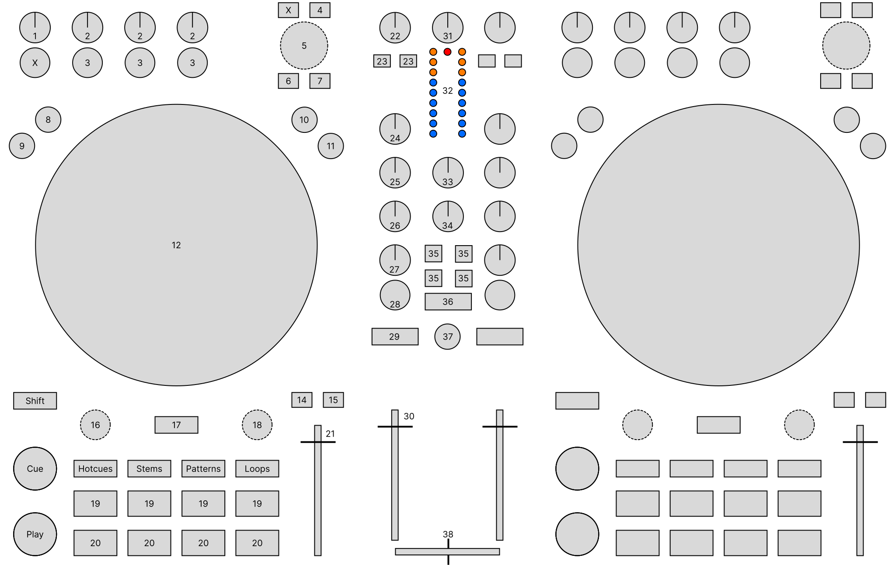

.. _native-instruments-traktor-mx2:

Native Instruments Traktor MX2
==============================

The MX2 is a two-channel controller with an integrated sound card. It has two integrated stereo outputs (line and 1/8" / 3.5 mm TRS), headphone outputs (1/8" / 3.5 mm TRS) and microphone
inputs (1/4" / 6.3 mm TRS). The MX2 uses the standard HID protocol to send and receive signals from a computer, so it can work with Mixxx.

- `Manufacturer’s product page <https://www.native-instruments.com/de/products/traktor/dj-controllers/traktor-mx2/>`__
- `Mapping forum thread <https://mixxx.discourse.group/t/native-instruments-traktor-mx2/33225>`__

.. versionadded:: 2.6.0

Mixxx Sound Hardware Preferences
~~~~~~~~~~~~~~~~~~~~~~~~~~~~~~~~

-  Main output: channels 1-2
-  Headphone output: channels 3-4

Mixxx mapping
~~~~~~~~~~~~~

- The Mixxx mapping tries to be as close as possible to NI's original mappings which you can find here: `In section 4 of their manual <https://www.native-instruments.com/fileadmin/ni_media/downloads/manuals/traktor/Traktor_MX2_user_guide-en.pdf>`__

   Native Instruments Traktor MX2 (schematic view)

Channel Controls (1-30)
+++++++++++++++++++++++

+--------------------+-----------------------------------------------------------------------------------------------------------------------------+-----------------------------------------------------+
| Element            | Primary function                                                                                                            | Secondary function (+ SHIFT)                        |
+====================+=============================================================================================================================+=====================================================+
| **1**. FX Main knob| Control the 'Dry/Wet' Parameter of FX1 / FX2                                                                                |                                                     |
+--------------------+-----------------------------------------------------------------------------------------------------------------------------+-----------------------------------------------------+
| **2**. FX Param    | Control the 'meta' Parameter of Effect 1-3 in FX1 / FX2                                                                     |                                                     |
| knob               |                                                                                                                             |                                                     |
+--------------------+-----------------------------------------------------------------------------------------------------------------------------+-----------------------------------------------------+
| **3**. FX Toggle   | Toggles Effect 1-3 in FX1 / FX2                                                                                             |                                                     |
| button             |                                                                                                                             |                                                     |
+--------------------+-----------------------------------------------------------------------------------------------------------------------------+-----------------------------------------------------+
| **4**. Preparation | Add selected track to AutoDJ queue (bottom)                                                                                 | Add selected track to AutoDJ queue (top)            |
| button             |                                                                                                                             |                                                     |
+--------------------+-----------------------------------------------------------------------------------------------------------------------------+-----------------------------------------------------+
| **5**. Browse knob | Scroll in Tracks table                                                                                                      | Scroll in tree view                                 |
| **turn**           |                                                                                                                             |                                                     |
+--------------------+-----------------------------------------------------------------------------------------------------------------------------+-----------------------------------------------------+
| **5**. Browse knob | Load selected track into deck                                                                                               | Go to tracks table of currently hovered item        |
| **press**          |                                                                                                                             |                                                     |
+--------------------+-----------------------------------------------------------------------------------------------------------------------------+-----------------------------------------------------+
| **6**. Preview     | | Load selected track into preview deck / play, pause if already loaded                                                     |                                                     |
| button             |                                                                                                                             |                                                     |
|                    | Buttons are linked -> preview on channel 1 & 2 control the same preview deck                                                |                                                     |
+--------------------+-----------------------------------------------------------------------------------------------------------------------------+-----------------------------------------------------+
| **7**. List view   | Toggles maximizing the library                                                                                              |                                                     |
| button             |                                                                                                                             |                                                     |
+--------------------+-----------------------------------------------------------------------------------------------------------------------------+-----------------------------------------------------+
| **8**. FLX button  | Enable and disable slip mode                                                                                                |                                                     |
+--------------------+-----------------------------------------------------------------------------------------------------------------------------+-----------------------------------------------------+
| **9**. REV button  | Reverse play while held                                                                                                     | Reverse play + slip mode while held                 |
+--------------------+-----------------------------------------------------------------------------------------------------------------------------+-----------------------------------------------------+
| **10**. Turntable  | Set jog wheel mode to 'turntable'                                                                                           |                                                     |
| button             |                                                                                                                             |                                                     |
+--------------------+-----------------------------------------------------------------------------------------------------------------------------+-----------------------------------------------------+
| **11**. Jog button | Set jog wheel mode to 'jog'                                                                                                 |                                                     |
+--------------------+-----------------------------------------------------------------------------------------------------------------------------+-----------------------------------------------------+
| **12**. Jog wheels | | 'turntable' mode: Control scratching when touched from the top (Temporarily bend the pitch when touched from the side)    |                                                     |
|                    |                                                                                                                             |                                                     |
|                    | 'jog' mode:       Temporarily bend the pitch                                                                                |                                                     |
+--------------------+-----------------------------------------------------------------------------------------------------------------------------+-----------------------------------------------------+
| **Shift** button   | Activates secondary functions when pressed                                                                                  |                                                     |
+--------------------+-----------------------------------------------------------------------------------------------------------------------------+-----------------------------------------------------+
| **14**. Sync button| Syncs the BPM and phase (depending on quantize). Press longer to activate sync lock on that deck.                           | Syncs the phase to that of the other track          |
+--------------------+-----------------------------------------------------------------------------------------------------------------------------+-----------------------------------------------------+
| **15**. Sync master| Set the deck as sync leader                                                                                                 |                                                     |
| button             |                                                                                                                             |                                                     |
+--------------------+-----------------------------------------------------------------------------------------------------------------------------+-----------------------------------------------------+
| **16**. Move knob  | | Beatjump backwards/forwards                                                                                               | | Halve or double beatjump size                     |
| **turn**           |                                                                                                                             |                                                     |
|                    | while **Stems** is active and **20** is held: see 'Stems mode'                                                              |                                                     |
+--------------------+-----------------------------------------------------------------------------------------------------------------------------+-----------------------------------------------------+
| Stems mode         | Control volume of stem                                                                                                      |                                                     |
+--------------------+-----------------------------------------------------------------------------------------------------------------------------+-----------------------------------------------------+
| **16**. Move knob  | Activates a rolling loop of the defined number of beats. Once disabled, playback will resume where the track would have     | Activate current loop, jump to its loop in point,   |
| **press**          | been if it had not entered the loop                                                                                         | and stop playback                                   |
+--------------------+-----------------------------------------------------------------------------------------------------------------------------+-----------------------------------------------------+
| **17**. Keylock    | Enable keylock for the deck                                                                                                 |                                                     |
| button             |                                                                                                                             |                                                     |
+--------------------+-----------------------------------------------------------------------------------------------------------------------------+-----------------------------------------------------+
| **18**. Loop knob  | | Halve or double loop size                                                                                                 |                                                     |
| **turn**           |                                                                                                                             |                                                     |
|                    | while **Stems** is active and **20** is held: see 'Stems mode'                                                              |                                                     |
+--------------------+-----------------------------------------------------------------------------------------------------------------------------+-----------------------------------------------------+
| Stems mode         | Control the 'meta' parameter of the stem effect                                                                             | Cycle through effects                               |
+--------------------+-----------------------------------------------------------------------------------------------------------------------------+-----------------------------------------------------+
| **18**. Loop knob  | Set a loop of the defined number of beats and enables the loop                                                              | Toggles the current loop on or off                  |
| **press**          |                                                                                                                             |                                                     |
+--------------------+-----------------------------------------------------------------------------------------------------------------------------+-----------------------------------------------------+
| **CUE** button     | CUE default                                                                                                                 | If the CUE point is set, jump to it and stops       |
+--------------------+-----------------------------------------------------------------------------------------------------------------------------+-----------------------------------------------------+
| **Play** button    | Toggles playing                                                                                                             | Seeks a player to the start and then stops it       |
+--------------------+-----------------------------------------------------------------------------------------------------------------------------+-----------------------------------------------------+
| **Hotcues**        | Activate hotcue mode (for the number buttons)                                                                               |                                                     |
| button             |                                                                                                                             |                                                     |
+--------------------+-----------------------------------------------------------------------------------------------------------------------------+-----------------------------------------------------+
| **Stems**          | Activate stems mode (for the number buttons)                                                                                |                                                     |
| button             |                                                                                                                             |                                                     |
+--------------------+-----------------------------------------------------------------------------------------------------------------------------+-----------------------------------------------------+
| **Patterns**       | Activate patterns mode (for the number buttons) --> currently not implemented                                               |                                                     |
| button             |                                                                                                                             |                                                     |
+--------------------+-----------------------------------------------------------------------------------------------------------------------------+-----------------------------------------------------+
| **Loops**          | Activate loops mode (for the number buttons)                                                                                |                                                     |
| button             |                                                                                                                             |                                                     |
+--------------------+-----------------------------------------------------------------------------------------------------------------------------+-----------------------------------------------------+
| **19**. Number     | Function depends on current mode                                                                                            |                                                     |
| buttons 1-4        |                                                                                                                             |                                                     |
+--------------------+-----------------------------------------------------------------------------------------------------------------------------+-----------------------------------------------------+
| Hotcue mode        | If hotcue is set, seeks the player to hotcue position. Otherwise set hotcue at current position                             | Clear the hotcue                                    |
+--------------------+-----------------------------------------------------------------------------------------------------------------------------+-----------------------------------------------------+
| Stems mode         | Toggle mute stem 1-4                                                                                                        |                                                     |
+--------------------+-----------------------------------------------------------------------------------------------------------------------------+-----------------------------------------------------+
| Loops mode         | Enable a loop of 1/16, 1/8, 1/4, 1/2 beats while beeing held                                                                | Enable rolling loop instead                         |
+--------------------+-----------------------------------------------------------------------------------------------------------------------------+-----------------------------------------------------+
| **20**. Number     | Function depends on current mode                                                                                            |                                                     |
| buttons 5-8        |                                                                                                                             |                                                     |
+--------------------+-----------------------------------------------------------------------------------------------------------------------------+-----------------------------------------------------+
| Hotcue mode        | like **19**                                                                                                                 | like **19**                                         |
+--------------------+-----------------------------------------------------------------------------------------------------------------------------+-----------------------------------------------------+
| Stems mode         | Toggle move and loop knob to stems mode while beeing held                                                                   |                                                     |
+--------------------+-----------------------------------------------------------------------------------------------------------------------------+-----------------------------------------------------+
| Loops mode         | Enable a loop of 1, 2, 4, 8 beats while beeing held                                                                         | Enable a rolling loop instead                       |
+--------------------+-----------------------------------------------------------------------------------------------------------------------------+-----------------------------------------------------+
| **21**. Tempo fader| Speed control                                                                                                               |                                                     |
+--------------------+-----------------------------------------------------------------------------------------------------------------------------+-----------------------------------------------------+
| **22**. Pre-Gain   | Adjusts the pre-fader gain of the deck                                                                                      |                                                     |
| knob               |                                                                                                                             |                                                     |
+--------------------+-----------------------------------------------------------------------------------------------------------------------------+-----------------------------------------------------+
| **23**. FX select  | Selects whether FX1 / FX2 should be applied to the deck                                                                     |                                                     |
| button             |                                                                                                                             |                                                     |
+--------------------+-----------------------------------------------------------------------------------------------------------------------------+-----------------------------------------------------+
| **24**. HI knob    | High frequency filter                                                                                                       |                                                     |
+--------------------+-----------------------------------------------------------------------------------------------------------------------------+-----------------------------------------------------+
| **25**. MID knob   | Middle frequency filter                                                                                                     |                                                     |
+--------------------+-----------------------------------------------------------------------------------------------------------------------------+-----------------------------------------------------+
| **26**. LOW knob   | Low frequency filter                                                                                                        |                                                     |
+--------------------+-----------------------------------------------------------------------------------------------------------------------------+-----------------------------------------------------+
| **27**. GFX        | Quick effect (35, 36) 'meta' parameter knob for the deck                                                                    |                                                     |
| parameter knob     |                                                                                                                             |                                                     |
+--------------------+-----------------------------------------------------------------------------------------------------------------------------+-----------------------------------------------------+
| **28**. GFX toggle | Toggles whether GFX (35, 36) should be applied to the deck                                                                  |                                                     |
| button             |                                                                                                                             |                                                     |
+--------------------+-----------------------------------------------------------------------------------------------------------------------------+-----------------------------------------------------+
| **29**. Headphone  | Toggles headphone cueing                                                                                                    |                                                     |
| button            |                                                                                                                              |                                                     |
+--------------------+-----------------------------------------------------------------------------------------------------------------------------+-----------------------------------------------------+
| **30**. Volume     | Adjusts the channel volume fader for the corresponding deck                                                                 |                                                     |
| fader              |                                                                                                                             |                                                     |
+--------------------+-----------------------------------------------------------------------------------------------------------------------------+-----------------------------------------------------+

Mixer Controls (31-38)
+++++++++++++++++++++++

+--------------------+-----------------------------------------------------------------------------------------------------------------------------+-----------------------------------------------------+
| Element            | Primary function                                                                                                            | Secondary function (+ SHIFT)                        |
+====================+=============================================================================================================================+=====================================================+
| **31**. Gain knob  | *Unmapped* (adjusts the hardware gain)                                                                                      |                                                     |
+--------------------+-----------------------------------------------------------------------------------------------------------------------------+-----------------------------------------------------+
| **32**. VuMeter    | Show the current instantaneous deck volume                                                                                  |                                                     |
| LEDs               |                                                                                                                             |                                                     |
+--------------------+-----------------------------------------------------------------------------------------------------------------------------+-----------------------------------------------------+
| **33**. Headphone  | Adjusts the cue/main mix in the headphone output                                                                            |                                                     |
| mix knob           |                                                                                                                             |                                                     |
+--------------------+-----------------------------------------------------------------------------------------------------------------------------+-----------------------------------------------------+
| **34**. Headphone  | Adjusts the headphone output gain                                                                                           |                                                     |
| gain knob          |                                                                                                                             |                                                     |
+--------------------+-----------------------------------------------------------------------------------------------------------------------------+-----------------------------------------------------+
| **35**. Effect     | | Load preset from the Quick Effect presets list on both decks. 8 first presets from the list can be selected.              | Load preset on selected deck                        |
| buttons (GFX)      | | Press the button once to get the first preset, press twice for the second preset.                                         |                                                     |
|                    | | Press once (Press twice):                                                                                                 |                                                     |
|                    | | 1 (5)  2 (6)                                                                                                              |                                                     |
|                    | | 3 (7)  4 (8)                                                                                                              |                                                     |
+--------------------+-----------------------------------------------------------------------------------------------------------------------------+-----------------------------------------------------+
| **36** Filter      | Loads the 'Filter' effect preset                                                                                            |                                                     |
| effect button (GFX)|                                                                                                                             |                                                     |
+--------------------+-----------------------------------------------------------------------------------------------------------------------------+-----------------------------------------------------+
| **37**. Microphone | Toggles microphone talkover, long press for permanent activation                                                            |                                                     |
| button             |                                                                                                                             |                                                     |
+--------------------+-----------------------------------------------------------------------------------------------------------------------------+-----------------------------------------------------+
| **38**. Crossfader | Adjusts the crossfader between both decks                                                                                   |                                                     |
+--------------------+-----------------------------------------------------------------------------------------------------------------------------+-----------------------------------------------------+
