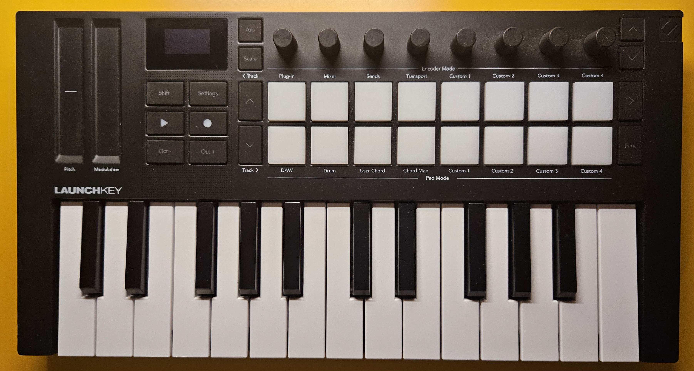
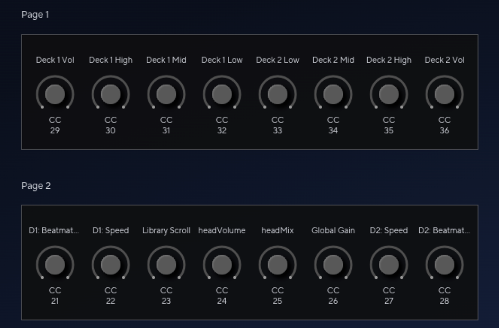
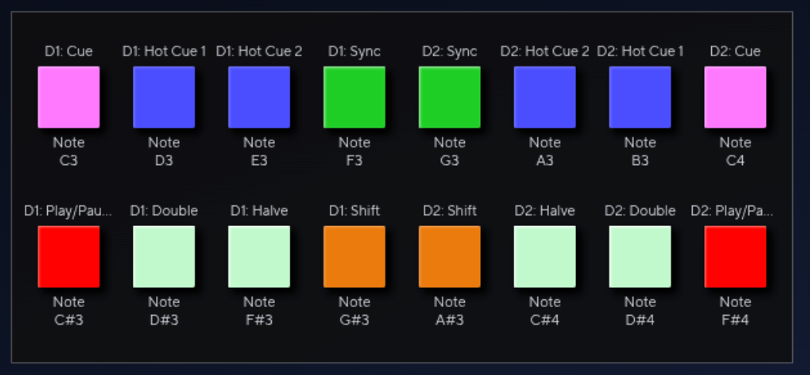

(novation_launchkey_mini_mk4_25)=

# Novation Launchkey Mini MK4 25

:::{sectionauthor} Matteo Tacconi <teotexeplus@gmail.com>
:::

The Novation Launchkey Mini MK4 25 is a compact 25-key MIDI keyboard controller featuring velocity-sensitive pads, capacitive touch strips, and endless rotary encoders.

## Setup & Novation Components

This mapping requires a custom Custom Mode profile loaded onto the controller using **Novation Components**. All controls (pads, knobs, strips) are configured to send MIDI messages on **MIDI Channel 5**.

1. Download the custom SysEx profile files:
   * [Knobs](../../_static/controllers/novation_launchkey_mini_mk4_25/MixxxKnobs.syx)
   * [Pads](../../_static/controllers/novation_launchkey_mini_mk4_25/MixxxPads.syx)
2. Connect your Launchkey Mini MK4 25 to your computer.
3. Open [Novation Components](https://components.novationmusic.com/) in a WebMIDI-compatible browser (e.g. Google Chrome or Brave).
4. Upload the downloaded `.syx` files to your device and assign them to **Custom Mode 1**.

## Controller Mapping

### Encoders (Knobs)

The 8 rotary encoders are split into two pages via Novation Components (both sending on MIDI Channel 5):

 

**Page 1 (Mixer & EQ):**

* **Deck 1 Vol (CC 29)**: Adjusts Deck 1 Volume.
* **Deck 1 High (CC 30)**: Adjusts Deck 1 High EQ.
* **Deck 1 Mid (CC 31)**: Adjusts Deck 1 Mid EQ.
* **Deck 1 Low (CC 32)**: Adjusts Deck 1 Low EQ.
* **Deck 2 Low (CC 33)**: Adjusts Deck 2 Low EQ.
* **Deck 2 Mid (CC 34)**: Adjusts Deck 2 Mid EQ.
* **Deck 2 High (CC 35)**: Adjusts Deck 2 High EQ.
* **Deck 2 Vol (CC 36)**: Adjusts Deck 2 Volume.

**Page 2 (Navigation, Pitch & Headphones):**

* **D1: Beatmatch (CC 21)**: 14-bit relative encoder jog-nudge for Deck 1.
* **D1: Speed (CC 22)**: Adjusts Deck 1 Pitch/Tempo slider.
* **Library Scroll (CC 23)**: Scrolls through track library lists.
* **headVolume (CC 24)**: Adjusts Headphone Gain/Volume.
* **headMix (CC 25)**: Adjusts Headphone Mix (Cue/Master).
* **Global Gain (CC 26)**: Adjusts Main/Master Gain.
* **D2: Speed (CC 27)**: Adjusts Deck 2 Pitch/Tempo slider.
* **D2: Beatmatch (CC 28)**: 14-bit relative encoder jog-nudge for Deck 2.

### Performance Pads

All performance pads send MIDI Note messages on **MIDI Channel 5**:

 

**Top Row:**

* **D1: Cue (Note C3 / 0x3C)**: Sets or plays Deck 1 default Cue point.
* **D1: Hot Cue 1 (Note D3 / 0x3E)**: Triggers Hot Cue 1 on Deck 1.
  * **Shift + D1**: Clears Hot Cue 1.
* **D1: Hot Cue 2 (Note E3 / 0x40)**: Triggers Hot Cue 2 on Deck 1.
  * **Shift + D1**: Clears Hot Cue 2.
* **D1: Sync (Note F3 / 0x41)**: Toggles Sync lock for Deck 1.
  * **Shift + D1**: Loads selected track into Deck 1.
* **D2: Sync (Note G3 / 0x42)**: Toggles Sync lock for Deck 2.
  * **Shift + D2**: Loads selected track into Deck 2.
* **D2: Hot Cue 2 (Note A3 / 0x45)**: Triggers Hot Cue 2 on Deck 2.
  * **Shift + D2**: Clears Hot Cue 2.
* **D2: Hot Cue 1 (Note B3 / 0x47)**: Triggers Hot Cue 1 on Deck 2.
  * **Shift + D2**: Clears Hot Cue 1.
* **D2: Cue (Note C4 / 0x48)**: Sets or plays Deck 2 default Cue point.

**Bottom Row:**

* **D1: Play/Pause (Note C#3 / 0x3D)**: Toggles Play/Pause on Deck 1.
  * **Shift + D1**: Performs a 1-bar quantized pause.
* **D1: Double (Note D#3 / 0x3F)**: Doubles active loop size for Deck 1 (or activates beatloop).
* **D1: Halve (Note F#3 / 0x42)**: Halves active loop size for Deck 1.
  * **Shift + D1**: Exits active loop.
* **D1: Shift (Note G#3 / 0x44)**: Shift modifier for Deck 1.
* **D2: Shift (Note A#3 / 0x46)**: Shift modifier for Deck 2.
* **D2: Halve (Note C#4 / 0x49)**: Halves active loop size for Deck 2.
  * **Shift + D2**: Exits active loop.
* **D2: Double (Note D#4 / 0x4B)**: Doubles active loop size for Deck 2 (or activates beatloop).
* **D2: Play/Pause (Note F#4 / 0x4E)**: Toggles Play/Pause on Deck 2.
  * **Shift + D2**: Performs a 1-bar quantized pause.

### Touch Strips

* **Modulation Strip**: Functions as a virtual scratch platter for the active deck with inertia physics.
* **Pitch Strip**: Functions as a sticky relative crossfader with soft catch-up logic.
