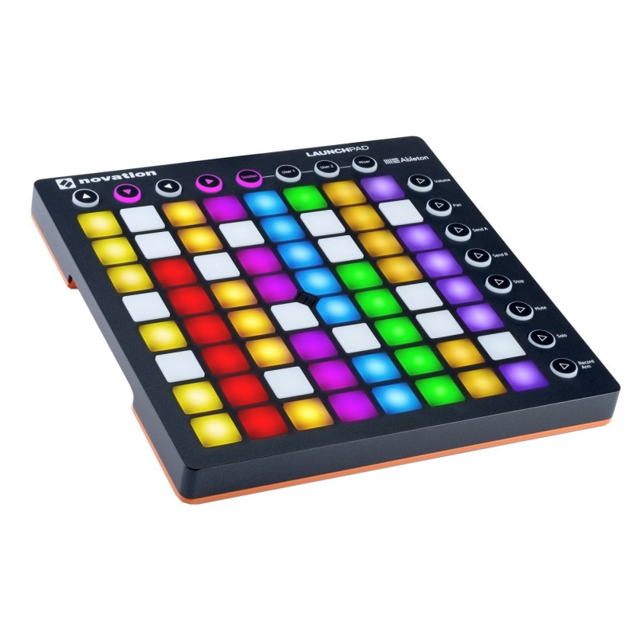

(novation-launchpad-mk2)=

# Novation Launchpad MK2

Novation Launchpad MK2 is an updated versions of the Launchpad.
It introduces new features such as RGB, velocity sensitive pads, and a redesigned layout scheme.

## Mapping

[Novation Launchpad Mapping by szdavid92](novation_launchpad_mapping_by_szdavid92.md)

## Links

[Mapping Sources on GitHub](https://github.com/szdavid92/mixxx-launchpad)

[Official Programmer's Manual](https://global.novationmusic.com/sites/default/files/novation/downloads/10529/launchpad-mk2-programmers-reference-guide_0.pdf)

:::{versionadded} 2.1
:::
:::{note}
Unfortunately a detailed description of this controller mapping is still missing.
If you own this controller, please consider
[contributing one](https://github.com/mixxxdj/mixxx/wiki/Contributing-Mappings#user-content-documenting-the-mapping).
:::
