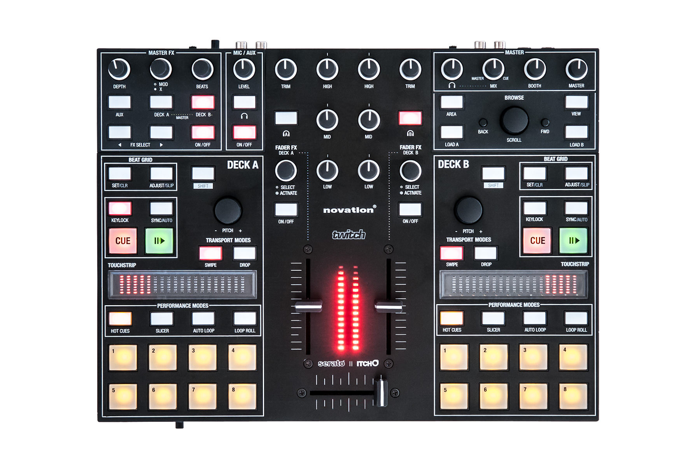
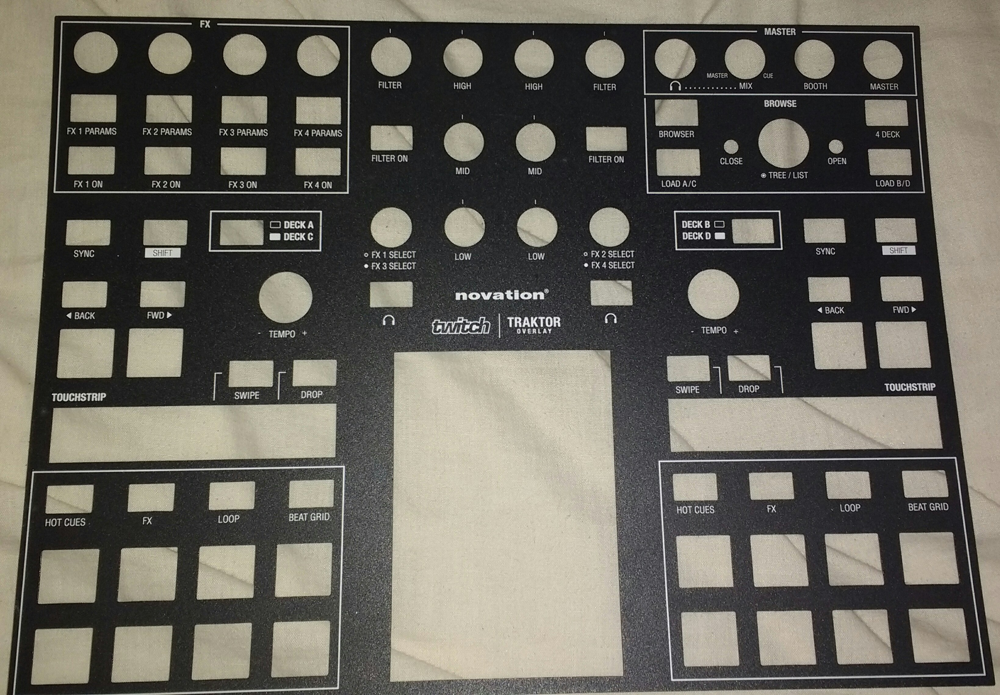

# Novation Twitch

:::versionadded 2.1
:::

:::note
Unfortunately a detailed description of this controller mapping is still missing.
If you own this controller, please consider
[contributing one](https://github.com/mixxxdj/mixxx/wiki/Contributing-Mappings#user-content-documenting-the-mapping).
:::

[Serato's Product Page](https://serato.com/dj/hardware/novation-twitch)
Novation no longer have a dedicated page for the controller but drivers, manuals and MIDI reference guide can be found by search the Twitch product at: [The Novation Support Page](https://customer.novationmusic.com/support/downloads?brand=Novation&product_by_range=485&download_type=all)

## Audio Setup

Configure Channels 1 & 2 for Master output and 3 & 4 for the Headphone Cue. The top right section are analogue hardware controls for the onboard audio interface and do not affect the related controls within Mixxx. Note that the Headphone Mix knob has fully anti-clockwise for Master and fully clockwise for Cue, the reverse of most DJ mixers.

VU Meters have been configured to display Master if no PFL is selected and to display the Channel selected on the side which has PFL On (including paging for Decks C/D.) As all LEDs are red the meter has been calibration so if the top LED is lit then your signal will be running into clipping. It's best to keep is so the very top LED remains unlit.

## Mixxx Mapping

The above shows the controller as per the manufacturers website with the Serato layout printed on the hardware. This is based on what in the MIDI mapping literature is referred to as Advanced Mode. With the controller came an overlay for the supplied Traktor based on the Basic Mode MIDI mapping, which has hardware buttons for deck layers which coincide with the Shift keys on the Serato layer and thus using the labels as per the Serato layout is really not applicable if programming in Basic Mode.

This is a photo of the overlay for the Traktor/Basic Mode the Mixxx mapping has been based from.

Throughout this guide I will display the button labels as on the Traktor overlay first with the labels on the hardware unit displayed in () parenthesis so it is clear for users of both.

## Known Issues

None of the Init codes in the manual either remembered or reset the FX Params paging, thus if the mapping is (re)loaded while Mixxx is in operation and it's not set on the default (no LED lit) page then it will not display as controlling the FX page it's on until a button has been selected. This shouldn't be noticed in normal operation.

## User Options

These can be found at the very top of the mappings .js file.

**fxOnUnitMaster** Set to 0 for FX On buttons to globally turn On/Off effect 1-4 Set to 1 for FX On buttons to assign Master to effects 1-4. DEFAULT is 1 as this is how the GUIs have been designed. (No included GUI has on screen indication of if an FX is enabled but the LEDs work and you may find this more useful than assigning to master, plus it's useful to be able to turn them On/Off no matter which page for the Pads you currently have activate.)

## Master Section

These are hardware controls, see the above Audio Setup section

## Browse Section

**BROWSER (AREA)**
Press to change between library pane navigated.
SHIFT+Press to expand Library

**4 DECK (VIEW)**
Press to toggle between 2 and 4 deck view in the GUI
SHIFT + Press to toggle view of Samplers in GUI.

**LOAD A/C (LOAD A)**
Loads selected track in Deck A or C depending on layer in operation by left side of controller.

**LOAD B/D (LOAD B)**
Loads selected track in Deck B or D depending on layer in operation by right side of controller.

**CLOSE (BACK)**
Closes (unexpands) folder when navigating in Tree section of Library Browser.

**OPEN (FWD)**
Opens (expands) folder when navigating in Tree section of Library Browser.

**TREE/LIST (SCROLL) Encoder**
Rotate to navigate within Library Browser.
With either the Encoder Pressed or SHIFT held down navigation will be faster (~11 tracks per tick.)
With both the Encoder Pressed and SHIFT held down together navigation will be much faster (over 100 tracks per tick.)
Rotation is velocity sensitive, the faster you rotate the further you will move.

## Deck Controls

**DECK A/B C/D (SHIFT)**
Hardware control buttons to switch layer controls by left or right side of deck for controlling of 4 decks.

**SYNC (SET/CLR)**
Press to Sync to playing deck
Hold to enable Master Sync
SHIFT + Press to toggle Quantise

**SHIFT (ADJUST/SLIP)**
SHIFT button (hold to activate any functions listed with SHIFT on this page.

**TEMPO (PITCH) Encoder**
Rotate to adjust the playback rate of deck (clockwise = faster whichever way the faders are set.)
Press + Rotate to adjust playback rate in larger steps.
SHIFT + Press to reset playback rate to 0% offset.

**\< BACK (KEYLOCK)**
Press to toggle Keylock
SHIFT + Press to Reset Key to original

**FWD \> (SYNC/AUTO)**
Press to toggle Slip Mode
SHIFT + Press to enable Repeat mode.

**CUE**
Press for standard Cue control. Exact operation may depend on your Preference settings.
Shift + Press to Stop and Rewind to Star of track.

**PLAY/PAUSE**
Press to toggle Play and Pause.
Shift + Press to toggle Reverse Playback.

**SWIPE & DROP**
Hardware controls for the Touchstrip. See below

**TOUCHSTRIP**
SWIPE active: When Paused shuttle through track. When in Play Jog the playback pitch to adjust timing.
DROP active: (Reverts to SWIPE after single operation.) Press or drag on touchstrip to position the play cursor in relative position in track.
HOT CUE BANK button + TOUCHSTRIP: Scratch Mode activation. Playback will resume once HOT CUE Select Button is released (as long as it's from the same Deck.)
SHIFT + TOUCHSTRIP: Scratch Mode activation. Subtle difference in that track will come to stop if SHIFT is released before motion finishes (if performing EG a SpinBack.) Touch TOUCHSTRIP again to release Scratch and have full control again. Using a HOT CUE BANK button from the opposite deck will have similar behaviour.

## PAD BANKS

**HOT CUES**
BANK BUTTON: Hardware selection of Hot Cue bank. Also used as Modifier key for TOUCHSTRIP Scratch Mode and for Hot Cue Looping.
PADS 1-8: Press to trigger HotCue 1-8
SHIFT + Press to delete HotCue 1-8
HOTCUES Bank + Press to enable a Loop of Beatloop Size at play position on Pad release.

**FX (SLICER)**
BANK BUTTON: Hardware selection of FX bank SHIFT + FX BANK: Show FX in GUI
PADS 1-4: Turn FX Chain 1-4 On/Off for relevant Deck. PADS 5-8: Load/Triggers Samplers. Deck A Samplers 1-4. Deck B Samplers 5-8. Deck C Sampler 9-12. Deck D Sampler 13-16. SHIFT + Pads 5-8: Stop/Unload Samplers as per above.

**LOOP (AUTO LOOP)**
BANK BUTTON: Hardware selection of LOOP bank
PADS 1-4: Trigger Loop of 4/8/16/32 beats.
PAD 5: Half Loop size
PAD 6: Double Loops size
PAD 7: Enable Loop of Beatsize.
PAD 8: Reloop Toggle
SHIFT + 1: Set Loop In
SHIFT + 2: Set Loop Out
SHIFT + 5: Jump backwards 16 beats
SHIFT + 6: Jump backwards 4 beats
SHIFT + 7: Jump forwards 4 beats
SHIFT + 8 Jump forwards 16 beats

**BEAT GRID (LOOP ROLL)**
BANK BUTTON: Hardware selection of Loop Roll/Beat Grid Bank.
PADS 1-4: Trigger LoopRoll (Stutter) of 0.25/0.5/1/2 beats.
PAD 5: Jump back 4 beats
PAD 6: Jump back 1 beat
PAD 7: Jump forwards 1 beat
PAD 8: Jump forwards 4 beats
SHIFT + 2: Adjust track tempo down
SHIFT + 3: Adjust track tempo up
SHIFT + 5: Tap Tempo
SHIFT + 6: Move Beatgrid left
SHIFT + 7: Move Beatgrid right
SHIFT + 8: Set Beatgrid to cursor position

## Mixer Section

**FILTER (TRIM) Knobs** Channel Pregain.
**HIGH/MID/LOW Knobs** EQ controls
**FX SELECT (ACTIVATE) Encoder*** Quick FX control
**FILTER ON (CUE)** Quick FX On/Off
**CUE (ON/OFF)** Headphone cue selectors.

## Effects Section

The FX PARAMS Buttons controller hardware level switching for layer of the knobs. With FX1 to FX4 selected it works almost as the [Standard Effects Mapping](https://www.mixxx.org/wiki/doku.php/standard_effects_mapping) minus the ability to control individual controls within an effect. The fourth button, which would enable this, currently expands/collapses the view of that effect. (TODO is to bring these controls fully to the standard.)

With FX layer 0 selected (no LEDs lit.) FX On buttons select the effect to Master with an configurable option to instead globally Enable/Disable the effect chain. The knobs control the 4 Super controls in normal mode and control the 4 Wet/Dry Mix controls when used with SHIFT.
