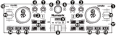

.. _numark-dj2go2-touch:

Numark DJ2GO2 Touch
===================

.. sectionauthor::
   tandy1000 <https://github.com/tandy-1000>

The Numark DJ2GO2 Touch is a USB :term:`MIDI` controller with an integrated audio interface.
It is the successor to the DJ2GO2, and features touch capable wheels.

-  `Manufacturer’s product page <https://www.numark.com/product/dj2go2-touch>`__
-  `Mapping Forum Thread <https://mixxx.discourse.group/t/a-complete-numark-dj2go2-touch-mapping/22616>`__

.. versionadded:: 2.3.1

   Numark DJ2GO2 Touch (schematic view)

Controller Mapping
------------------

Decks
~~~~~

===  ===============================================================  ======================================================
No.  Control                                                          Function
===  ===============================================================  ======================================================
2    :hwlabel:`HEADPHONES`                                            Routes deck to headphones output
6    :hwlabel:`LOAD`                                                  Loads a track into the deck.
7    :hwlabel:`LEVEL`                                                 Hi / low pass filter effect.
9    :hwlabel:`PAD MODE`                                              Switches between modes of operation for pad buttons on both decks.
10   Jog Wheel (top surface)                                          Perform scratch operation.
10   Jog Wheel (outer edge)                                           Rotate to lower/raise playback speed and pitch.
11   :hwlabel:`PLAY/PAUSE`                                            Plays or pause the song.
12   Pads                                                             4 buttons which can be used to control various features.
13   :hwlabel:`CUE`                                                   Specifies, plays or recalls temporary cue point.
14   :hwlabel:`SYNC`                                                  Match tempo and phase of other deck.
15   Tempo slider                                                     Adjust song playback speed.
===  ===============================================================  ======================================================

Pads
~~~~

The pad mode is changed using the :hwlabel:`PAD MODE` button.

===============================================================  ======================================================================================================================
Pad Mode                                                         Function
===============================================================  ======================================================================================================================
:hwlabel:`CUES`                                                  Set cue points, and trigger them by clicking.
:hwlabel:`AUTO`                                                  Enable / disable beat loops, with pads 1, 2, 3, and 4 creating 1, 4, 8, and 16 bar loops respectively.
:hwlabel:`MANUAL`                                                Set a custom loop: pad 1 sets the loop in point, pad 2 sets the loop out point, pad 3 enables / disables the loop, and pad 4 stops the loop and returns to the beginning.
:hwlabel:`SAMPLER`                                               Load / trigger sample tracks.
===============================================================  ======================================================================================================================

Mixer / Library
~~~~~~~~~~~~~~~

===  ===============================================================  ==================================
No.  Control                                                          Function
===  ===============================================================  ==================================
3    :hwlabel:`CUE LEVEL`                                             Adjusts the cue output level.
4    :hwlabel:`MASTER LEVEL`                                          Adjusts the master output level.
5    Browse encoder                                                   Scroll in the track list. Preview tracks when clicking on a track in a tracklist, scrolling the encoder allows seeking the previewed track. Clicking when a track is being previewed will stop the preview, allowing you to scroll the tracklist again.
8    Crossfader                                                       Fades between left and right deck.
===  ===============================================================  ==================================

Inputs / outputs
~~~~~~~~~~~~~~~~

===  ===============================================================  ==================================
No.  IO                                                               Function
===  ===============================================================  ==================================
1    USB                                                              Micro USB slot for data / power connection to the Mixxx host device.
16   Main (3.5mm)                                                     Master audio output for the onboard interface.
17   Headphones (3.5mm)                                               Cue audio output for the onboard interface.
===  ===============================================================  ==================================
