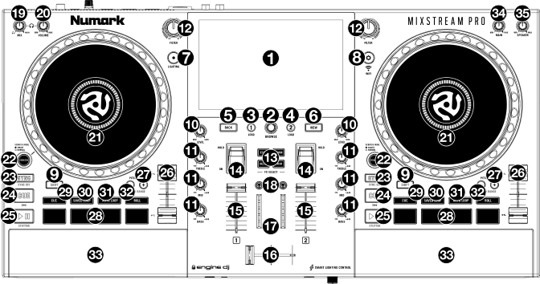

.. _numark-mixstream-pro:

Numark Mixstream Pro
=======================

-  `Manufacturer’s product page <https://www.numark.com/product/mixstream-pro>`__
-  `Manufacturer's User Manual <https://cdn.inmusicbrands.com/engine/43/Mixstream%20Pro%2C%20Mixstream%20Pro%2B%2C%20Mixstream%20Pro%20Go%20-%20User%20Guide%20-%20v4.3.0%202.pdf>`__
-  `Forum thread <https://mixxx.discourse.group/t/numark-mixstream-pro-mapping/24858>`__

The Numark Mixstream Pro is a stand-alone DJ controller with integrated speakers and touchscreen.

.. versionadded:: 2.5.4

Compatibility
-------------

The Numark Mixstream Pro is a USB audio compliant device. It is
fully compatible with Linux, Windows, and macOS. No proprietary driver
is required on Linux or macOS. For Windows, download and install the
latest driver from the manufacturers product page.

Computer Mode
-------------

You will need to enter computer mode before you can use your controller with Mixxx.

1. Turn on the controller and press the **Control Center** button, swipe down from the toolbar, or tap the gear icon to open the **Control Center**.
2. Tap the **Source** icon, and then select the computer icon at the top of the display.
3. It will ask you to confirm, select yes, and the controller will restart into **Computer Mode**.

Audio routing
-------------

============================================= =======================
Output                                        Channels
============================================= =======================
:guilabel:`MIXSTREAM PRO Analog Surround 4.0` Channel 1 - 2
:guilabel:`MIXSTREAM PRO Analog Surround 4.0` Channel 3 - 4
============================================= =======================

The speakers receive the main mix but also have a controllable volume.

======================================= =======================
Input                                   Channels
======================================= =======================
:guilabel:`MIXSTREAM PRO Analog Stereo` Channel 1 - 2
======================================= =======================

There is a loopback mix available as a Mixxx input which includes the microphone input and mix.

Feature differences
---------------------

Features in Engine DJ OS on the Numark Mixstream Pro that are not available yet in Mixxx:

-  **Stems Mode**: `SHIFT` + **Hotcue** will enable the stems mode (with purchase of a software license).
-  **Lighting Control**: Engine DJ OS is able to control compatible smart lighting systems.

Features in Mixxx that are not available yet in Engine DJ OS on the Numark Mixstream Pro:

-  **Multiple FX at once**: Select up to 3 FX on the channel at once, configurable within the Mixxx FX panel.

Configuration options
---------------------

Configuration options can be set in the options when selecting the mapping.

 ====================================== ============ =========================================================================================================================================================
  Option                                 Type         Explanation                                                                                                                                             
 ====================================== ============ =========================================================================================================================================================
  `SHIFT` + **Play** Behaviour           Select       Select whether to have this button combo stutter-play or perform a slow start/stop                                                                      
  Hotcue While Playing                   True/false   Enable hotcue usage and assignment while track is playing                                                                                               
  Default Pad Mode On Load               Select       Select which pad mode to load by default on loading a new track. The default will use the previously selected mode                                    
  Jog Wheel Buffer Size                  Number       The jog wheel uses a buffer to smooth the speed it turns. Raising this too high makes it lag behind your movement and lowering it makes it sound warbly 
  Enable Backspin (only In Mixxx 2.6+)   True/false   Enable backspinning (or forward spinning) when you lift your finger off the platter. Not compatible with Mixxx versions below 2.6                       
  Backspin Speed Threshold               Decimal      The speed at which the scratching will turn off. This can make the track stuck in a speed if too low                                                    
  Backspin Timeout                       Milisecond   If the jog wheel speed gets stuck, this will reset it every n miliseconds                                                                                                                                                                                                                                                                                     
 ====================================== ============ =========================================================================================================================================================

Mapping Description
-------------------

   Numark Mixstream Pro (schematic view)

1. Touchscreen
~~~~~~~~~~~~~~

| Full-color, multi-touch display. Unused in Mixxx.

2. Browse Knob
~~~~~~~~~~~~~~

| Turn this knob to navigate through lists. Press the knob to load the selected track on the first available deck.

3. Load 1
~~~~~~~~~

| Press this button to load the selected track to Deck 1.
| :hwlabel:`SHIFT` + **Press:** remove the selected track from Deck 1.

4. Load 2
~~~~~~~~~

| Press this button to load the selected track to Deck 2.
| :hwlabel:`SHIFT` + **Press:** remove the selected track from Deck 2.

5. Back
~~~~~~~

| Unused.

6. View
~~~~~~~

| Press this button to cycle between the Track Selection and Playlists.

7. Lighting
~~~~~~~~~~~

| Unused.

8. Control Center
~~~~~~~~~~~~~~~~~

| Press this button to activate Aux 1 for `Spotify in the MIXXX <https://audministrator.wordpress.com/2023/02/21/mixxx-spotify-in-the-mixxx/>`__.

9. Shift
~~~~~~~~

| Press and hold this button to access secondary functions of other controls.

10. Channel Level
~~~~~~~~~~~~~~~~~

| Turn this knob to adjust the level of the pre-fader, pre-EQ audio signal for the channel.

11. Channel EQ
~~~~~~~~~~~~~~

| Turn these knobs to boost or cut the high, mid-range, and low frequencies for the channel.

12. Filter
~~~~~~~~~~

| Adjusts the amount of the filter effect. Starting from the center (12:00) position,
  turn counterclockwise to apply a low-pass filter, or turn clockwise to apply a
  high-pass filter.

13. FX Select
~~~~~~~~~~~~~

| Press these buttons to enable or disable the selected effect: Echo, Delay, Flanger or Phaser.

14. Effects Toggle
~~~~~~~~~~~~~~~~~~

| Move this toggle switch away from you to activate the selected effect—the toggle will
  latch to that position. Pull the toggle back to the center position to deactivate the
  effects.
| Pull and hold this toggle toward you to activate the selected effect momentarily, and
  release the toggle to deactivate the effect—the toggle will return to the center position.

15. Channel Fader
~~~~~~~~~~~~~~~~~

| Use this fader to adjust the channel's volume level.

16. Crossfader
~~~~~~~~~~~~~~

| Use the crossfader to mix between Deck 1 and Deck 2.

17. Main Level Meters
~~~~~~~~~~~~~~~~~~~~~

| These LEDs display the audio signal level of the main mix (sent out of the Main Outputs).

18. Headphone Preview
~~~~~~~~~~~~~~~~~~~~~

| Press this button to preview the channel in the headphones.
| Use the Headphone Mix knob to adjust the mix between the channel's pre-fader signal
  and the headphones' cue channel.

19. Headphone Mix
~~~~~~~~~~~~~~~~~

| Turn this knob to adjust the blend of the headphone cue and main channels together in the
| headphones.

20. Headphone Volume
~~~~~~~~~~~~~~~~~~~~

| Adjusts the volume for headphone cueing.

21. Platter
~~~~~~~~~~~

| This capacitive, touch-sensitive platter controls the audio playhead when the wheel is
| touched and moved. See settings above for adjustments.

22. Scratch Mode
~~~~~~~~~~~~~~~~

| When this button is enabled, Smart Scratch mode will be active. In this mode, the
  track's timeline continues (the lower half of the waveform in the display will continue
  moving forward) when you use the platter to "scratch" the track. When you release the
  platter, the track will resume normal playback from where it would have been if you had
  never moved the platter.
| :hwlabel:`SHIFT` + **Press:** enable or disable jog mode. In this mode, touch the platter and move
  it to temporarily adjust the track's speed.
| Press this button again to disable Smart Scratch and enable vinyl mode for the platter.
  You can use the platter to "scratch" the track as you would with a vinyl record.

23. Sync / Sync Off
~~~~~~~~~~~~~~~~~~~

| Hold this button to activate or deactivate sync.

24. Cue / Previous
~~~~~~~~~~~~~~~~~~

| When the Deck is paused, you can set a Temporary Cue Point by moving the platter to place
  the playhead at the desired location and then pressing the Cue Button.
| During playback, you can press the Cue Button to return the track to this Temporary Cue
  Point. (If you did not set a Temporary Cue Point, then it will return to the beginning of
  the track.)
| **Hold:** play the track from the Temporary Cue Point. Releasing the Cue Button will
  return the track to the Temporary Cue Point and pause it. To continue playback without
  returning to the Temporary Cue Point, press and hold the Cue Button, then press and hold
  the Play Button, and then release both buttons.
| :hwlabel:`SHIFT` + **Press:** return to the beginning of the track.

25. Play/Pause
~~~~~~~~~~~~~~

| Press this button to pause or resume playback.
| :hwlabel:`SHIFT` + **Press:** "stutter-play" the track from the initial cue point.

26. Pitch Fader
~~~~~~~~~~~~~~~

| Move this fader to adjust the speed (pitch) of the track.

27. Pitch Bend –/+
~~~~~~~~~~~~~~~~~~

| Press and hold one of these buttons to momentarily reduce or increase (respectively)
  the speed of the track.
| :hwlabel:`SHIFT` + **Press:** set the range of the pitch fader.

28. Performance Pads
~~~~~~~~~~~~~~~~~~~~

These pads have different functions on each deck depending on the current pad mode.
See Pad Modes for more information.

29. Cue
~~~~~~~

| Press this button to enter Cue mode. Press the button again to enter a second bank of
  cues. To assign a cue to a pad, press a pad at the desired location in the track.
| :hwlabel:`SHIFT` + **Press:** clear a cue from a pad.

30. Saved Loop
~~~~~~~~~~~~~~

| Press this button to enter Saved Loop mode. Press the button again to enter a second
  bank of saved loops.
| To assign a loop to a pad and activate it, press a pad to create a Loop In point at the
  current location, and then press it again to create the Loop Out point at another location.
| To deactivate or reactivate a loop, press the corresponding pad.
| :hwlabel:`SHIFT` + **Press:** delete a loop from a pad.

31. Auto Loop
~~~~~~~~~~~~~

| Press this button to enter Auto Loop mode. Press the button again to enter a second bank
  of auto loop lengths.
| To activate an auto loop, press a pad. To deactivate an auto loop, press the pad again.

32. Roll
~~~~~~~~

| Press this button to enter Roll Mode. Press the button again to enter a second bank of
  roll lengths. To trigger a roll, press a pad.
| :hwlabel:`SHIFT` + **Hold:** enter Sampler Mode.

33. Speakers
~~~~~~~~~~~~

These speakers will play the same current audio as the Main Outputs. Use the Speaker Level
knob to adjust the volume of the speakers.

34. Main Level
~~~~~~~~~~~~~~

Turn this knob to adjust the volume level of the Main Outputs.

35. Speaker Level
~~~~~~~~~~~~~~~~~

Turn this knob to adjust the volume level of the speakers.
