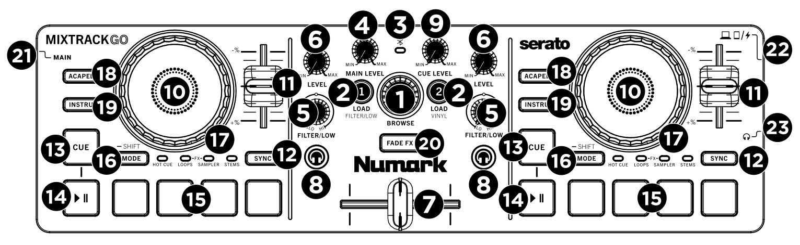

**Numark Mixtrack Go**
===================================


**Numark Mixtrack Go** is a USB [MIDI](https://manual.mixxx.org/2.5/en/glossary#term-MIDI) controller with an integrated audio interface.
It improves on the concept of the Numark DJ2GO2 Touch by adding:

- STEMS tracks support - the STEMS support in [Mixxx](https://mixxx.org/download/) is added on version 2.6.
- Shifting - now some buttons have alternate actions if pressed while shifted.
- Mode selection is independent for each deck.
- Better LED feedback.
- More controls.

Usefull links:
- [Numark Mixtrack Go website](https://www.numark.com/new/mixtrack-go/)
- [Mixxx forum thread for this mapping](https://mixxx.discourse.group/t/script-for-numark-mixtrack-go-for-mixxx-2-6-also-works-with-previous-versions/34022/)
 
The Numark Mixtrack Go controller is a USB Audio and MIDI Class compliant device and works with Linux, macOS, and Windows.


```{note}
   - While Fade FX can use any effect available on each channel, effects that dont have their reset point at 0, may not work as expected.
   - Effects that don't reset at 0 are the effects that are at their lowest intensity when the knob is turned all the way to the left.
   - These effects currently are:
       - Filter Echo
       - Mid/Side
       - Balance
       - Filter
       - Loudness
       - Moog Filter
       - Pitch Shift
```


**Soundcard Setup**
--------------------

This controller has a built-in 4 channel output sound card, with a stereo Main output (3.5mm jack) and stereo Headphone output (3.5mm jack).

   - Open **Preferences** > **Sound Hardware**
   - Select the **Output** tab.
   - From the **Main** drop-down menu, select the audio interface, then **Channels 1-2**.
   - From the **Headphones** drop-down menu, select the audio interface, then **Channels 3-4**.
   - Click **Apply** to save the changes.


**Controller Layout**
---------------------



**Controller Mapping**
----------------------


```{list-table}
:header-rows: 1
:align: center

* - Number
  - Control
  - Function
* - **1** 
  - Browser
  - A knob for browsing the Library. If pushed, loads a track on the Preview Deck.
* - **2**
  - Load
  - Each button loads a track to the Deck on their side.
* - **-**
  - Shift + Load 1
  - Switches the filter/low knobs between controlling the Low EQ and the Filter (or any other) Effect.
* - **-**
  - Shift + Load 2
  - Toggles the Vinyl mode in the Jogwheel.
* - **3**
  - Bluetooth Led
  - There is currently no functionality for this LED in Mixxx.
* - **4**
  - Main Gain
  - Controls the Main Output Gain.
* - **5**
  - Filter/Low
  - Controls either the Filter (or any other) Effect, or the Low EQ. This can be switched with Shift + Load 1
* - **6**
  - Level
  - Controls the channel's Volume.
* - **7**
  - Crossfader
  - Fades between the Left and the Right channel.
* - **8**
  - Headphone
  - Sends the channel's audio through the Headphone Output.
* - **9**
  - Cue Level
  - Controls the headphone gain.
* - **10**
  - Jogwheel
  - If Vinyl Mode is active (Shift + Load 2), the top surface controls scratching and the side surface controls Pitch Bend. If Vinyl Mode is inactive, both surfaces control pitch bend.
* - **11**
  - Tempo Fader
  - Changes the track's playback speed.
* - **12**
  - Sync
  - Toggles Sync Lock.
* - **13**
  - Cue
  - Sets the cue point or moves to the main cue point and stops. See options at **Preferences** > **Deck** > **Cue mode**.
* - **-**
  - Shift + Cue
  - Moves to the main cue point and resumes playing from there.
* - **-**
  - Shift + Cue(2x)
  - Loads the previous track on the Library and starts playing it from the main cue point. This action is prevented if **Preferences** > **Deck** > **Loading a track, when a deck is playing** is set to Reject.
* - **14**
  - Play/Pause
  - Plays or Pauses the track.
* - **-**
  - Shift + Play/Pause
  - Moves to the main cue point and resumes playing from there. Same as Shift + Cue.
* - **15**
  - Pads
  - Performance Pads: These pads can be used to trigger Hotcues, Loops, Samples, Stems, and to apply effects. To change the function of the pads, press the Mode (Shift).
* - **16**
  - Mode (**Shift**) 
  - Press this button to change the current function of the Performance Pads. A long press activates the **Shift** functions on other controls.
* - **17**
  - Hotcue Mode
  - In Hotcue Mode, a Pad sets a hotcue in the current position of the track. Shift + Pad clears the corresponding hotcue.
* - **-**
  - Loops Mode
  - In Loops Mode, Pads 1, 2, 3 and 4 set 1, 2, 4 and 8 beat sized beatloops respectively. Shift + Pad clears the corresponding beatloop.
* - **-**
  - FX Mode
  - In FX mode, Pad1 starts an Echo Effect, Pad 2 starts a Flanger Effect, Pad 3 starts a Reverb Effect and Pad4 starts a 1 beat sized beatroll.
* - **-**
  - Sampler Mode
  - In Sampler Mode, each pad loads the currently selected track in the library into it's sampler. If it is already loaded, it starts playing the sample until the sample ends. Shift + Pad ejects the track from the corresponding sampler.
* - **-**
  - STEMS mode
  - In STEMS Mode, pads mute and unmute the components of the loaded STEMS track: Pad 1 affects the Drums stem part, Pad 2 affects the FX/Bass stem part, Pad 3 affects the Synth stem part and Pad 4 affects the Voice stem part.
* - **18**
  - Acapel
  - The Acappella button activates an acappella from the loaded track. This is a STEMS button.
* - **19**
  - Instru
  - The Instrumental button activates an instrumental from the loaded track. This is a STEMS button.
* - **20**
  - Fade FX
  - This button toggles the Fade FX feature in Mixxx. When Fade FX is active, moving the Crossfader away from the current deck will apply the set Fade FX to that deck. When inactive, the Crossfader will work normally.
* - **21**
  - Main Audio Output
  - Connect this output to an amplifier or speaker system.
* - **22**
  - Headphone Output
  - Connect headphones to this 1/8” (3.5 mm) jack for monitoring the signal. The headphone volume is controlled using the Cue Gain knob.
```
