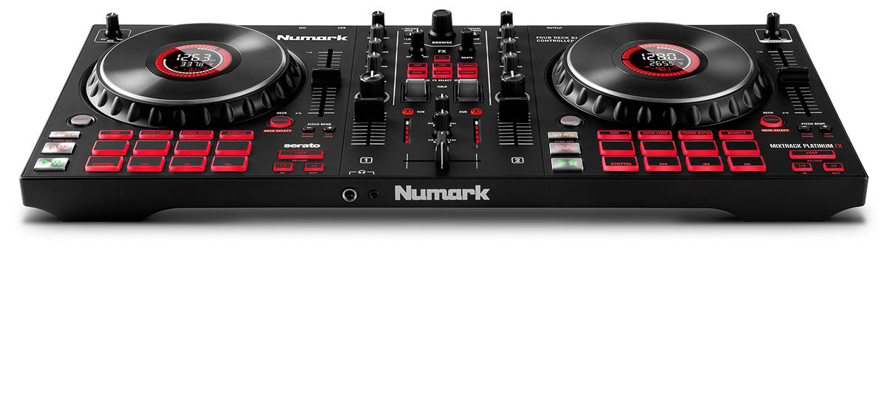
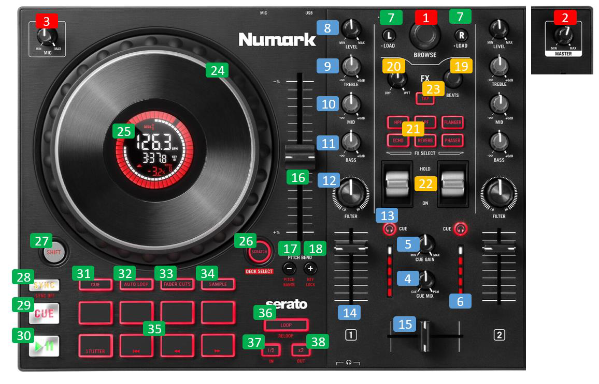

.. Credit to PopHippy for creating the orignal PDF file

Numark Mixtrack Platinum FX
========================

-  `Manufacturer’s product page <https://www.numark.com/product/mixtrack-platinum-fx>`__
-  `Forum thread <https://mixxx.discourse.group/t/numark-mixtrack-platinum-fx-mapping/19985/215>`__

Mixtrack Platinum FX is a 24-bit 4-deck digital DJ controller with a dedicated software effects section, large 6-inch capacitive-touch jog wheels with built in hi-res displays and 16-multifunctional performance pads.

   Firmware

   The mapping requires the following Soft/Firmware for all enabled
   features to work for Mixxx 2.4
-  `Firmware Update v1.10 MAC <https://cdn.inmusicbrands.com/Numark/MixtrackPlatinumFX/Mixtrack%20Platinum%20FX%20Firmware%201.10%20Mac.zip>`__
-  `Firmware Update v1.10 WIN <https://cdn.inmusicbrands.com/Numark/MixtrackPlatinumFX/Mixtrack%20Platinum%20FX%20Firmware%201.10%20Win.zip>`__
- Linux user need to install firmware using Windows or MAC.

Overview
--------

---------------

   Mapping Manual for NUMARK MIXTRACK PLATINUM FX

Index

   | 1.Numark Mixtrack Platinum FX links
   | 2.Overview
   | 3.Audio Interface
   | 4.Firmware
   | 5.Control Mapping
   | 6.Performance Pad Modes
   | a.Pad Loop Timings
   | b.Cue Mode & Layers
   | c.Auto Loop Mode & Layers
   | d.Fade Cuts Mode & Layers
   | e.Sample Mode & Layers
   | 7.Advanced User Section
   | 8.Notes

   Numark Mixtrack Platinum FX
..

   | Overview
   | The pads are for controlling cue’s, loops, and The Numark Mixtrack
     Platinum FX is a 2 channel (with 4 channel layering) entry level DJ
     controller with an integrated audio interface. The stand out
     feature of the Mixtrack Platinum FX is the LCD displays integrated
     into the jog wheels. It is a USB Audio and MIDI Class compliant
     device and works with Linux, macOS, and Windows.

   Audio Interface

   Configure Mixxxs’ Master output for channels 1-2 and Headphones
   output for Channels 3-4.

   The microphone input on this controller is not available to the
   computer through the controller’s audio interface. It is mixed with
   the master output in hardware, so this controller’s audio interface
   is not suitable for broadcasting or recording the inputs. If you want
   to use the controller for broadcasting or recording, a separatewith a
   microphone input is suggested.

Control Mapping

Numark Mixtrack Platinum FX (Controls Condensed)

+-----------------------+-----------------------+-----------------------+
| Ctr                   |    Default Function   |    Shift Function     |
+=======================+=======================+=======================+
|    1.                 |    | Browse Knob:     |    | Speed Scrolling  |
|                       |    | Rotate this knob |    | SHIFT + Rotate   |
|                       |      to cycle through |    | Directory        |
|                       |      folders and      |      Open/Close SHIFT |
|                       |    | tracks. Press    |      (left deck)      |
|                       |      the knob to      |    | Preview Play     |
|                       |      cycle between    |      Track            |
|                       |      the Crates and   |    | SHIFT (right     |
|                       |      Library. Hold    |      deck)            |
|                       |      Shift and rotate |                       |
|                       |      the knob to      |                       |
|                       |      quickly scroll   |                       |
|                       |      through tracks   |                       |
|                       |      and folders.     |                       |
+-----------------------+-----------------------+-----------------------+
|    2.                 |    | Master Gain:     |                       |
|                       |    | Adjusts the      |                       |
|                       |      master volume in |                       |
|                       |      the software.    |                       |
+-----------------------+-----------------------+-----------------------+
|    3.                 |    | Mic Gain:        |                       |
|                       |    | Adjusts the      |                       |
|                       |      level for the    |                       |
|                       |      microphone       |                       |
|                       |      input.           |                       |
+-----------------------+-----------------------+-----------------------+

+-----------------------+-----------------------+-----------------------+
|    4.                 |    | Cue Mix:         |                       |
|                       |    | Adjusts the      |                       |
|                       |      audio output to  |                       |
|                       |      the headphones,  |                       |
|                       |      mixing between   |                       |
|                       |      the cue output   |                       |
|                       |      and the master   |                       |
|                       |      mix output.      |                       |
+=======================+=======================+=======================+
|    5.                 |    | Cue Gain:        |                       |
|                       |    | Adjusts the      |                       |
|                       |      volume for       |                       |
|                       |      headphone        |                       |
|                       |      cueing.          |                       |
+-----------------------+-----------------------+-----------------------+
|    6.                 |    Master Output      |                       |
|                       |    LEDs: Displays the |                       |
|                       |    audio level going  |                       |
|                       |    to the Master      |                       |
|                       |    Output.            |                       |
+-----------------------+-----------------------+-----------------------+
|    7.                 |    | Load:            |    | Eject Deck       |
|                       |    | Press one of     |    | Removes the      |
|                       |      these buttons    |      track from       |
|                       |      while a track is |      related deck.    |
|                       |      selected to      |                       |
|                       |      assign it to     |                       |
|                       |      Deck 1 or 2,     |                       |
|                       |      respectively.    |                       |
|                       |      Quickly double   |                       |
|                       |      press a Load     |                       |
|                       |      button to assign |                       |
|                       |      the same track   |                       |
|                       |      on both decks.   |                       |
+-----------------------+-----------------------+-----------------------+
|    **8.**             |    Level: Adjusts the |                       |
|                       |    pre-fader, pre-EQ  |                       |
|                       |    audio level of the |                       |
|                       |    corresponding      |                       |
|                       |    channel.           |                       |
+-----------------------+-----------------------+-----------------------+
|    **9.**             |    High EQ: Controls  |                       |
|                       |    the treble         |                       |
|                       |    frequencies for    |                       |
|                       |    the individual     |                       |
|                       |    channels           |                       |
+-----------------------+-----------------------+-----------------------+
| **10.**               |    | Mid EQ:          |                       |
|                       |    | Controls the     |                       |
|                       |      mid-range        |                       |
|                       |      frequencies for  |                       |
|                       |      the individual   |                       |
|                       |      channels.        |                       |
+-----------------------+-----------------------+-----------------------+
| **11.**               |    | Low EQ:          |                       |
|                       |    | Controls the     |                       |
|                       |      bass frequencies |                       |
|                       |      for the          |                       |
|                       |      individual       |                       |
|                       |      channels         |                       |
+-----------------------+-----------------------+-----------------------+
| **12.**               |    | Filter:          |                       |
|                       |    | Adjusts the      |                       |
|                       |      amount of the    |                       |
|                       |      filter effect.   |                       |
|                       |      Turning the knob |                       |
|                       |      left and right   |                       |
|                       |      will produce a   |                       |
|                       |      lowpass filter   |                       |
|                       |      and high-pass    |                       |
|                       |      filter,          |                       |
|                       |      respectively.    |                       |
+-----------------------+-----------------------+-----------------------+
| **13.**               |    | Cue/PFL:         |    | Slip Mode        |
|                       |    | Sends pre-fader  |      (On/Off)         |
|                       |      audio to the cue |    | Toggles slip     |
|                       |      channel for      |      mode on/off for  |
|                       |      headphone        |      related deck.    |
|                       |      monitoring.      |                       |
+-----------------------+-----------------------+-----------------------+
| **14.**               |    | Channel Fader:   |                       |
|                       |    | Adjusts the      |                       |
|                       |      volume of the    |                       |
|                       |      individual       |                       |
|                       |      channels in the  |                       |
|                       |      software.        |                       |
+-----------------------+-----------------------+-----------------------+
| **15.**               |    | Crossfader:      |                       |
|                       |    | Controls the     |                       |
|                       |      blend between    |                       |
|                       |      the two decks.   |                       |
+-----------------------+-----------------------+-----------------------+

+-----------------------+-----------------------+-----------------------+
| 16.                   |    | Pitch Fader:     |                       |
|                       |    | This controls    |                       |
|                       |      the speed of the |                       |
|                       |      music. Moving    |                       |
|                       |      towards the "+"  |                       |
|                       |      will speed the   |                       |
|                       |      music up, while  |                       |
|                       |      moving towards   |                       |
|                       |      the "–" will     |                       |
|                       |      slow it down.    |                       |
+=======================+=======================+=======================+
| 17.                   | 17. Pitch Bend Down:  |    | Pitch Range      |
|                       | Press and hold to     |    | Hold Shift and   |
|                       | momentarily reduce    |      this button to   |
|                       | the speed of the      |      adjust.          |
|                       | track.                |                       |
+-----------------------+-----------------------+-----------------------+
| 18.                   | 18. Pitch Bend Up:    |    | Keylock          |
|                       | Press and hold to     |    | Hold Shift and   |
|                       | momentarily increase  |      this button to   |
|                       | the speed of the      |      activate         |
|                       | track.                |                       |
+-----------------------+-----------------------+-----------------------+
| 19.                   | 19. Beats Multiplier: |    | FX Macros        |
|                       | Increases and         |    | Selects and      |
|                       | decreases the rate of |      controls FX      |
|                       | the effects to the    |      Macros           |
|                       | beat. When using a    |      parameters.      |
|                       | time-based effect,    |                       |
|                       | this knob adjusts its |                       |
|                       | time division.        |                       |
+-----------------------+-----------------------+-----------------------+
| 20.                   | 20. FX Wet/Dry Knob:  |                       |
|                       | Turn this knob to     |                       |
|                       | adjust the wet/dry    |                       |
|                       | mix of the effects.   |                       |
+-----------------------+-----------------------+-----------------------+
| 21.                   | 21. Software FX:      |    | Multiple FX (at  |
|                       | Press one of these    |      once)            |
|                       | buttons to select a   |    | Hold shift and   |
|                       | software effect. •    |      select multiple  |
|                       | HPF (High pass        |      FX buttons to be |
|                       | filter) • LPF (Low    |      active at once.  |
|                       | pass filter) •        |                       |
|                       | Flanger • Echo •      |                       |
|                       | Reverb • Phaser       |                       |
+-----------------------+-----------------------+-----------------------+
| 22.                   | 22. FX Toggle On /    |                       |
|                       | Off:                  |                       |
|                       | Push up on the toggle |                       |
|                       | switch to latch       |                       |
|                       | (lock) the FX in the  |                       |
|                       | on position. Push     |                       |
|                       | down on the toggle    |                       |
|                       | switch to turn the FX |                       |
|                       | on momentarily. When  |                       |
|                       | the toggle switch is  |                       |
|                       | in the middle         |                       |
|                       | position, the FX will |                       |
|                       | be off.               |                       |
+-----------------------+-----------------------+-----------------------+
| 23.                   |    | Tap BPM:         |    | Default Tempo    |
|                       |    | Press this a     |      Reset:           |
|                       |      minimum of 4     |    | Press Shift and  |
|                       |      times to         |      this button to   |
|                       |      manually enter a |      reset the tempo  |
|                       |      new BPM. The     |      to the track to  |
|                       |      software will    |      default BPM.     |
|                       |      ignore the       |                       |
|                       |      track's BPM and  |                       |
|                       |      follow your      |                       |
|                       |      manually entered |                       |
|                       |      tempo.           |                       |
+-----------------------+-----------------------+-----------------------+

+-----------------------+-----------------------+-----------------------+
| 24.                   | 24. Platter/Jog       |    | Scrub Scroll     |
|                       | Wheel:                |    | Scrub Scrolling  |
|                       | This capacitive,      |      while holding    |
|                       | touch-sensitive jog   |      Jog wheel.       |
|                       | wheel controls the    |                       |
|                       | audio when the wheel  |                       |
|                       | is touched and moved. |                       |
|                       | When the Scratch      |                       |
|                       | button is not active, |                       |
|                       | use the jog wheel to  |                       |
|                       | bend the pitch of the |                       |
|                       | track. When the       |                       |
|                       | Scratch button is     |                       |
|                       | active, use the jog   |                       |
|                       | wheel to grab and     |                       |
|                       | move the audio,       |                       |
|                       | "scratching" the      |                       |
|                       | track as you would    |                       |
|                       | with a vinyl record.  |                       |
|                       | You can also grab the |                       |
|                       | non-touch-sensitive   |                       |
|                       | outer wheel, to bend  |                       |
|                       | the pitch of the      |                       |
|                       | track.                |                       |
+=======================+=======================+=======================+
| 25.                   | | 25. Deck Display:   |                       |
|                       | | 1. Active Deck:     |                       |
|                       |   Indicates the       |                       |
|                       |   currently active    |                       |
|                       |   deck.               |                       |
|                       |                       |                       |
|                       |    2. Platter         |                       |
|                       |    Position: Displays |                       |
|                       |    the current track  |                       |
|                       |    position.          |                       |
|                       |                       |                       |
|                       |    3. BPM: Displays   |                       |
|                       |    the current BPM    |                       |
|                       |    for the selected   |                       |
|                       |    track.             |                       |
|                       |                       |                       |
|                       |    4. Keylock: This   |                       |
|                       |    icon illuminates   |                       |
|                       |    when Keylock is    |                       |
|                       |    active for the     |                       |
|                       |    current deck.      |                       |
|                       |                       |                       |
|                       |    5. Pitch Range:    |                       |
|                       |    Shows the current  |                       |
|                       |    pitch range.       |                       |
|                       |                       |                       |
|                       |    6. Pitch: Shows    |                       |
|                       |    current pitch of   |                       |
|                       |    the track.         |                       |
|                       |                       |                       |
|                       |    7. Pitch Adjust:   |                       |
|                       |    Indicates the      |                       |
|                       |    direction to move  |                       |
|                       |    the Pitch Fader to |                       |
|                       |    match the current  |                       |
|                       |    track’s BPM with   |                       |
|                       |    the track on the   |                       |
|                       |    opposite deck.     |                       |
|                       |                       |                       |
|                       |    8. Time Remaining: |                       |
|                       |    Displays the time  |                       |
|                       |    elapsed or time    |                       |
|                       |    remaining for the  |                       |
|                       |    current track. 9.  |                       |
|                       |    Time Bars:         |                       |
|                       |    provides visual    |                       |
|                       |    reference to time  |                       |
|                       |    remaining on the   |                       |
|                       |    selected song.     |                       |
|                       |    When the song is   |                       |
|                       |    almost over these  |                       |
|                       |    segments will      |                       |
|                       |    flash to give a    |                       |
|                       |    warning.           |                       |
+-----------------------+-----------------------+-----------------------+
| 26.                   |    | Scratch:         |    | Deck Select:     |
|                       |    | Press this       |    | Selects deck 3 & |
|                       |      button to turn   |      4 for 4 deck     |
|                       |      on the scratch   |      mixing           |
|                       |      feature for the  |                       |
|                       |      jog wheel. Hold  |                       |
|                       |      Shift and press  |                       |
|                       |      this button to   |                       |
|                       |      select which     |                       |
|                       |      Layer in the     |                       |
|                       |      software is      |                       |
|                       |      controlled by    |                       |
|                       |      that hardware    |                       |
|                       |      Deck. Deck 1 can |                       |
|                       |      control Layer 1  |                       |
|                       |      or 3; Deck 2 can |                       |
|                       |      control Layer 2  |                       |
|                       |      or 4.            |                       |
+-----------------------+-----------------------+-----------------------+
| 27.                   |    | Shift:           |                       |
|                       |    | Allows multiple  |                       |
|                       |      control commands |                       |
|                       |      to be triggered  |                       |
|                       |      when pressed     |                       |
|                       |      first along with |                       |
|                       |      other buttons.   |                       |
+-----------------------+-----------------------+-----------------------+

+-----------------------+-----------------------+-----------------------+
| 28.                   |    | Sync:            |    | Sync Deactivate  |
|                       |    | Press this       |    | Press again to   |
|                       |      button to        |      deactivate Sync. |
|                       |      automatically    |                       |
|                       |      match the        |                       |
|                       |      corresponding    |                       |
|                       |      Deck's tempo     |                       |
|                       |      with the         |                       |
|                       |      opposite Deck's  |                       |
|                       |      tempo.           |                       |
|                       |                       |                       |
|                       |    Hold: Locks sync   |                       |
+=======================+=======================+=======================+
| 29.                   |    | Cue              |    | Cue Track Start  |
|                       |    | Sets and recalls |    | Return cue head  |
|                       |      the main Cue     |      to beginning of  |
|                       |      point in the     |      track.           |
|                       |      current track.   |                       |
|                       |      Hold down the    |                       |
|                       |      Cue button for   |                       |
|                       |      temporary play   |                       |
|                       |      of the cue       |                       |
|                       |      point. The track |                       |
|                       |      will play for as |                       |
|                       |      long as the      |                       |
|                       |      button is held   |                       |
|                       |      down and return  |                       |
|                       |      to the cue point |                       |
|                       |      once it is       |                       |
|                       |      released. Press  |                       |
|                       |      Shift + Cue to   |                       |
|                       |      return the play  |                       |
|                       |      head             |                       |
+-----------------------+-----------------------+-----------------------+
|    30.                |    | Play/Pause:      |                       |
|                       |    | Starts and       |                       |
|                       |      suspends         |                       |
|                       |      playback.        |                       |
+-----------------------+-----------------------+-----------------------+
| 31.                   |    Cue (Pad): With    |    Beat Grid Adjust:  |
|                       |    this Pad mode,     |    Adjust Beat Grid,  |
|                       |    each pad assigns a |    so Hold shift and  |
|                       |    Hot Cue Point, or  |    this button to     |
|                       |    returns the track  |    align closest beat |
|                       |    to that Hot Cue    |    to the current     |
|                       |    Point. When a pad  |    play position.     |
|                       |    is unlit, you can  |                       |
|                       |    assign a Hot Cue   |                       |
|                       |    Point by pressing  |                       |
|                       |    it at the desired  |                       |
|                       |    point in your      |                       |
|                       |    track.             |                       |
|                       |                       |                       |
|                       |    \*See Performance  |                       |
|                       |    Pad Modes          |                       |
+-----------------------+-----------------------+-----------------------+
| 32.                   | | 32. Auto Loop       |    SHIFT: Beat Jump   |
|                       |   (Pad):              |                       |
|                       | | With this Pad mode, |                       |
|                       |   each pad triggers   |                       |
|                       |   an auto loop of a   |                       |
|                       |   different length.   |                       |
|                       |                       |                       |
|                       |    \*See Performance  |                       |
|                       |    Pad Modes          |                       |
+-----------------------+-----------------------+-----------------------+

+-----------------------+-----------------------+-----------------------+
| 33.                   | | 33. Fader Cuts      |    SHIFT: Each pad    |
|                       |   (Pad):              |    triggers an roll   |
|                       | | With this Pad mode, |    of a different     |
|                       |   the top 4           |    length             |
|                       |   performance pads    |                       |
|                       |   are used to perform |                       |
|                       |   transform effects   |                       |
|                       |   for cuts on         |                       |
|                       |   scratching.         |                       |
|                       |                       |                       |
|                       |    \*See Performance  |                       |
|                       |    Pad Modes          |                       |
+=======================+=======================+=======================+
| 34.                   | | 34. Sampler (Pad):  |    | SHIFT: Selects   |
|                       | | With this Pad mode, |      layer 2 of       |
|                       |   each pad triggers a |      samples -        |
|                       |   sample in the       |      Performance pads |
|                       |   software.           |      then trigger     |
|                       |                       |    | samples 9-16.    |
|                       |    \*See Performance  |                       |
|                       |    Pad Modes          |                       |
+-----------------------+-----------------------+-----------------------+
| 35.                   | | 35. Performance     |                       |
|                       |   Pads                |                       |
|                       | | The pads are used   |                       |
|                       |   to trigger loop     |                       |
|                       |   points or samples   |                       |
|                       |   depending on the    |                       |
|                       |   Pad mode setting.   |                       |
|                       |                       |                       |
|                       |    \*See Performance  |                       |
|                       |    Pad Modes          |                       |
+-----------------------+-----------------------+-----------------------+
| 36.                   | 36. Loop On/Off:      |    | Re-Loop          |
|                       | Press to activate     |    | Triggers a       |
|                       | auto loop on/off.     |      re-loop          |
|                       | Hold Shift and press  |                       |
|                       | this button to        |                       |
|                       | trigger a re-loop.    |                       |
+-----------------------+-----------------------+-----------------------+
| 37.                   |    | Loop 1/2:        |    | Loop In (Manual  |
|                       |    | Press this       |      Loop)            |
|                       |      button when a    |    | Set the Loop In  |
|                       |      loop is active   |      point for a      |
|                       |      to decrease the  |      manual loop.     |
|                       |      loop size by     |                       |
|                       |      half.            |                       |
+-----------------------+-----------------------+-----------------------+
| 38.                   |    | Loop x2:         |    | Loop Out (Manual |
|                       |    | Press this       |      Loop)            |
|                       |      button when a    |    | Set the Loop Out |
|                       |      loop is active   |      point for a      |
|                       |      to double the    |      manual loop.     |
|                       |      loop size.       |                       |
+-----------------------+-----------------------+-----------------------+

..

   | Performance Pad Modes
   | The pads are for controlling cue’s, loops, and samples via various
     modes. To select a mode, select a Pad Mode button (Cue, Auto Loop,
     Fader Cuts & Sample) to assign that functionality to the 8 pads. An
     LED under the pad, indicates the currently selected mode.

   Further to the NORMAL Pad Mode, 2 additional layers of functionality,
   SHIFT & ALTERNATE is also provided, as shown in the matrix below.

+-------------+-------------+-------------+-------------+-------------+
|    Mode     |    Cue      |    Auto     |    Fader    |    Samples  |
|             |             |    Loop     |    Cuts     |             |
+=============+=============+=============+=============+=============+
|    | Normal |    Hot Cue  |    Auto     |    | Fader  |    Sample   |
|    | • (LED |    1-8      |    Loop     |      Cuts   |    1-8      |
|      On)    |             |             |             |             |
|             |             |             | | Transport |             |
+-------------+-------------+-------------+-------------+-------------+
|    | Shift  |    Hot Cue  |    Roll     |    Fader    |    Sample   |
|    | Shift  |    9-16     |    Loop     |    Cuts 8   |    9-16     |
|      +Mode  |             |             |             |             |
|    | Button |             |             |             |             |
|    | • (LED |             |             |             |             |
|      Slow   |             |             |             |             |
|      Blink) |             |             |             |             |
+-------------+-------------+-------------+-------------+-------------+
|    |        |    Beat     |    Cue Loop |    | Fader  |    Pitch    |
| Alternative |    Jump     |             |      Cuts   |    Play     |
|    | H      |             |             |    | Roll   |             |
| old/D-Click |             |             |      Rev    |             |
|    | Mode   |             |             |      Key    |             |
|      button |             |             |      Tempo  |             |
|    | • (LED |             |             |             |             |
|      Fast   |             |             |             |             |
|      Blink) |             |             |             |             |
+-------------+-------------+-------------+-------------+-------------+

..

   NOTE: Within these modes initiated by SHIFT, the SHIFT button can be
   further used as an action or function for the individual pads.

   Pad Loop Lengths

+-----------------+-----------------+-----------------+-----------------+
|    | Pad 1      |    | Pad 2      |    | Pad 3      |    | Pad 4      |
|    | (1/16th)   |    | (1/8th)    |    | (1/4th)    |    | (1/2)      |
+=================+=================+=================+=================+
|    | Pad 5      |    | Pad 6      |    | Pad 7      |    | Pad 8      |
|    | 1 beat     |    | 2 beat     |    | 4 beat     |    | 8 beat     |
+-----------------+-----------------+-----------------+-----------------+

Cue Mode & Layers

+-----------------------+-----------------------+-----------------------+
|    Mode               |    Pad Function       |    Shift function     |
+=======================+=======================+=======================+
|    Normal             |    | Cue Pad 1-8      |    | Remove Cue       |
|                       |    | Each pad assigns |    | Hold and         |
|                       |      a Hot Cue Point, |      selecting pad,   |
|                       |      or returns the   |      removes that cue |
|                       |      track to that    |      point.           |
|                       |      Hot Cue Point.   |                       |
|                       |      When a pad is    |                       |
|                       |      unlit, you can   |                       |
|                       |      assign a Hot Cue |                       |
|                       |      Point by         |                       |
|                       |      pressing it at   |                       |
|                       |      the desired      |                       |
|                       |      point in your    |                       |
|                       |      track.           |                       |
+-----------------------+-----------------------+-----------------------+
|    Shift              |    | Cue 9-16         |    | Remove Cue       |
|                       |    | Same as Normal   |    | Hold and         |
|                       |      mode             |      selecting pad,   |
|                       |                       |      removes that cue |
|                       |                       |      point.           |
+-----------------------+-----------------------+-----------------------+
| Alternative           |    | Beat Jump        |    | Reverse Beat     |
|                       |    | Let’s you move   |      Jump             |
|                       |      forwards in a    |    | Holding and      |
|                       |      track in         |      selecting pad,   |
|                       |      predefined pad   |      let’s you move   |
|                       |      beat increments  |      backwards in a   |
|                       |    | while staying in |      track in         |
|                       |      sync and on      |    | predefined pad   |
|                       |      time.            |      beat increments  |
|                       |                       |      while staying in |
|                       |    \*See Pad Loop     |      sync and on      |
|                       |    Lengths            |      time.            |
|                       |                       |                       |
|                       |                       |    \*See Pad Loop     |
|                       |                       |    Lengths            |
+-----------------------+-----------------------+-----------------------+

Auto Loop Mode & Layers

+-----------------------+-----------------------+-----------------------+
|    Mode               |    Pad function       |    Shift function     |
+=======================+=======================+=======================+
|    Normal             |    | Auto Loop        |    | Roll Loop (Hold  |
|                       |    | Activates a loop |      shift)           |
|                       |      section of pre-  |    | Hold and         |
|                       |    | determined pad   |      selecting pad,   |
|                       |      beat lengths,    |      performs a       |
|                       |      which loops      |    | standard Auto    |
|                       |      automatically.   |      Loop, but when   |
|                       |                       |      the loop is      |
|                       |                       |      turned off the   |
|                       |                       |      playback         |
|                       |                       |      position is      |
|                       |                       |      returned to the  |
|                       |                       |      position where   |
|                       |                       |      it would be, if  |
|                       |                       |      it had not       |
|                       |                       |      entered the      |
|                       |                       |      loop.            |
+-----------------------+-----------------------+-----------------------+
|    Shift              |    | Roll Loop (Hold  |    | Auto Loop        |
|                       |      shift)           |    | Hold and         |
|                       |    | Performs a       |      selecting pad,   |
|                       |      standard Auto    |      Activates a loop |
|                       |      Loop, but when   |      section of       |
|                       |      the loop is      |      pre-determined   |
|                       |      turned off the   |      pad beat         |
|                       |    | playback         |    | lengths, which   |
|                       |      position is      |      loops            |
|                       |      returned to the  |      automatically.   |
|                       |      position where   |                       |
|                       |      it would be, if  |                       |
|                       |      it had not       |                       |
|                       |      entered the      |                       |
|                       |      loop.            |                       |
+-----------------------+-----------------------+-----------------------+
| Alternative           |    | Cue Loop         |    | Cue Loop Roll &  |
|                       |    | Pressing the     |      Slip             |
|                       |      button jumps to  |    | Hold and         |
|                       |      the relative hot |      selecting pad,   |
|                       |      cue (1-8) and    |      additionally     |
|                       |      activates a loop |    | activates slip   |
|                       |      (the same length |      mode, and does a |
|                       |      as if the loop   |      roll at the cue  |
|                       |      button was       |      point, then      |
|                       |      pressed).        |      releasing the    |
|                       |                       |      button, resumes  |
|                       |    TIP: Adjust loop   |      where it would   |
|                       |    length with        |      have been.       |
|                       |    dedicated loop     |                       |
|                       |    controls half or   |                       |
|                       |    double.            |                       |
+-----------------------+-----------------------+-----------------------+

Fader Cuts Mode & Layers

+-----------------------+-----------------------+-----------------------+
|    Mode               |    Pads function      |    Shift (as Pad      |
|                       |                       |    Action)            |
+=======================+=======================+=======================+
|    Normal             |    | Fader Cuts (Pad  |    \*Note: Shift +    |
|                       |      1-4)             |    Pad Mode buttons,  |
|                       |    | The pads will    |    puts decks into an |
|                       |      mute and unmute  |    alternate pad      |
|                       |      the deck’s audio |    layer. In that     |
|                       |      signal in a way  |    layer shift can be |
|                       |      that emulates    |    further used as an |
|                       |      crossfader       |    “pad action” for   |
|                       |      movements toward |    the individual     |
|                       |      that deck.       |    pads.              |
|                       |                       |                       |
|                       |    | (P1-4) Standard  |                       |
|                       |      Fader Cuts (P1)  |                       |
|                       |      - 1 Click Flare  |                       |
|                       |    | (P2) – 2 Click   |                       |
|                       |      Flare            |                       |
|                       |    | (P3) – 3 Click   |                       |
|                       |      Flare            |                       |
|                       |    | (P4) – 4 Click   |                       |
|                       |      Flare            |                       |
|                       |                       |                       |
|                       |    | (P5-8) Factory   |                       |
|                       |      Functions P5 –   |                       |
|                       |      Stutter / Repeat |                       |
|                       |      Start P6 –       |                       |
|                       |      Previous Track   |                       |
|                       |    | P7 – Rewind      |                       |
|                       |    | P8 – Fast        |                       |
|                       |      Forward          |                       |
+-----------------------+-----------------------+-----------------------+
|    Shift              |    | (P1-4) Standard  |                       |
|                       |      Fader Cuts       |                       |
|                       |      (P5-8) Extended  |                       |
|                       |      Fader Cuts (P5)  |                       |
|                       |      - Unknown        |                       |
|                       |    | (P6) - Unknown   |                       |
|                       |    | (P7) - Unknown   |                       |
|                       |    | (P8) - Unknown   |                       |
+-----------------------+-----------------------+-----------------------+
| Alternative           |    | (P1-4) Standard  |    (P5-8) Various     |
|                       |      Fader Cuts       |                       |
|                       |    | (P5-8) Various   |    (P7) – Reset Key   |
|                       |    | (P5) – Reverse   |    sync               |
|                       |      Roll (Censor)    |                       |
|                       |      (P6) – Reverse   |    (P8) – Reset Tap   |
|                       |      Toggle (Censor)  |    Tempo.             |
|                       |      (P7) – Key sync  |                       |
|                       |      to deck          |                       |
|                       |    | (P8) – Tap       |                       |
|                       |      Tempo.           |                       |
+-----------------------+-----------------------+-----------------------+

..

   Sample Mode & Layers

+-----------------------+-----------------------+-----------------------+
|    Mode               |    Pads function      |    Shift function     |
+=======================+=======================+=======================+
|    Normal             |    (P1-8) Play Sample |    | Stop             |
|                       |                       |      Playback/Load    |
|                       |                       |      Sample           |
|                       |                       |    | Hold and         |
|                       |                       |      selecting pad,   |
|                       |                       |      Stop Playback or |
|                       |                       |      Load Sample if   |
|                       |                       |      the slot is      |
|                       |                       |      empty.           |
+-----------------------+-----------------------+-----------------------+
|    Shift              |    (P9-16) Play       |    | Stop             |
|                       |    Sample             |      Playback/Load    |
|                       |                       |      Sample           |
|                       |                       |    | Hold and         |
|                       |                       |      selecting pad,   |
|                       |                       |      Stop Playback or |
|                       |                       |      Load Sample if   |
|                       |                       |      the slot is      |
|                       |                       |      empty.           |
+-----------------------+-----------------------+-----------------------+
| Alternative           |    | (P1-4) Pitch     |    | Change Range     |
|                       |      Play             |    | Hold and         |
|                       |    | Play a single    |      selecting        |
|                       |      cue Point at     |      SAMPLE, changes  |
|                       |      variable         |      Range 3 ranges.  |
|                       |      pitches.         |                       |
|                       |                       |    | Change cue       |
|                       |    | *Note*           |    | Hold and         |
|                       |    | • Only One Cue   |      selecting other  |
|                       |      at a time •      |      cue point on Cue |
|                       |      Deleting cue     |      Pad changes cue. |
|                       |      point in Pitch   |                       |
|                       |      Play Mode not    |                       |
|                       |      possible,        |                       |
+-----------------------+-----------------------+-----------------------+

..

   Advanced User Section

   For advanced users, alternative functions exist in the code, by
   accessing and setting a code

   variable.

   **TAPPING**

   Added logic for the tap button, Two modes exist:

+-----------------------------------+-----------------------------------+
| •                                 |    The default is to use the      |
|                                   |    MIXXX common bpm.tapButton     |
| •                                 |    which sets the effective bpm   |
|                                   |    to the one tapped using the    |
|                                   |    tempo adjust. Shift tap resets |
|                                   |    to 0 tempo change.             |
|                                   |                                   |
|                                   |    The alternative changes the    |
|                                   |    actual file bpm. The problem   |
|                                   |    is the reset doesn't work, the |
|                                   |    best I can do is change the    |
|                                   |    effective bpm to the original, |
|                                   |    but then the file is still     |
|                                   |    "broken" next time it is       |
|                                   |    loaded. The alternative mode   |
|                                   |    is only accessible by setting  |
|                                   |    a code variable                |
|                                   |    M                              |
|                                   |MixtrackPlatinumFX.tapChangesTempo |
|                                   |    to false, recommended only for |
|                                   |    advanced users                 |
+===================================+===================================+
+-----------------------------------+-----------------------------------+

..

   For the default, the MIXXX common function takes taps and averages
   them. If you don't tap for 2 seconds the average resets and you start
   again. To prevent accidental double taps or misses if a tap is 40%
   shorter or 80% longer it will be ignored. I found while testing
   sometimes if I got the first two taps wrong the rest would be
   rejected by the filter, but it wasn't obvious this was happening. By
   default the button is dimly lit (like most others). When you tap the
   button if it accepts the tap it will go bright, if it rejects it from
   the filter it will show off. If this happens stop tapping wait 2
   seconds for the filter to clear and try again. Fixed this kicking in
   after 8 taps.

   For tapping we have to "guess" which deck is intended, so we use some
   pointers.

   1.we'll only consider loaded decks

   2.except in fallback we'll only consider decks on the "active" layer
   (unless neither on this layer are loaded)

   3.If one deck has PFL and the other doesn't we use that one
   (assumption that tapping bpm will be on a non playout deck)

   4.If both have the same PFL state then look if one is playing.
   Currently prefers the one that IS playing, could argue this the other
   way?

   5.If they both match then use the one with the lowest deck number

   To help know which it is using when tapping BOTH up and down arrows
   on the deck are lit. As the first tap doesn't make any changes (you
   can't work out a bpm from one tap) it is safe to tap and hold the
   button and check which deck the arrows are showing on.

   MixtrackPlatinumFX.tapChangesTempo to false, recommended only for
   advanced users. The pads are for controlling cue’s, loops, and
   samples via various modes & layers. To select a mode, select a Pad
   Mode button (Cue, Auto Loop, Fader Cuts & Sample) to assign that
   functionality to the 8 pads. An LED under the pad section indicates
   the currently selected

   Further to the Normal Pad Modes, 2 additional layers of
   functionality, SHIFT & ALTERNATE is also provided as shown in matrix
   below.
