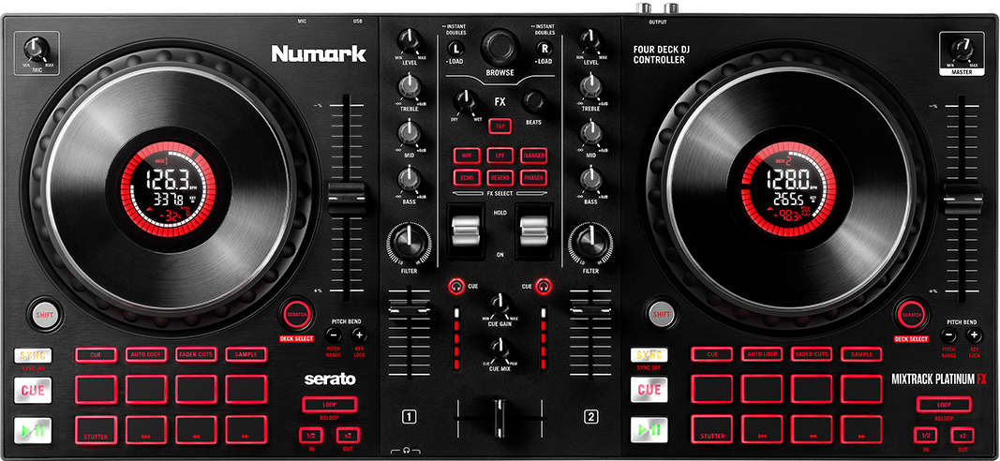
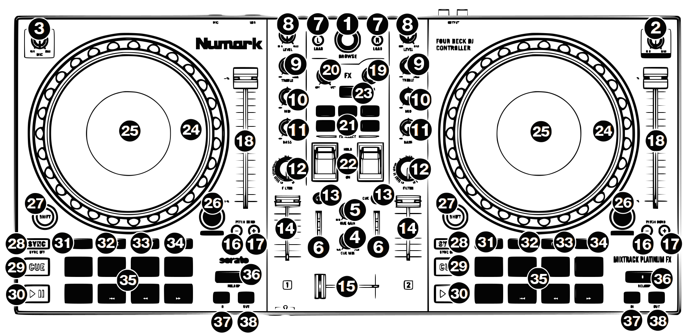

Numark Mixtrack Platinum FX
==============================

The Mixtrack Platinum FX is a 24-bit 4-deck digital DJ controller with a dedicated software effects section, large 6-inch capacitive-touch jog wheels and 16-multifunctional performance pads. Its stand out feature  is the LCD displays integrated into the jog wheels, apart from that it shares the layout of the Mixtrack Pro FX.

It is a USB Audio and MIDI Class compliant device and works with Linux, macOS, and Windows.

- `Manufacturer's product page <https://www.numark.com/product/mixtrack-platinum-fx>`__
- `Forum thread <https://mixxx.discourse.group/t/numark-mixtrack-platinum-fx-mapping/19985/215>`__

Firmware
--------

The mapping requires the following Firmware for all enabled features to work for Mixxx 2.4

-  `Firmware Update v1.10 MAC <https://cdn.inmusicbrands.com/Numark/MixtrackPlatinumFX/Mixtrack%20Platinum%20FX%20Firmware%201.10%20Mac.zip>`_
-  `Firmware Update v1.10 WIN <https://cdn.inmusicbrands.com/Numark/MixtrackPlatinumFX/Mixtrack%20Platinum%20FX%20Firmware%201.10%20Win.zip>`_
- Linux users need to install firmware using Windows or MAC.

Audio Interface
---------------

Configure Mixxx' Main output for channels 1-2 and Headphones output for Channels 3-4.

The microphone input on this controller is not available to the computer through the controller's audio interface. It is mixed with the master output in hardware, so this controller's audio interface is not suitable for broadcasting or recording the inputs. If you want to use the controller for broadcasting or recording, a separate audio interface with a microphone input is suggested.

Control Mapping
---------------

=======  ==============================================  ===============================================================
No.      Control                                         Function
=======  ==============================================  ===============================================================
1        :hwlabel:`Browse` Rotate                        Cycle through folders and tracks
|        Press                                           Cycle between the Crates and Library
|        :hwlabel:`SHIFT` Rotate                         Fast Scrolling
|        Left :hwlabel:`SHIFT` Press                     Open/Close Directory
|        Right :hwlabel:`SHIFT` Press                    Preview Play/Stop Track
2        Master Gain                                     Adjusts the master volume in the software.
3        Mic Gain                                        Adjusts the level for the microphone input.
4        Cue Mix                                         Adjusts the audio output to the headphones, mixing between the cue output and the master mix output.
5        Cue Gain                                        Adjusts the volume for headphone cueing.
|        :hwlabel:`SHIFT` Global Sample Volume Adjust    Adjusts volume on all sample decks
6        Master Output LEDs                              Displays the audio level going to the Master Output.
7        Load                                            Press one of these buttons while a track is selected to assign it to Deck 1 or 2, respectively.
|        :hwlabel:`2X Press` Track Cloning               Quickly double press a Load button to clone the track of the adjacent deck.
|        :hwlabel:`SHIFT` Eject                          Removes the track from related deck.
8        Level                                           Adjusts the pre-fader, pre-EQ audio level of the corresponding channel.
9        High EQ                                         Controls the treble frequencies for the individual channels
10       Mid EQ                                          Controls the mid-range frequencies for the individual channels.
11       Low EQ                                          Controls the bass frequencies for the individual channels.
12       Filter                                          Adjusts the amount of the filter effect. Turning the knob left and right will produce a lowpass filter and high-pass filter, respectively.
13       Cue/PFL                                         Sends pre-fader audio to the cue channel forheadphone monitoring.
|        :hwlabel:`SHIFT` Slip Mode                      Toggles slip mode on/off for related deck.
14       Channel Fader                                   Adjusts the volume of the individual channels in the software.
15       Crossfader                                      Controls the blend between the two decks
16       Pitch Bend Down                                 Press and hold to momentarily reduce the speed of the track.
|        :hwlabel:`SHIFT` Pitch Range                    Hold Shift and this djust Pitch Range
17       Pitch Bend Up                                   Press and hold to momentarily reduce the speed of the track.
|        :hwlabel:`SHIFT` Keylock                        Hold Shift and this button to adjust Keylock.
18       Pitch Fader                                     This controls the speed of the music. Moving towards the + will speed the music up, while moving towards the – will slow it down.
19       Beats Multiplier                                Increases and decreases the rate of the effects to the beat. When using a time-based effect, this knob adjusts its time division.
|        :hwlabel:`SHIFT` FX Macros                      Selects and controls FX Macros parameters.
20       FX Wet/Dry Knob                                 Turn this knob to adjust the wet/dry mix of the effects.
21       Software FX                                     | Press one of these buttons to select the user assigned software effect.
                                                         | • HPF (High pass filter)
                                                         | • LPF (Low pass filter)
                                                         | • Flanger
                                                         | • Echo
                                                         | • Reverb
                                                         | • Phaser
                                                         | FX Buttons will need to be assigned with mixxx `Effects <https://manual.mixxx.org/2.5/en/chapters/effects#effects>`__ selectors in the graphical interface.
|        :hwlabel:`SHIFT` Multiple FX (at once)          Hold shift and select/unselect multiple FX buttons to be active at once.
22       FX Toggle On / Off:                             Push up on the toggle switch to latch (lock) the FX in the on position. Push down on the toggle switch to turn the FX on momentarily. When the toggle switch is in the middle position, the FX will be off.
23       Tap BPM                                         | Press this a minimum of 4 times to manually enter a new BPM. The software will ignore the track's BPM and follow your manually entered tempo.
                                                         | See :ref:`Tapping Logic <numark-platinum-fx-tapping-logic>`
|        Left :hwlabel:`PFL` ON (Right off)              | Set BPM for left deck.
                                                         | See :ref:`Tapping Logic <numark-platinum-fx-tapping-logic>`
|        Right :hwlabel:`PFL` ON (Left off)              | Set BPM for right deck.
                                                         | See :ref:`Tapping Logic <numark-platinum-fx-tapping-logic>`
|        :hwlabel:`SHIFT` Default Tempo Reset            | Press Shift and this button to reset the tempo to the track to default BPM.
                                                         | Note: Reset the selected deck. See :ref:`Tapping Logic <numark-platinum-fx-tapping-logic>`
24       Platter/Jog Wheel                               This capacitive, touch-sensitive jog wheel controls the audio when the wheel is touched and moved. When the Scratch button is not active, use the jog wheel to bend the pitch of the track. When the Scratch button is active, use the jog wheel to grab and move the audio, scratching the track as you would with a vinyl record. You can also grab the non-touch-sensitive outer wheel, to bend the pitch of the track.
|        :hwlabel:`SHIFT` Scrub Scroll                   Scrub Scrolling while holding Jog wheel.
25       Deck Display                                    | **1. Active Deck:** Indicates the currently active deck.
                                                         | **2. Platter Position:** Displays the current track position.
                                                         | **3. BPM:** Displays the current BPM for the selected track.
                                                         | **4. Keylock:** This icon illuminates when keylock is active for the current deck.
                                                         | **5. Pitch Range:** Shows the current pitch range.
                                                         | **6. Pitch:** Shows current pitch of the track.
                                                         | **7. Pitch Adjust:** Indicates the direction to move Pitch Fader to match the current track's BPM with the track on the opposite deck.
                                                         | **8. Time Remaining:** Displays the time elapsed or time remaining for the current track. (Time elapsed only implemented in current mapping).
                                                         | **9. Time Bars:** Provides visual reference to time remaining on the selected song. When the song is almost over these segments will flash to give a warning.
26       Scratch                                         Press this button to turn on the scratch feature for the jog wheel.
|        :hwlabel:`SHIFT` Deck Select                    Switch between decks 1 & 3 or 2 & 4 for 4 deck mixing
27       Shift                                           Allows multiple control commands to be triggered when pressed first along with other buttons.
28       Sync (tap)                                      Automatically match the corresponding Deck's tempo with the opposite Deck's tempo.
|        Lock Sync (hold)                                Hold for at least one second to lock sync. Tap again to release sync lock.
|        :hwlabel:`SHIFT` Quantize                       Toggle quantize on/off.
29       Cue (tap)                                       Sets and recalls the main Cue point in the current track
|        Cue Play (hold)                                 Play from the Cue point for as long as the button is held down and return to the cue point once it is released
|        :hwlabel:`SHIFT` Cue Track Start                Return cue head to beginning of track.
30       Play/Pause                                      Starts and suspends playback.
|        :hwlabel:`SHIFT` Beat Grid Adjust               Adjust Beat Grid, Hold shift and this button to align closest beat to the current play position.
31       Cue (Pad)                                       | With this Pad mode, each pad assigns a Hot Cue Point, or returns the track to that Hot Cue Point. When a pad is unlit, you can assign a Hot Cue Point by pressing it at the desired point in your track.
                                                         | See :ref:`Performance Pad Modes <numark-platinum-fx-performance-pad-modes>`
|        :hwlabel:`SHIFT` Secondary Hot Cue              Hot Cue 9-16
|        | :hwlabel:`HOLD` or :hwlabel:`2X PRESS`        Beat Jump
         | Beat Jump
32       Auto Loop (Pad)                                 | With this Pad mode, each pad triggers an auto loop of a different length.
                                                         | See :ref:`Performance Pad Modes <numark-platinum-fx-performance-pad-modes>`
|        :hwlabel:`SHIFT` Beat Jump                      Roll Loop
|        | :hwlabel:`HOLD` or :hwlabel:`2X PRESS`        Cue Loop
         | Beat Jump
33       Fader Cuts (Pad)                                | With this Pad mode, the top 4 performance pads are used to perform transform effects for cuts on scratching.
                                                         | See :ref:`Performance Pad Modes <numark-platinum-fx-performance-pad-modes>`
|        :hwlabel:`SHIFT` Roll                           Each pad triggers a roll of a different length
|        | Hold or double-press                          Fader Cuts Roll Rev, Key Tempo
         | Fader Cuts 3rd set
34       Sampler 1-8 (Pad)                               | With this Pad mode, each pad triggers a sample in the software.
                                                         | See :ref:`Performance Pad Modes <numark-platinum-fx-performance-pad-modes>`
|        :hwlabel:`SHIFT` Sampler 9-16                   Selects layer 2 of samples - Performance pads then trigger samples 9-16.
|        | Hold or double-press                          Pitch Play
         | Pitch Play
35       Performance Pads                                | The pads are used to trigger loop points or samples depending on the Pad mode setting.
                                                         | See :ref:`Performance Pad Modes <numark-platinum-fx-performance-pad-modes>`
36       Loop On/Off                                     Press to activate auto loop on/off.
|        :hwlabel:`SHIFT` Re-Loop                        Triggers a re-loop
37       Loop 1/2                                        | Press this button when a loop is active to decrease the loop size by half.
|        :hwlabel:`SHIFT` Loop In (Manual Loop)          Set the Loop In point for a manual loop.
38       Loop x2                                         Press this button when a loop is active to double the loop size.
|        :hwlabel:`SHIFT` Loop Out (Manual Loop)         Set the Loop Out point for a manual loop.
=======  ==============================================  ===============================================================

..

.. _numark-platinum-fx-performance-pad-modes:

Performance Pad Modes
---------------------

The pads are for controlling cue's, loops, and samples via various modes. To select a mode, select a Pad Mode button (Cue, Auto Loop, Fader Cuts & Sample) to assign that functionality to the 8 pads. An LED under the pad, indicates the currently selected mode.

Further to the NORMAL Pad Mode, 2 additional layers of functionality, SHIFT & ALTERNATE is also provided, as shown in the matrix below.

========================================  ====================  ===============  ===============  ======================  ===============
Function                                  Mode                  Cue              Auto Loop        Fader Cuts              Samples
========================================  ====================  ===============  ===============  ======================  ===============
Normal                                    | Primary             Hot Cue 1-8      Auto Loop        Fader Cuts              Sample 1-8
                                          |
                                          | • (LED On)                                            Transport
:hwlabel:`SHIFT`                          | Secondary Mode      Hot Cue 9-16     Roll Loop        Fader Cuts 8            Sample 9-16
                                          |
                                          | • (LED Slow Blink)
:hwlabel:`Hold` or :hwlabel:`2X PRESS`    | Alternative Mode     Beat Jump        Cue Loop         Fader Cuts              Pitch Play
                                          |                                                        Roll Rev, Key Tempo
                                          | • (LED Fast Blink)
========================================  ====================  ===============  ===============  ======================  ===============

..

**NOTE:** Within these modes initiated by SHIFT, the SHIFT button can be further used as an action or function for the individual pads.

.. _numark-platinum-fx-pad-loop-lengths:

**Pad Loop Lengths**

===============  ===============  ===============  ===============
Pad 1            Pad 2            Pad 3            Pad 4
===============  ===============  ===============  ===============
1 beat           2 beat           4 beat           8 beat
===============  ===============  ===============  ===============

..

**Cue Mode & Layers**

.. csv-table::
   :header: "Mode", "Pad Function", "Shift function"
   :widths: 40 50 50

   "Normal

   • (LED On)", "**Cue Pad 1-8**

   Each pad assigns a Hot Cue Point, or returns the track to that Hot Cue Point. When a pad is unlit, you can assign a Hot Cue Point by pressing it at the desired point in your track.", "**Remove Cue**

   Hold and selecting pad, removes that cue point."
   ":hwlabel:`SHIFT`

   Secondary Mode

   • (LED Slow Blink)", "**Cue 9-16**

   Same as Normal mode", "**Remove Cue**

   Hold and selecting pad, removes that cue point."
   ":hwlabel:`Hold` or :hwlabel:`2X PRESS`

   Alternative Mode

   • (LED Fast Blink)", "**Beat Jump**

   Lets you move forwards in a track in predefined pad beat increments while staying in sync and on time.

   See :ref:`Pad Loop Lengths <numark-platinum-fx-pad-loop-lengths>`", "**Reverse Beat Jump**

   Holding and selecting pad, let's you move backwards in a track in predefined pad beat increments while staying in sync and on time

   See :ref:`Pad Loop Lengths <numark-platinum-fx-pad-loop-lengths>`"
..

**Auto Loop Mode & Layers**

.. csv-table::
   :header: "Mode", "Pad Function", "Shift function"
   :widths: 40 50 50

   "Normal

   • (LED On)", "**Auto Loop8**

   Activates a loop section of pre-determined pad beat lengths, which loops automatically.", "**Roll Loop (Hold shift)**

   Hold and selecting pad, performs a standard Auto Loop, but when the loop is turned off the playback position is returned to the position where it would be, if it had not entered the loop."
   ":hwlabel:`SHIFT`

   Secondary Mode

   • (LED Slow Blink)", "**Roll Loop (Hold shift)**

   Performs a standard Auto Loop, but when the loop is turned off the playback position is returned to the position where it would be, if it had not entered the loop.", "**Auto Loop**

   Hold and selecting pad, Activates a loop section of pre-determined pad beat lengths, which loops automatically."
   ":hwlabel:`Hold` or :hwlabel:`2X PRESS`

   Alternative Mode

   • (LED Fast Blink)", "**Cue Loop**

   Pressing the button jumps to the relative hot cue (1-8) and activates a loop (the same length as if the loop button was pressed).

   TIP: Adjust loop length with dedicated loop controls half or double.", "**Cue Loop Roll & Slip**

   Hold and selecting pad, additionally activates slip mode, and does a roll at the cue point, then releasing the button, resumes where it would have been."
..

**Fader Cuts Mode & Layers**

.. csv-table::
   :header: "Mode", "Pad Function", "Shift (as Pad Action)"
   :widths: 40 50 50

   "Normal

   • (LED On)", "**Fader Cuts (Pad 1-4)**

   The pads will mute and unmute the deck's audio signal in a way that emulates crossfader movements toward that deck.

   (P1-4) Standard Fader Cuts (Click Flares)

   **(P5-8) Factory Functions**

   P5 – Stutter / Repeat

   P6 – Start / Previous Track

   P7 – Rewind

   P8 – Fast Forward", "*Note: Shift + Pad Mode* buttons, puts decks into an alternate pad layer. In that layer shift can be further used as an pad action for the individual pads."
   ":hwlabel:`SHIFT`

   Secondary Mode

   • (LED Slow Blink)", "(P1-4) Standard Fader Cuts

   (P5-8) Extended Fader Cuts", ""
   ":hwlabel:`Hold` or :hwlabel:`2X PRESS`

   Alternative Mode

   • (LED Fast Blink)", "(P1-4) Standard Fader Cuts

   (P5) – Reverse Roll (Censor)

   (P6) – Reverse Toggle (Censor)

   (P7) – Key sync to deck

   (P8) – Tap Tempo.", "(P5-8) Various Fader Cuts

   (P7) – Reset Key sync

   (P8) – Reset Tap Tempo."
..

**Sample Mode & Layers**

.. csv-table::
   :header: "Mode", "Pad Function", "Shift function"
   :widths: 40 50 50

   "Normal

   • (LED On)", "(P1-8) Play Sample", "**Stop Playback/Load Sample**

   Hold and selecting pad, Stop Playback or Load Sample if the slot is empty."
   ":hwlabel:`SHIFT`

   Secondary Mode

   • (LED Slow Blink)", "(P9-16) Play Sample", "**Stop Playback/Load Sample**

   Hold and selecting pad, Stop Playback or Load Sample if the slot is empty."
   ":hwlabel:`Hold` or :hwlabel:`2X PRESS`

   Alternative Mode

   • (LED Fast Blink)", "**Pitch Play (P1-4)**

   Play a single cue Point at variable pitches.

   Note

   • Only One Cue at a time

   • Deleting cue point in Pitch Play Mode not possible,", "**Change Range**

   Hold and selecting SAMPLE, changes Range 3 ranges.

   **Change cue**

   Hold and selecting other cue point on Cue Pad changes cue."

.. _numark-platinum-fx-tapping-logic:

Tapping
-------

Logic for the tap button:

1. If only one deck is loaded, the BPM control will be assigned to the loaded deck.

2. If both decks are loaded (only 1 PFL ON):

   A. One deck with active PFL, the BPM button will be assigned to the deck with active PFL.

3. If both deck is loaded (Both PFL on the same state):

   A. The BPM button will be assigned to the deck the is playing.

   B. If both deck are playing, then BPM will control the deck with the lowest deck number

*Note:*
*BPM only controls the active deck*
*To help know which it is using when tapping BOTH up and down arrows on the deck are lit. As the first tap doesn't make any changes (you can't work out a bpm from one tap) it is safe to tap and hold the button and check which deck the arrows are showing on.*

**PADS**

The pads are for controlling cues, loops, and samples via various modes & layers. To select a mode, select a Pad Mode button (Cue, Auto Loop, Fader Cuts & Sample) to assign that functionality to the 8 pads. An LED under the pad section indicates the currently selected

.. Credit to PopHippy for creating the original PDF file.
