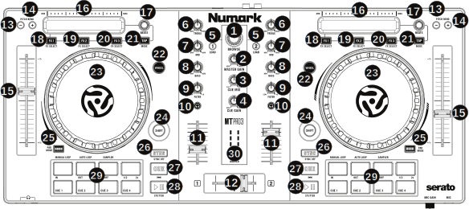

.. _numark-mixtrack-pro-3:

Numark Mixtrack (Pro) 3
=======================

-  `Manufacturer’s product page <http://www.numark.com/product/mixtrack-pro-3>`__
-  `Manufacturer's User Manual <https://www.numark.com/images/product_downloads/MixtrackPro3-UserGuide-v1.1.pdf>`__
-  `Forum thread <https://mixxx.discourse.group/t/mixtrack-pro-3/15165>`__

The Numark Mixtrack 3 and Numark Mixtrack Pro 3 are the same controller
except that the Pro version has an integrated 4 channel output sound
card and costs $50 more. If you use the non-Pro version, you would need
a :ref:`splitter cable <hardware-splitter-cables>` or
:ref:`separate audio interface <hardware-audio-interfaces>` to be able
to preview tracks in headphones.

The microphone input on the Pro version is not available to the computer
through the controller’s sound card. It is mixed with the master output
in hardware, so this controller’s sound card is not suitable for
broadcasting or recording the inputs. If you want to use the controller
for broadcasting or recording, getting the non-Pro version with a
separate :ref:`audio interface <hardware-audio-interfaces>` with a
microphone input is suggested.

.. versionadded:: 2.1

Configuration options
---------------------

Configuration options can be set in the mapping. You will need to edit
the values below at the very top of the JavaScript file
“Numark-Mixtrack-3-scripts.js” and save changes. Allowed values are
“**true**” or “**false**” unless specified.

-  **TrackEndWarning**: whether the Wheel button flashes near the end of
   a track
-  **iCutEnabled**: whether to enable iCut with the jog wheel. See
   `#platter/jog wheel <#platter/jog%20wheel>`__ section for details
-  **fastSeekEnabled**: whether to enable fast seeking with the jog
   wheel. See `#platter/jog wheel <#platter/jog%20wheel>`__ section for
   details
-  **smartPFL**: When the Load button is used, the Cue/PFL button is
   automatically activated on the deck being loaded and deactivated on
   the other deck
-  **beatlooprollActivate**: Use beatlooproll (slip mode loop) instead
   of beatloop command when using pads in Autoloop mode
-  **DarkMetalSkin**: Specify if Dark Metal skin is used for your
   installation. This is required in order for Expand Library feature to
   work properly.
-  **FXMode**: Select FX Mode based on skin used:

   -  value “**1**”: (Deere skin): Each deck is assigned its own Effect
      Unit with 3 effects per deck (e.g. Deck 1 = Effect Unit 1, Deck 2
      = Effect Unit 2, etc…\\
   -  value “**2**”: (other skins): FX button 1 = Effect Unit 1, Effect
      1, FX Button 2 = Effect Unit 2, Effect 1, FX button 3 = Effect
      Unit 3, Effect 1. Effect settings are shared by each deck.\\

-  **PitchBendOnWheelOff**: allow nudge with wheel when wheel is not
   active.
-  **noPlayOnSyncDoublePress**: Specify if Play is disabled on Sync
   button Double Press.
-  **ShiftFilterFX4**: Specify Shift+Filter control behavior - FX
   parameter 4 (true) or Channel Gain (false)

Mapping Description
-------------------

   Numark Mixtrack (Pro) 3 (schematic view)

1. Browser Knob
~~~~~~~~~~~~~~~

| Rotate this knob to cycle through tracks in main library window. Press
  the Knob to expand library view.
| :hwlabel:`SHIFT` **+ Turn:** allows selecting Play Lists and side navigation bar
  items.
| :hwlabel:`SHIFT` **+ Push:** opens / closes selected side navigation bar item.

2. Master Gain
~~~~~~~~~~~~~~

| Adjusts the master volume in the software.
| **Note**: This control does not affect the microphone volume which is
  summed with the final output of the Master Gain to the Master Output.
  Use the Mic Gain knob to control the microphone volume.

3. Cue Mix
~~~~~~~~~~

Adjusts the software’s audio output to the headphones, mixing between
the cue (PFL) output and the master mix output.

4. Cue Gain
~~~~~~~~~~~

Adjusts the volume for headphone cueing in the software.

5. Load
~~~~~~~

| Press one of these buttons while a track is selected in the library
  window to assign it to Deck 1 and 2, respectively, in the software.
| :hwlabel:`SHIFT` + :hwlabel:`LOAD`: Activates Fader Start mode for the corresponding
  (PFL Button is then blinking). Fader start guide: In fader start mode,
  not only you can press the play/pause button to play/pause the track,
  but if you move up the level fader (the volume fader if you prefer) of
  the deck, the track will be played and if you close it to zero, the
  track will be paused.
| **Configurable option:**
| If the `smartPFL option <#configuration-options>`__ is set to true,
  the Cue/PFL button is automatically activated on the deck being loaded
  and deactivated on the other deck.

6. High EQ Knobs
~~~~~~~~~~~~~~~~

| Adjust High frequencies of the deck
| :hwlabel:`SHIFT` + :hwlabel:`HIGH`: Adjust parameter 1 of the currently focused effect on this deck.

7. Mid EQ Knobs
~~~~~~~~~~~~~~~

| Adjust Mid frequencies of the deck
| :hwlabel:`SHIFT` + :hwlabel:`MID`: Adjust parameter 2 of the currently focused effect on this deck.

8 Low EQ Knobs
~~~~~~~~~~~~~~

| Adjust Low frequencies of the deck
| :hwlabel:`SHIFT` + :hwlabel:`LOW`: Adjust parameter 3 of the currently focused effect on this deck.

9. Filter
~~~~~~~~~

| Adjusts the amount of the filter effect. Turning the knob left
  controls the low pass filter; turning it right controls the high pass
  filter.
| :hwlabel:`SHIFT` + :hwlabel:`FILTER`: Adjust parameter 4 of the currently focused effect on this deck.
| If effect is unfocused then;
| :hwlabel:`SHIFT` + :hwlabel:`FILTER` Adjust the gain of the deck.

10. Cue/PFL/Headphones
~~~~~~~~~~~~~~~~~~~~~~

| Sends pre-fader audio to the headphone output
| :hwlabel:`SHIFT` + :hwlabel:`CUE/PFL`: Toggle quantize mode

11. Volume fader
~~~~~~~~~~~~~~~~

Adjusts the volume of the deck

12. Crossfader
~~~~~~~~~~~~~~

Controls the blend between the two decks

13-14. Pitch Bend Down/Up
~~~~~~~~~~~~~~~~~~~~~~~~~

| Press and hold to momentarily reduce the speed of the track.
| :hwlabel:`SHIFT` + **PITCH BEND** :hwlabel:`-`/:hwlabel:`+`: Jump 1 beat backward/forward
|  - If loop is activated, move loop by beatjump amount instead.

15. Pitch Fader
~~~~~~~~~~~~~~~

Adjust the speed of the music (activate keylock to adjust tempo without
affecting pitch). Note that moving the fader down *increases* speed, as
marked by the “+” at the bottom of the fader on the controller. This can
be reversed in Mixxx’s preferences under Interface > Speed slider
direction

16. Touch Strip
~~~~~~~~~~~~~~~

| Use the Touch Strip to adjust the deck’s Effect Unit Superknob. If
  Effects are assigned to Instant FX , they will be enabled instantly on
  touch, and disabled on finger lift.
| :hwlabel:`SHIFT` + **Touch Strip**: search through a track’s timeline

17. Beats Multiplier
~~~~~~~~~~~~~~~~~~~~

| Adjusts the Dry/Wet mix of the deck’s Effect Unit
| :hwlabel:`TAP` + :hwlabel:`BEATS`: Moves the beat grid left (turn counterclockwise) or
  right (turn clockwise)
| :hwlabel:`SHIFT` + :hwlabel:`BEATS`: Adjust beatjup amount  
| :hwlabel:`PADMODE` + :hwlabel:`BEATS`: Adjust Sampler Volume.
  Left beat knob will adjust Samplers 1-4; Right knob will adjust Samplers 5-8

18. FX 1 On/Off
~~~~~~~~~~~~~~~

| Turns FX1 on and off
| :hwlabel:`SHIFT` + :hwlabel:`FX1`: Select from the list of available effects for the respective effect.
| :hwlabel:`PADMODE` + :hwlabel:`FX1`: Assign / unassign FX 1 to Instant FX. When assigned to
  Instant FX, the FX is instantly activated by touching the Strip and stopped when finger is lifted.
| :hwlabel:`TAP` + :hwlabel:`FX1`: Focus this effect to allow adjusting its metaknob with the touch strip.

19. FX 2 On/Off
~~~~~~~~~~~~~~~

| Turns FX2 on and off
| :hwlabel:`SHIFT` + :hwlabel:`FX2`: Select from the list of available effects for the respective effect.
| :hwlabel:`PADMODE` + :hwlabel:`FX2`: Assign / unassign FX 1 to Instant FX. When assigned to
  Instant FX, the FX is instantly activated by touching the Strip and stopped when finger is lifted.
| :hwlabel:`TAP` + :hwlabel:`FX2`: Focus this effect to allow adjusting its metaknob with the touch strip.

20. FX 3 On/Off
~~~~~~~~~~~~~~~

| Turns FX3 on and off
| :hwlabel:`SHIFT` + :hwlabel:`FX3`: Select from the list of available effects for the respective effect.
| :hwlabel:`PADMODE` + :hwlabel:`FX3`: Assign / unassign FX 1 to Instant FX. When assigned to
  Instant FX, the FX is instantly activated by touching the Strip and stopped when finger is lifted.
| :hwlabel:`TAP` + :hwlabel:`FX3`: Focus this effect to allow adjusting its metaknob with the touch strip.

21. Tap BPM
~~~~~~~~~~~

| Press this 8 or more times on beat to manually enter a new BPM. The
  software will ignore the track’s BPM and follow your manually entered
  tempo.
| :hwlabel:`SHIFT` + :hwlabel:`TAP`: Toggles deck between deck 1-3 (left side) or deck 2-4
  (right side). TAP LED will be RED when deck 3 is active (Left Tap) or
  deck 4 is active (Right Tap)
| :hwlabel:`TAP` + :hwlabel:`HOTCUE 1`: Activates Brake effect
| :hwlabel:`TAP` + :hwlabel:`HOTCUE 2`: Activates Spinback effect

22. Wheel button
~~~~~~~~~~~~~~~~

| Activate this button to use the platter/jog wheel to grab and move the
  audio, scratching the track like a vinyl record.
| :hwlabel:`SHIFT` + :hwlabel:`WHEEL`: Toggle slip mode on/off

23. Platter/Jog Wheel
~~~~~~~~~~~~~~~~~~~~~

| **Touch side:** Pitch bend (nudging) if track is playing (Wheel On
  (always) & Wheel Off - if
  `PitchBendOnWheelOff <#configuration-options>`__ configuration option
  is true) and / track positioning (Wheel On)
| :hwlabel:`WHEEL` **On** + **Touch platter**: scratching: touch the platter and move it
| :hwlabel:`WHEEL` **Off** + **Touch platter**: If track is not playing, allows
  positioning the track
| :hwlabel:`SHIFT` + :hwlabel:`WHEEL` **Off** + **Touch platter**: fast seek through track
| :hwlabel:`SHIFT` + :hwlabel:`WHEEL` **On** + **Touch platter**: iCut mode: simulates a scratch
  routine with the jog wheel. When the jog wheel is turned back, the
  crossfader closes; when the jog wheel is turned forward the crossfader
  will open. As a visual reference, TAP LED and Wheel button LED will be
  ON.

**Configuration Options:** The `iCutEnabled <#configuration-options>`__
and `fastSeekEnabled <#configuration-options>`__ options can be used to
turn off iCut and fast seeking. These options may be helpful to avoid
accidentally using these features when touching the platter with shift
lock on.

24. Shift
~~~~~~~~~

| Allows multiple control commands to be triggered when pressed first
  along with other buttons

25. Pad Mode
~~~~~~~~~~~~

This is used to change the operation mode of the `top 4 performance
pads <#29.-Performance-Pads>`__. Pressing this button will light the pad
indicating the currently active mode (Manual Loop, Auto Loop or
Sampler).

26. Sync
~~~~~~~~

| Enables BPM syncing between decks.
| **Short Press:** Press once to synchronize the tempo (BPM) to that of
  to that of the other track
| **Double Press:** press twice QUICKLY to play the track immediately
  synchronized to the tempo (BPM) and to the phase of the other track,
  if the track was paused
| **Long Press** (Sync Lock): Hold for at least half of a second to
  enable sync lock for this deck. Decks with sync locked will all play
  at the same tempo, and decks that also have quantize enabled will
  always have their beats lined up. If the Sync Lock was previously
  activated, it just deactivates it regardless of the Short press/Double
  Press
| :hwlabel:`SHIFT` + :hwlabel:`SYNC`: Toggle Key Lock

**Configuration Options:** The
`noPlayOnSyncDoublePress <#configuration-options>`__ option can be used
to turn off Play on Sync Double Press.

27. Cue (Transport Control)
~~~~~~~~~~~~~~~~~~~~~~~~~~~

| Behavior depends on the :ref:`cue mode <interface-cue-modes>` set in the Mixxx preferences.
| :hwlabel:`SHIFT` + :hwlabel:`CUE`: Return the play head to the start of the track.

28. Play/Pause
~~~~~~~~~~~~~~

| Starts and suspends playback. If no track is loaded, loads the
  selected track (if any) and play.
| :hwlabel:`SHIFT` + :hwlabel:`PLAY/PAUSE`: Stutter the track from the last set cue point.
  If a cue point has not been set, the play head will return to the
  start of the track.

29. Performance Pads
~~~~~~~~~~~~~~~~~~~~

The top row of pads is for controlling loops and samples. To select a
mode, hold down the Pad Mode button and press one of the upper pads. An
LED under the pad section indicates the currently selected mode. See the
subsections below for details about each mode.

| The bottom row of pads is used to trigger hotcue points. If a hotcue
  point has not already been set for the loaded track, this control will
  mark the hotcue point. If a hotcue point has already been set, this
  control will jump to it.
| :hwlabel:`SHIFT` + :hwlabel:`HOTCUE`: Deletes the assigned hotcue point

Manual Loop Mode
^^^^^^^^^^^^^^^^

Hold :hwlabel:`PADMODE` and press the pad marked Manual Loop (silkscreened above
the pad) to assign the lower 4 pads to the functions listed below:

-  **Loop In** – Sets the beginning of a loop: When assigned, the Pad
   LED will light blue
-  **Loop Out** – Sets the end point for the loop: When assigned, the
   Pad LED will light blue
-  **On/Off** – (De)activate the loop. If a loop has not been set, this
   button will have no effect.: When assigned, the Pad LED will light
   blue
-  **Loop x1/2** – Halve the length of the loop. Press :hwlabel:`SHIFT` + **Loop x1/2**
   to double the length of the loop.
   x1/2 button is disabled unless the corresponding deck is set to
   be quantized

Auto Loop Mode
^^^^^^^^^^^^^^

| Hold Pad Mode and press the pad marked Autoloop to assign the lower 4
  pads to the functions listed below: When assigned, the respective Pad
  LED will blink Yellow

-  **Auto 1** – Sets and starts playback of a 2-beat autoloop.
-  **Auto 2** – Sets and starts playback of a 4-beat autoloop.
-  **Auto 3** – Sets and starts playback of a 8-beat autoloop.
-  **Auto 4** – Sets and starts playback of a 16-beat autoloop.
-  :hwlabel:`SHIFT` **+ Auto 1** – Sets and starts playback of a 1/8-beat autoloop.
-  :hwlabel:`SHIFT` **+ Auto 2** – Sets and starts playback of a 1/4-beat autoloop.
-  :hwlabel:`SHIFT` **+ Auto 3** – Sets and starts playback of a 1/2-beat autoloop.
-  :hwlabel:`SHIFT` **+ Auto 4** – Sets and starts playback of a 1-beat autoloop.

If the pad is held down more than .5 second (Long Press), the Autoloop
will be disabled once pad is released. On Short Press, the pad will
behave as a normal button (ON on first press, OFF on second press)

Sample Mode
^^^^^^^^^^^

| Hold Pad Mode and press the pad marked Sampler to assign the lower 4
  pads to the functions listed below. When assigned, the respective Pad
  LED will blink Purple
| Shift + Sample X will play loaded sample, but with Sampler unit Sync
  disabled

-  **Deck 1 - Sample 1** – Plays the sample assigned to Sample Pad 1
   with the unit Sync activated.
-  **Deck 1 - Sample 2** – Plays the sample assigned to Sample Pad 2
   with the unit Sync activated.
-  **Deck 1 - Sample 3** – Plays the sample assigned to Sample Pad 3
   with the unit Sync activated.
-  **Deck 1 - Sample 4** – Plays the sample assigned to Sample Pad 4
   with the unit Sync activated.
-  **Deck 2 - Sample 1** – Plays the sample assigned to Sample Pad 5
   with the unit Sync activated.
-  **Deck 2 - Sample 2** – Plays the sample assigned to Sample Pad 6
   with the unit Sync activated.
-  **Deck 2 - Sample 3** – Plays the sample assigned to Sample Pad 7
   with the unit Sync activated.
-  **Deck 2 - Sample 4** – Plays the sample assigned to Sample Pad 8
   with the unit Sync activated.

If the pad is held down more than .5 second (Long Press), the sampler
will be disabled once pad is released. On Short Press, the pad will
behave as a normal button (ON on first press, OFF on second press)

-  Load sample by selecting track and pressing **Sample X**
-  Pressing sample button when sample is already playing goes back to
   cue and plays
-  Shift + sample to stop sample
-  Eject sample by :hwlabel:`TAP` + **Sample X**

30. Master Output LEDs
~~~~~~~~~~~~~~~~~~~~~~

Displays the audio level going to the Master Output.

