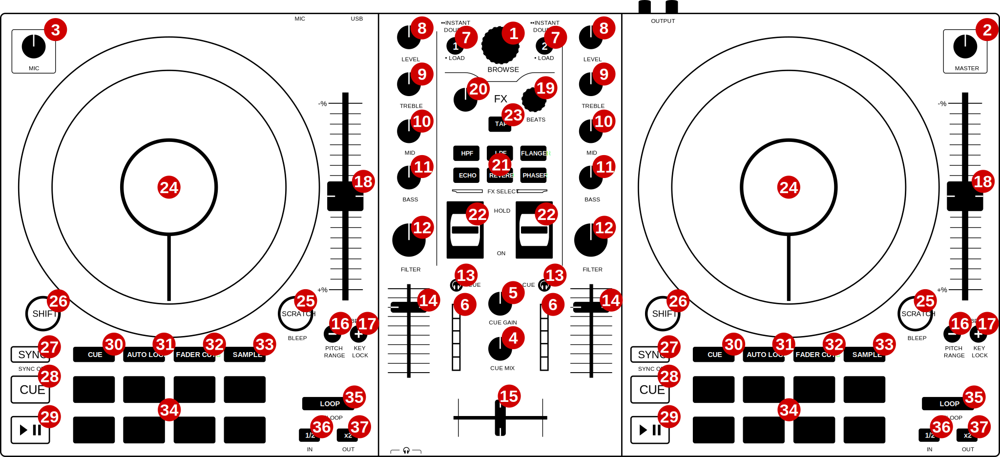

Numark Mixtrack Pro FX
======================

`Manufacturer's product page <https://www.numark.com/product/mixtrack-pro-fx>`_ · `Manufacturer's user manual <https://cdn.inmusicbrands.com/Numark/vAC9uYWEnT/mtprfx/MixTrackProFX-UserGuide-v1.2.pdf>`_ · `Forum thread <https://mixxx.discourse.group/t/numark-mixtrack-pro-fx/19561>`_

.. versionadded:: 2.3.1

Overview
--------

See the tables below for controls descriptions.

Misc
----

..
   TODO change "master output" to "main output"

.. csv-table::
   :header: "#", "Name", "Function"
   :widths: 5 25 70

   "1", ":hwlabel:`BROWSE` (rotate)", "Browse library"
   "1", ":hwlabel:`SHIFT` + :hwlabel:`BROWSE` (rotate)", "Zoom in/out :term:`waveform summary`"
   "1", ":hwlabel:`BROWSE` (press)", "Switch between tree and track list"
   "1", ":hwlabel:`SHIFT` + :hwlabel:`BROWSE` (press)", "Select item (collapse/extend tree branch or load track)"
   "2",  ":hwlabel:`MASTER`", "Adjust the volume level of :term:`master output`. Does not affect the microphone volume (adjusted separately with the :hwlabel:`MIC` knob)"
   "3",  ":hwlabel:`MIC`", "Adjust the volume level of microphone input. Note that the microphone input is mixed in hardware, so the corresponding :term:`GUI` knob does not reflect the hardware knob state."
   "4",  ":hwlabel:`CUE MIX`", ":term:`Head/mix knob<Head/mix button>`. Adjust the audio output to the headphones, mixing between the cue output and the main mix output"
   "5",  ":hwlabel:`CUE GAIN`", "Adjust the headphone volume"
   "15", "Crossfader", "Controls the mix between the two decks"
   "23", ":hwlabel:`BPM`", "Tap repeatedly to enter a new :term:`BPM` on both decks"

Deck
-----

Each of those controls exists in both :term:`decks<deck>` and affects only the corresponding deck.

.. csv-table::
   :header: "#", "Name", "Function"
   :widths: 5 25 70

   "6",  "Main level meter", "Displays the audio level going to the main output"
   "7", ":hwlabel:`LOAD`", "Load selected track"
   "7", ":hwlabel:`·· INSTANT DOUBLES`

   (2x :hwlabel:`LOAD`)", "Load track from the opposite deck and seek to the same position. Deck cloning must be enabled in Mixxx settings (Settings -> Preferences -> Decks -> Double-press Load button to clone playing track)."
   "8",  ":hwlabel:`LEVEL`", "Adjust the pre-fader, pre-EQ audio level"
   "9",  ":hwlabel:`TREBLE`", "Adjust high frequencies"
   "10", ":hwlabel:`MID`", "Adjust middle frequencies"
   "11", ":hwlabel:`BASS`", "Adjust low frequencies"
   "12", ":hwlabel:`FILTER`", "Adjust the filter effect"
   "13", ":hwlabel:`CUE`", ":term:`Headphone button`. Toggle sending channel to the cue (headphone) channel"
   "14", "Channel fader", "Adjust volume level"
   "16", ":hwlabel:`PITCH BEND -` (hold)", "Temporarily reduce the speed of the track"
   "16", ":hwlabel:`PITCH RANGE`

   (:hwlabel:`SHIFT` + :hwlabel:`PITCH BEND -`)", "Change pitch range. Ranges are configurable in the script file, see :ref:`Adjustable values<numark_mixtrack_pro_fx_adjustable>` section."
   "17", ":hwlabel:`PITCH BEND +` (hold)", "Temporarily increase the speed of the track"
   "17", ":hwlabel:`KEYLOCK`

   (:hwlabel:`SHIFT` + :hwlabel:`PITCH BEND +`)", "Toggle :term:`key lock`"
   "18", "Pitch fader", "Adjust the speed of the track"
   "24", "Jog wheel (top)", "If scratch mode is enabled (see the :hwlabel:`SCRATCH` button below): scratch

   If scratch mode is disabled: pitch bend

   The behavior of jogwheel can be fine-tuned, see the :ref:`Adjustable values<numark_mixtrack_pro_fx_adjustable>` section."
   "24", "Jog wheel (edge)", ":term:`Pitch bend`"
   "24", ":hwlabel:`SHIFT` + jog wheel", "Seek track"
   "25", ":hwlabel:`SCRATCH`", "Toggle scratch mode. Enabled by default."
   "25", ":hwlabel:`BLEEP`

   (:hwlabel:`SHIFT` + :hwlabel:`SCRATCH`) (hold)", "Play the track in reverse, then release to continue playback from a point where the track would have been if it had not been reversed"
   "26", ":hwlabel:`SHIFT`", "Hold and then manipulate other controls to activate their secondary functions"
   "27", ":hwlabel:`SYNC`", "If sync lock is disabled: set BPM to the other deck's BPM

   If sync lock is enabled: disable sync lock"
   "27", ":hwlabel:`SYNC` (hold, then release)", "Enable :term:`sync lock`"
   "27", ":hwlabel:`SYNC OFF`

   (:hwlabel:`SHIFT` + :hwlabel:`SYNC`)", "Toggle :term:`quantization`"
   "28", ":hwlabel:`CUE`", "If track is playing: stops the track and resets position to the main cue point

   If playback is stopped: sets the main cue point"
   "28", ":hwlabel:`CUE` (hold)", "Play the track from main cue point, release to stop playback and return to the main cue point. Playback must be initially stopped on main cue point."
   "28", ":hwlabel:`SHIFT` + :hwlabel:`CUE`", "Stop the playback and return to the beginning of the track"
   "29", "Play/Pause", "Play/pause playback"
   "29", ":hwlabel:`SHIFT` + Play/Pause", "Toggle reverse playback"
   "35", ":hwlabel:`LOOP`", "If loop is disabled: enable loop, starting at current position

   If loop is enabled: disable loop"
   "35", ":hwlabel:`RELOOP`

   (:hwlabel:`SHIFT` + :hwlabel:`LOOP`)", "If loop is enabled: jump to loop IN point and stop playback

   If loop is disabled: enable loop, without moving it"
   "36", ":hwlabel:`1/2`", "Decrease loop size by half"
   "36", ":hwlabel:`IN`

   (:hwlabel:`SHIFT` + :hwlabel:`1/2`)", "Set the loop IN point"
   "37", ":hwlabel:`x2`", "Double the loop size"
   "37", ":hwlabel:`OUT`

   (:hwlabel:`SHIFT` + :hwlabel:`x2`)", "Set the loop OUT point"

.. hint::
   The actual behavior of CUE and Play/Pause buttons depends on Mixxx settings. See :doc:`../../chapters/user_interface` for more info.

FX
--

.. csv-table::
   :header: "#", "Name", "Function"
   :widths: 5 25 70

   "19", ":hwlabel:`BEATS`", "Adjust FX param 1 of Effect 1 on Effect Unit 1 and 2"
   "19", ":hwlabel:`SHIFT` + :hwlabel:`BEATS`", "Adjust FX param 2 of Effect 1 on Effect Unit 1 and 2"
   "20", "Dry/Wet knob", "Adjust the Dry/Wet rate of Effect Unit 1 and 2"
   "21", "FX select buttons", "See below"
   "22", "FX toggle switches", "Toggle Effect 1 on Effect Unit corresponding to deck number"

FX select buttons have different functions than what is printed on them. Below is the original layout (not used), and two tables presenting button functions (and :hwlabel:`SHIFT` + buttons functions).

.. csv-table:: Original layout of FX select buttons (**not used**)
   :align: center
   :widths: 33 33 33
   :width: 500 px

   ":hwlabel:`HPF`", ":hwlabel:`LPF`", ":hwlabel:`FLANGER`"
   ":hwlabel:`ECHO`", ":hwlabel:`REVERB`", ":hwlabel:`PHASER`"

.. csv-table:: FX select/bonus functions buttons
   :align: center
   :widths: 33 33 33
   :width: 500 px

   "Effect Unit 1 Effect 1 previous FX", "Adjust :term:`beatgrid` on deck 1", "Effect Unit 2 Effect 1 previous FX"
   "Effect Unit 1 Effect 1 next FX", "Adjust beatgrid on deck 2", "Effect Unit 2 Effect 1 next FX"

.. csv-table:: FX select/bonus functions buttons (:hwlabel:`SHIFT`)
   :align: center
   :widths: 33 33 33
   :width: 500 px

   "Pitch up on deck 1", "--", "Pitch up on deck 2"
   "Pitch down on deck 1", "--", "Pitch down on deck 2"

Pitch up/down buttons change pitch by one semitone.

.. hint::
   For more info about Effect Units see :doc:`../../chapters/effects`.

Pads
----

The 8 pads in each deck have multiple functions, depending on the selected *pad mode*. Default pad mode is *hotcues*. Current mode is selected by pressing one of the buttons above the pads. The button for currently active pad mode is lit up (or blinking, when secondary pad mode is selected - secondary pad modes are: beatjump and sampler 2).

Pads support secondary (shift) actions in most pad modes. 4 bottom pads with "special" functions printed on them (:hwlabel:`STUTTER`, etc.) act the same as the top 4 pads, i.e. don't perform any special functions.

.. csv-table::
   :header: "#", "Name", "Function"
   :widths: 5 25 70

   "30", ":hwlabel:`CUE`", "Change pad mode to :term:`hotcues<hotcue>`.

   **Pad press**: set hotcue if not set. If set, go to hotcue position and start playback

   :hwlabel:`SHIFT` **+ pad press**: remove hotcue (if set)

   Pad lights indicate if a particular hotcue is set or not."
   "30", ":hwlabel:`SHIFT` + :hwlabel:`CUE`", "Change pad mode to beatjump.

   **Pad press**: beatjump forwards

   :hwlabel:`SHIFT` **+ pad press**: beatjump backwards

   If loop is active, loop is moved forwards/backwards instead.

   Default beatjump values are: 1/16, 1/8, 1/4, 1/2, 1, 2, value set in Mixxx GUI (4 by default), 8. Values can be adjusted, see the :ref:`Adjustable values<numark_mixtrack_pro_fx_adjustable>` section."
   "31", ":hwlabel:`AUTO LOOP`", "Change pad mode to auto-loop.

   **Pad press**: activate auto-loop

   :hwlabel:`SHIFT` **+ pad press (hold)**: activate beatlooproll. When released, playback will resume where the track would have been if it had not entered the loop.

   Default auto-loop sizes are: 1/16, 1/8, 1/4, 1/2, 1, 2, 4, 8. Loop sizes can be adjusted, see the :ref:`Adjustable values<numark_mixtrack_pro_fx_adjustable>` section."
   "32", ":hwlabel:`FADER CUTS`", "Change pad mode to fader cuts

   This pad mode emulates rapid crossfader movements.

   **Pad press (hold)**: activate a fader cut. The crossfader will rapidly move in one of the 8 available patterns. The crossfader will return to the position of hardware crossfader after the pad is released.

   Note: this function is controlled by the hardware or firmware"
   "33", ":hwlabel:`SAMPLE`", "Change pad mode to sampler 1 (samples 1-8)

   **Pad press**: play a sample

   :hwlabel:`SHIFT` **+ pad press**: stop sample playback"
   "33", ":hwlabel:`SHIFT` + :hwlabel:`SAMPLE`", "Change pad mode to sampler 2 (samples 9-16)"
   "34", "Performance pads", "Various functions, depending on selected pad mode"
   "34", ":hwlabel:`SHIFT` + Performance pads", "Various functions, depending on selected pad mode"

.. _numark_mixtrack_pro_fx_adjustable:

Adjustable values
-----------------

There are a few configurable values at the top of the script (:file:`Numark-Mixtrack-Pro-FX-scripts.js`).

.. csv-table::
   :header: "Variable", "Default value", "Description"
   :widths: 10 20 70
   :quote: '

   '``pitchRanges``', '[0.08, 0.16, 1]', 'For adjusting the range of pitch fader. Pressing :hwlabel:`PITCH RANGE` (:hwlabel:`SHIFT` + :hwlabel:`PITCH BEND -`) cycles through available values. Number of values in the array can be changed without further script modifications. Note that the default (first) pitch range must be also selected independently in Mixxx settings (Settings -> Preferences -> Decks -> Slider range).'
   '``waveformsSynced``', 'true', 'This variable should reflect the corresponding Mixxx option (Settings -> Preferences -> Waveforms -> Synchronize zoom level across all waveforms). This affects waveform summary zooming.'
   '``jogScratchSensitivity``', '1024', 'Scratching sensitivity'
   '``jogScratchAlpha``', '1', 'For controlling the alpha-beta filter used in scratching'
   '``jogScratchBeta``', '1/32', 'For controlling the alpha-beta filter used in scratching'
   '``jogPitchSensitivity``', '10', 'Jogwheel pitch bend sensitivity'
   '``jogSeekSensitivity``', '10000', 'Jogwheel seek sensitivity'
   '``enableBlink``', 'true', 'Enable blinking of pad mode buttons when in secondary mode (beatjump or sampler 2)'
   '``blinkDelay``', '700', 'Blinking frequency of pad mode buttons when in secondary mode (in ms)'
   '``autoLoopSizes``', '["0.0625", "0.125", "0.25", "0.5", "1", "2", "4", "8"]', 'Loop sizes for the auto-loop pad mode, each value corresponds to one of the pads.'
   '``beatJumpValues``', '["0.0625\_", "0.125\_", "0.25\_", "0.5\_", "1\_", "2\_", "", "8\_"]', 'Beatjump values for the beatjump pad mode, each value corresponds to one of the pads. The empty value ("") means the value set in Mixxx (4 by default). Underscores (_) are needed because of that control, which has one underscore in the name, as opposed to beatjump controls with predetermined values which have two underscores.'

.. hint::
   See `here <https://github.com/mixxxdj/mixxx/wiki/Midi-Scripting#user-content-scratching-and-jog-wheels>`_ for more info about constants used in scratching.

Notes
-----

* Pressing either :hwlabel:`SHIFT` button will cause both decks to shift (e.g. when pressing :hwlabel:`SHIFT` on deck 1 and then some control on deck 2, the secondary function will be executed). This approach was chosen to be consistent with the behavior of hardware - i.e. pressing either :hwlabel:`SHIFT` changes midi codes of some controls on *both* decks.
* :hwlabel:`SHIFT` + :hwlabel:`TAP` does not trigger BPM rescan, as there is no Mixxx control for this action.
