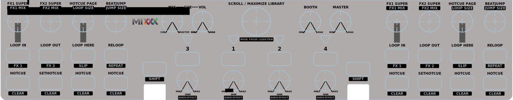

Numark N4
=========

The Numark N4 is a 4-deck DJ controller with seamless integration of external devices.

-  `Manufacturer’s product page <http://www.numark.com/product/n4>`__
-  `Wiki page <https://github.com/mixxxdj/mixxx/wiki/Numark-N4>`__

.. versionadded:: 1.10

Mapping Description
+++++++++++++++++++

   Numark N4 (schematic view)

This mapping has some unusual features like per Deck shift buttons and multiple pages of hotcues.
An annotated, ready-to-print overlay of this mapping can be downloaded for :download:`DIN A3<../../_static/controllers/numark_n4_overlay_a3.pdf>` and :download:`DIN A4<../../_static/controllers/numark_n4_overlay_a4.pdf>` printers.

Definable Settings
------------------

Some settings in the script can be changed by editing them at the top of the script.

| **searchAmplification** Defines the speedup-factor used when using the searchbutton and scrolling.
| *type:* number
| *range:* ]0;+∞[

| **warnAfterTime** Time in seconds before the end of the track in which the controller should warn you.
| *type:* number
| *range:* [0;+∞]

| **blinkInterval** Timeinterval for the triangular Leds in ms
| *type:* number
| *range:* [20;+∞[

| **encoderResolution** Percent how much the value changes with each encoder tick
| *type:* number
| *range:* ]0;1]

| **resetHotCuePageOnTrackLoad** The Hotcuepage should be reset to 1 when a new Track is loaded into the Deck
| *type:* boolean
| *range:* true or false

| **cueReverseRoll** If [SHIFT]+[CUE] should trigger a reverse_roll
| *type:* boolean
| *range:* true or false

| **rateRanges** An array of rateRanges in percent
| *type:* array
| *range:* ]0;3]

Deck
----

The Deck consists of the jogwheel, play, cue, the topContainer (which hold the eight square buttons and the four encoders), pitchslider, pitchrange, search, keylock, tap, sync and pitchbend ±.

Special Features
~~~~~~~~~~~~~~~~

The mapping features some peculiar features which might not be discoverable by standard trial-and-error.

Shift
^^^^^

A shift button is bound to its Deck, which means that you can’t use the shift button of Deck1 to access a shifted function on any of the other three Decks. Moreover the shiftbuttons can also work as
toggle switches instead of pushbuttons (enabled via components.js Button.type.powerWindow). This means that if the shiftbutton is pressed for a longer period than 275ms it will bounce back to its
original state (like a regular shift-/pushbutton). If the Button was pressed for a shorter period than 275ms, the button will remain in that state until it is pressed again (like a toggling button).

Hotcues
^^^^^^^

The four lower buttons of the topContainer are hotcues. They can be changed by using the corresponding Encoder [HOTCUE PAGE]. The current assignment will then be shown for one second in the upper row.
Currently up to 4 Pages are supported (with 4 hotcues each).

Controls
~~~~~~~~

Most of these controls behave as expected but they are listed in detail for the sake of completeness anyways.

Play
^^^^

| Default: Starts regular Play.
| Shifted: Plays Track in reverse.

Cue
^^^

| Default: Standard Cue.
| Shifted: reverse roll if shift is enabled (plays in reverse end enables slip) otherwise standard cue.

Pitchbend ±
^^^^^^^^^^^

| Default: Change rate temporarily.
| Shifted: Change rate temporarily small.

Sync
^^^^

| Default: Momentary BPM Sync
| \* Short Press: Momentary BPM & Phase Sync

-  Long Press: Toggle Sync Lock

Shifted: Toggles magnet (quantize)

Tap
^^^

| Default: Tap the desired BPM of the Channel
| Shifted: ^^
| Note: This functionality is broken until `#1811 <https://github.com/mixxxdj/mixxx/pull/1811>`__ gets merged

Search/Scratch
^^^^^^^^^^^^^^

| Default: Enable Scratching (otherwise it just works just like moving the Jog without the platter)
| Shifted: Speeds up platter movement for searching within the track

Keylock
^^^^^^^

| Default: Toggles track keylock
| Shifted: Syncs Key

Pitch Range
^^^^^^^^^^^

| Default: Cycles Through pitchranges
| Shifted: ^^

Pitch/Bpm slider
^^^^^^^^^^^^^^^^

| Default: Normal Pitchslider (Down plays faster; can be changed in the global mixxx preferences)
| Shifted: ^^

TopContainer
~~~~~~~~~~~~

The TopContainer holds four assignable Hotcue buttons, four loop buttons, which can enable FX via Shift, and four Encoderknobs.

.. _hotcues-1:

Hotcues
^^^^^^^

| Default: set/active Hotcue_X
| Shift: clear Hotcue_X
| *visit*\ `#special_features <#special_features>`__\ *for more info on how these work*

Loop In
^^^^^^^

| Default: Presses the Loop In button like in the UI
| Shifted: Toggles EffectRack1

Loop Out
^^^^^^^^

| Default: Presses the Loop Out button like in the UI
| Shifted: Toggles EffectRack2

Loop Here
^^^^^^^^^

| Default: Creates a loop at the current position of current Loop Size.
| Shifted: Toggles Slip

Reloop
^^^^^^

| Default: De-/Re-activates the last loop
| Shifted: Jumps to start of last loop and stops playback there

FX1 Knob
^^^^^^^^

| Default: Controls the Super Knob on EffectRack1.
| Shifted: Controls the Mix Knob on EffectRack1.

FX2 Knob
^^^^^^^^

| Default: Controls the Super Knob on EffectRack2.
| Shifted: Controls the Mix Knob on EffectRack2.

Hotcue Page
^^^^^^^^^^^

| Default: visit `#special_features <#special_features>`__ for more info on what this encoder does
| Shifted: Double/Halve current Loop Size

Beat Jump
^^^^^^^^^

| Default: Jump in the direction turned
| Shifted: Double/Halve current Beat Jump Size

Mixer
-----

The Mixer features four channels with identical functionality and controls for the library and other miscellaneous features.

Channel
~~~~~~~

A channel consists of a volume fader, a gain knob, knobs for low,mid,high EQ a Loadbutton and a pflButton. These are internally still part of the Deck which is why the shiftbutton of Deck 1 won’t work
with the Loadbutton or gainknob of Deck2/3/4.

Volume
^^^^^^

Default: Channel Volume

.. _cue-1:

CUE
^^^

| Default: Channel Pre-Fader-Listening
| *these work as usual on the N4: Clicking another one deselect all other.
  Press multiple at the same Time to PFL multiple Channels*

BASS
^^^^

Default: EQ Low

MID
^^^

Default: EQ Mid

TREBLE
^^^^^^

Default: EQ High

GAIN
^^^^

| Default: Gain
| Shifted: QuickEffect1 (Usually Filter)

LOAD
^^^^

| Default: Load Track into Deck
| Shifted: Eject Track from Deck

Library
~~~~~~~

The Library is managed via the Library Encoder. **Any** shiftbutton can be used to access shift functionanly

Turn
^^^^

| Default: Move Library Cursor Vertically
| Shifted: Move Focus between panes
| *sometimes the focus is stuck somewhere (eg when using the searchbox) and is only recoverable with user intervention via a pointing device.*

| **Button** Default: Open/Close Folder / Load Item into first available Deck (Context-dependent)
| Shift: Maximize Library

Miscellaneous
~~~~~~~~~~~~~

Crossfader
^^^^^^^^^^

The Crossfader and its assignment buttons are integrated seamlessly with Mixxx.

Line/PC Input Source
^^^^^^^^^^^^^^^^^^^^

Function as expected: Mutes the corresponding Deck in Mixxx if set to Line.

Crossfader Contour
^^^^^^^^^^^^^^^^^^

Normal: Uses the crossfader parameters that were present when the mapping was loaded Scratch: Uses Scratch typical parameters for hard cuts

Cue-Master Mix
^^^^^^^^^^^^^^

Doesn’t manipulate the mixxx controls. Make sure the head gain is not zero and the mix is set to 100% PFL

Cue Volume
^^^^^^^^^^

Make sure its high enough within mixxx

Booth/Gain Volume
^^^^^^^^^^^^^^^^^

Behaves as expected (but doesn’t manipulate any mixxx controls).
