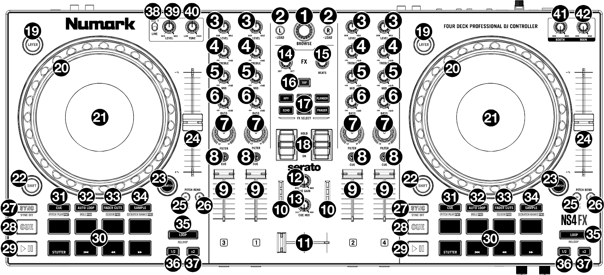
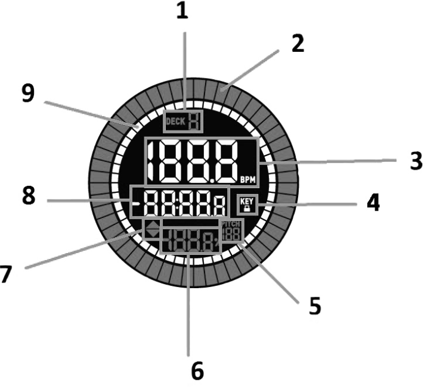

Numark NS4FX
============

-  `Manufacturer’s product page <https://www.numark.com/product/ns4fx>`__
-  `Forum thread <https://mixxx.discourse.group/t/numark-ns4-fx-mapping-repository/32767>`__

The Numark NS4FX is a 4 channel (with channel layering) DJ controller with an integrated audio interface.
Its stand out feature is the LCD displays integrated into the jog wheels.
It is a USB Audio and MIDI Class compliant device and works with Linux, macOS, and Windows.

.. versionadded:: 1.0

Audio interface
---------------

Configure Mixxx’s main output for channels 1-2 and Headphones output for Channels 3-4.

The microphone input on this controller is not available to the computer through the controller’s audio interface.
It is mixed with the main output in hardware, so this controller’s audio interface is not suitable for broadcasting or recording the inputs.
If you want to use the controller for broadcasting or recording, a separate :ref:`audio interface <hardware-audio-interfaces>` with a microphone input is suggested.

Configuration Options
---------------------

You can set configuration options in the Mixxx controller preferences.

-  **Enable Wheel on startup** When enabled (default), the jog wheels will be in vinyl/scratch mode by default.
   When disabled, they will be in pitch bend/nudge mode.
-  **SHIFT + Load ejects track** When enabled (default), holding the SHIFT button and pressing LOAD will eject the track from the deck.
   If disabled, it will load and play the selected track.
-  **Use effect only on active deck** When enabled, effects are only applied to the currently active deck (e.g., Deck 1 or 3).
   When disabled (default), effects are applied to both decks on that side (e.g., Deck 1 and 3).
-  **Display VU from both decks** When enabled, the channel VU meters will display the left and right master output levels.
   When disabled (default), they will display the individual level for each active deck.
   **Select default pad mode after Mixxx startup** Sets the performance pad mode that is active when Mixxx starts.
   **Control stems with Fader Cuts pads** When enabled, the 'Fader Cuts' pad mode is replaced with a mode to control Stems (mute, volume and quick effects).
   **Add hotcues 5-8 to the second row of pads** When enabled, the bottom row of transport pads (CUE, START, BACK, FWD) will function as hotcues 5-8 when the pad mode is set to 'Hot Cue'.

Mapping
-------

   Numark NS4FX (schematic view)

   1. **Browse Knob:** Rotate this knob clockwise to scroll down, counter clockwise to scroll up.
      Press the Knob to load tracks into the inactive deck, expand entries in the library view, and select playlists and crates.
      **SHIFT + Turn:** Page down/page up, allows you to scroll by page instead of by item.
      **SHIFT + Push:** Focus next library pane, allows you to toggle between the left and right panes.

   2. **Load:** Press one of these buttons while a track is selected in the library window to assign it to the active deck.
      **SHIFT + Load:** Load the track and play. If the 'SHIFT + Load ejects track' option is set, eject the track)

   3. **Level:** Adjusts the pre-fader, pre-EQ audio level of the corresponding channel.

   4. **Treble EQ:** Controls the treble frequencies for the individual channels.

   5. **Mid EQ:** Controls the mid-range frequencies for the individual channels.

   6. **Bass EQ:** Controls the bass frequencies for the individual channels.

   7. **Filter:** Adjusts the amount of the filter effect.
      Turning the knob left and right will produce a low-pass filter and high-pass filter, respectively.

   8. **Headphone Cue:** Sends pre-fader audio to the cue channel for headphone monitoring.

   9. **Channel Fader:** Adjusts the volume of the individual channels in the software.

   10. **Main Output LEDs:** Displays the audio level going to the Main Output.

   11. **Crossfader:** Controls the blend between the two decks.

   12. **Cue Gain:** Adjusts the volume for headphone cueing.

   13. **Cue Mix:**; Adjusts the audio output to the headphones, mixing between the cue output and the master mix output.

   14. **FX Wet/Dry Knob:** Turn this knob to adjust the wet/dry mix of the effects.

   15. **Beats Multiplier:** As Mixxx does not have a single BEATS knob, you can use it to control effect units superknobs.

   16. **Tap BPM:** Press this button 4 or more times to manually enter a new BPM.
       The software will ignore the track's BPM and follow your manually entered tempo.

       Press SHIFT and this button to reset the tempo to the track’s default BPM.

   17. **Software FX:** Press one or more of these buttons to select active software effects.

   18. **FX On / Off / Hold:** Push up on the toggle switch to latch (lock) the FX in the 'on' position.
       Push down on the toggle switch to turn the FX on momentarily.
       When the toggle switch is in the middle position, the FX will be off.

   19. **Layer:** Press this button to select which layer in the software is controlled by that hardware deck.
       Deck A can control Layer 1 or 3 while Deck B can control Layer 2 or 4.

   20. **Platter/Jog Wheel:** This capacitive, touch-sensitive jog wheel controls the audio when the wheel is touched and moved.
       When the Scratch button is not active, use the jog wheel to bend the pitch of the track.
       When the Scratch button is active, use the jog wheel to grab and move the audio, "scratching" the track as you would with a vinyl record.
       You can also grab the non-touch-sensitive outer wheel to bend the pitch of the track.

       Press SHIFT and move the wheel to quickly search through the track audio.

   21. **Display:** Use this screen to view information about the current track.
       See the TODO DISPLAY for more information.

   22. **SHIFT:** Allows multiple control commands to be triggered when pressed first along with other buttons.

   23. **Scratch:** Press this button to turn on the scratch feature for the jog wheel.

   24. **Pitch Fader:** Adjust the speed of the music.
       Moving towards the " + " will speed the music up, while moving towards the "–" will slow it down.
       **NOTE:** You can reverse the slider direction by deactivating the `Down increases speed` option in Mixxx Deck preferences.
       **SHIFT + Pitch Fader** changes the pitch range of the deck between 4% to 90%.

   25. **Pitch Bend Down:** Press and hold to momentarily reduce the speed of the track.
       **SHIFT + Pitch Bend Down:** Adjust the key of the playing track down.
       **Pitch Bend Up + Pitch Bend Down:** Toggle keylock.

   26. **Pitch Bend Up:** Press and hold to momentarily increase the speed of the track.
       **SHIFT + Pitch Bend Up:** Adjust the key of the playing track up.
       **Pitch Bend Up + Pitch Bend Down:** Toggle keylock.

   27. **Sync:** Set the BPM of this deck to match the opposite deck.
       **Press:** Press once to synchronize the tempo (BPM) to that of to that of the other track
       **Long Press:** Enable :ref:`Sync Lock <sync-lock>`. Press again to disable.
       **SHIFT + Sync:** Toggle quantize mode.

   28. **Cue (Transport Control):** Behavior depends on the :ref:`cue mode <interface-cue-modes>` set in the Mixxx preferences.
       **SHIFT + Cue:** return the play head to the start of the track and stop the deck.

   29. **Play/Pause:** Starts and suspends playback.
       **SHIFT + Play:** Toggles slip (roll) mode for the current deck.

   30. **Performance Pads:** These pads have different functions on each deck depending on the current pad mode.
       See :ref:`performance-pads` for more information to learn how to use the pads in each mode.

       With Mixxx, the bottom row of pads is used to trigger Stutter, Start, Search Backward and Search Forward:

         * **Stutter:** Repeats or "stutters" the sample when the pad is repeatedly tapped from the last cue position.
         * **Start:** Jumps to the beginning of the current track.
         * **Search Backward:** Searches backward through the current track.
         * **Search Forward:** Searches forward through the current track.

         TIP: the bottom four pads can also be used for the selected pad mode.

   31. **Cue mode:** Press this button to enter Cue mode.

   32. **Auto Loop:** Press this button to enter Auto Loop mode.

   33. **Fader Cuts:** Press this button to enter Fader Cuts mode.

   34. **Sampler:** Press this button to enter Sampler mode.

   35. **Loop On/Off:** Press this button to activate auto loop on/off. Hold SHIFT and press this button to trigger a reloop.

   36. **Loop 1/2:** Press this button when a loop is active to decrease the loop size by half. Hold SHIFT and press this button to set the Loop In point.

   37. **Loop x2:** Press this button when a loop is active to double the loop size. Hold SHIFT and press this button to set the Loop Out point.

   38. **Mic 1/Line Switch:** Flip this switch to the appropriate position, depending on the device connected to the Mic 1 Input.
       If you are using a microphone connected to the Mic 1 Input, set the switch to Mic 1.
       If you are using a device such as a CD player or sampler connected to the AUX input, set the switch to Line.
   39. **Mic 1/Line Level:** Turn this knob to adjust the level for the Mic 1 Input or Aux Input.

   40. **Mic 1/Line Tone:** Turn this knob to adjust the tone of the Mic 1 Input or Aux Input.
       Turn left to increase the Low frequency tone, or turn right to increase the High frequency tone.

   41. **Booth Volume:** Turn this knob to adjust the output volume of the Booth Output mix.

   42. **Main Volume:** Turn this knob to adjust the output volume of the Main Output mix.

.. _performance-pads:

Performance Pads:
-----------------

The top row of pads 31-34 controls hotcues, loops, stems and samples function of the performance pads below.
To select a mode, just press one of these upper pads.
An LED under the pad section indicates the currently selected mode.
See the subsections below for details about each mode.

Cue Mode
^^^^^^^^

Press the **CUE** pad (31) to enter the cue mode.
By pressing a pad from the upper row of performance pads, you assign a hotcue 1-4 at the current play position of the track.
The assigned pad will be illuminated.
If that pad was already assigned a hotcue, the deck starts to play the current track from the hotcue-assigned position.
To erase a hotcue, press SHIFT + pad related to that hotcue.

**TIP:** If you enable the 'Add hotcues 5-8 to the second row of pads' option in the controller's preferences, you add another row of hotcues 5-8.

Auto Loop Mode
^^^^^^^^^^^^^^

Press the **AUTO LOOP** pad (32) to enter the auto loop mode.
It assigns the upper 4 performance pads to the following functions:
-  **Auto 1:** – Sets and starts playback of a 2-beat autoloop.
-  **Auto 2:** – Sets and starts playback of a 4-beat autoloop.
-  **Auto 3:** – Sets and starts playback of a 8-beat autoloop.
-  **Auto 4:** – Sets and starts playback of a 16-beat autoloop.

**TIP:** You can also control loop s with the 'Loop On/Off', 'Loop 1/2' and 'Loop x2' buttons (35-37).

Fader Cuts Mode
^^^^^^^^^^^^^^^

Press the **FADER CUTS** pad (33) to enter the fader cuts mode.
In Fader Cuts mode, the pads will mute and unmute the deck’s audio signal in a way that emulates crossfader movements toward that deck.

Stems Mode
^^^^^^^^^^

*Stems* control separated drum (pad 1), bass (pad 2), melody (pad3) and voice (pad 4) streams of a track.
To activated stem control mode, activate the 'Control stems with Fader Cuts pads' option in the Mixxx preferences of your controller.
Because stems replace Fader Cuts functionality, press the **FADER CUTS** pad (33) to enter the stem mode afterwards.

-  **Toggle a stem** by pressing the corresponding stem pad 1-4 from performance pads.
-  **Set a stem's volume** by holding a stem pad while rotating the BEATS knob (15) left or right.
-  **Toggle a stem's effect** by holding SHIFT (22) while pressing the corresponding stem pad.
-  **Set a stem's effect volume** by holding a stem pad, pressing SHIFT (22) while rotating the BEATS knob (15) left or right.

Sampler Mode
^^^^^^^^^^^^

Press the **SAMPLE** pad (34) to enter the sampler mode.
A press of any of the sample buttons 1-4 will load and start playing a sample if the sampler is not loaded.
Pressing the same pad again will start playing the sample from its beginning.
SHIFT + sample pad will stop playing the sample and unloads it if it is not playing.

Use **SHIFT + Cue Gain** (12) to adjust the volume of the sampler. When switching to the pad mode to sampler, hold down SHIFT to control slots 5-8 using the hotcue buttons.

**Note:** The sampler pads on both the left and right decks control the same sampler slots in Mixxx.
This is a hardware limitation, as the controller sends identical MIDI signals from both sides, preventing Mixxx from distinguishing between them.

.. _jog-wheel-display:

Jog Wheel display
------------------

The Jog wheel of Numark NS4FX include a color LED display with useful information about the loaded / playing track.

Numark NS4FX jog wheel display (schematic view)

1. Active Deck: Indicates the currently active deck.

2. Platter Position: Displays the current track position.

3. BPM: Displays the current BPM for the selected track.

4. Keylock: This icon illuminates when Keylock is active for the current deck.

5. Pitch Range: Shows the current pitch range.

6. Pitch: Shows current pitch of the track.

7. Pitch Adjust: Indicates the direction to move the Pitch Fader to match the current track’s BPM with the track on the opposite deck.

8. Time Remaining: Displays the time elapsed or time remaining for the current track.

9. Time Bars: Provides visual reference to time remaining on the selected song.
   When the song is almost over these segments will flash to give a warning.
