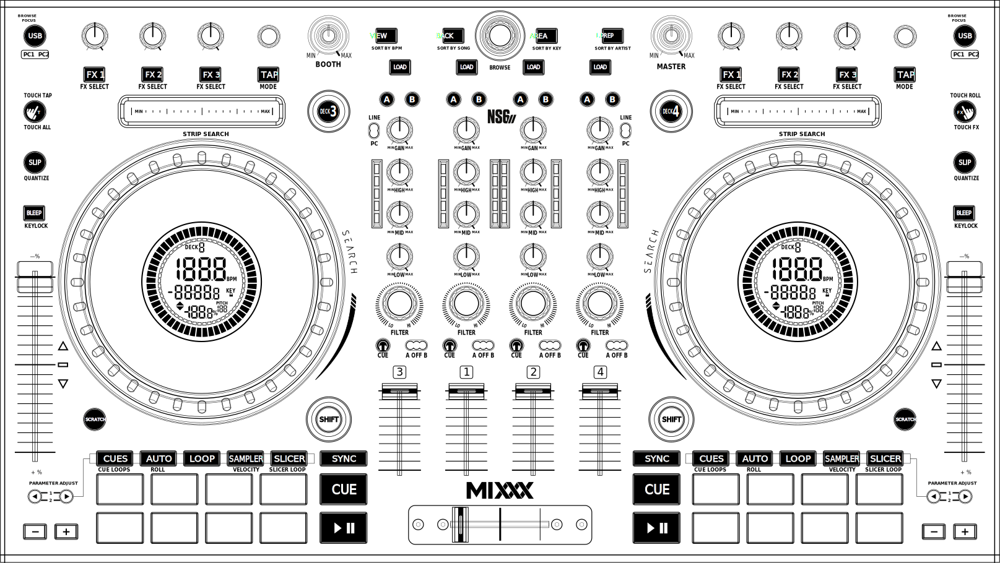
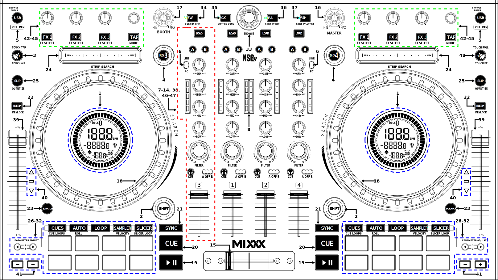
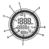
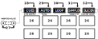

.. _numark-ns6ii:

Numark NS6II
============

.. sectionauthor::
   Nikolaus Einhauser <nikolaus.einhauser@mixxx.org>

   Numark NS6II (schematic view)

The Numark NS6II is an all-in-one USB :term:`MIDI` controller with an integrated audio interface.
It has controls for 2 decks that can be toggled between decks to play with 4 decks.
Its jogwheels feature a built-in screen highlighting basic information on the currently
playing track of each deck.

-  `Manufacturer’s product page <http://www.numark.com/product/ns6ii>`__
-  `Serato DJ Hardware Page <https://serato.com/dj/hardware/numark-ns6ii>`__
-  `User Guide <https://www.numark.com/images/product_downloads/NS6II-UserGuide-v1.1.pdf>`__

.. versionadded:: 2.4.2

Mapping Description
-------------------

You can download the latest Windows & MacOS drivers and firmware from the `manufacturer’s website <https://www.numark.com/product/ns6ii>`__.
Since the NS6II is a USB class compliant MIDI and audio device, the device is plug-and-play on Linux.

Audio Setup
-----------

The mapping relies on the following channel assignments (for line/phono
input support, applying effects to the TR-S output, etc.):

===================== ================
Output Channels       Assigned to
===================== ================
1-2                   Main
3-4                   Headphones
===================== ================

===================== ================
Input Channels        Assigned to
===================== ================
1-2 (CH 3 Line/Phono) Vinyl Control 1/3
3-4 (CH 4 Line/Phono) Vinyl Control 2/4
===================== ================

Only the Line/Phono inputs are sent back by the controller, no main nor headphone signal.

The knobs for :hwlabel:`MASTER`, :hwlabel:`BOOTH`, :hwlabel:`CUE GAIN`, :hwlabel:`MIC LEVEL`, and :hwlabel:`CUE MIX` are controlling the hardware mixer of the built-in audio interface.
Hence, turning the knobs will not change values in the Mixxx :term:`GUI` and you’ll need to set the Mixxx knobs to their default values when using the controller:

- Set the main/booth/headphones/microphone channel levels to 100% (knob center position)
- Set cue/main mixing to cue-only (leftmost position)

Controller Layout
------------------

The control numbering in the schematic drawings matches the those found on the
specified page in the Owner's Manual.

   Numark NS6II (Annotated Topview)

========  ======================================================================  ==========================================
No.       Control                                                                 Function
========  ======================================================================  ==========================================
1         LCD Display (:ref:`see below <numark-ns6ii-jogwheel-display>`)          Show basic Metadata about currently playing deck
2         :hwlabel:`SHIFT` Button                                                 Activates alternative functionality on respective deck and all Mixer channels
3         :hwlabel:`Touch All` (On or Blinking)                                   Touching an **FX Knob** enables it while it is touched and deactivated once released
3         :hwlabel:`Touch All` (Blinking)                                         Touching an **EQ Knob** enables it while it is touched and deactivated once released
4         :hwlabel:`Deck 3`/:hwlabel:`Deck 4`                                     Switch between controlling deck 1/3 or 2/4
5         :hwlabel:`USB`                                                          See :ref:`numark-ns6ii-dj-changeover`
5         :hwlabel:`SHIFT` + :hwlabel:`USB`                                       Switch deck to be controlled by PC1 (white) or PC2 (red)
6         :hwlabel:`LINE` / :hwlabel:`PC`                                         Select Audio input Source for Mixer Channel 3/4
15        Crossfader                                                              Fades volume between side A and B
16        :hwlabel:`Master` Gain                                                  Controls output volume of the hardware Master output
17        :hwlabel:`Booth` Gain                                                   Controls output volume of the hardware Booth output
18        Jog Wheel (top surface)                                                 Perform scratch operation (if scratch mode is enabled, otherwise perform as if outer edge was touched)
18        Jog Wheel (outer edge)                                                  Rotate to lower/raise playback speed (and pitch if key lock is off).
19        Play/Pause Button                                                       Starts/Stops/Resumes playback on the current Deck
20        :hwlabel:`CUE`                                                          Specifies, plays or recalls temporary cue point. Depends on :ref:`Cue mode <interface-cue-modes>`
20        :hwlabel:`SHIFT` + :hwlabel:`CUE`                                       Seeks to the Track start, then stops the Deck.
21        :hwlabel:`SYNC` button                                                  Short press to match tempo and phase of other deck once. Long press to enable :ref:`Sync Lock <sync-lock>`.
21        :hwlabel:`SHIFT` + :hwlabel:`SYNC` button                               Press to toggle :term:`quantization`.
22        :hwlabel:`BLEEP` Button                                                 Press to play in reverse, return to where the track would be with no button press on button release.
22        :hwlabel:`SHIFT` + :hwlabel:`BLEEP` Button (:hwlabel:`KEYLOCK`)         Toggle :term:`Keylock <key lock>`
23        :hwlabel:`SCRATCH` button                                               Toggle platter scratching. If active, touching the jogwheel results in scratch behavior, if disabled jogwheel behaves as if only outer edge was touched.
23        :hwlabel:`SHIFT` + :hwlabel:`SCRATCH` button                            Switch display between showing remaining/elapsed time
24        :hwlabel:`STRIP SEARCH`                                                 Seek to absolute position in *stopped* track
24        :hwlabel:`SHIFT` + :hwlabel:`STRIP SEARCH`                              Seek to absolute position in *playing* track
25        :hwlabel:`SLIP`                                                         toggle slip mode
25        :hwlabel:`SHIFT` + :hwlabel:`SLIP` (:hwlabel:`QUANTIZE`)                Toggle Deck track repeat (quantize is mapped to :hwlabel:`SHIFT` + :hwlabel:`SYNC` instead)
33        :hwlabel:`BROWSE` encoder                                               Navigate vertically in the library a single step at a time
33        :hwlabel:`SHIFT` + :hwlabel:`BROWSE` encoder                            Navigate vertically in the library jumping a configurable amount of steps each time
33        :hwlabel:`BROWSE` encoder press                                         :mixxx:coref:`Perform GoToItem <[Library],GoToItem>`.
34        :hwlabel:`VIEW` button                                                  Toggle maximized library view (useful when searching for tracks on small screens)
34        :hwlabel:`SHIFT` + :hwlabel:`VIEW` button                               Sort library by BPM
35        :hwlabel:`BACK` button                                                  Move Focus Back (jump between library sidebar and table)
35        :hwlabel:`SHIFT` + :hwlabel:`BACK` button                               Sort library by Song title
36        :hwlabel:`AREA` button                                                  Move Focus Forward (jump between library sidebar and table)
36        :hwlabel:`SHIFT` + :hwlabel:`AREA` button                               Sort library by Key
37        :hwlabel:`L.PREP` button                                                Load track to :ref:`interface-preview-deck`
37        :hwlabel:`SHIFT` + :hwlabel:`L.PREP` button                             Sort library by Artist name
39        :hwlabel:`+%`/:hwlabel:`-%` Fader                                       Move down to increase track tempo, move up to decrease. Behavior can be configured via :menuselection:`Preferences --> Decks --> Down increases Speed`.
40        takeover LEDs                                                           see :ref:`numark-ns6ii-takeover-leds`.
41        :hwlabel:`+` & :hwlabel:`-` buttons                                     Temporarily speedup / slowdown the track (used for beatmatching). The exact behavior can be configured via :menuselection:`Preferences --> Decks --> Pitch bend behavior`.
48        :hwlabel:`TOUCH FX`                                                     Tristate (off/on/blinking). When on or blinking, merely touching an FX knob activate the FX while its touched and deactivated once released. If its blinking the same also applies to the EqKnobs.
========  ======================================================================  ==========================================

.. _numark-ns6ii-takeover-leds:

Takeover LEDs
^^^^^^^^^^^^^^

These indicate the physical position of the tempo fader relative to the software
one. The Tempo Fader uses soft-takeover, meaning if the physical location does
not match the software one, you will need to synchronize it manually again (this
avoids sudden jumps). The closer the slider is to its neutral position, the
brighter the middle LED is. The closer the physical slider position is to the
software position, the dimmer they get. This allows you to judge how far you
have to move the slider until you have synchronized the fader and how far you
have to move it until it is at neutral speed. These leds (with the exceptions of
the middle LED are also repeated on the Jogwheel LCD Display).

Mixer Section
^^^^^^^^^^^^^

The NS6II features 4 identical (with respect to symmetry) Mixer Channels. See :ref:`interface-eq-gain` for a complete explanation of the individual concepts

========  ==============================================================  ==========================================
No.       Control                                                         Function
========  ==============================================================  ==========================================
7         :hwlabel:`GAIN`                                                 Channel Gain (see :ref:`interface-eq-gain`)
8         Channel VuMeter                                                 loudness of signal of that specific channel (after EQ, before Filter and Faders). A white LED indicates a clipping signal (see :term:`level meter`).
9         :hwlabel:`HIGH`                                                 Channel High/Treble EQ
10        :hwlabel:`MID`                                                  Channel Mid EQ
11        :hwlabel:`LOW`                                                  Channel Low/Bass EQ
12        Channel Fader                                                   Decrease the volume of the channel
13        :hwlabel:`🎧` (pfl/cue) button                                  Toggle :term:`PFL`. Notice: due to hardware constraints, this always works in numark mode: clicking a single button solos the corresponding channel, to listen to multiple channels, press and then release multiple buttons at once.
14        :hwlabel:`A OFF B` switch                                       The :term:`crossfader` orientation switches determine to which side of the crossfader the deck is assigned. It can be set to the left or right side, or to the center where it is unaffected by the crossfader knob.
47        :hwlabel:`FILTER`                                               This knob lets you control the Meta knob of the deck’s Quick Effect.
38        :hwlabel:`LOAD`                                                 Load the currently selected track from the library into the deck corresponding to the channel
48        :hwlabel:`A` / :hwlabel:`B`                                     Route Channel to left/right :ref:`Effect Unit <interface-effects>`.
========  ==============================================================  ==========================================

Front Panel
^^^^^^^^^^^

   Numark NS6II (front view)

========  ==============================================================  ==========================================
No.       Control                                                         Function
========  ==============================================================  ==========================================
1         :hwlabel:`🎧` 3.5mm (1/8") and 6.35mm (1/4") TRS Jacks/Sockets  Sole audio output of the Headphone signal
2         :hwlabel:`GAIN` Knob                                            Headphone signal gain (hardware)
3         :hwlabel:`SPLIT` Switch                                         Switch between Stereo and SplitCue signal (see :ref:`interface-head-main`) (note: the v1.0.4 firmware :ref:`contains a bug <numark-ns6ii-split-cue-issue>`)
4         :hwlabel:`MIX` Knob                                             Fade between Main and PFL signal
5         :hwlabel:`CF CONTOUR` Knob                                      Change between a Crossfader curve suitable for scratching (hard cut) and smooth fading (constant power).
6         :hwlabel:`LEVEL` Knob                                           Output Level of the microphone signal. Note that the microphone signal goes directly to the main output and is not sent to mixxx.
7         :hwlabel:`HIGH` Knob                                            High EQ of the microphone signal
8         :hwlabel:`LOW` Knob                                             Low EQ of the microphone signal
========  ==============================================================  ==========================================

Effects Section
^^^^^^^^^^^^^^^

.. figure:: ../../_static/controllers/numark_ns6ii_schematics/fx_unit.svg
   :align: center
   :width: 50%
   :figwidth: 100%
   :alt: NS6II (Effect Unit)
   :figclass: pretty-figures

   Numark NS6II (Effect Unit)

Left Section controls Effect Unit 1, right controls Effect Unit 2. For more details on Effect Units, see :ref:`effects`.
The mapping follows the standards :ref:`controller-effects-mapping`.

.. _numark-ns6ii-jogwheel-display:

Jogwheel Display
^^^^^^^^^^^^^^^^

   Numark NS6II (jogwheel display)

========  ==========================================================================
No.       Function
========  ==========================================================================
1         Shows the deck currently being controlled by that side of the controller
2         The current position of the "virtual" vinyl sticker
3         Shows how far we are through the track (percentage)
4         Time Elapsed of / Remaining in the track. Elapsed/Remaining can be toggled with :hwlabel:`SHIFT` + :hwlabel:`SCRATCH` button
5         current BPM of the deck (with tempofader adjustments)
6         copy of the :ref:`numark-ns6ii-takeover-leds`
7         current Tempo Adjustment in percent
8         current Tempo Adjustment range in percent
9         Shows whether :term:`key lock` is enabled.
========  ==========================================================================

Performance Pads
^^^^^^^^^^^^^^^^

   Numark NS6II (performance pads)

Each controller Deck has a performance pad section controlling aspects of the deck or the currently playing track.

The mode currently active mode can be selected by pressing the corresponding buttons. Each button cycles through a selection of modes which can be
seen in the table below. Pressing a mode button once results in a fully lit button, pressing it twice will blink on and off and pressing it three times results
in a repeating pattern consisting of three short blinks and a pause. The pattern indicates which mode is active.

The functionality of the :hwlabel:`PARAMETER ADJUST` buttons (labelled 27) is specific to each mode.

========  ====================  =======================  ================================  ==================
No.       Label                 1x Press                 2x Press                          3x Press
========  ====================  =======================  ================================  ==================
28        :hwlabel:`CUES`           Hotcues 1-8          Hotcues 1-9
29        :hwlabel:`AUTO`           AutoLoop             LoopRoll
30        :hwlabel:`LOOP`           Loop Control         KeyControl
31        :hwlabel:`SAMPLER`        Samplers 1-8 Normal  Samplers 1-8 Velocity-sensitive
32        :hwlabel:`SLICER`         beat jumping         intro/outro markers               beatgridsettings
========  ====================  =======================  ================================  ==================

Hotcues
"""""""

   Numark NS6II (performance pads)

========  ==================================================================  ====================================================================================================================================================================================
No.       Control                                                             Function
========  ==================================================================  ====================================================================================================================================================================================
1-8       Pad (unlit)                                                         Save current position as hot cue (hotcue index as labelled).
1-8       Pad (lit)                                                           Jump to hot cue. If the track is stopped, holding the pad will preview the hot cue until the pad is released.
1-8       :hwlabel:`SHIFT` + Pad (lit)                                        Clear hot cue.
27        :hwlabel:`PARAMETER ADJUST`                                         no functionality
27        :hwlabel:`SHIFT` + :hwlabel:`PARAMETER ADJUST`                      Change the color of the currently focused (last pressed) hotcue. Cycles forwards/backwards through the colors of the currently selected palette (see :ref:`configuration-colors-editor`)
========  ==================================================================  ====================================================================================================================================================================================

Pressing the hotcue selector a second time, the second hotcue mode will get selected, making it possible to access hotcues 9-16.

.. _numark-ns6ii-autoloop:

Auto Loop Mode
""""""""""""""

   Numark NS6II (autoloop)

========  ==================================================================  ====================================================================================================================================================================================
No.       Control                                                             Function
========  ==================================================================  ====================================================================================================================================================================================
1-8       Pad (unlit) + loop disabled                                         activate loop at current position for the specified length
1-8       Pad (unlit) + loop enabled                                          change currently active loop length
1-8       Pad (lit)                                                           deactivate loop
27        :hwlabel:`PARAMETER ADJUST`                                         double/half the size of each loop activated by a specific pad.
========  ==================================================================  ====================================================================================================================================================================================

.. _numark-ns6ii-looproll:

Loop Roll Mode
""""""""""""""

Works exactly like :ref:`numark-ns6ii-autoloop`, but the loop will get deactivated after letting go of the pad and the track resumes at the position where it would
have been if it had not looped.

Loop Control Mode
"""""""""""""""""

   Numark NS6II (loop control)

========  ==================================================================  ==================================================================================================================================================
No.       Control                                                             Function
========  ==================================================================  ==================================================================================================================================================
1         Loop in                                                             :mixxx:coref:`loop_in <[ChannelN],loop_in>`
2         Loop Out                                                            :mixxx:coref:`loop_out <[ChannelN],loop_out>`
3         Loop Activate                                                       :mixxx:coref:`beatloop_activate <[ChannelN],beatloop_activate>`
4         Loop Toggle                                                         :mixxx:coref:`reloop_exit <[ChannelN],reloop_exit>`. Lit if loop is active.
5         Jump loop back                                                      :mixxx:coref:`beatjump_backward <[ChannelN],beatjump_backward>`.
6         Jump forward                                                        :mixxx:coref:`beatjump_forward <[ChannelN],beatjump_forward>`.
7         Loop /2                                                             :mixxx:coref:`loop_halve <[ChannelN],loop_halve>`.
8         Loop x2                                                             :mixxx:coref:`loop_double <[ChannelN],loop_double>`.
27        :hwlabel:`PARAMETER ADJUST`                                         No function
========  ==================================================================  ==================================================================================================================================================

Key Control
"""""""""""

   Numark NS6II (key control)

========  ==================================================================  ==================================================================================================================================================
No.       Control                                                             Function
========  ==================================================================  ==================================================================================================================================================
1         Sync Key                                                            :mixxx:coref:`sync_key <[ChannelN],sync_key>`
2         Pitch Down                                                          :mixxx:coref:`pitch_down <[ChannelN],pitch_down>`
3         Pitch Up                                                            :mixxx:coref:`pitch_up <[ChannelN],pitch_up>`
4         Reset Key                                                           :mixxx:coref:`reset_key <[ChannelN],reset_key>`
5 - 8     Pad                                                                  Unused
27        :hwlabel:`PARAMETER ADJUST`                                         No function
========  ==================================================================  ==================================================================================================================================================

Sampler Pads
""""""""""""

   Numark NS6II (sampler pads)

The sampler modes allow you to load, play and stop samples in the first 8 sample slots.

========  ===============================================================  ==========================================
No.       Control                                                          Function
========  ===============================================================  ==========================================
1-8       Pad (unlit)                                                      Load currently selected track into the sample slot associated with the pad.
1-8       :hwlabel:`SHIFT` + Pad (lit)                                     If the sample is playing, stop the playback. If the sample is not playing, eject the sample from the sample slot.
1-8       Pad (lit)                                                        Play the sample in the sample slot associated with the pad. *Velocity Sampler Mode*: The playback volume of the sample depends on the pressure (velocity).
27        :hwlabel:`PARAMETER ADJUST`                                      No function
========  ===============================================================  ==========================================

.. _numark-ns6ii-beatjump:

Beat Jump
""""""""""""""

   Numark NS6II (beat jump)

The beat jump mode allows you to jump to specific beat positions in your loop.

========  ===============================================================  ==========================================
No.       Control                                                          Function
========  ===============================================================  ==========================================
1-4       Pad                                                              Jump forward to the beat position indicated by the pad.
5-8       Pad                                                              Jump backward to the beat position indicated by the pad.
27        :hwlabel:`PARAMETER ADJUST`                                      Adjusts the loop size (halve/double each pad).
========  ===============================================================  ==========================================

Intro/Outro Markers
"""""""""""""""""""

   Numark NS6II (beat jump)

This mode allow you to prepare tracks by setting intro/outro cues.

========  ===============================================================  ==========================================
No.       Control                                                          Function
========  ===============================================================  ==========================================
1         Pad (unlit)                                                      Set current position as intro start.
1         Pad (lit)                                                        Jump to intro start position.
2         Pad (unlit)                                                      Set current position as intro end.
2         Pad (lit)                                                        Jump to intro end position.
3         Pad (unlit)                                                      Set current position as outro start.
3         Pad (lit)                                                        Jump to outro start position.
4         Pad (unlit)                                                      Set current position as outro end.
4         Pad (lit)                                                        Jump to outro end position.
5-8       Pad                                                              No function
27        :hwlabel:`PARAMETER ADJUST`                                      No function
========  ===============================================================  ==========================================

Beatgrid Adjustments
""""""""""""""""""""

   Numark NS6II (beatgrid)

This mode allow you to adjust the beatgrid of a track. The layout mimics the Beatgrid controls of the Latenight skin.

========  ===============================================================  ==========================================
No.       Control                                                          Function
========  ===============================================================  ==========================================
1         Set Beatgrid at current position                                 :mixxx:coref:`beats_translate_curpos <[ChannelN],beats_translate_curpos>`
2         Shift beatgrid earlier                                           :mixxx:coref:`beats_translate_earlier <[ChannelN],beats_translate_earlier>`
3         Shift beatgrid later                                             :mixxx:coref:`beats_translate_later <[ChannelN],beats_translate_later>`
4         Shift cues later                                                 :mixxx:coref:`shift_cues_later <[ChannelN],shift_cues_later>`.
5         BPM tap                                                          :mixxx:coref:`bpm_tap <[ChannelN],bpm_tap>`. This button does not exist in latenight.
6         beats adjust faster                                              :mixxx:coref:`beats_adjust_faster <[ChannelN],beats_adjust_faster>`.
7         beats adjust slower                                              :mixxx:coref:`beats_adjust_slower <[ChannelN],beats_adjust_slower>`.
8         shift cues earlier                                               :mixxx:coref:`shift_cues_earlier <[ChannelN],shift_cues_earlier>`.
27        :hwlabel:`PARAMETER ADJUST`                                      No function
========  ===============================================================  ==========================================

.. _numark-ns6ii-dj-changeover:

DJ Changeover
-------------

The NS6II allows two computers running Mixxx (likely also Serato DJ, but this is untested) to connect to the unit simultaneously. This allows
two DJs to play at the same time for easy DJ set changeovers. With a computer already connected
to the NS6II and playing (PC1), do the following:

1. Connect a second computer (PC2) to the unused USB port on the NS6II's rear
   panel. Once the computer has connected, the software will show all decks
   offline. The first computer will still control both sides of the controller.

2. Before giving PC2 control of one side of the NS6II, make sure no audio is playing
   from PC2 on that deck. Then, press and hold the :hwlabel:`SHIFT` key and press the :hwlabel:`PC1/PC2`` button on the non-playing deck.

   PC2 will now control the two channels on that side of the controller, and will
   automatically have focus of the browse controls. Use the browse knob to
   scroll through the library, then add the desired track to the deck by
   pressing the Load button.

3. Play a track on PC2's deck and mix it in when ready. For example, while PC1 is
   using Deck A (and the mixer controls for Channels 1 & 3) to control their computer,
   PC2 can also use Deck B (and the mixer controls for Channels 2 & 4) to control
   their computer.

   With one computer controlling each deck, press the Browse Focus / PC1/PC2 button
   on the non-playing deck to switch control of the browse knob.

4. Fade out the audio playing from PC1's computer to the audio playing from PC2's
   computer. When only the audio from PC2's computer is left in the mix, press and
   hold the Shift key and press the Browse Focus / PC1/PC2 button on the
   non-playing deck. Now, PC2 is using both Deck A and Deck B.

5. Repeat steps 3 and 4 for the other side of the NS6II.

Please note that you should always test the changeover process with a small
amount of music before performing it during a live set.

.. _numark-ns6ii-split-cue-issue:

.. note::

    There is a bug in Firmware v1.0.4 (and possibly earlier) of the Numark NS6II
    which causes the headsplit control to be sent inverted when the controller
    status is sent. This happens on startup and when switching decks between
    PC1/PC2. Numark is aware of the issue but they don't seem to be interested
    in fixing it. Unfortunately it also doesn't happen 100% of the time, so if
    you experience mono-sounding headphones you may need to explicitly sync
    mixxx and the built-in mixer by toggling the split cue switch once.

Settings
--------

==========================================  ============  =======================================================  ===================================================
Variable                                    Type          Default                                                  Description
==========================================  ============  =======================================================  ===================================================
``NS6II.RATE_RANGES``                       ``[float]``   ``[0.04, 0.08, 0.10, 0.16, 0.24, 0.50, 0.90, 1.00]``     List of available :mixxx:coref:`rate ranges <[ChannelN],rateRange>` to cycle through using the Pitch Bend +/- Buttons.
``NS6II.NAVIGATION_ENCODER_ACCELERATION``   ``int``       5                                                        Amount of tracks moved in a single step when turning the :hwlabel:`BROWSE` encoder while pressing :hwlabel:`SHIFT`.
``NS6II.DEFAULT_LOOP_ROOT_SIZE``            ``int``       1                                                        the size of the first pad on :ref:`numark-ns6ii-autoloop`, :ref:`numark-ns6ii-looproll` and :ref:`numark-ns6ii-beatjump`.
``NS6II.USE_BUTTON_BACKLIGHT``              ``bool``      ``true``                                                 ``true``: deactivated button has a slight (usually red) backlight, ``false``: LED of deactivated button is completely off.
==========================================  ============  =======================================================  ===================================================
