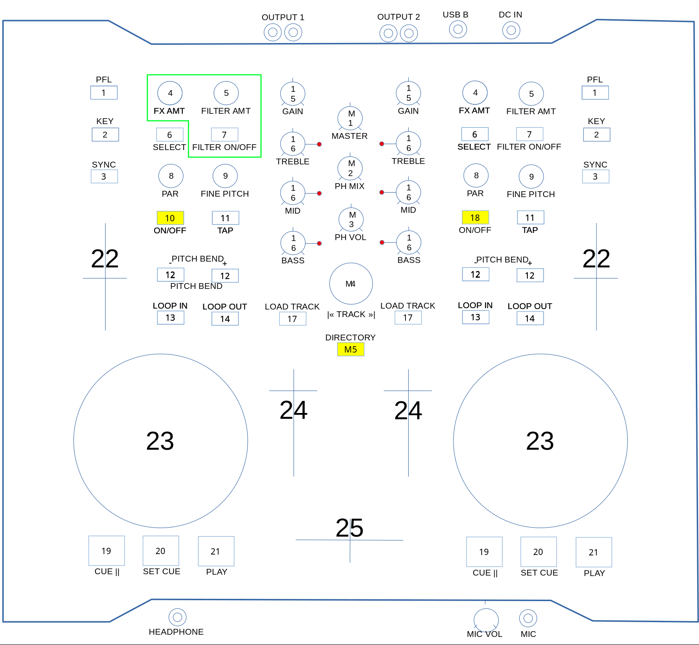

Numark Omni Control
===================

-  `Manfacturer’s product page <https://web.archive.org/web/20251116215741/https://www.numark.com/product/omnicontrol>`__
-  `Wiki page <https://github.com/mixxxdj/mixxx/wiki/Numark%20Omni%20Control>`__

.. versionadded:: 1.10
.. versionchanged:: 2.5.6

Description
===========

The Numark Omni Control is an 2 channel stereo DJ controller with integrated soundcard, 2 dual stereo outputs (RCA), 1 headphone output and 1 microphone input.
The device should be connected at least via USB 2.0 (USB-B plug) to use all of its features. Additional power supply (6 Volt, 1 Ampere) is usually not required.
This device is not `USB Audio Device Class <https://www.usb.org/document-library/usb-audio-devices-rev-30-and-adopters-agreement>`__ compliant and requires special drivers on Windows and macOS to work as a MIDI device. 

(In)Compatibility
=================

-  `Latest working Windows drivers <https://web.archive.org/web/20251116224010/https://www.numark.com/images/product_downloads/Numark_OMNICONTROL_2.9.64.zip>`__
-  Latest MacOS driver is still Intel-Architecture and is untested with ARM.
-  There is no driver available for Linux.

Inputs and outputs of the audio interface
=========================================

Channel output
--------------

===================== ================
Output Channels       Assigned to
===================== ================
1-2                   Main
3-4                   Headphones
===================== ================

Special instructions
--------------------

To reduce the audio latency time, the setting must be made in MIXXX and the "Numark Omni Control Panel" software (requires reboot of controller). But it's recommended to leave the audio latencies as they are.

Microphone inputs
-----------------

Untested yet, but the Windows driver also doesn't show any usable input devices.

   Numark Omni Control (schematic view)

Controller Mapping in normal Mode
=================================

MASTER
------

==== ================================================================================
 M1   Master volume
 M2   Headphone mix (cue to PGM)
 M3   Headphone volume
 M4   Trackselector (left/right = backward/forward) (press = play/pause prelistening)
==== ================================================================================

CHANNEL
-------

==== =======================================================================================
  1   PFL = Pre Fader Listening
  2   KEY = Keeps the key
  3   SYNC = one time synch of tempo (blinks at beat)
  6   SELECT = switchs loop anchor between start and end of loop (end of loop = light on)
  8   PAR = Beatjump; uses beatloop size (left/right = backward/forward)
  9   FINE PITCH = temporary change of the pitch even over min/max (resets at PITCH moving)
 11	  TAP = manual tap to calculate speed of the tracklist
 12   PITCH-BEND(-/+) = adjusting temporary deck play speed (-/+ = slower/faster) aka NUDGE
 13   LOOP IN = sets loop-in point
 14   LOOP OUT = sets loop-out point and reloop; keep pressed to disable reloop
 15   GAIN = adjusts gain of the channel
 16   EQ = (left/right = min/max) (press = push kill on/off) (light indicator = push kill)
 17	  LOAD TRACK = loads selected track into channel (if not playing)
 19   CUE = play deck from current cue point (cue is start if nothing else selected)
 20   SET CUE = sets new cue point
 21   PLAY = play/pause current deck
 22   PITCH = adjusting play speed of deck
 23   JOGWHEEL = adjusting temporary deck play speed (left/right = slower/faster)
 24   CHANNEL VOLUME 
 25   CROSS FADER
==== =======================================================================================

QuickEffect (green group)
^^^^^^^^^^^^^^^^^^^^^^^^^

==== ============================================================================
  4   FX AMT = rotate through QuickEffects (only if QuickEffect is not enabled)
  5   FILTER AMT = applies selected QuickEffect (only if QuickEffect is enabled)
  7   FILTER ON/OFF = QuickEffect (enabled = light on)
==== ============================================================================

Custom Mode switches (yellow)
^^^^^^^^^^^^^^^^^^^^^^^^^^^^^

Custom modes can be enabled from start by editing the -> User customisations.

==== ===================
 M5   Directory mode 
 10   Scratch mode 
 18   ExtendedLoop mode
==== ===================

Custom Modes
============

Directory mode 
--------------

==== =========================================================================
 M4   Trackselector (left/right = up/down) (press = right aka open subfolder)
==== =========================================================================

Scratch mode
------------
==== ====================================================
 23   JOGWHEEL = scratch (left/right = backward/forward)
==== ====================================================

ExtendedLoop mode
-----------------

This mode also enables quantisation, so the LOOP IN and LOOP OUT are aligned at the beat grid.

===== ==================================================================================
  8*   PAR = moves loop block* (left/right = backward/forward)
 12    PITCH-BEND(-/+) = changes size of the loop (-/+ = half/double), but keeps anchor
 13    LOOP IN = sets loop-in point and removes LOOP OUT point; disables reloop
 14    LOOP OUT = sets loop-out point and reloop; keep pressed to disable reloop
 20*   SET CUE = sets new cue point at the closest beat grid (because of quantisation)
===== ==================================================================================
* = this is standard behavior of MIXXX

User customisations
===================

Edit the js-file at the "LoadUserDefaults" function to customise the controller by enabling custom modes from start and:
-  FINE PITCH speed adjusting
-  JOGWHEEL speed adjusting (Scratch mode and normal mode)

Known Issues
============

-  After changing "audio latency time" the device needs be disconnected from USB. Restarting MIXXX won't be enough.
-  Right volume fader may be shown with wrong position after MIXXX programm start; just move the right volume fader once to re-adjust.
