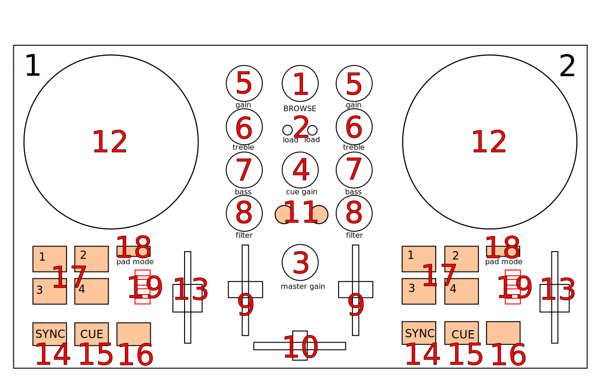

Numark Party Mix II
===================

`Manufacturer's product page <https://www.numark.com/product/party-mix-ii>`_ · `Manufacturer's user manual <https://cdn.inmusicbrands.com/Numark/Party%20Mix%20MKII%20-%20User%20Guide%20-%20v1.4.pdf>`_

.. versionadded:: 2.5.6

Overview
--------

See the tables below for controls descriptions.

Center
------

..

.. csv-table::
   :header: "#", "Name", "Function"
   :widths: 5 25 70

   "1", ":hwlabel:`BROWSE` (rotate)", "Browse library"
   "1", ":hwlabel:`BROWSE` (press+rotate)", "switch between Library and Sidebar"
   "1", ":hwlabel:`BROWSE` (press)", "Equivalent to double clicking the currently selected item in Library (see :mixxx:coref:`GoToItem<[Library],GoToItem>` control)"
   "2", ":hwlabel:`LOAD` 1 and 2", "load currently selected track to Deck 1 or 2"
   "3",  ":hwlabel:`MASTER GAIN`", "Adjust the volume level of :term:`master output`."
   "4",  ":hwlabel:`CUE GAIN`", "Adjust the headphone volume"
   "10", ":hwlabel:`Crossfader`", "Controls the mix between the two decks. See :ref:`interface-crossfader`"

Deck
----

Each of those controls exists in both :term:`decks<deck>` and affects only the corresponding deck.

.. csv-table::
   :header: "#", "Name", "Function"
   :widths: 5 25 70

   "5",  ":hwlabel:`GAIN`", "Adjust the pre-fader, pre-EQ audio level"
   "6",  ":hwlabel:`TREBLE`", "Adjust high frequencies"
   "7", ":hwlabel:`BASS`", "Adjust low frequencies"
   "8", ":hwlabel:`FILTER`", "Adjust filter"
   "9", ":hwlabel:`Channel fader`", "Adjust volume level"
   "11", ":hwlabel:`CUE`", ":term:`Headphone button`. Toggle sending channel to the cue (headphone) channel"
   "12", ":hwlabel:`Jog wheel`", "If touched on top: scratch

   If touched at the side: pitch bend

   The behavior of the jog wheel can be fine-tuned, see the :ref:`Adjustable values<numark_party_mix_ii_adjustable>` section."
   "13", ":hwlabel:`Pitch fader`", "Adjust the speed of the track"
   "14", ":hwlabel:`SYNC`", "If sync lock is disabled: set BPM to the other deck's BPM

   If sync lock is enabled: disable sync lock"
   "14", ":hwlabel:`SYNC` (hold, then release)", "Enable :term:`sync lock`"
   "15", ":hwlabel:`CUE`", "If track is playing: stops the track and resets position to the main cue point

   If playback is stopped: sets the main cue point"
   "15", ":hwlabel:`CUE` (hold)", "Play the track from main cue point, release to stop playback and return to the main cue point. Playback must be initially stopped on the main cue point."
   "16", ":hwlabel:`Play/Pause`", "Play/pause playback"
   "17", ":hwlabel:`PADS 1-4`", "Pads 1-4 function depends on selected mode"
   "18", ":hwlabel:`PAD MODE`", "Select mode of :hwlabel:`PADS 1-4`"
   "19", ":hwlabel:`MODE LEDs`", "The 4 pads in each deck have multiple functions, depending on the selected *pad mode*. Default pad mode is *hotcues*. Current mode is selected by pressing :hwlabel:`PAD MODE`. The LED for currently active pad mode is lit up (or all 3 LEDs for effect mode)."

.. hint::
   The actual behavior of CUE and Play/Pause buttons depends on Mixxx settings. See :ref:`interface-cue-modes` for more info.

Pads
----

.. csv-table::
   :header: "#", "Name", "Function"
   :widths: 5 25 70

   "18", ":hwlabel:`CUE Mode`", "set hotcue if not set. If set, go to hotcue position and start playback. Hold :hwlabel:`PAD MODE` down and press pad to delete hotcue.

   Pad lights indicate if a particular hotcue is set or not."
   "18", ":hwlabel:`LOOP Mode`", "activate auto-loop.

   Default auto-loop sizes are: 4, 8, 16, 32. Loop sizes can be adjusted, see the :ref:`Adjustable values<numark_party_mix_ii_adjustable>` section."
   "18", ":hwlabel:`SAMPLER Mode`", "button for 4 Samples for each Deck 1-4 and 5-8 (Press the button to load the track selected in the library into an empty sampler. Press a loaded sampler to play it from its cue point. Press again while playing to jump back to the cue point. Shift behavior: If the sampler is playing, stop it. If the sampler is stopped, eject it.)."
   "18", ":hwlabel:`EFFECT Mode`", "Pad 1-3 activates effect during press Deck1 of EffectUnit1, Deck2 of EffectUnit2.

   Pad 4 switches mix mode. Pad light on indicates Dry/Wet mode. Pad Light off indicates Dry+Wet mode."

.. _numark_party_mix_ii_adjustable:

Adjustable values
-----------------

There are a few configurable values at the top of the script (:file:`Numark-Party-Mix-MKII.scripts.js`).

.. csv-table::
   :header: "Variable", "Default value", "Description"
   :widths: 10 20 70
   :quote: '

   '``jogScratchAlpha``', '1/8', 'For controlling the alpha-beta filter used in scratching'
   '``jogScratchBeta``', '1/8/32', 'For controlling the alpha-beta filter used in scratching'
   '``autoLoopSizes``', '[ "4", "8", "16", "32"]', 'Loop sizes for the auto-loop pad mode, each value corresponds to one of the pads.'

.. hint::
   See `here <https://github.com/mixxxdj/mixxx/wiki/Midi-Scripting#user-content-scratching-and-jog-wheels>`_ for more info about constants used in scratching.

