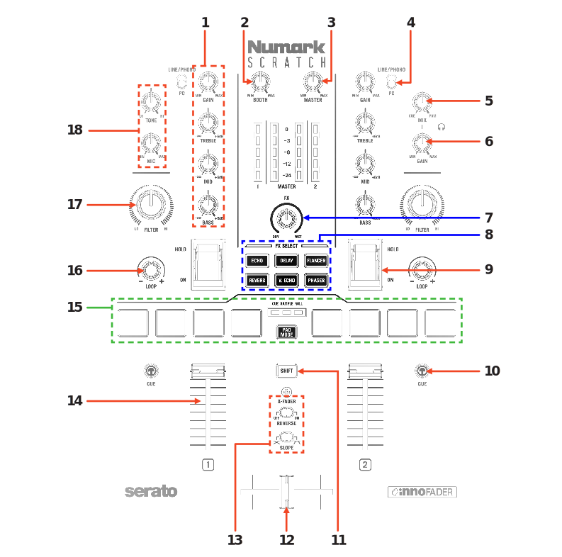
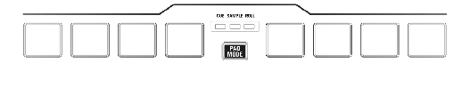

.. _numark_scratch:

Numark Scratch
==============

The Numark Scratch is a 24-bit 2 channel mixer designed for the scratch DJ.
It's equipped with an InnoFader crossfader and 8 performance pads across 3 modes, and
6 dedicated software FX selectors with dual toggle triggers. The Scratch is DVS ready under Mixxx

-  `Manufacturer’s product page <https://www.numark.com/product/scratch>`__
-  `Serato DJ Hardware Page <https://serato.com/dj/hardware/numark-scratch>`__
-  `Owner’s Manual <https://www.numark.com/images/product_downloads/Scratch_-_User_Guide_-_v1.2.pdf>`__
-  `Driver Download Page <https://www.numark.com/product/scratch>`__
-  `Mapping Forum Thread <https://mixxx.discourse.group/t/numark-scratch-mapping/25186>`__

.. versionadded:: 2.4.0

Drivers
-------

You can download the latest Windows driver from the `manufacturer’s website <https://www.numark.com/product/scratch>`__.
The Scratch is class complaint on Mac and Linux.

Audio Setup
-----------

The mapping relies on the following channel assignments:

===================== ================
Output Channels       Assigned to
===================== ================
1-2                   Master
3-4                   Headphones
===================== ================

===================== ================
Input Channels        Assigned to
===================== ================
1-2 (CH 1 Line/Phono) Vinyl Control 1
3-4 (CH 2 Line/Phono) Vinyl Control 2
5-6 (Mix)             Record/Broadcast
===================== ================

The microphone, and external inputs are mixed
together in input channels 5-6, so Mixxx can record and broadcast them.

The knobs for :hwlabel:`MASTER`, :hwlabel:`BOOTH`, :hwlabel:`MIC LEVEL`, :hwlabel:`MIC TONE` and :hwlabel:`CUE GAIN` are controlling the hardware mixer of the built-in audio interface.
Hence, turning the knobs will not change values in the Mixxx :term:`GUI` and you’ll need to set the Mixxx knobs to their default values when using the controller:

- Set the master/booth/headphones/microphone levels to 100% (knob center position)

.. note::
   The :hwlabel:`PC / LINE/PHONO` switches work only if the :guilabel:`Vinyl Control` input channels are assigned to software inputs.
   So even if you do not intend to use timecode vinyl but want to pass through line or phono inputs directly to the left/right deck, you need assign these channels in the Sound Hardware preferences.

Controller Mapping
------------------

Schematic
~~~~~~~~~~~~~~~~~~~~~~

   Numark Scratch (schematic view)

========  ==================================================  ==========================================
No.       Control                                             Function
========  ==================================================  ==========================================
1         CHANNEL EQ/GAIN                                     Adjust volume & the high / mid / low EQs per channel
2         :hwlabel:`BOOTH`                                    Adjust Booth output level
3         :hwlabel:`MASTER`                                   Adjust Master output level
4         :hwlabel:`LINE/PHONO` & :hwlabel:`PC`               Toggle between LINE / PHONO or PC per channel
5         CUE :hwlabel:`MIX`                                  Adjust monitoring between CUE and PGM
6         CUE :hwlabel:`GAIN`                                 Adjust CUE level
7         FX :hwlabel:`DRY / WET`                             Adjust FX wet/dry depth
7         :hwlabel:`SHIFT` :hwlabel:`DRY / WET`               Adjust the metaknob for all effects in the chain.
8         FX SELECT                                           Toggle single FX
8         :hwlabel:`SHIFT` + FX SELECT                        Toggle multiple FX selections at the same time
9         FX :hwlabel:`HOLD / ON` paddle                      Push up to toggle FX on or push down to toggle FX momentarily
10        :hwlabel:`CUE`                                      Press to cue channel for monitoring in headphones
11        :hwlabel:`SHIFT`                                    Used with other controls that have SHIFT modifier function
12        CROSSFADER                                          Crossfade audio between channel 1/2
13        X-FADER :hwlabel:`REVERSE` & :hwlabel:`SLOPE`       Toggle crossfader reverse, & adjust between crossfader curves
14        CHANNEL FADER                                       Adjust per channel volume
15        PERFORMANCE PADS                                    SEE PERFORMANCE PADS SECTION FOR MORE INFO
16        :hwlabel:`LOOP -/+`                                 Turn right/left to increase/decrease loop size, press in to toggle loop on/off
16        :hwlabel:`SHIFT` + :hwlabel:`LOOP -/+`              Turn for Library scroll, press in to load selected track to deck, double press to load instant double
17        :hwlabel:`FILTER`                                   Adjust hardware Filter per channel
18        MIC :hwlabel:`TONE` & :hwlabel:`MIC` level          Adjust microphone tone & level
========  ==================================================  ==========================================

Performance Pads
~~~~~~~~~~~~~~~~

To change modes, press the PAD MODE button repeatedly, which
will cycle through the available pade modes, which are as follows:

**CUE** mode: Pads 1-4 trigger the respective hotcues, and if no hotcue point is set on that pad, will set a Cue point
in the respective pad/slot. Holding SHIFT while pressing a pad will clear the Cue point from that pad.

**SAMPLER** mode: Press pads 1-4 to trigger samples loaded into the sample slot. Hold SHIFT while pressing a pad to
stop the sample playback once triggered.

**ROLL** mode: In this mode holding pads 1-4 activates a loop roll of varying sizes. Release the pad to exit the loop roll.
