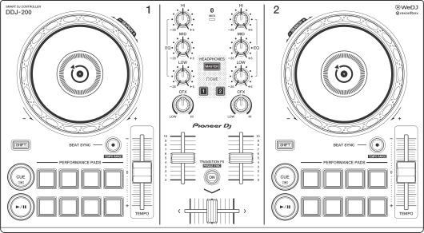
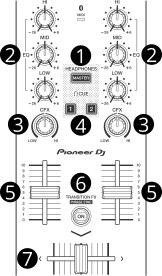

Pioneer DDJ-200
===============

.. sectionauthor::
   Daniel Giddins <daniel.giddins at nottingham.ac.uk>
   Frank Breitling <frank.breitling at gmx.de>

   Pioneer DDJ-200 (schematic view)

The Pioneer DDJ-200 is a simple 2 deck USB and Bluetooth DJ controller designed for WeDJ, djay, edjing Mix and Rekordbox.

-  `Manufacturer's Product Page <https://www.pioneerdj.com/en-gb/product/controller/ddj-200/black/overview/>`__
-  `Manufacturer's User Manual <http://docs.pioneerdj.com/Manuals/DDJ_200_DRI1596B_manual/>`__
-  `Manufacturer's Firmware Update <https://www.pioneerdj.com/en/support/software/controller/ddj-200/>`__
-  `Mixxx User Forum <https://mixxx.discourse.group/t/pioneer-ddj-200-mapping/18259>`__
.. versionadded:: 2.2.5

Controller Mapping
------------------

A schematic drawing with the control numbers that are used here can be found on the specified page in the User Manual in the Links section.

.. _pioneer-ddj-200-decks:

Deck section (p. 8)
~~~~~~~~~~~~~~~~~~~

.. figure:: ../../_static/controllers/pioneer_ddj_200_decks.svg
   :align: center
   :width: 65%
   :figwidth: 100%
   :alt: Pioneer DDJ-200 (deck section)
   :figclass: pretty-figures

   Pioneer DDJ-200 (deck section)

===  =================================================  ============================================================================================
No.  Control                                            Function
===  =================================================  ============================================================================================
1    :hwlabel:`JOG WHEEL` (top)                         Scratches the track
1    :hwlabel:`JOG WHEEL` (outer)                       Pitch bend
1    :hwlabel:`SHIFT` + Jog Wheel (top)                 Move Play position with higher speed in the direction the Wheel is turned
2    :hwlabel:`SHIFT` button                            Change the function of another control
3    :hwlabel:`PAD 1 - 8`                               Set (if empty) or play Hot cue point / loop
3    :hwlabel:`SHIFT` + Pad 1 - 8                       Unset/Delete hot cue point / loop
4    :hwlabel:`CUE` button                              Depends on the :ref:`cue mode <interface-cue-modes>` set in the Mixxx preferences
4    :hwlabel:`SHIFT` + :hwlabel:`CUE` button           Return to beginning of the cue point or track if not set
5    :hwlabel:`PLAY/PAUSE` button                       Plays/pauses a track in the respective Deck
6    :hwlabel:`BEAT SYNC` button                        Match tempo and phase of other deck. Long press to enable Master Sync.
7    :hwlabel:`TEMPO` slider                            Adjust the track playing speed (can be adjusted via :hwlabel:`SHIFT` + :hwlabel:`BEAT SYNC`)
===  =================================================  ============================================================================================

.. _pioneer-ddj-200-mixer:

Mixer section (p. 10)
~~~~~~~~~~~~~~~~~~~~~

   Pioneer DDJ-200 (mixer section)

===  =================================================  ============================================================================================
No.  Control                                            Function
===  =================================================  ============================================================================================
1    :hwlabel:`MASTER CUE` button                       Activates Master output on Headphones
2    :hwlabel:`HI`/:hwlabel:`MID`/:hwlabel:`LOW` knobs  Adjust the high/mid/low-frequency regions of the song.
3    :hwlabel:`CFX` knobs                               Turns on the selected effects
4    :hwlabel:`HEADPHONE CUE` button                    Toggle PFL for the Channel
5    Channel faders                                     Adjust the output level for each channel.
6    Transition FX Button                               Turns on :ref:`AutoDJ <djing-auto-dj>`.
7    Cross fader                                        Fades between left and right deck.
===  =================================================  ============================================================================================
