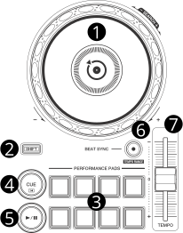

.. _pioneer-ddj-200:

Pioneer DDJ-200
===============

.. sectionauthor::
   Rene Ejury <mixxx at absorb.it>
   Daniel Giddins <daniel.giddins at nottingham.ac.uk>
   Frank Breitling <frank.breitling at gmx.de>

.. figure:: ../../_static/controllers/pioneer_ddj_200.svg
   :align: center
   :width: 100%
   :figwidth: 100%
   :alt: Pioneer DDJ-200 (schematic view)
   :figclass: pretty-figures

   Pioneer DDJ-200 (schematic view)

The Pioneer DDJ-200 is a 2 deck USB and Bluetooth DJ controller designed for WeDJ, djay, edjing Mix and Rekordbox.

-  `Manufacturer's Product Page <https://www.pioneerdj.com/en-gb/product/controller/ddj-200/black/overview/>`__
-  `Manufacturer's User Manual <https://support.pioneerdj.com/hc/en-us/articles/4404919733401-How-to-use-the-Pioneer-DJ-DDJ-200-Controller-Instruction-manual/>`__
-  `Manufacturer's Firmware Update <https://www.pioneerdj.com/en/support/software/controller/ddj-200/>`__
-  `Mixxx User Forum <https://mixxx.discourse.group/t/pioneer-ddj-200-mapping/18259>`__

.. versionadded:: 2.2.5

Controller Mapping
------------------

A schematic drawing with the control numbers that are used here can be found on the specified page in the User Manual in the Links section.

.. _pioneer-ddj-200-decks:

Deck section (p. 8)
~~~~~~~~~~~~~~~~~~~

   Deck section (p. 8)

===  ============================================================================  ============================================================================================
No.  Control                                                                       Function
===  ============================================================================  ============================================================================================
1    Jog Wheel (top)                                                               Scratch (move play position)
1    Jog Wheel (outer)                                                             Pitch bend (nudge)
1    :hwlabel:`SHIFT` + Jog Wheel (top)                                            Seek fast (move play position) without audio output. [1]_
2    :hwlabel:`SHIFT` button                                                       Switch function of control
2    left :hwlabel:`SHIFT` + right :hwlabel:`SHIFT`                                Change active panel in library.
3    Pad 1-8  and :hwlabel:`SHIFT` + Pad 1-8                                       see :ref:`PAD modes section <pioneer-ddj-200-pads>`
4    :hwlabel:`CUE` button                                                         Play / set cue, dependent on your configured :ref:`Cue mode <interface-cue-modes>` settings.
4    :hwlabel:`SHIFT` + :hwlabel:`CUE` button                                      Return to cue point and stop
5    :hwlabel:`PLAY/PAUSE` button                                                  Play / pause
5    :hwlabel:`SHIFT` + :hwlabel:`PLAY/PAUSE` button                               Reverse playing
6    :hwlabel:`BEAT SYNC` button                                                   Match tempo and phase of other deck, long press to enable master sync
6    :hwlabel:`SHIFT` + :hwlabel:`BEAT SYNC` button                                2-deck mode: Change RPM Range of :hwlabel:`TEMPO` slider. 4-deck mode: Change to active deck (:hwlabel:`BEAT SYNC` will blink on alternate deck control)
6    left :hwlabel:`SHIFT` + right :hwlabel:`SHIFT` + :hwlabel:`BEAT SYNC` button  Change RPM Range of :hwlabel:`TEMPO` slider (This will also change active panel in library)
7    :hwlabel:`TEMPO` slider                                                       Adjust track playing speed (can be adjusted via :hwlabel:`SHIFT` + :hwlabel:`BEAT SYNC`)
===  ============================================================================  ============================================================================================

.. [1] function can be changed to scroll trough your library in your :menuselection:`Preferences --> Controller --> Controller Setup`.

.. _pioneer-ddj-200-pads:

PAD modes
~~~~~~~~~

change between differerent pad modes with :hwlabel:`Transition FX` button

======== ====================================================
Mode     Indication
======== ====================================================
Hotcue   :hwlabel:`Transition FX` off
Loop     :hwlabel:`Transition FX` on
Effect   :hwlabel:`Transition FX` blinking slow
Jump     :hwlabel:`Transition FX` blinking fast
======== ====================================================

======== ========================================== =========================================
Mode     Control                                    Function
======== ========================================== =========================================
Hotcue   Pad 1-8                                    Set (if empty) or Preview/Play (if set) hot cue point / loop 1-8
Hotcue   :hwlabel:`SHIFT` + Pad 1-8                 Clear hot cue 1-8
Loop     Pad 1-8                                    Set and enables or stops loop over beats (increasing size PADs 1-8) [2]_
Loop     :hwlabel:`SHIFT` + Pad 1-8                 Set and enables or stops looproll over beats (increasing size PADs 1-8) [2]_
Effect   Pad 1-4                                    Play Sampler 1-4 from cue, if not loaded load current track into Sampler
Effect   :hwlabel:`SHIFT` + Pad 1-4                 Stop or Eject Sampler 1-4
Effect   Pad 5-7                                    Toggle FX1/FX2 Effect 1-3
Effect   :hwlabel:`SHIFT` + Pad 5-7                 Toggle FX3/FX4 Effect 1-3
Effect   Pad 8 / :hwlabel:`SHIFT` + Pad 8           BPM Tap- Button
Jump     Pad 1-8                                    Jump forward over beats (increasing distance PADs 1-8) [2]_
Jump     :hwlabel:`SHIFT` + Pad 1-8                 Jump back over beats (increasing distance PADs 1-8) [2]_
======== ========================================== =========================================

.. [2] minimal loop/jump size can be configured at :menuselection:`Preferences --> Controller --> Controller Setup`.

.. _pioneer-ddj-200-mixer:

Mixer section (p. 10)
~~~~~~~~~~~~~~~~~~~~~

.. figure:: ../../_static/controllers/pioneer_ddj_200_mixer.svg
   :align: center
   :width: 35%
   :figwidth: 100%
   :alt: Pioneer DDJ-200 (mixer section)
   :figclass: pretty-figures

   Mixer section (p. 10)

===  =====================================================  ============================================================================================
No.  Control                                                Function
===  =====================================================  ============================================================================================
1    :hwlabel:`MASTER` button                               Toggle main mix in the headphone output on/off
1    :hwlabel:`SHIFT` + :hwlabel:`MASTER` button            Toggle between 2- and 4-deck mode
2    :hwlabel:`HI`/:hwlabel:`MID`/:hwlabel:`LOW` knobs      Adjust high/mid/low-frequencies
3    :hwlabel:`CFX` knobs                                   EffectChain superknob [3]_
4    :hwlabel:`HEADPHONE CUE 1` button                      Toggle headphone pre-fader listening of left deck
4    :hwlabel:`HEADPHONE CUE 2` button                      Toggle headphone pre-fader listening of right deck
4    :hwlabel:`SHIFT` + :hwlabel:`HEADPHONE CUE 1`          Load selected track to left deck
4    :hwlabel:`SHIFT` + :hwlabel:`HEADPHONE CUE 2`          Load selected track to right deck
5    Channel faders                                         Adjust the output level for each channel
5    :hwlabel:`SHIFT` + Channel faders                      zero->notzero: "FADER Start", play track from cue. notzero->zero: "FADER Stop", pause track and set cue
6    :hwlabel:`Transition FX` button                        Change pad modes (Hotcue - Loop - Effect) / Return from beatjump mode
6    :hwlabel:`SHIFT` + :hwlabel:`Transition FX` button     Activate beatjump pad mode
7    Cross fader                                            Fade between left and right deck
7    :hwlabel:`SHIFT` + Cross fader                         zero->notzero: "FADER Start", play track from cue. notzero->zero: "FADER Stop", pause track and set cue
===  =====================================================  ============================================================================================

.. [3] superknob can be used for channel gain control if configured at :menuselection:`Preferences --> Controller --> Controller Setup`.

Configure Controller DEMO mode
~~~~~~~~~~~~~~~~~~~~~~~~~~~~~~

Disabling Demo Mode according to the user manual:

- Disconnect the USB cable / power supply.
- Hold both the [SHIFT] and [PLAY/PAUSE] buttons and connect USB cable / power supply.
- Use performance pads to change the settings.

  -  Pad 1 - Demo mode is switched off
  -  Pad 2 - Demo mode starts when you don’t use the unit for 1 minute
  -  Pad 3 - Demo mode starts when you don’t use the unit for 5 minutes
  -  Pad 4 - Demo mode starts when you don’t use the unit for 10 minutes

-  While saving bottom row of Performance Pads is flashing. Wait till it stops.
- Disconnect the USB cable / power supply.
