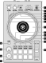
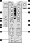

Pioneer DDJ-400
===============

.. sectionauthor::
   jusko <justin.kourie@gmail.com>

.. figure:: ../../_static/controllers/pioneer_ddj_400.svg
   :align: center
   :width: 100%
   :figwidth: 100%
   :alt: Pioneer DDJ-400 (schematic view)
   :figclass: pretty-figures

   Pioneer DDJ-400 (schematic view)

The Pioneer DDJ-400 is a 2 deck USB controller with integrated audio interface designed for rekordbox.

- `Manufacturer's Product Page <https://www.pioneerdj.com/en-us/product/controller/ddj-400/black/overview/>`__
- `Manufacturer's User Manual <http://docs.pioneerdj.com/Manuals/DDJ_400_DRI1551A_manual/>`__
- `Manufacturer's Firmware <https://www.pioneerdj.com/en/support/software/controller/ddj-400/>`__
- `Midi Mappings <https://www.pioneerdj.com/-/media/pioneerdj/software-info/controller/ddj-400/ddj-400_midi_message_list_e1.pdf>`__
- `Hardware Diagram <https://www.pioneerdj.com/-/media/pioneerdj/software-info/controller/ddj-400/ddj-400_hardwarediagram_rekordboxdj_e1.pdf?la=en-us>`__
- `Mapping Forum Thread <https://mixxx.discourse.group/t/pioneer-ddj-400/17476>`__

.. versionadded:: 2.3.0

Drivers
-------

You can download the latest firmware from
`the manufacturer's website <https://www.pioneerdj.com/en/support/software/controller/ddj-400/>`__.

Unfortunately Pioneer offers no Linux support, so to update your controller's
firmware you will need access to a Windows or Mac machine. Simply download the
drivers, attach your device and run the installer.

.. note:: It is highly recommended that you update your controller's firmware.
          This will fix a bug in the release drivers which causes the tempo
          sliders to send signals without being touched!

Controller Mapping
------------------

The schematic drawings used here can be referenced in the
`manufacturer's manual <http://docs.pioneerdj.com/Manuals/DDJ_400_DRI1551A_manual/>`__
on the given page number.

Browser section (p. 6)
~~~~~~~~~~~~~~~~~~~~~~

   Pioneer DDJ-400 (browser section)

========  ==================================================  ==========================================
No.       Control                                             Function
========  ==================================================  ==========================================
1         :hwlabel:`LOAD` buttons                             Load track selected in library into deck.
2         Rotary Selector                                     Press to toggle focus between the library sidebar and associated panels. Turn to move focus up or down.
========  ==================================================  ==========================================

Deck sections (p. 6)
~~~~~~~~~~~~~~~~~~~~

   Pioneer DDJ-400 (deck section)

====  =======================================================  ======================================================================
No.   Control                                                  Function
====  =======================================================  ======================================================================
1     :hwlabel:`BEAT SYNC`                                     Tap to sync tempo to the other playing track. Hold to enable sync lock.
1     :hwlabel:`SHIFT` + :hwlabel:`BEAT SYNC`                  Cycles through tempo ranges: +/-6%, +/-10%, +/-16%, +/-25%
2     :hwlabel:`CUE/LOOP CALL`:hwlabel:`>`                     Doubles the current loop size.
2     :hwlabel:`SHIFT` + :hwlabel:`CUE/LOOP CALL`:hwlabel:`>`  Jumps a 32 beats forwards
3     :hwlabel:`CUE/LOOP CALL`:hwlabel:`<`                     Halves the current loop size.
3     :hwlabel:`SHIFT` + :hwlabel:`CUE/LOOP CALL`:hwlabel:`<`  Jumps 32 beats backwards
4     :hwlabel:`RELOOP/EXIT`                                   Enables/disables currently set loop
4     :hwlabel:`shift` + :hwlabel:`RELOOP/EXIT`                Jump to loop start, enable loop, and stop playback
5     :hwlabel:`OUT`                                           Sets end of loop to the current playback position.
                                                               If quantize is enabled, it is set to the closest beat.
                                                               If held during an active loop, sets the new end point when released.
5     :hwlabel:`shift` + :hwlabel:`OUT`                        When a loop is enabled, press to adjust the loop's end position with the jog wheel.
6     :hwlabel:`IN/-4BEAT`                                     Sets start of loop to the current playback position. If quantize is enabled, it is set to the closest beat.
                                                               If held during an active loop, sets the new start point when released.
6     :hwlabel:`shift` + :hwlabel:`IN/-4BEAT`                  When a loop is enabled, press to adjust the loop's start position with the jog wheel.
7     Jog Wheel (top)                                          Scratch (move play position)
7     Jog Wheel (outer)                                        Nudge tempo up or down temporarily
8     :hwlabel:`HOT CUE` mode                                  Sets pads to hot cue mode. *TODO: See using hotcues*
9     :hwlabel:`BEAT LOOP` mode                                Sets pads to beat loop mode. *TODO: See using beat loop*
10    :hwlabel:`BEAT JUMP` mode                                Sets pads to beat jump mode. *TODO: See using beat jump*
11    :hwlabel:`SAMPLER` mode                                  Sets pads to sampler mode. *TODO: See using sampler*
12    :hwlabel:`TEMPO` slider                                  Adjust playback speed
13    Performance pads                                         Functionality differs depending on the pad mode selected by 8-11 *See pad mode descriptions*
14    :hwlabel:`PLAY/PAUSE`                                    Play/pauses a track
15    :hwlabel:`CUE`                                           Behavior depends on the :ref:`cue mode <interface-cue-modes>`
====  =======================================================  ======================================================================

Mixer section (p. 8)
~~~~~~~~~~~~~~~~~~~~

   Pioneer DDJ-400 (mixer section)

====  =======================================================  ======================================================================
No.   Control                                                  Function
====  =======================================================  ======================================================================
1     :hwlabel:`TRIM`                                          Adjusts deck prefader gain
2     :hwlabel:`MASTER`                                        Adjusts master output level
3     Headphone :hwlabel:`CUE` (Master)                        Sends master output to headphones (adjust with headphone mixing knob)
4     EQs (:hwlabel:`LOW` :hwlabel:`MID` :hwlabel:`HIGH`)      Boosts or cuts channel frequencies
5     Channel level indicators                                 Displays channel levels (before being sent through channel faders)
6     :hwlabel:`HEADPHONES` :hwlabel:`MIXING`                  Adjusts between headphone :hwlabel:`CUE` and :hwlabel:`MASTER` levels sent to headphones
7     :hwlabel:`FILTER`                                        QuickEffect superknob (by default controls a Filter, but this can be changed in the :ref:`preferences <preferences-equalizers>`)
8     :hwlabel:`HEADPHONES` :hwlabel:`LEVEL`                   Adjusts output level from :hwlabel:`PHONES` jack
9     Headphone :hwlabel:`CUE` (Channel)                       Turn on to output channel to headphones
9     :hwlabel:`SHIFT` + Headphone :hwlabel:`CUE`              Toggles quantize for the current channel
10    Channel fader                                            Adjusts channel levels output to master
11    Crossfader                                               Fade between left and right channels
====  =======================================================  ======================================================================

Effect section (p. 9)
~~~~~~~~~~~~~~~~~~~~~

Mixxx's `standard FX mappings <https://github.com/mixxxdj/mixxx/wiki/Standard-Effects-Mapping>`__
are implemented as much as is possible using Pioneer's :hwlabel:`BEAT FX` controls.

   Pioneer DDJ-400 (effect section)

====  =======================================================  ======================================================================
No.   Control                                                  Function
====  =======================================================  ======================================================================
1     :hwlabel:`BEAT` :hwlabel:`<`                             Focus on effect slot 1. Press again to unfocus (in order to use wet/dry mix as described below)
1     :hwlabel:`SHIFT` + :hwlabel:`BEAT` :hwlabel:`<`          Select previous effect (on currently focused effect slot)
2     :hwlabel:`BEAT` :hwlabel:`>`                             Focus on effect slot 2. Press again to unfocus (in order to use wet/dry mix as described below)
2     :hwlabel:`SHIFT` + :hwlabel:`BEAT` :hwlabel:`>`          Select next effect (on currently focused effect slot)
3     :hwlabel:`FX SELECT`                                     Focus on effect slot 3. Press again to unfocus (in order to use wet/dry mix as described below)
4     Channel select switch                                    Send effect chain mix to channel 1, 2 or master
5     :hwlabel:`LEVEL/DEPTH`                                   Controls the metaknob of the currently focused effect *if the effect is enabled*.

                                                               Controls the wet/dry mix knob if *no effect is in focus*
6     :hwlabel:`ON/OFF`                                        Enable/disable the currently focused effect
6     :hwlabel:`SHIFT` + :hwlabel:`ON/OFF`                     Disables all enabled effects in a chain
====  =======================================================  ======================================================================

Example Effect Workflow
^^^^^^^^^^^^^^^^^^^^^^^

A simple effect workflow might look as follows:

- Select and enable one or more effects (consider setting their parameters in advance).
- Return focus to the wet/dry mix
- Mix the effect chain as desired
- Disable the effects

.. note:: It is possible to change effects assigned to one of the three slots,
          but note that your parameter will be reset. In Mixxx 2.4 this will
          change with the introduction of chain presets.

          Also note that soft takeover is enabled on the :hwlabel:`LEVEL/DEPTH`
          knob to prevent sudden changes to the wet/dry mix or effect metaknob
          when changing between the two.
