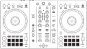
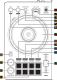
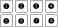
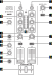
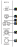

.. _pioneer-ddj-FLX4:

Pioneer DDJ-FLX4
================

.. sectionauthor::
   Based on DDJ-400 from jusko <justin.kourie@gmail.com>
   Robert904 <robert@percu.be>

   Pioneer DDJ-FLX4 (schematic view)

The Pioneer DDJ-FLX4 is a 2 deck USB controller with an integrated audio interface
designed for rekordbox and Serato.

- `Manufacturer's Product Page <https://www.pioneerdj.com/en-us/product/controller/ddj-flx4/black/overview/>`__
- `Manufacturer's User Manual <http://docs.pioneerdj.com/Manuals/DDJ_FLX4_DRI1804A_manual/>`__
- `Midi Mappings <https://www.pioneerdj.com/-/media/pioneerdj/software-info/controller/ddj-flx4/ddj-flx4_midi_message_list_e1.pdf>`__
- `Hardware Diagram <https://www.pioneerdj.com/-/media/pioneerdj/software-info/controller/ddj-flx4/ddj-flx4_hardwarediagram_rekordbox_e1.pdf?la=en-us>`__
- `Mapping Forum Thread <https://mixxx.discourse.group/t/pioneer-ddj-flx4/26553>`__

Firmware
--------

The mapping has been created on Firmware version 1.02

Compatibility
-----------------

The Pioneer DDJ-FLX4 is USB audio and MIDI class compliant and works
with Linux, Windows, and macOS without needing to install any drivers.

Audio Setup
-----------

Configure Mixxx's :ref:`sound hardware settings <preferences-sound-hardware>` as follows:

============ ========
Output       Channel
============ ========
Master       1-2
Headphones   3-4
============ ========

.. note:: It is not possible to record or broadcast input sent from the 1/4" unbalanced
          TS microphone jack on the controller, as it is not routed back to the computer
          and cannot be configured as an input device.

Controller Mapping
------------------

The schematic drawings used here can be referenced in the
`manufacturer's manual <http://docs.pioneerdj.com/Manuals/DDJ_FLX4_DRI1804A_manual/>`__
on the given page number.

Browser section (p. 12)
~~~~~~~~~~~~~~~~~~~~~~~

   Pioneer DDJ-FLX4 (browser section)

========  ==================================================  ==========================================
No.       Control                                             Function
========  ==================================================  ==========================================
1         :hwlabel:`LOAD` buttons                             Load track selected in library into deck.
2         Rotary Selector                                     Press to toggle focus between the library sidebar and associated panels. Turn to move focus up or down.
2         :hwlabel:`SHIFT` + Rotary Selector                  Turn to zoom parallel waveform.
========  ==================================================  ==========================================

Deck sections (p. 15)
~~~~~~~~~~~~~~~~~~~~~
.. _pioneer-ddj-flx4-deck-sections:

   Pioneer DDJ-FLX4 (deck section)

====  =======================================================  ======================================================================
No.   Control                                                  Function
====  =======================================================  ======================================================================
1     :hwlabel:`BEAT SYNC`                                     Press to sync tempo to the other playing track. Hold to enable sync lock.
1     :hwlabel:`SHIFT` + :hwlabel:`BEAT SYNC`                  Cycles through tempo ranges: +/-6%, +/-10%, +/-16%, +/-25%
2     :hwlabel:`CUE/LOOP CALL`:hwlabel:`>`                     Doubles the current loop size.
2     :hwlabel:`SHIFT` + :hwlabel:`CUE/LOOP CALL`:hwlabel:`>`  Jumps 32 beats forwards.
3     :hwlabel:`CUE/LOOP CALL`:hwlabel:`<`                     Halves the current loop size.
3     :hwlabel:`SHIFT` + :hwlabel:`CUE/LOOP CALL`:hwlabel:`<`  Jumps 32 beats backwards.
4     :hwlabel:`4BEAT/EXIT`                                    Enables/disables currently set loop.
4     :hwlabel:`shift` + :hwlabel:`4BEAT/EXIT`                 Jump to loop start, enable loop, and stop playback.
5     :hwlabel:`OUT`                                           Sets end of loop to the current playback position.
                                                               If quantize is enabled, it is set to the closest beat.
                                                               If held during an active loop, sets the new end point when released.
5     :hwlabel:`shift` + :hwlabel:`OUT`                        When a loop is enabled, press to adjust the loop's end position with the jog wheel.
6     :hwlabel:`IN`                                            Sets start of loop to the current playback position. If quantize is enabled, it is set to the closest beat.
                                                               If held during an active loop, sets the new start point when released.
6     :hwlabel:`shift` + :hwlabel:`IN`                         When a loop is enabled, press to adjust the loop's start position with the jog wheel.
7     Jog Wheel (top)                                          Scratch (move play position).
7     Jog Wheel (outer)                                        Nudge tempo up or down temporarily.
8     :hwlabel:`HOT CUE` mode                                  Sets pads to :ref:`hot cue mode <pioneer-ddj-flx4-hot-cue-mode>`.
9     :hwlabel:`PAD FX` mode                                   Not implemented.
10    :hwlabel:`BEAT JUMP` mode                                Sets pads to :ref:`beat jump mode <pioneer-ddj-flx4-beat-jump-mode>`.
10    :hwlabel:`SHIFT` + :hwlabel:`BEAT LOOP` mode             Sets pads to :ref:`beat loop mode <pioneer-ddj-flx4-beat-loop-mode>`.
11    :hwlabel:`SAMPLER` mode                                  Sets pads to :ref:`sampler mode <pioneer-ddj-flx4-sampler-mode>`.
12    :hwlabel:`TEMPO` slider                                  Adjust playback speed.
13    Performance pads                                         Functionality differs depending on the pad mode selected by 8-11.
14    :hwlabel:`PLAY/PAUSE`                                    Play/pauses a track).
15    :hwlabel:`CUE`                                           Behavior depends on the :ref:`cue mode <interface-cue-modes>`.
16    :hwlabel:`SHIFT`                                         Used to access secondary functiones of other buttons while being pressed.
====  =======================================================  ======================================================================

Pad Modes
^^^^^^^^^

The pad mode buttons change between different modes in which the performance pads operate. The main
pad modes described below are similar to those found in rekordbox.

.. note:: The secondary pad modes described in the manufacturer's manual
          (:hwlabel:`KEYBOARD` :hwlabel:`PAD FX1` :hwlabel:`PAD FX2` and
          :hwlabel:`KEYSHIFT`) are not currently implemented by this
          mapping.

Hot Cue Mode
^^^^^^^^^^^^
.. _pioneer-ddj-flx4-hot-cue-mode:

Bookmark positions in the track and jump to them.

   Pioneer DDJ-FLX4 (hot cue pads)

========  ===============================  ========================================================
No.       Control                          Function
========  ===============================  ========================================================
1-8       Pad (unlit)                      Save current position as hot cue.
1-8       Pad (lit)                        Jump to hot cue. If the track is stopped, holding the
                                           pad will preview the hot cue until the pad is released.
1-8       :hwlabel:`SHIFT` + Pad (lit)     Clear hot cue.
========  ===============================  ========================================================

Beat Loop Mode
^^^^^^^^^^^^^^
.. _pioneer-ddj-flx4-beat-loop-mode:

Press a pad to enable a loop from the current position. Press the pad again to
disable the loop. The size of the loop is assigned to the pads as follows:

.. table:: Pioneer DDJ-FLX4 (beat loop sizes)
   :align: center

   ============  ============  ============  ============
   1/4 beat      1/2 beat      1 beat        2 beats
   4 beats       8 beats       16 beats      32 beats
   ============  ============  ============  ============

Beat Jump Mode
^^^^^^^^^^^^^^
.. _pioneer-ddj-flx4-beat-jump-mode:

Press a pad to jump forwards or backwards by the number of beats assigned to the
pads below.

Press :hwlabel:`SHIFT` + pad 7 to decrease or :hwlabel:`SHIFT` + pad 8 to
increase the jump values by a factor of 16.

.. table:: Pioneer DDJ-FLX4 (beat jump defaults)
   :align: center

   =============  ===============  =============  ================
   1 beat back    1 beat forward   2 beats back   2 beats forward
   4 beats back   4 beats forward  8 beats back   8 beats forward
   =============  ===============  =============  ================

Sampler Mode
^^^^^^^^^^^^
.. _pioneer-ddj-flx4-sampler-mode:

Load and play samples from the library. The pads on decks 1 and 2 correspond to
the first and second sampler rows in Mixxx respectively.

   Pioneer DDJ-FLX4 (sampler pads)

========  ===============================  ========================================================
No.       Control                                                          Function
========  ===============================  ========================================================
1-8       Pad (unlit)                      Load sample selected in library.
1-8       Pad (lit)                        Play a loaded sample. If the sample is already playing,
                                           playback starts from the beginning.
1-8       :hwlabel:`SHIFT` + Pad (lit)     Stop a loaded sample from playing. If the sample is
                                           already stopped, unload it.
========  ===============================  ========================================================

Mixer section (p. 25)
~~~~~~~~~~~~~~~~~~~~~

   Pioneer DDJ-FLX4 (mixer section)

====  =======================================================  ======================================================================
No.   Control                                                  Function
====  =======================================================  ======================================================================
1     :hwlabel:`TRIM`                                          Adjusts deck prefader gain
2     :hwlabel:`MASTER`                                        Adjusts master output (this is hardware implemented and is not mapped
                                                               to the software gain in Mixxx).
3     :hwlabel:`MASTER` :hwlabel:`CUE`                         Sends master output to headphones (this is hardware implemented and is
                                                               not visible in the Mixxx interface).
4     EQs (:hwlabel:`LOW` :hwlabel:`MID` :hwlabel:`HIGH`)      Boosts or cuts channel frequencies
5     :hwlabel:`MASTER`                                        Microphone level. Works for microphones connected on the controller and
                                                               through the controller's line out.
6     Channel level indicators                                 Displays channel levels (before being sent through channel faders)
7     :hwlabel:`CFX`                                           QuickEffect superknob (by default controls a Filter, but this can be changed in the :ref:`preferences <preferences-equalizers>`)
8     :hwlabel:`Smart CFX`                                     Not implemented
9     Headphone :hwlabel:`CUE` (Channel)                       Turn on to output channel to headphones
9     :hwlabel:`SHIFT` + Headphone :hwlabel:`CUE`              Toggles quantize for the current channel
10    :hwlabel:`HEADPHONES` :hwlabel:`MIXING`                  Adjusts between headphone :hwlabel:`CUE` and :hwlabel:`MASTER` levels sent to headphones
11    :hwlabel:`HEADPHONES` :hwlabel:`LEVEL`                   Adjusts output level from :hwlabel:`PHONES` jack
12    Channel fader                                            Adjusts channel levels output to master
13    :hwlabel:`Smart Fader`                                   Not implemented
14    Crossfader                                               Fade between left and right channels
====  =======================================================  ======================================================================

Effect section (p. 31)
~~~~~~~~~~~~~~~~~~~~~~

   Pioneer DDJ-FLX4 (effect section)

The :hwlabel:`BEAT FX` controls above are mapped to Mixxx's first effect unit as
follows:

====  =======================================================  ======================================================================
No.   Control                                                  Function
====  =======================================================  ======================================================================
1     Channel select switch                                    Route deck 1, deck 2 or both to effect unit 1
2     :hwlabel:`FX SELECT`                                     Load next effect
2     :hwlabel:`SHIFT` + :hwlabel:`FX SELECT`                  Load previous effect
3     :hwlabel:`BEAT` :hwlabel:`<`                             Cycle effect focus leftward
4     :hwlabel:`BEAT` :hwlabel:`>`                             Cycle effect focus rightward
5     :hwlabel:`LEVEL/DEPTH`                                   Controls the wet/dry mix knob
5     :hwlabel:`SHIFT` + :hwlabel:`LEVEL/DEPTH`                Controls the metaknob of the currently focused effect
6     :hwlabel:`ON/OFF`                                        Enable/disable the currently focused effect
6     :hwlabel:`SHIFT` + :hwlabel:`ON/OFF`                     Disables all effects in the chain and kills the wet/dry mix
====  =======================================================  ======================================================================

.. note:: Soft takeover is enabled on the :hwlabel:`LEVEL/DEPTH`
          knob to prevent sudden changes to the wet/dry mix or effect metaknob
          when changing between the two.
