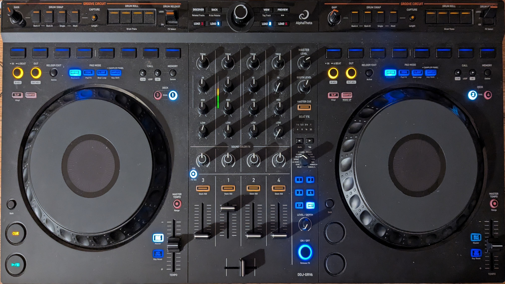

Pioneer DDJ-GRV6
================

.. sectionauthor::
   Jörg Beyer <joerg.beyer@gmail.com>

(I need to reach out to the manufacturer Pioneer and ask for persionion to use a diagram from their documentation.
Meanwhile, here is a photo)

   Pioneer DDJ-GRV6 (photo)

The Pioneer DDJ-GRV6 is a 4 deck USB controller with an integrated audio interface
designed for rekordbox.

- `Manufacturer's Product Page <https://support.pioneerdj.com/hc/en-us/sections/37070449483417-DDJ-GRV6/>`__
- `Midi Mappings <https://www.pioneerdj.com/-/media/pioneerdj/software-info/controller/ddj-grv6/ddj-grv6_midi_message_list_e1.pdf>`__
- `Forum discussion <https://mixxx.discourse.group/t/working-on-a-pioneer-ddj-grv6-mapping/33114>`__

.. versionadded:: 2.7.0

Compatibility
-----------------

The Pioneer DDJ-GRV6 is USB audio and MIDI class compliant and works
with Linux, Windows, and macOS without needing to install any drivers.

Audio Setup
-----------

Configure Mixxx's :ref:`sound hardware settings <preferences-sound-hardware>` as follows:

============ ========
Output       Channel
============ ========
Main         1-2
Headphones   3-4
============ ========

Controller Mapping
------------------

TBD

Browser section
~~~~~~~~~~~~~~~

========  ==================================================  ==========================================
No.       Control                                             Function
========  ==================================================  ==========================================
1         :hwlabel:`LOAD` buttons                             Load track selected in library into deck.
2         Rotary Selector                                     Press to toggle focus between the library sidebar and associated panels. Turn to move focus up or down.
========  ==================================================  ==========================================

Deck sections
~~~~~~~~~~~~~

The Controller has 2 hardware decks, but emulates 4 decks. Use the deck selector buttons

Mixer section
~~~~~~~~~~~~~

=======================================================  ======================================================================
Control                                                  Function
=======================================================  ======================================================================
:hwlabel:`TRIM`                                          Adjusts deck prefader gain
:hwlabel:`MASTER`                                        Adjusts main output (this is hardware implemented and is not mapped
                                                         to the software gain in Mixxx).
:hwlabel:`MASTER` :hwlabel:`CUE`                         Sends main output to headphones (this is hardware implemented and is
                                                         not visible in the Mixxx interface).
EQs (:hwlabel:`LOW` :hwlabel:`MID` :hwlabel:`HIGH`)      Boosts or cuts channel frequencies
Channel level indicators                                 Displays channel levels (before being sent through channel faders)
:hwlabel:`HEADPHONES` :hwlabel:`MIXING`                  Adjusts between headphone :hwlabel:`CUE` and :hwlabel:`MASTER` levels sent to headphones
:hwlabel:`FILTER`                                        QuickEffect superknob (by default controls a Filter, but this can be changed in the :ref:`preferences <preferences-equalizers>`)
:hwlabel:`HEADPHONES` :hwlabel:`LEVEL`                   Adjusts output level from :hwlabel:`PHONES` jack
Headphone :hwlabel:`CUE` (Channel)                       Turn on to output channel to headphones
:hwlabel:`SHIFT` + Headphone :hwlabel:`CUE`              Toggles quantize for the current channel
Channel fader                                            Adjusts channel levels output to main
Crossfader                                               Fade between left and right channels
=======================================================  ======================================================================

Effect section
~~~~~~~~~~~~~~

not yet fully working. You can't currently change the effects with the Hardware rotation knob.
