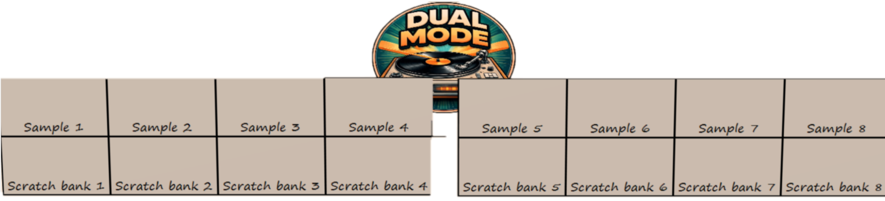
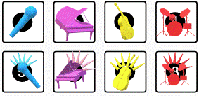

.. _pioneer-ddj-rev1:

Pioneer DDJ-REV1
================

.. sectionauthor:: AKOI

The Pioneer DDJ-REV1 is a four-channel battle-style USB controller with an
integrated audio interface. This page documents Mixxx-specific mapping
behavior; see the manufacturer’s manual for the physical control layout.

- `Manufacturer’s product page
  <https://www.pioneerdj.com/en/product/controller/ddj-rev1/black/overview/l>`_
- `Manufacturer’s manual
  <https://www.pioneerdj.com/en/support/documents/ddj-rev1/>`_
- `MIDI message list (PDF)
  <https://www.pioneerdj.com/-/media/pioneerdj/software-info/controller/ddj-rev1/ddj-rev1_midi_message_list_e1.pdf>`_
- `Mapping forum thread
  <https://mixxx.discourse.group/t/pioneer-ddj-rev1-mapping-update-2-6/32603>`_

.. versionadded:: 2.5.0

Requirements
------------

Mixxx 2.5 or newer. A compatibility mode supports 2.5 and 2.6+ behavior; see
`Compatibility`_.

Firmware & drivers
------------------

**Firmware:** At the time this documentation was written there were no
required firmware updates for the Pioneer DDJ-REV1. Check the Pioneer DJ
website for updates.

**Drivers:** No dedicated driver is required for class-compliant operation.
On Windows, ASIO may require installation of the Pioneer audio driver.

Compatibility
-------------

**Controller:** This controller is a class-compliant USB MIDI and audio device,
so it can be used without any special drivers on GNU/Linux, macOS, and
Windows. However, if you wish to use the ASIO sound API under Windows, please
install the latest driver package available.

**Mixxx:** This mapping supports version-gated behavior for Mixxx 2.5 and 2.6+.

==========     ===========================================================================
Mode           Behavior
==========     ===========================================================================
Auto           Uses the non-stems code path on Mixxx 2.5 and the stems code path on 2.6+.
Force 2.5      Disables stems behavior regardless of the running Mixxx version.
Force 2.6      Enables stems behavior regardless of the running Mixxx version.
==========     ===========================================================================

**Priority gate:** On a stems-capable runtime, stems mode takes priority over
ScratchBank when both would conflict.

Sound card setup
----------------

This controller has a built-in 4-channel sound card with master output. MIC
input: 1/4" TR jack. Master output: RCA pin jacks. Headphones: 3.5 mm stereo
jack.

In :menuselection:`Preferences --> Sound Hardware`, configure outputs as
follows:

===============  =========== 
Output channel   Assign to
===============  =========== 
1–2              Main
3–4              Headphones
===============  =========== 

=============== =============
Input Channels  Assign to
=============== =============
1-2 (Input 1)   Microphone 1
=============== =============

Input routing
^^^^^^^^^^^^^

On the rear side is a small knob to select the microphone volume. It adjusts
the level of sound input at the microphone input terminal.

.. seealso::
   When the microphone is not in use, turn the level to the minimum available.
   The :ref:`example setups section <setup-laptop-and-external-card>` provides more details about the audio configuration in Mixxx.

Hardware controls
^^^^^^^^^^^^^^^^^

The **Mic Level** hardware control interacts directly with the integrated sound
card and is not mapped to Mixxx.

.. seealso::
   The :ref:`gain staging documentation <djing-gain-staging>` explains how to set your levels properly when using Mixxx.

Mapping description differences
-------------------------------

See the Pioneer manual for the physical control layout. The following
describes Mixxx-specific behavior.

- Compatibility mode supports Auto / Force 2.5 / Force 2.6 mapping behavior.
- :hwlabel:`SHIFT` + :hwlabel:`PLAY/PAUSE` supports braking profiles (Off,
  Classic, Slow) with a default fallback when braking is disabled.
- Beatjump and roll pads use hold semantics with configurable roll sizes.
- Sampler volume gate and headphone cue logic are tuned for usability.
- ScratchBank mapping and FX buffering are refined for stability.
- Sampler pad layout options are available (see `User configuration options`_).
- Sixteen samples by default (samples 1–16).
- Improvements to Library Sort.
- Scratch Feel.
- Split FX.
- STEMS v2.6+.
- Additional user configuration options.

Controls
-------------------------------

Browse section
^^^^^^^^^^^^^^

========================  ======================================================  ===========================================================================================
No.                       Control                                                 Function
========================  ======================================================  ===========================================================================================
1                         :hwlabel:`SHIFT` + :hwlabel:`LOAD`                      Sort by user-selected configuration. Double press toggles ascending/descending.
2                         :hwlabel:`SHIFT` + :hwlabel:`Rotary Selector`           Rotate selector while holding SHIFT to move left or right in the library or open and close the subcrates panel.
========================  ======================================================  ===========================================================================================

Deck section
^^^^^^^^^^^^

==== ========================================================= ======================================================================
No.  Control                                                   Function
==== ========================================================= ======================================================================
6    :hwlabel:`SYNC`                                           Temporary beat sync. If sync lock is active, a short press cancels the lock.
6    :hwlabel:`SHIFT` + :hwlabel:`SYNC`                        Enable sync lock.
7    :hwlabel:`SHIFT` + :hwlabel:`PLAY/PAUSE`                  Braking disabled: stutter-play. Braking enabled: uses the configured start/stop brake profile (Off / Classic / Slow).
9    :hwlabel:`JOG WHEEL` top / side Vinyl mode:               Top scratches, side bends (or waveform zoom when enabled). CDJ mode: jog uses bend behavior.
==== ========================================================= ======================================================================

Mixer section
^^^^^^^^^^^^^

==== ========================================================= ======================================================================
No.  Control                                                   Function
==== ========================================================= ======================================================================
12   :hwlabel:`(HEADPHONES) CUE`                               PFL toggle with updated head-mix handling (user configuration).
12   :hwlabel:`MASTER CUE`                                     Toggles head-mix behavior (user configuration).
13   :hwlabel:`SHIFT` + :hwlabel:`CHANNEL FADER`               Channel fader start (must be enabled in Utility mode on the controller).
15   :hwlabel:`SHIFT` + :hwlabel:`CROSSFADER`                  Crossfader start (must be enabled in Utility mode on the controller).
==== ========================================================= ======================================================================

.. note::
   Utility mode and fader-start MIDI can vary by hardware firmware. If
   fader-start does not respond after changing utility options, restart Mixxx.

Effect section
^^^^^^^^^^^^^^

==== ===========================================================================  ============================================================================================
No.  Control                                                                      Function
4    :hwlabel:`LEVEL/DEPTH`                                                       Adjusts the parameter of the enabled effects for FX1 / FX2.
3    :hwlabel:`SHIFT` + :hwlabel:`FX 1`                                           Cycle to the next effect-chain preset after the currently loaded preset (descending order).
4    :hwlabel:`SHIFT` + :hwlabel:`FX 2`                                           Adjust the average BPM up by +0.01 (beat grid lines move closer together).
5    :hwlabel:`SHIFT` + :hwlabel:`FX 3`                                           Adjust the average BPM down by −0.01 (beat grid lines move farther apart).
4    :hwlabel:`FX1`, :hwlabel:`FX2`, :hwlabel:`FX3` + :hwlabel:`ROTARY SELECTOR`  Designate the effect for the selected FX button (descending order).
==== ============================================================================ ============================================================================================

Sampler section
^^^^^^^^^^^^^^^

==== ========================================================= =================================================================================================
No.  Control                                                   Function
==== ========================================================= =================================================================================================
10   :hwlabel:`SAMPLER PADS` 1–16                              Play the loaded sample, or load the selected track when empty. Follows sampler pad layout.
10   :hwlabel:`SHIFT` + :hwlabel:`SAMPLER PADS` 1–16           Stop the playing sample, or eject a stopped sample.
10   :hwlabel:`SAMPLER` + :hwlabel:`LEVEL/DEPTH`               Sampler gain for samplers 1–16 while held (sampler volume gate).
10   :hwlabel:`SAMPLER PADS` 5–8                               **Mixxx 2.6+ dual mode only.** When ScratchBank is active, loads scratch samples from **17–24**.
==== ========================================================= =================================================================================================

   Dual mode: samples 1–4; ScratchBank on pads 5–8.

ScratchBank section (Mixxx 2.5)
^^^^^^^^^^^^^^^^^^^^^^^^^^^^^^^

When stems priority is not active, ScratchBank uses pads as follows:

==== ========================================================= ======================================================================
No.  Control                                                   Function
==== ========================================================= ======================================================================
10   :hwlabel:`SCRATCH MODE` pads 1–4                          Load scratch samples from samples **17–24**.
==== ========================================================= ======================================================================

.. note::
   On a stems-capable Mixxx version, stems mode wins over ScratchBank when
   both would apply. ScratchBank actions are suppressed in that case.

Stem section (Mixxx 2.6+)
^^^^^^^^^^^^^^^^^^^^^^^^^

==== ========================================================= ======================================================================
No.  Control                                                   Function
==== ========================================================= ======================================================================
10   :hwlabel:`SCRATCH MODE` pads 1–4                          Stem mute toggles (voice / melody / bass / drums).
10   :hwlabel:`SCRATCH MODE` pads 5–8                          Stem effect toggles (voice / melody / bass / drums).
10   :hwlabel:`STEM PAD` + :hwlabel:`LEVEL/DEPTH`              Adjust stem volume / effect parameters while held.
==== ========================================================= ======================================================================

   Stems and stem-effect positions: voice, melody, bass, drums.

Beat jump / roll section
^^^^^^^^^^^^^^^^^^^^^^^^

==== ========================================================= ======================================================================
No.  Control                                                   Function
==== ========================================================= ======================================================================
10   Beatjump pads 1–4                                         One-shot beat jump / back / size controls.
10   Beatjump pad 5                                            Previous track (deck must not be playing).
10   Beatjump pads 6 / 7                                       Hold-to-rewind / hold-to-fast-forward.
10   Beatjump pad 8                                            Hold-to-censor (``reverseroll``).
10   Roll pads 1–8                                             Hold loop roll with per-pad configurable roll sizes.
==== ========================================================= ======================================================================

Extra controls section
^^^^^^^^^^^^^^^^^^^^^^

==== ========================================================= ======================================================================
No.  Control                                                   Function
==== ========================================================= ======================================================================
10   Scratch Mode :hwlabel:`SHIFT` + :hwlabel:`Pad1`           AutoDJ.
10   Scratch Mode :hwlabel:`SHIFT` + :hwlabel:`Pad2`           AutoDJ fade to next.
10   Scratch Mode :hwlabel:`SHIFT` + :hwlabel:`Pad3`           Toggle Microphone.
10   Scratch Mode :hwlabel:`SHIFT` + :hwlabel:`Pad4`           Toggle Record Mix.
10   Scratch Mode :hwlabel:`SHIFT` + :hwlabel:`Pad5`           Key Match.
10   Scratch Mode :hwlabel:`SHIFT` + :hwlabel:`Pad6`           Beat Grid.
10   Scratch Mode :hwlabel:`SHIFT` + :hwlabel:`Pad7`           Pitch Up.
10   Scratch Mode :hwlabel:`SHIFT` + :hwlabel:`Pad8`           Pitch Down.
==== ========================================================= ======================================================================

User configuration options
^^^^^^^^^^^^^^^^^^^^^^^^^^^

Controller settings are exposed in mapping options (XML); script defaults apply
as fallbacks.

.. list-table::
   :header-rows: 1
   :widths: 23 62 15
   :class: longtable

   * - Variable
     - Function
     - Default
   * - ``PioneerDDJREV1PROD.compatibilityMode``
     - Detects the Mixxx version at runtime.
     - ``auto``
   * - ``PioneerDDJREV1PROD.vinylMode``
     - Per-deck startup vinyl / CDJ mode.
     - ``true``
   * - ``PioneerDDJREV1PROD.VinylSlipAutoff``
     - Auto-enable slip on vinyl touch and auto-disable on release.
     - ``false``
   * - ``PioneerDDJREV1PROD.nonShiftScratchFeel``
     - Scratch speed: DEFAULT / PLX / DIGITAL / AKO / STUDIO.
     - ``Default``
   * - ``PioneerDDJREV1PROD.librarySortDefaults``
     - Sort library by artist, BPM, date, duration, genre, key, rating.
     - ``"artist"``, ``"bpm"``, ``"date added"``, ``"key"``
   * - ``PioneerDDJREV1PROD.beatLoopRollsSize1`` … ``beatLoopRollsSize8``
     - Per-pad roll sizes for roll mode.
     - ``1/16`` … ``8``
   * - ``PioneerDDJREV1PROD.sZoom``
     - Use vinyl side jog for waveform zoom.
     - ``false``
   * - ``PioneerDDJREV1PROD.brakingEnabled``
     - Enable profile-based :hwlabel:`SHIFT` + :hwlabel:`PLAY` braking.
     - ``false``
   * - ``PioneerDDJREV1PROD.brakingStartProfile``
     - Start profile for :hwlabel:`SHIFT` + :hwlabel:`PLAY`: ``off`` / ``classic`` / ``slow``.
     - ``off``
   * - ``PioneerDDJREV1PROD.brakingStopProfile``
     - Stop profile for :hwlabel:`SHIFT` + :hwlabel:`PLAY`: ``off`` / ``classic`` / ``slow``.
     - ``off``
   * - ``PioneerDDJREV1PROD.tempSamplerSkin``
     - Show sampler UI while using the sampler volume gate.
     - ``false``
   * - ``PioneerDDJREV1PROD.scratchBankEnabled``
     - Enable ScratchBank where not overridden by stems priority.
     - ``false``
   * - ``PioneerDDJREV1PROD.studioPflAdjustment``
     - PFL adjustment: Off / Auto / Studio.
     - ``Auto``
   * - ``PioneerDDJREV1.splitFx``
     - :hwlabel:`LEVEL/DEPTH` routing: Off (default) controls both FX units; On routes :hwlabel:`LEVEL/DEPTH`-> FX1 vs :hwlabel:`SHIFT` + :hwlabel:`LEVEL/DEPTH`-> FX2 .
     - ``false``
   * - ``PioneerDDJREV1PROD.samplePadLayout``
     - ``Standard`` / ``Banked Rows`` / ``Mirrored``.
     - ``Standard``

.. note:: ``samplePadLayout`` layouts

  - **Standard** (linear): (Deere, Tango) 
      Left 1–8, right 9–16 (top to bottom, linear).
  - **Banked rows:** (Late Night) 
     Top row: left 1–4, right 5–8. Bottom row: left 9–12, right 13–16.
  - **Mirrored:** Default order reversed within each row. 
     Top 4 3 2 1, bottom 8 7 6 5; deck 2 mirror: top 12 11 10 9, bottom 16 15 14 13.

Known issues
~~~~~~~~~~~~

- Controller Utility mode may not expose all expected fader-start MIDI
  variants on the hardware (controller limitation).
- Fader-start behavior can depend on controller-side utility state and may
  require a Mixxx restart after utility changes (controller limitation).
- ScratchBank actions are intentionally suppressed when the stems-priority
  gate is active on a stems-capable runtime.
