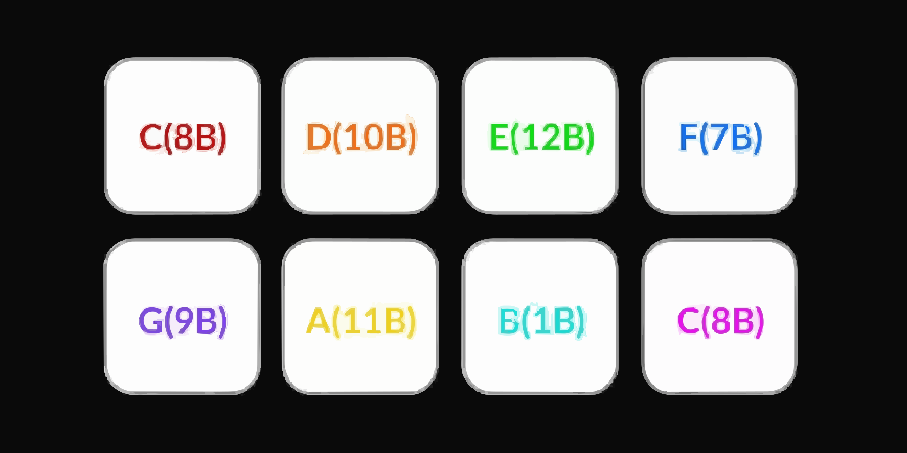
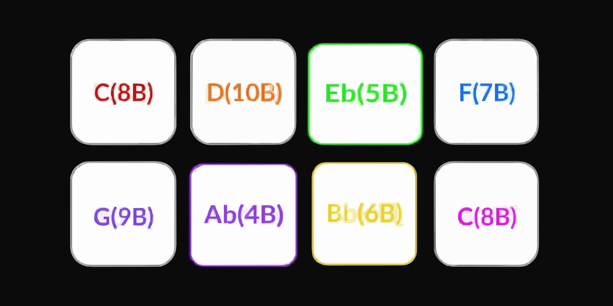
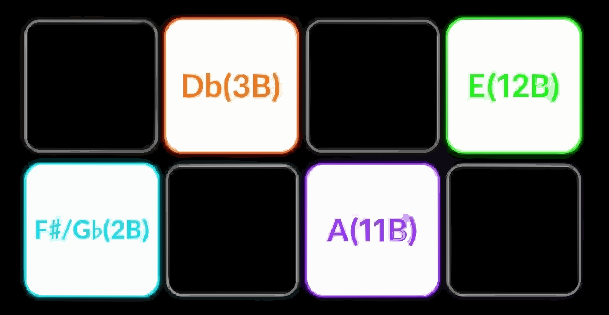
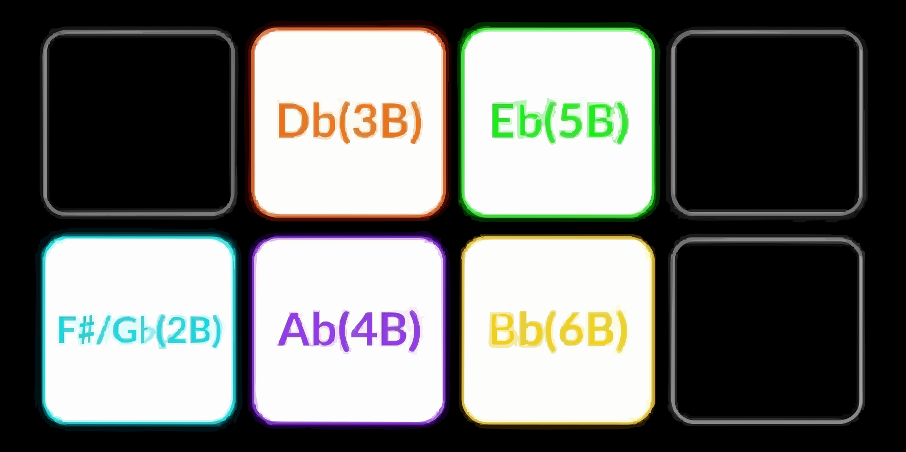

.. _pioneer-ddj-rev1:

Pioneer DDJ-REV1
================

.. sectionauthor:: AKOI

The Pioneer DDJ-REV1 is a four-channel battle-style USB controller with an
integrated audio interface. This page documents Mixxx-specific mapping
behavior; see the manufacturer’s manual for the physical control layout.

- `Manufacturer’s product page
  <https://www.pioneerdj.com/en/product/controller/ddj-rev1/black/overview/l>`_
- `Manufacturer’s manual
  <https://www.pioneerdj.com/en/support/documents/ddj-rev1/>`_
- `MIDI message list (PDF)
  <https://www.pioneerdj.com/-/media/pioneerdj/software-info/controller/ddj-rev1/ddj-rev1_midi_message_list_e1.pdf>`_
- `Mapping forum thread
  <https://mixxx.discourse.group/t/pioneer-ddj-rev1-mapping-update-2-6/32603>`_

.. versionadded:: 2.5.0

.. contents::
   :local:
   :depth: 4

Requirements
------------

Mixxx 2.5 or newer. Supports 2.5 and 2.6+ behavior; see
`Compatibility`_.

Firmware & drivers
------------------

**Firmware:** At the time this documentation was written there were no
required firmware updates for the Pioneer DDJ-REV1. Check the Pioneer DJ
website for updates.

**Drivers:** No dedicated driver is required for class-compliant operation.
On Windows, ASIO may require installation of the Pioneer audio driver.

Compatibility
-------------

**Controller:** This controller is a class-compliant USB MIDI and audio device,
so it can be used without any special drivers on GNU/Linux, macOS, and
Windows. However, if you wish to use the ASIO sound API under Windows, please
install the latest driver package available.

**Mixxx:** This mapping supports version-gated behavior for Mixxx 2.5 and 2.6+.

==========     ===========================================================================
Mode           Behavior
==========     ===========================================================================
**2.5:** Scratch Bank on :hwlabel:`SCRATCH Bank` pads 1–4 (samples 17–24). 
**2.6+:** Same pads on :hwlabel:`SCRATCH Bank` control stems (mute). Scratch Bank is available via :ref:`Mixxed Mode` slot 4 when enabled. Stem/EQ options apply only when stem tracks and stem controls are available.
==========     ===========================================================================

**Priority gate:** On a stems-capable runtime, stems mode takes priority over
ScratchBank when both would conflict.

Sound card setup
----------------

This controller has a built-in 4-channel sound card with master output. MIC
input: 1/4" TR jack. Master output: RCA pin jacks. Headphones: 3.5 mm stereo
jack.

In :menuselection:`Preferences --> Sound Hardware`, configure outputs as
follows:

===============  =========== 
Output channel   Assign to
===============  =========== 
1–2              Main
3–4              Headphones
===============  =========== 

=============== =============
Input Channels  Assign to
=============== =============
1-2 (Input 1)   Microphone 1
=============== =============

Input routing
^^^^^^^^^^^^^

On the rear side is a small knob to select the microphone volume. It adjusts
the level of sound input at the microphone input terminal.

.. seealso::
   When the microphone is not in use, turn the level to the minimum available.
   The :ref:`example setups section <setup-laptop-and-external-card>` provides more details about the audio configuration in Mixxx.

Hardware controls
^^^^^^^^^^^^^^^^^

The **Mic Level** hardware control interacts directly with the integrated sound
card and is not mapped to Mixxx.

.. seealso::
   The :ref:`gain staging documentation <djing-gain-staging>` explains how to set your levels properly when using Mixxx.

Mapping description differences
-------------------------------

See the Pioneer manual for the physical control layout. The following
describes Mixxx-specific behavior.

- Automatic version detection (2.5 / 2.6+) (STEMS vs Scratch Bank pad routing).
- :hwlabel:`SHIFT` + :hwlabel:`PLAY/PAUSE` supports braking profiles (Off,
  Classic, Slow) with a default fallback when braking is disabled.
- Configurable Beat Jump, Auto Loop and Beat Roll pads use hold semantics with configurable roll sizes.
- Sampler volume gate and headphone cue logic are tuned for usability.
- ScratchBank mapping and FX buffering are refined for stability.
- 3 Sampler pad layout options are available (see `User configuration options`_).
- Sixteen samples by default (samples 1–16).
- Improvements to Library Sort.
- Scratch Feel.
- Split FX.
- STEMS v2.6+.
- Configurable beat tempo ranges.
- VU meter options.
- Additional user configuration options.
- Mixxxed Mode (configurable per deck — see :ref:`Mixxed Mode`).

  - Slot 1: Auto Loop
  - Slot 2: Beat Slicer
  - Slot 3: Piano Roll
  - Slot 4: Scratch Bank

Controls
-------------------------------

Browse section
^^^^^^^^^^^^^^

========================  ======================================================  ===========================================================================================
No.                       Control                                                 Function
========================  ======================================================  ===========================================================================================
1                         :hwlabel:`SHIFT` + :hwlabel:`LOAD`                      Sort by user-selected configuration. Double press toggles ascending/descending.
2                         :hwlabel:`Rotary Selector PUSH`                         Push Rotary selector to cycle forward between panels in library.
2                         :hwlabel:`SHIFT` + :hwlabel:`Rotary Selector PUSH`      Hold shift + Push Rotary selector to cycle backwards between panels in library.
3                         :hwlabel:`SHIFT` + :hwlabel:`Rotary Selector`           Rotate selector while holding SHIFT to move left or right in the library or open and close the subcrates panel.
========================  ======================================================  ===========================================================================================

Deck section
^^^^^^^^^^^^

==== ========================================================= ======================================================================
No.  Control                                                   Function
==== ========================================================= ======================================================================
6    :hwlabel:`SYNC`                                           Temporary beat sync. If sync lock is active, a short press cancels the lock.
6    :hwlabel:`SHIFT` + :hwlabel:`SYNC`                        Enable sync lock.
7    :hwlabel:`SHIFT` + :hwlabel:`PLAY/PAUSE`                  Braking disabled: stutter-play. Braking enabled: uses the configured start/stop brake profile (Off / Classic / Slow).
9    :hwlabel:`JOG WHEEL` top / side Vinyl mode:               Top scratches, side bends (or waveform zoom when enabled). CDJ mode: jog uses bend behavior.
==== ========================================================= ======================================================================

Mixer section
^^^^^^^^^^^^^

==== ========================================================= ======================================================================
No.  Control                                                   Function
==== ========================================================= ======================================================================
12   :hwlabel:`(HEADPHONES) CUE`                               PFL toggle with AUTO head-mix adjustment.
12   :hwlabel:`MASTER CUE`                                     Toggles master head-mix blend (AUTO PFL).
13   :hwlabel:`SHIFT` + :hwlabel:`CHANNEL FADER`               Channel fader start (must be enabled in Utility mode on the controller).
15   :hwlabel:`SHIFT` + :hwlabel:`CROSSFADER`                  Crossfader start (must be enabled in Utility mode on the controller).
==== ========================================================= ======================================================================

.. note::
   Utility mode and fader-start MIDI can vary by hardware firmware. If
   fader-start does not respond after changing utility options, restart Mixxx.

Effect section
^^^^^^^^^^^^^^

==== ============================================================================ ============================================================================================
No.  Control                                                                      Function
4    :hwlabel:`LEVEL/DEPTH`                                                       Adjusts the parameter of the enabled effects for FX1 / FX2.
3    :hwlabel:`SHIFT` + :hwlabel:`FX 1`                                           Cycle to the next effect-chain preset after the currently loaded preset (descending order).
4    :hwlabel:`SHIFT` + :hwlabel:`FX 2`                                           Adjust the average BPM up by +0.01 (beat grid lines move closer together).
5    :hwlabel:`SHIFT` + :hwlabel:`FX 3`                                           Adjust the average BPM down by −0.01 (beat grid lines move farther apart).
4    :hwlabel:`FX1`, :hwlabel:`FX2`, :hwlabel:`FX3` + :hwlabel:`ROTARY SELECTOR`  Designate the effect for the selected FX button (descending order).
==== ============================================================================ ============================================================================================

Sampler section
^^^^^^^^^^^^^^^

==== ========================================================= =================================================================================================
No.  Control                                                   Function
==== ========================================================= =================================================================================================
10   :hwlabel:`SAMPLER PADS` 1–16                              Play the loaded sample, or load the selected track when empty. Follows sampler pad layout.
10   :hwlabel:`SHIFT` + :hwlabel:`SAMPLER PADS` 1–16           Stop the playing sample, or eject a stopped sample.
10   :hwlabel:`SAMPLER` + :hwlabel:`LEVEL/DEPTH`               Sampler gain for samplers 1–16 while held (sampler volume gate).
==== ========================================================= =================================================================================================

Scratch Bank section (Mixxx 2.5)
^^^^^^^^^^^^^^^^^^^^^^^^^^^^^^^^

When stems priority is not active, Scratch Bank uses pads as follows:

==== ========================================================= ======================================================================
No.  Control                                                   Function
==== ========================================================= ======================================================================
10   :hwlabel:`SCRATCH MODE` pads 1–4                          Load scratch samples from samples **17–20(Deck1/3) 21-24 (Deck2/4).**
==== ========================================================= ======================================================================

.. note::
   On 2.6, Scratch Bank moved to *Mixxed Mode* slot 4. 

Stem section (Mixxx 2.6+)
^^^^^^^^^^^^^^^^^^^^^^^^^

==== ========================================================= ======================================================================
No.  Control                                                   Function
==== ========================================================= ======================================================================
10   :hwlabel:`SCRATCH MODE pads 1–4`                          Stem mute toggles (voice / melody / bass / drums).
10   :hwlabel:`SCRATCH MODE pads 5–8`                          Stem effect toggles (voice / melody / bass / drums).
10   :hwlabel:`STEM PAD pads 1–4` + :hwlabel:`LEVEL/DEPTH`     Adjust stem volume / while held parameters while held.
10   :hwlabel:`STEM PAD pads 5–8` + :hwlabel:`LEVEL/DEPTH`     Adjust effect volume / while held.
10   :hwlabel:`STEM PAD pads 1–4` + :hwlabel:`Rotary Selector` Select stem effect chain / while held.
==== ========================================================= ======================================================================

   Stems and stem-effect positions: voice, melody, bass, drums.

Beat Jump / Roll section
^^^^^^^^^^^^^^^^^^^^^^^^

==== ========================================================= ======================================================================
No.  Control                                                   Function
==== ========================================================= ======================================================================
10   Beat Jump :hwlabel:`pads 1–4`                             One-shot beat jump / back / size controls.
10   Beat Jump :hwlabel:`pad 5`                                Previous track (deck must not be playing).
10   Beat Jump :hwlabel:`pads 6 /`                             Hold-to-rewind / hold-to-fast-forward.
10   Beat Jump :hwlabel:`pad 8`                                Hold-to-censor (``reverseroll``).
11   Beat Roll :hwlabel:`pads 1–8`                             Hold loop roll with per-pad configurable roll sizes and available actions.
==== ========================================================= ======================================================================

Extra controls section
^^^^^^^^^^^^^^^^^^^^^^

==== ========================================================= ======================================================================
No.  Control                                                   Function
==== ========================================================= ======================================================================
10   Scratch Mode :hwlabel:`SHIFT` + :hwlabel:`Pad1`           AutoDJ.
10   Scratch Mode :hwlabel:`SHIFT` + :hwlabel:`Pad2`           AutoDJ fade to next.
10   Scratch Mode :hwlabel:`SHIFT` + :hwlabel:`Pad3`           Toggle Microphone.
10   Scratch Mode :hwlabel:`SHIFT` + :hwlabel:`Pad4`           Toggle Record Mix.
10   Scratch Mode :hwlabel:`SHIFT` + :hwlabel:`Pad5`           Key Match.
10   Scratch Mode :hwlabel:`SHIFT` + :hwlabel:`Pad6`           Beat Grid.
10   Scratch Mode :hwlabel:`SHIFT` + :hwlabel:`Pad7`           Pitch Up.
10   Scratch Mode :hwlabel:`SHIFT` + :hwlabel:`Pad8`           Pitch Down.
==== ========================================================= ======================================================================

*MIXXED MODE* section
^^^^^^^^^^^^^^^^^^^^^^

.. _Mixxed Mode:

When ``multiModeEnabled`` is on, :hwlabel:`SHIFT` + :hwlabel:`←FX2/FX3→` cycles
per-deck modes on the Auto Loop pad row (1→2→3→4→1). Release :hwlabel:`SHIFT`
or wait 1.5 s after the last step to lock. Mode preview uses the shift pad LED
row.

   Mixxxed Mode slot 4: Scratch Bank. Scratch samples loaded.

==== ========================================================= ======================================================================
No.  Control                                                   Function
0    Auto Loop Mode :hwlabel:`SHIFT` + :hwlabel:`←FX2/FX3→`    Cycle Mixxed Mode (per deck).
==== ========================================================= ======================================================================

Slot 1: Auto Loop
~~~~~~~~~~~~~~~~~

==== ========================================================= ======================================================================
No.  Control                                                   Function
1    Auto Loop Mode — slot 1                                    Standard auto loop row (user configuration applies).
==== ========================================================= ======================================================================

Slot 2: Beat Slicer
~~~~~~~~~~~~~~~~~~~

==== ========================================================= ======================================================================
No.  Control                                                   Function
2    Auto Loop Mode — slot 2                                    Segment the beat into small consumable pieces. Default continuous mode.
2    Auto Loop Mode :hwlabel:`SHIFT` + :hwlabel:`Pad7`          Cycle Beat Slicer domain 8 / 16 / 32 / 64. Loop size and slice jump size increase accordingly.
2    Auto Loop Mode :hwlabel:`SHIFT` + :hwlabel:`Pad8`          Toggle Beat Slicer loop mode.
==== ========================================================= ======================================================================

+---------------------------------------+---------------------------------------+
| |slice-linear|                        | |slice-loop|                          |
|                                       |                                       |
| Beat Slicer — Linear                  | Beat Slicer — Loop                    |
+---------------------------------------+---------------------------------------+

Mixxxed Mode slot 2: Beat Slicer. Pad lighting follows the active slice.

Slot 3: Piano Roll
~~~~~~~~~~~~~~~~~~

==== ========================================================= ======================================================================
No.  Control                                                   Function
3    Auto Loop Mode — slot 3                                    Piano Roll — pitch and anchor modes (Major / Minor / Play Through).
3    Auto Loop Mode :hwlabel:`SHIFT` + :hwlabel:`pads 1–8`      Anchor modes only: toggle hotcue anchor override on deck 1 (SHIFT row LEDs show set hotcues).
==== ========================================================= ======================================================================

All piano pads target **deck 1** audio. The right Auto Loop row is decks 1 / 3;
the right row is decks 2 / 4. In **anchor modes** (Major / Minor), pad 1 is the
**original reference key**; playback snaps to the anchor on each pad press.

.. note:: ``Keylock`` - is enabled while in piano mode. Exist all piano decks to revert back to previous enable/disabled status. 

Major [Ionian]
""""""""""""""

C-scale example — pad 1 = original reference key:

+-----------------------------+-----------------------------+
| |piano-major-d1|            | |piano-major-d2|            |
|                             |                             |
| Deck 1 — Major scale        | Deck 2 — Minor scale        |
+-----------------------------+-----------------------------+

.. |piano-major-d2| image:: ../../_static/controllers/Mixxx-250-Hardware-DDJ_REV1-Major-Deck2-MinorScale.svg
   :width: 300px
   :alt: Piano Roll Major mode — deck 2 minor scale (C example).

Minor [Aeolian]
""""""""""""""

C-scale example — pad 1 = original reference key:

+-----------------------------+-----------------------------+
| |piano-minor-d3|            | |piano-minor-d4|            |
|                             |                             |
| Deck 1 — Major scale        | Deck 2 — Minor scale        |
+-----------------------------+-----------------------------+

Play Through
""""""""""""""

Pitch-shift only — no position snap or anchor. Main and SHIFT rows are both
active pitch keys; the right deck adds +12 semitones.

+-----------------------------+-----------------------------+
| |piano-pt-d1|               | |piano-pt-d2|               |
| Deck 1 — Major scale        | Deck 2 — Minor scale        |
+-----------------------------+-----------------------------+
| |piano-pt-d1-shift|         | |piano-pt-d2-shift|         |
| Deck 1 — Major scale (SHIFT)| Deck 2 — Minor scale (SHIFT)|
+-----------------------------+-----------------------------+

.. |piano-pt-d1| image:: ../../_static/controllers/Mixxx-250-Hardware-DDJ_REV1-PT-Deck1-MajorScale.svg
   :width: 300px
   :alt: Piano Roll Play Through — deck 1 major scale (C example).

.. |piano-pt-d2| image:: ../../_static/controllers/Mixxx-250-Hardware-DDJ_REV1-PT-Deck2-MinorScale.svg
   :width: 300px
   :alt: Piano Roll Play Through — deck 2 minor scale (C example).

.. |piano-pt-d1-shift| image:: ../../_static/controllers/Mixxx-250-Hardware-DDJ_REV1-PT-Deck1-MajorScale-SHIFT.svg
   :width: 300px
   :alt: Piano Roll Play Through — deck 1 major scale SHIFT row (C example).

.. hint::

   **Anchor modes (Major / Minor)**

   - On a **stopped** deck, pressing a piano pad sets anchor and plays track in key.
     Releasing a piano pad stops playback. Press :hwlabel:`PLAY` while holding a piano pad for **continuous
     play** in that key.
   - On a **playing** deck, pressing a piano pad sets anchor stops playback on release. Press :hwlabel:`PLAY` while holding a piano pad for **continuous
     play** in that key.
   - Press :hwlabel:`PLAY` alone to roll from the anchor; the next pad press
     stops transport first.
   - :hwlabel:`SHIFT` + Auto Loop pad select/deselect an existing hotcue as the anchor
     (SHIFT row LED blinks for the active override). Setting a new hotcue on
     deck 1 updates the avaiable hotcue anchors.

   **Play Through**

   - Hold a pad for momentary pitch shift; no playhead snap or anchor.
   - Both pad rows are live pitch keys — SHIFT row pads reach the upper scale
     degrees (+12 semitones on the right deck).

Slot 4: Scratch Bank
~~~~~~~~~~~~~~~~~~~~

==== ========================================================= ======================================================================
No.  Control                                                   Function
4    Auto Loop Mode — slot 4                                    Loads selected scratch samples to the respective deck.
4    Auto Loop Mode :hwlabel:`pads 1–4`                         Load scratch samples from samples **17–20** (deck 1 / 3) and **21–24** (deck 2 / 4).
==== ========================================================= ======================================================================

User configuration options
^^^^^^^^^^^^^^^^^^^^^^^^^^^

Controller settings are exposed in mapping options (XML); script defaults apply
as fallback.

.. list-table::
   :header-rows: 1
   :widths: 23 62 15
   :class: longtable

   * - Variable
     - Function
     - Default
   * - ``PioneerDDJREV1PROD.vinylMode``
     - Per-deck startup vinyl / CDJ mode.
     - ``true``
   * - ``PioneerDDJREV1PROD.VinylSlipAutoff``
     - Auto-enable slip on vinyl touch and auto-disable on release.
     - ``false``
   * - ``PioneerDDJREV1PROD.nonShiftScratchFeel``
     - Scratch speed: DEFAULT / PLX / DIGITAL / AKO / STUDIO.
     - ``Default``
   * - ``PioneerDDJREV1PROD.librarySortDefaults``
     - Sort by any available library option.
     - ``"artist"``, ``"bpm"``, ``"date added"``, ``"key"``
   * - ``PioneerDDJREV1PROD.bigLibraryShiftPush``
     - :hwlabel:`SHIFT` + :hwlabel:`ROTARY SELECTOR PUSH` Maximize and minimize "Big Library". *Replaces library backwards panel movement. Use forward to cycle through.*
     - ``false``
   * - ``PioneerDDJREV1PROD.beatJumpSize1`` … ``beatJumpSize8``
     - Per-pad configuration for beat jump size, includes action override.
     - ``Back/Half/Double/Forward`` … ``Prev/RWD/FWD/Censor``
   * - ``PioneerDDJREV1PROD.autoLoopSize1`` … ``autoLoopSize8``
     - Per-pad loop sizes for auto loop mode (1/32...-64, halves/doubles).
     - ``1/16`` … ``8``
   * - ``PioneerDDJREV1PROD.beatLoopRollsSize1`` … ``beatLoopRollsSize8``
     - Per-pad roll sizes for beat roll mode (1/32...-64, halves/doubles).
     - ``1/4`` … ``32``
   * - ``PioneerDDJREV1PROD.sZoom``
     - Use vinyl side jog for waveform zoom.
     - ``false``
   * - ``PioneerDDJREV1PROD.waveformZoomMode``
     - Attach waveform zoom to deck Vinyl or CDJ mode when enabled.
     - ``vinyl``
   * - ``PioneerDDJREV1PROD.vuMeterMode``
     - VU meter routing: legacy per-deck meters, or stereo split master (left , right).
     - ``per_deck``
   * - ``PioneerDDJREV1PROD.brakingEnabled``
     - Enable profile-based :hwlabel:`SHIFT` + :hwlabel:`PLAY` braking.
     - ``false``
   * - ``PioneerDDJREV1PROD.brakingStartProfile``
     - Start profile for :hwlabel:`SHIFT` + :hwlabel:`PLAY`: ``off`` / ``classic`` / ``slow``.
     - ``off``
   * - ``PioneerDDJREV1PROD.brakingStopProfile``
     - Stop profile for :hwlabel:`SHIFT` + :hwlabel:`PLAY`: ``off`` / ``classic`` / ``slow``.
     - ``off``
   * - ``PioneerDDJREV1PROD.tempSamplerSkin``
     - Show sampler UI while using the sampler volume gate.
     - ``false``
   * - ``PioneerDDJREV1.splitFx``
     - :hwlabel:`LEVEL/DEPTH` routing: Off (default) controls both FX units; On routes :hwlabel:`LEVEL/DEPTH`-> FX1 vs :hwlabel:`SHIFT` + :hwlabel:`LEVEL/DEPTH`-> FX2.
     - ``false``
   * - ``PioneerDDJREV1.tempoRangeProfile``
     - :hwlabel:`Deck Select` long press cycles through preselected ranges (wraps to first step). Default [8%, 16%, 50%], Classic [6%, 10%, 16%, 25%], Alt Step Size [8%, 24%, 50%], Extreme [8%, 16%, 50%, 100%].
     - ``Default``
   * - ``PioneerDDJREV1.multiModeEnabled``
     - :hwlabel:`Shift` + :hwlabel:` ←FX2/FX3→` cycles through available modes.
     - ``false``
   * - ``PioneerDDJREV1.beatSlicerPattern``
     - Beat Slicer pattern: ``linear`` or ``loop``.
     - ``linear``
   * - ``PioneerDDJREV1.pianoRollScale``
     - Piano Roll scale: ``major``, ``minor``, or ``playthrough``.
     - ``major``
   * - ``PioneerDDJREV1.disableStartFader``
     - :hwlabel:`Shift` + :hwlabel:`Any fader` Disables channel and crossfader start.
     - ``false``
   * - ``PioneerDDJREV1PROD.samplePadLayout``
     - ``Standard`` / ``Banked Rows`` / ``Per Pad 32``.
     - ``Standard``

.. note:: ``samplePadLayout`` layouts

  - **Standard (linear):** (Deere, Tango) 
       - Left 1–8, right 9–16 (top to bottom, linear).
  - **Banked rows:** (Late Night) 
      - Top row: left 1–4, right 5–8. Bottom row: left 9–12, right 13–16.
  - **Per Pad 32:** Each deck controls its own bank of 8 samplers:
       - Deck 1 → 1–8, Deck 2 → 9–16, Deck 3 → 17–24, Deck 4 → 25–32. (Top to bottom, linear).
        - Note: `Pad 32`` conflicts with ScratchBank’s current Sampler 17–24 pool (Deck 3 sampler pads overlap).

Known issues
^^^^^^^^^^^^
- Controller Utility mode may not expose all expected fader-start MIDI
  variants on the hardware (controller limitation).
- Fader-start behavior can depend on controller-side utility state and may
  require a Mixxx restart after utility changes (controller limitation).
- Classic scratch row is not used on 2.6+; Scratch Bank via Mixxed Mode slot 4.

Troubleshooting
^^^^^^^^^^^^^^^

- **Scratching not working on first run:** Close Mixxx → unplug controller → replug → restart Mixxx.
- **Brake not working:** Enable in user config; requires Mixxx 2.5.4+ with brake support.
- **Mixxx controls not found for stems:** Confirm the correct XML mapping is loaded, then restart Mixxx.
- **Lighting is incorrect:** Same as scratching on first run: close Mixxx, unplug/replug the controller, restart Mixxx.
- **Phantom jog/slider movement:** See the manufacturer manual — blow compressed air to clear dust from components.
- **Scratch Bank samples not playing:** Load samples on samplers **17–24**. Use a skin with 24+ sample slots (Late Night, Tango, Deere).
    Check the Mixxx console for log messages if pads still fail.

