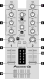
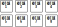

Pioneer DDJ-SB3
===============

.. sectionauthor::
   Javier Vilalta <javier at dancephy.com>

.. figure:: ../../_static/controllers/pioneer_ddj_sb3.svg
   :align: center
   :width: 100%
   :figwidth: 100%
   :alt: Pioneer DDJ-SB3 (schematic view)
   :figclass: pretty-figures

   Pioneer DDJ-SB3 (schematic view)

The Pioneer DDJ-SB3 is a 4 deck USB DJ controller.

-  `Manufacturer's Product Page <https://www.pioneerdj.com/en-us/product/controller/ddj-sb3/black/overview/>`__
-  `Manufacturer's User Manual <https://docs.pioneerdj.com/Manuals/DDJ_SB3_DRI1533A_manual/>`__
-  `Manufacturer's Firmware Update <https://www.pioneerdj.com/en-us/product/controller/ddj-sb3/black/support/>`__
-  `Mixxx User Forum <https://mixxx.discourse.group/t/pioneer-ddj-sb3-mapping-v1-0-now-available/22186>`__

.. versionadded:: 2.3.2

Audio Setup
-----------

The mapping relies on the following channel assignments:

===================== ================
Output Channels       Assigned to
===================== ================
1-2                   Master
3-4                   Headphones
===================== ================

This controller mapping does not support any inputs. The controller itself has a microphone input, but that cannot be controlled via MIDI or routed to the computer.

Controller Mapping
------------------

A schematic drawing with the control numbers that are used here can be found on the specified page in the User Manual in the Links section.

.. _pioneer-ddj-sb3-decks:

Deck section (p. 6)
~~~~~~~~~~~~~~~~~~~

   Deck section (p. 6)

===  =================================================  ============================================================================================
No.  Control                                            Function
===  =================================================  ============================================================================================
1    :hwlabel:`TEMPO` slider                            Adjust track playing speed (can be adjusted via :hwlabel:`SYNC`)
2    Jog Wheel (top)                                    Pitch bend (nudge) or scratch when vinyl mode is enabled
2    Jog Wheel (outer)                                  Pitch bend (nudge)
2    :hwlabel:`SHIFT` + Jog Wheel (top)                 Fast-forward or fast reverse track
3    :hwlabel:`HOT CUE`                                 Set hot cue mode
3    :hwlabel:`SHIFT` + :hwlabel:`HOT CUE`              Set BEAT JUMP mode
4    :hwlabel:`FX FADE`                                 Set FX fade mode
4    :hwlabel:`SHIFT` + :hwlabel:`FX FADE`              Set roll mode
5    :hwlabel:`PAD SCRATCH`                             Set pad scratch mode
5    :hwlabel:`SHIFT` + :hwlabel:`PAD SCRATCH`          Set slicer mode
6    :hwlabel:`SAMPLER`                                 Set sampler mode
6    :hwlabel:`SHIFT` + :hwlabel:`SAMPLER`              Set trans mode
7    :hwlabel:`VINYL`                                   Toggle vinyl mode
7    :hwlabel:`SHIFT` + :hwlabel:`VINYL`                Toggle slip mode
8    :hwlabel:`AUTO LOOP`                               Toggle auto loop
8    :hwlabel:`SHIFT` + :hwlabel:`AUTO LOOP`            Cancel loop or reloop
9    :hwlabel:`2X`                                      Double loop length
10   :hwlabel:`1/2X`                                    Halve loop length
11   Pad 1 - 8                                          Perform different functions depending on current mode
12   :hwlabel:`PLAY/PAUSE` button                       Play / pause
12   :hwlabel:`SHIFT` + :hwlabel:`PLAY/PAUSE` button    Return to temporary cue point
13   :hwlabel:`CUE` button                              Set, play and call out cue points
13   :hwlabel:`SHIFT` + :hwlabel:`CUE` button           Return to the beginning of the song
14   :hwlabel:`SYNC` button                             Match tempo and phase to currently playing deck
15   :hwlabel:`SHIFT` + button                          Switch function of controls
16   :hwlabel:`DECK X`                                  Switch deck
17   :hwlabel:`KEY LOCK`                                Toggle key lock
17   :hwlabel:`SHIFT` + :hwlabel:`KEY LOCK`             Toggle tempo slider range
===  =================================================  ============================================================================================

.. _pioneer-ddj-sb3-mixer:

Mixer section (p. 8)
~~~~~~~~~~~~~~~~~~~~~

   Mixer section (p. 8)

===  =====================================================  ============================================================================================
No.  Control                                                Function
===  =====================================================  ============================================================================================
1    :hwlabel:`TRIM` knob                                   Adjust individual channel output gain
2    :hwlabel:`HI`/:hwlabel:`MID`/:hwlabel:`LOW` knobs      Adjust high/mid/low-frequencies
3    :hwlabel:`FILTER` knob                                 Low pass / high pass filter for each channel
4    :hwlabel:`HEADPHONE CUE 1` button                      Toggle headphone pre-fader listening of left deck.
4    :hwlabel:`HEADPHONE CUE 2` button                      Toggle headphone pre-fader listening of right deck.
5    Channel faders                                         Adjust the output level for each channel
5    :hwlabel:`SHIFT` Channel faders                        Fader start and adjust the output level for each channel
6    Cross fader                                            Fade between left and right deck
7    :hwlabel:`MASTER` knob                                 Adjust master output level. This changes the master output level directly on the
                                                            controller's audio interface. The MAIN knob on the Mixxx UI will not change.
8    :hwlabel:`HEADPHONES` knob                             Adjust headphones output level. This changes the headphones' output level directly on the
                                                            controller's audio interface. The HEAD knob on the Mixxx UI will not change.
9    :hwlabel:`MASTER` button                               Output master to headphones
===  =====================================================  ============================================================================================

.. _pioneer-ddj-sb3-effects:

Effect section (p. 8)
~~~~~~~~~~~~~~~~~~~~~

   Effects section (p. 8)

===  =====================================================  ============================================================================================
No.  Control                                                Function
===  =====================================================  ============================================================================================
1    :hwlabel:`1` button                                    Turns the effect on/off
1    :hwlabel:`SHIFT`:hwlabel:`1` button                    Focuses the effect
2    :hwlabel:`2` button                                    Turns the effect on/off
2    :hwlabel:`SHIFT`:hwlabel:`2` button                    Focuses the effect
3    :hwlabel:`3` button                                    Turns the effect on/off
3    :hwlabel:`SHIFT`:hwlabel:`2` button                    Focuses the effect
4    :hwlabel:`LEVEL` knob                                  Adjusts the mix of the dry and wet signal of the effect unit
===  =====================================================  ============================================================================================

.. _pioneer-ddj-sb3-browser:

Browser section (p. 13)
~~~~~~~~~~~~~~~~~~~~~~~

   Browser section (p. 13)

===  =====================================================  ============================================================================================
No.  Control                                                Function
===  =====================================================  ============================================================================================
1    :hwlabel:`LOAD` button                                    Loads track highlighted in the library to the left or right deck
2    :hwlabel:`BROWSE` knob (rotate)                        Rotate the knob left or right highlights the previous or next track in the library
2    :hwlabel:`BROWSE` knob (press)                         Starts / stops track preview of highlighted track
===  =====================================================  ============================================================================================

Performance Pads
~~~~~~~~~~~~~~~~

You can use the Pad Mode Select buttons to select a mode for the
performance pads. Performance pads are numbered from top left to bottom right. First row is 1-4 and the second row is 5-8.
Press shift and the pad mode select button to access other pad modes.

Hot Cue Mode
^^^^^^^^^^^^
Hot Cue mode is enabled by pressing the :hwlabel:`HOT CUE` button. The button will light up when selected.

   Pioneer DDJ-SB3 (performance pads in hot cue mode)

Bookmark positions in the track and jump to them.

========  ===============================================================  ==========================================
No.       Control                                                          Function
========  ===============================================================  ==========================================
1-8       Pad (unlit)                                                      Save current position as hot cue.
1-8       Pad (lit)                                                        Jump to hot cue.
1-8       :hwlabel:`SHIFT` + Pad (lit)                                     Clear hot cue.
========  ===============================================================  ==========================================

Beatjump Mode
^^^^^^^^^^^^^
Beatjump mode is enabled by holding :hwlabel:`SHIFT` down and pressing the :hwlabel:`HOT CUE` button. The
button will flash when selected. Use beatjump mode to jump back or forward on the track by a certain number of beats.

.. figure:: ../../_static/controllers/pioneer_ddj_sb3_beatjump.svg
   :align: center
   :width: 65%
   :figwidth: 100%
   :alt: Pioneer DDJ-SB3 (performance pads in beatjump mode)
   :figclass: pretty-figures

   Pioneer DDJ-SB3 (performance pads in beatjump mode)

========  ===============================================================  ==========================================
No.       Control                                                          Function
========  ===============================================================  ==========================================
1         Pad                                                              Decrease beatjump size
2         Pad                                                              Increase beatjump size
3         Pad                                                              Jump left
4         Pad                                                              Jump right
5         Pad                                                              Go back to beginning of track
6         Pad                                                              Search left
7         Pad                                                              Search right
8         Pad                                                              Censor
========  ===============================================================  ==========================================

FX Fade Mode
^^^^^^^^^^^^
FX Fade mode is enabled by pressing the :hwlabel:`FX FADE` button. The button will light up when selected. FX fade is
a set of functions built-in to the controller.

   Pioneer DDJ-SB3 (Fade mode performance pads)

========  ===============================================================  ==========================================
No.       Control                                                          Function
========  ===============================================================  ==========================================
1         Pad (unlit)                                                      Applies a high-pass filter from off to max
1         Pad (blinking)                                                   Turn off filter
2         Pad (unlit)                                                      Applies a low-pass filter from off to max
2         Pad (blinking)                                                   Turn off filter
3         Pad (unlit)                                                      Apply 1 beat auto-loop and lower volume
3         Pad (blinking)                                                   Turn off loop and restore volume
4         Pad                                                              Perform a back-spin and resume
5         Pad                                                              Same as pad 1 but over more time
6         Pad                                                              Same as pad 2 but over more time
7         Pad                                                              Auto-loop with exponential size reduction
8         Pad                                                              Same as 4 but with a longer back-spin
========  ===============================================================  ==========================================

Loop Roll Mode
^^^^^^^^^^^^^^
Loop roll mode is enabled by holding :hwlabel:`SHIFT` down and by pressing the :hwlabel:`FX FADE` button. The button will
blink when selected. Press one of the pads to trigger a momentary loop roll. Once the pad is released, the track will
resume playing.

   Pioneer DDJ-SB3 (performance pads in loop roll mode)

========  ===============================================================  ==========================================
No.       Control                                                          Function
========  ===============================================================  ==========================================
1         Pad                                                              1/16 beat loop roll
2         Pad                                                              1/8 beat loop roll
3         Pad                                                              1/4 beat loop roll
4         Pad                                                              1/2 beat loop roll
5         Pad                                                              1 beat loop roll
6         Pad                                                              2 beat loop roll
7         Pad                                                              4 beat loop roll
8         Pad                                                              8 beat loop roll
========  ===============================================================  ==========================================

Pad Scratch Mode
^^^^^^^^^^^^^^^^
Pad scratch mode is enabled by pressing the :hwlabel:`PAD SCRATCH` button. The button will
light up when selected. Press one of the pads to trigger one of the built in scratches.

   Pioneer DDJ-SB3 (performance pads in pad scratch mode)

Slicer Mode
^^^^^^^^^^^
Slicer mode is enabled by holding :hwlabel:`SHIFT` down and by pressing the :hwlabel:`PAD SCRATCH` button. The button will
blink when selected. In this mode every pad represents a marker in the beat grid. Each pad will light up
as each slice is played. Press a pad to repeat the slice and hold the pad down to loop it.

.. figure:: ../../_static/controllers/pioneer_ddj_sb3_slicer.svg
   :align: center
   :width: 65%
   :figwidth: 100%
   :alt: Pioneer DDJ-SB3 (performance pads in slicer mode)
   :figclass: pretty-figures

   Pioneer DDJ-SB3 (performance pads in slicer mode)

Sampler Mode
^^^^^^^^^^^^
Sampler mode is enabled by pressing the :hwlabel:`SAMPLER` button. The button will
light up when selected.

.. figure:: ../../_static/controllers/pioneer_ddj_sb3_sampler.svg
   :align: center
   :width: 65%
   :figwidth: 100%
   :alt: Pioneer DDJ-SB3 (performance pads in sampler mode)
   :figclass: pretty-figures

   Pioneer DDJ-SB3 (performance pads in sampler mode)

========  ===============================================================  ==========================================
No.       Control                                                          Function
========  ===============================================================  ==========================================
1         Pad                                                              Play sample 1
1         :hwlabel:`SHIFT` + Pad                                           Stop sample 1
2         Pad                                                              Play sample 2
2         :hwlabel:`SHIFT` + Pad                                           Stop sample 2
3         Pad                                                              Play sample 3
3         :hwlabel:`SHIFT` + Pad                                           Stop sample 3
4         Pad                                                              Play sample 4
4         :hwlabel:`SHIFT` + Pad                                           Stop sample 4
5         Pad                                                              Load sample 1
5         :hwlabel:`SHIFT` + Pad                                           Unload sample 1
6         Pad                                                              Load sample 2
6         :hwlabel:`SHIFT` + Pad                                           Unload sample 2
7         Pad                                                              Load sample 3
7         :hwlabel:`SHIFT` + Pad                                           Unload sample 3
8         Pad                                                              Load sample 4
8         :hwlabel:`SHIFT` + Pad                                           Unload sample 4
========  ===============================================================  ==========================================

Trans Mode
^^^^^^^^^^
Trans mode is enabled by holding :hwlabel:`SHIFT` down and by pressing the :hwlabel:`SAMPLER` button. The button will
blink when selected. Press one of the pads to trigger one of the built in cut effects. This mode is driven entirely
by the controller's firmware, so there is no equivalent in the Mixxx UI. In this mode, pressing and holding a pad
triggers a Cut Effect, where the deck's fader volume is toggle from 0 to max at the rate described in the table below.
For example, pressing and holding pad 5 will cause the volume to toggle from max to min every one beat.

   Pioneer DDJ-SB3 (performance pads in trans mode)

   ========  ===============================================================  ==========================================
   No.       Control                                                          Function
   ========  ===============================================================  ==========================================
   1         Pad                                                              1/16 beat cut effect
   2         Pad                                                              1/8 beat cut effect
   3         Pad                                                              1/4 beat cut effect
   4         Pad                                                              1/2 beat cut effect
   5         Pad                                                              1 beat cut effect
   6         Pad                                                              2 beat cut effect
   7         Pad                                                              1/3 beat cut effect
   8         Pad                                                              Manual cut effect
   ========  ===============================================================  ==========================================
