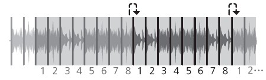

Pioneer DDJ-SX
==============

The Pioneer DDJ-SX is a 4 deck all-in-one controller that provides intuitive control of all of Mixxx’s features. The DDJ-SX mapping `reportedly works with the
DDJ-SX2 <https://mixxx.discourse.group/t/pioneer-ddj-sx-controller-mapping/15954/22>`__, but it does not use the new features of the DDJ-SX2 hardware.

-  `Manufacturer’s product page <https://www.pioneerdj.com/en/product/controller/archive/ddj-sx/black/overview/>`__
-  `Forum thread <https://mixxx.discourse.group/t/pioneer-ddj-sx-controller-mapping/15954>`__
-  `User Manual <https://support.pioneerdj.com/hc/en-us/articles/22976453073305-How-to-use-the-Pioneer-DJ-DDJ-SX-DJ-Controller-Instruction-manual>`__

.. versionadded:: 2.1

User Options
------------

To change the mapping’s user options, you have to open the script file (*.js). At the top of the file under **USER OPTIONS** the following settings can be made:

-  **PioneerDDJSX.jogwheelSensivity**: Sets the jogwheel sensitivity. 1 = default, 2 is twice as sensitive, 0.5 is half as sensitive.
-  **PioneerDDJSX.jogwheelShiftMultiplier**: Sets how much more sensitive the jogwheels get when holding :hwlabel:`SHIFT`. Set it to 1 to disable jogwheel sensitivity increase when holding :hwlabel:`SHIFT`.
-  **PioneerDDJSX.twinkleVumeterAutodjOn**: If true, level-meter twinkles if *AutoDJ* is enabled.
-  **PioneerDDJSX.autoDJAddTop**: If true, the selected track will be added to *AutoDJ* queue-top on pressing :hwlabel:`ROTARY SELECTOR`, else the selected track will be added to *AutoDJ* queue-bottom.
-  **PioneerDDJSX.autoDJTickInterval**: Sets the duration of sleeping between *AutoDJ* actions if *AutoDJ* is enabled [ms].
-  **PioneerDDJSX.autoDJMaxBpmAdjustment**: Sets the maximum adjustment of BPM allowed for beats to sync if *AutoDJ* is enabled.
-  **PioneerDDJSX.autoDJShuffleAfterSkip**: If true, *AutoDJ* queue is being shuffled after skipping a track.
-  **PioneerDDJSX.jumpPreviewEnabled**: If true, by releasing the Rotary Selector, track in preview player jumps forward to ``jumpPreviewPosition``.
-  **PioneerDDJSX.jumpPreviewPosition**: Sets the preview player absolute position, being set at releasing Rotary Selector and if ``jumpPreviewEnabled`` enabled.
-  **PioneerDDJSX.samplerCueGotoAndPlay**: If true, pad press in :hwlabel:`SAMPLER PAD MODE` repeatedly causes *sampler* to play loaded track from cue-point, else it causes to play loaded track from the
   beginning.
-  **PioneerDDJSX.autoPFL**: If true, PFL / Cue (headphone) is being activated by loading a track into certain deck.

General Functions
-----------------

====================  ===============  =============================================  =================================================================================================================================
Group                 Figure           Control                                        Description
====================  ===============  =============================================  =================================================================================================================================
5 - BROWSER           2, 3, 4, 5       :hwlabel:`LOAD`                                Loads the selected track into the specific deck
5 - BROWSER           2                :hwlabel:`SHIFT` + :hwlabel:`LOAD`             AutoDJ - Toggle BPM sync
5 - BROWSER           3                :hwlabel:`SHIFT` + :hwlabel:`LOAD`             AutoDJ - Toggle Key sync
5 - BROWSER           1                Rotary Selector                                Move UP or DOWN the specified number of locations in Library (MoveVertical function)
5 - BROWSER           1                Rotary Selector (press)                        Equivalent to double clicking the currently selected item in Library (GoToItem function)
5 - BROWSER           1                :hwlabel:`SHIFT` + Rotary Selector             Move LEFT or RIGHT the specified number of locations in Library (MoveHorizontal function)
5 - BROWSER           1                :hwlabel:`SHIFT` + Rotary Selector (press)     Add track from Library to AutoDJ queue at top/bottom (see user options: default = at bottom)
5 - BROWSER           6                :hwlabel:`BACK`                                Currently focused pane changes in Library - previously focused pane will be focused (MoveFocusBackward function)
5 - BROWSER           6                :hwlabel:`SHIFT`  :hwlabel:`BACK`              Maximize view of Library
5 - BROWSER           7                :hwlabel:`LOAD PREPARE`                        Load selected track into PreviewDeck, jump to position (see user options) and play, else stop already playing track
3 - MIXER             1                Crossfader                                     Controls Mixxx crossfader, fades between deck 1, 3 and 2, 4
3 - MIXER             2                Channel fader                                  Controls deck volume
3 - MIXER             2                :hwlabel:`SHIFT`  Channel fader                Fader start (starts playing deck when rising deck volume)
3 - MIXER             3                TRIM                                           Controls deck gain
3 - MIXER             4                EQ HIGH                                        Controls deck’s equalizer/filter high frequencies
3 - MIXER             5                EQ MID                                         Controls deck’s equalizer/filter mid frequencies
3 - MIXER             6                EQ LOW                                         Controls deck’s equalizer/filter low frequencies
3 - MIXER             7                :hwlabel:`CUE`                                 Toggles PFL/Cue (headphones) for specific deck
3 - MIXER             7                :hwlabel:`SHIFT`  :hwlabel:`CUE`               BPM Tab function for specific deck
3 - MIXER             8                :hwlabel:`MASTER LEVEL`                        Controls the main output volume
3 - MIXER             9                :hwlabel:`MASTER CUE`                          Toggles main cue
3 - MIXER             9                :hwlabel:`SHIFT`  :hwlabel:`MASTER CUE`        Toggles split cue (headphones)
3 - MIXER             10               Crossfader Assign                              Crossfader assignment - deck to crossfader (left (A), right (B) or center (THRU))
3 - MIXER             13               :hwlabel:`HEADPHONES MIX`                      Controls headphone’s audio source (cue, main)
3 - MIXER             14               SAMPLER VOLUME                                 Controls volume of all available Sampler decks
3 - MIXER             15               :hwlabel:`BOOTH MONITOR LEVEL`                 Controls the booth output volume
4 - FRONT PANEL       1                Crossfader curve                               Controls Mixxx crossfader curve
4 - FRONT PANEL       2                :hwlabel:`INPUT SELECT`                        Controls deck source (PC, MIC, CD, PHONO, LINE)
1 - DECK              25               :hwlabel:`PANEL SELECT`                        Show/hide Sampler decks / Effect rack
====================  ===============  =============================================  =================================================================================================================================

.. note::
   The :hwlabel:`MASTER LEVEL`, :hwlabel:`MASTER CUE`, :hwlabel:`HEADPHONE MIX`, :hwlabel:`BOOTH MONITOR LEVEL` and :hwlabel:`INPUT SELECT` controls directly affect the controller’s sound card, so adjusting these will not change anything on screen in Mixxx.

Deck Functions
--------------

The controls listed here are documented in Section 1 ("Deck") of the owner's manual.

===============  =============================================  =================================================================================================================================
Figure           Control                                        Description
===============  =============================================  =================================================================================================================================
1                :hwlabel:`PLAY/PAUSE`                          Toggles play/pause (hold pressed while playing: starts brake effect -> release: pause track, press while stopped: starts playback)
1                :hwlabel:`SHIFT` + :hwlabel:`PLAY/PAUSE`       Toggles play stutter
2                :hwlabel:`CUE`                                 Toggles default cue (sets cue point/ goes to cue point)
2                :hwlabel:`SHIFT` + :hwlabel:`CUE`              Jump to the beginning of the track and stop
3                Jog Wheel (platter)                            Vinyl-Mode enabled: performs scratching when pressed and rotated, Vinyl-Mode disabled: performs pitch bend
3                :hwlabel:`SHIFT` + Jog Wheel (platter)         Vinyl-Mode enabled: performs scratching considering user-options multiplier when touched and rotated, Vinyl-Mode disabled: performs pitch bend considering user-options multiplier
3                Jog Wheel (side)                               Performs pitch bend when rotated
3                :hwlabel:`SHIFT` + Jog Wheel (side)            Performs pitch bend when rotated considering user-options multiplier
4                :hwlabel:`TEMPO`                               Controls pitch/tempo ratio
5                :hwlabel:`KEYLOCK`                             Toggles keylock
5                :hwlabel:`SHIFT` + :hwlabel:`KEYLOCK`          Changes :hwlabel:`TEMPO` slider range: Doubles the *rateRange*, starting from the value set up in the Mixxx settings, until 100% is reached. On the next press *rateRange* jumps back to its original value.
5                :hwlabel:`KEYLOCK` (long press)                Toggles pitch/tempo reset
6                :hwlabel:`NEEDLE SEARCH`                       Jumps to equivalent absolute position in track if track is stopped.
6                :hwlabel:`SHIFT` + :hwlabel:`NEEDLE SEARCH`    Jumps to equivalent absolute position in track while track is playing.
7                :hwlabel:`DECK 1`                              Switches left deck to DECK 1 control and illumination
8                :hwlabel:`DECK 2`                              Switches right deck to DECK 2 control and illumination
9                :hwlabel:`DECK 3`                              Switches left deck to DECK 3 control and illumination
10               :hwlabel:`DECK 4`                              Switches right deck to DECK 4 control and illumination
11               :hwlabel:`DUAL DECK`                           Toggles left deck to dual deck control and illumination (DECK 1 and 3)
12               :hwlabel:`DUAL DECK`                           Toggles right deck to dual deck control and illumination (DECK 2 and 4)
13               :hwlabel:`SYNC`                                Toggles deck sync
13               :hwlabel:`SHIFT` + :hwlabel:`SYNC`             Toggles quantize function
14               :hwlabel:`AUTO LOOP`                           Set and enable beat loop
14               :hwlabel:`SHIFT`    :hwlabel:`AUTO LOOP`       Activates / Deactivates current loop
15               :hwlabel:`LOOP 1/2X`                           Halves active loop
15               :hwlabel:`SHIFT`    :hwlabel:`LOOP 1/2X`       Moves active loop one beat backward (left)
16               :hwlabel:`LOOP 2X`                             Doubles active loop
15               :hwlabel:`SHIFT`    :hwlabel:`LOOP 2X`         Moves active loop one beat forward (right)
17               :hwlabel:`LOOP IN`                             Toggles loop in
17               :hwlabel:`SHIFT`    :hwlabel:`LOOP IN`         Activates current loop, jumps to its loop in point and stops playback.
18               :hwlabel:`LOOP OUT`                            Toggles loop out
18               :hwlabel:`SHIFT`    :hwlabel:`LOOP OUT`        Toggles reloop / exit loop
19               :hwlabel:`VINYL`                               Toggles vinyl (scratch) mode
20               :hwlabel:`CENSOR`                              Toggles reverse roll play
20               :hwlabel:`SHIFT`    :hwlabel:`CENSOR`          Toggles reverse play
21               :hwlabel:`SLIP`                                Toggles slip mode
22               :hwlabel:`GRID ADJUST`                         Hold and touch/rotate Jog dial to adjust beats faster/slower
22               :hwlabel:`SHIFT`    :hwlabel:`GRID ADJUST`     Set/translate beat grid to current track position (adjust position with Jog dial)
23               :hwlabel:`GRID SLIDE`                          Hold and touch/rotate Jog dial to set/translate beat grid earlier/later
24               :hwlabel:`SHIFT`                               Switches to shifted controls, no direct function
===============  =============================================  =================================================================================================================================

Performance Pads
----------------

The performance pads support multiple different modes.
The controls listed here are documented in Section 6 ("Performance Pads") of the owner's manual.

===============  =============================================  =================================================================================================================================
Figure           Control                                        Description
===============  =============================================  =================================================================================================================================
9                :hwlabel:`HOT CUE` mode                        Switches pad control and illumination to :ref:`HOT CUE mode <pioneer-ddj-sx-hotcuemode>`
10               :hwlabel:`ROLL` mode                           Switches pad control and illumination to :ref:`BEATLOOP ROLL mode <pioneer-ddj-sx-rollmode>`
10               :hwlabel:`SHIFT` + :hwlabel:`ROLL` mode        Switches pad control and illumination to :ref:`GROUP2 (BEATLOOP) mode <pioneer-ddj-sx-beatloopmode>`
11               :hwlabel:`SLICER` mode                         Switches pad control and illumination to :ref:`SLICER mode <pioneer-ddj-sx-slicermode>`, in SLICER mode switches between continuous slice mode and loop slice mode
12               :hwlabel:`SAMPLER` mode                        Switches pad control and illumination to :ref:`SAMPLER mode <pioneer-ddj-sx-samplermode>`
12               :hwlabel:`SAMPLER` mode (long press)           Toggles sampler pad velocity mode (velocity ~ volume)
===============  =============================================  =================================================================================================================================

.. _pioneer-ddj-sx-hotcuemode:

HOT CUE Mode
~~~~~~~~~~~~

===============  =============================================  =================================================================================================================================
Figure           Control                                        Description
===============  =============================================  =================================================================================================================================
1                :hwlabel:`PAD 1`                               Set/activate Hot cue 1
1                :hwlabel:`SHIFT` + :hwlabel:`PAD 1`            Clear Hot cue 1
2                :hwlabel:`PAD 2`                               Set/activate Hot cue 2
2                :hwlabel:`SHIFT` + :hwlabel:`PAD 2`            Clear Hot cue 2
3                :hwlabel:`PAD 3`                               Set/activate Hot cue 3
3                :hwlabel:`SHIFT` + :hwlabel:`PAD 3`            Clear Hot cue 3
4                :hwlabel:`PAD 4`                               Set/activate Hot cue 4
4                :hwlabel:`SHIFT` + :hwlabel:`PAD 4`            Clear Hot cue 4
5                :hwlabel:`PAD 5`                               Set/activate Hot cue 5
5                :hwlabel:`SHIFT` + :hwlabel:`PAD 5`            Clear Hot cue 5
6                :hwlabel:`PAD 6`                               Set/activate Hot cue 6
6                :hwlabel:`SHIFT` + :hwlabel:`PAD 6`            Clear Hot cue 6
7                :hwlabel:`PAD 7`                               Set/activate Hot cue 7
7                :hwlabel:`SHIFT` + :hwlabel:`PAD 7`            Clear Hot cue 7
8                :hwlabel:`PAD 8`                               Set/activate Hot cue 8
8                :hwlabel:`SHIFT` + :hwlabel:`PAD 8`            Clear Hot cue 8
13               :hwlabel:`PARAMETER LEFT`                      Jump *beatjump_size* beats backward
13               :hwlabel:`SHIFT` + :hwlabel:`PARAMETER LEFT`   Increase *beatjump_size*
14               :hwlabel:`PARAMETER RIGHT`                     Jump *beatjump_size* beats forward
14               :hwlabel:`SHIFT` + :hwlabel:`PARAMETER RIGHT`  Decrease *beatjump_size*
===============  =============================================  =================================================================================================================================

.. _pioneer-ddj-sx-rollmode:

BEATLOOP ROLL Mode
~~~~~~~~~~~~~~~~~~

By using the :hwlabel:`PARAMETER LEFT` and :hwlabel:`PARAMETER RIGHT` buttons in BEATLOOP ROLL (default parameter set: 2), you can change the pad-assigned loop size.
The following table shows the possible assignments (unit: beats).

======= ===== ===== ===== ===== ===== ===== ===== =====
Set No. Pad 1 Pad 2 Pad 3 Pad 4 Pad 5 Pad 6 Pad 7 Pad 8
======= ===== ===== ===== ===== ===== ===== ===== =====
0       1/4   1/2   1     2     4     8     16    32
1       1/8   1/4   1/2   1     2     4     8     16
2       1/16  1/8   1/4   1/2   1     2     4     8
3       1/32  1/16  1/8   1/4   1/2   1     2     4
======= ===== ===== ===== ===== ===== ===== ===== =====

===============  =============================================  =================================================================================================================================
Figure           Control                                        Description
===============  =============================================  =================================================================================================================================
1                :hwlabel:`PAD 1`                               Toggle Beatloop roll length index 1 (according parameter set)
2                :hwlabel:`PAD 2`                               Toggle Beatloop roll length index 2 (according parameter set)
3                :hwlabel:`PAD 3`                               Toggle Beatloop roll length index 3 (according parameter set)
4                :hwlabel:`PAD 4`                               Toggle Beatloop roll length index 4 (according parameter set)
5                :hwlabel:`PAD 5`                               Toggle Beatloop roll length index 5 (according parameter set)
6                :hwlabel:`PAD 6`                               Toggle Beatloop roll length index 6 (according parameter set)
7                :hwlabel:`PAD 7`                               Toggle Beatloop roll length index 7 (according parameter set)
8                :hwlabel:`PAD 8`                               Toggle Beatloop roll length index 8 (according parameter set)
13               :hwlabel:`PARAMETER LEFT`                      Decrement active looproll-interval parameter set (0-3), button LED is illuminated at parameter set 2, 3
14               :hwlabel:`PARAMETER RIGHT`                     Increment active looproll-interval parameter set (0-3), button LED is illuminated at parameter set 1, 3
===============  =============================================  =================================================================================================================================

.. _pioneer-ddj-sx-slicermode:

SLICER Mode
~~~~~~~~~~~

For a detailed explanation of the slicer mode, take a look at the controller’s manual.
A limited slicer functionality is implemented into the controller mapping as described below.

There are two slicer modes, continuous slice and loop slice, which can be selected by pressing the :hwlabel:`SLICER` mode button. If none or only one pad (beat) is lit, continuous slice mode is active. If
you press :hwlabel:`SLICER` mode button again, loop slice mode will be activated and all pads, except one for the beat, will light up.

Starting with the first beat marked on a playing track, the track is divided into sections of 8 equal parts (not visible in waveform). If the first 8 parts are reached, the next section starts. The
pads are assigned to one section, each time the active section changes, the pads will be assigned to the new active section (pad 1..8 = section part 1..8). The section size is dependent of the
selected slicer domain, changeable by pressing :hwlabel:`SHIFT` + :hwlabel:`PARAMETER LEFT` or :hwlabel:`PARAMETER RIGHT`. The default slicer domain is 8 beats, so each part represents the part between one beat and
the following beat. Possible slicer domains are 8, 16, 32, 64 beats.

===============  =============================================  =================================================================================================================================
Figure           Control                                        Description
===============  =============================================  =================================================================================================================================
1                :hwlabel:`PAD 1`                               Press: Jumps to beat position 1 in 8-beat-section and beat loops according quantization index (default: 1/4 beat), Release (continuous slice only): Jumps to actual play position in the background (slip).
2                :hwlabel:`PAD 2`                               Press: Jumps to beat position 2 in 8-beat-section and beat loops according quantization index (default: 1/4 beat), Release (continuous slice only): Jumps to actual play position in the background (slip).
3                :hwlabel:`PAD 3`                               Press: Jumps to beat position 3 in 8-beat-section and beat loops according quantization index (default: 1/4 beat), Release (continuous slice only): Jumps to actual play position in the background (slip).
4                :hwlabel:`PAD 4`                               Press: Jumps to beat position 4 in 8-beat-section and beat loops according quantization index (default: 1/4 beat), Release (continuous slice only): Jumps to actual play position in the background (slip).
5                :hwlabel:`PAD 5`                               Press: Jumps to beat position 5 in 8-beat-section and beat loops according quantization index (default: 1/4 beat), Release (continuous slice only): Jumps to actual play position in the background (slip).
6                :hwlabel:`PAD 6`                               Press: Jumps to beat position 6 in 8-beat-section and beat loops according quantization index (default: 1/4 beat), Release (continuous slice only): Jumps to actual play position in the background (slip).
7                :hwlabel:`PAD 7`                               Press: Jumps to beat position 7 in 8-beat-section and beat loops according quantization index (default: 1/4 beat), Release (continuous slice only): Jumps to actual play position in the background (slip).
8                :hwlabel:`PAD 8`                               Press: Jumps to beat position 8 in 8-beat-section and beat loops according quantization index (default: 1/4 beat), Release (continuous slice only): Jumps to actual play position in the background (slip).
13               :hwlabel:`PARAMETER LEFT`                      Decrement active slicer quantization (1/8, 1/4, 1/2, 1 beat loop), button LED is illuminated at quantization 1/2, 1
13               :hwlabel:`SHIFT` + :hwlabel:`PARAMETER LEFT`   Decrement active slicer domain (8, 16, 32, 64 beats), button LED is illuminated at domain 32, 64
14               :hwlabel:`PARAMETER RIGHT`                     Increment active slicer quantization (1/8, 1/4, 1/2, 1 beat loop), button LED is illuminated at quantization 1/4, 1
14               :hwlabel:`SHIFT` + :hwlabel:`PARAMETER RIGHT`  Increment active slicer domain (8, 16, 32, 64 beats), button LED is illuminated at domain 16, 64
===============  =============================================  =================================================================================================================================

Continuous slice mode
^^^^^^^^^^^^^^^^^^^^^

The pad lights show the active part in the active section: The active part pad is lit, all other pad lights are off.

Continuous slice mode moves to the next section if the end of the previous active section is reached.

   Pioneer DDJ SX Slicer (type 1)

By pressing pad X, the play position jumps to the beat X of the active section. If you have pressed the pad on-beat and hold it, the play position is playing in loop. The beat loop length depends on
the selected slicer quantization (changeable by pressing :hwlabel:`PARAMETER LEFT` or :hwlabel:`PARAMETER RIGHT`). If you release the pad, the playback will resume where the track would have been if the slicer
wouldn’t have been activated (slip mode).

Loop slice mode
^^^^^^^^^^^^^^^

The pad lights show the active part in the active section: The active part pad light is off, all other pads are lit.

As soon as loop slice mode is activated, the active section is played in loop (not visible in waveform). If the end of the active section is reached, the play position jumps back to the beginning of
the active section.

.. figure:: ../../_static/controllers/pioneer_ddj_sx_slicertype2.png
   :align: center
   :width: 100%
   :figwidth: 100%
   :alt: Pioneer DDJ SX Slicer (type 2)
   :figclass: pretty-figures

   Pioneer DDJ SX Slicer (type 2)

By pressing pad X, the play position jumps to the beat X of the active section. In loop slice mode beat loop is not possible.

As soon as loop slice mode is deactivated (by pressing :hwlabel:`SLICER` mode button again), the playback will resume where the track would have been if the slicer wouldn’t have been activated (slip mode).

.. _pioneer-ddj-sx-samplermode:

SAMPLER Mode
~~~~~~~~~~~~

===============  =============================================  =================================================================================================================================
Figure           Control                                        Description
===============  =============================================  =================================================================================================================================
1                :hwlabel:`PAD 1`                               Sample deck index 1 (according sampler bank) - empty: Load selected track into sample deck, track loaded: start play (default, see user options) sample deck
1                :hwlabel:`SHIFT` + hwlabel:`PAD 1`             Sample deck index 1 (according sampler bank) - playing: stop deck, stopped: eject track
2                :hwlabel:`PAD 2`                               Sample deck index 2 (according sampler bank) - empty: Load selected track into sample deck, track loaded: start play (default, see user options) sample deck
2                :hwlabel:`SHIFT` + hwlabel:`PAD 2`             Sample deck index 2 (according sampler bank) - playing: stop deck, stopped: eject track
3                :hwlabel:`PAD 3`                               Sample deck index 3 (according sampler bank) - empty: Load selected track into sample deck, track loaded: start play (default, see user options) sample deck
3                :hwlabel:`SHIFT` + hwlabel:`PAD 3`             Sample deck index 3 (according sampler bank) - playing: stop deck, stopped: eject track
4                :hwlabel:`PAD 4`                               Sample deck index 4 (according sampler bank) - empty: Load selected track into sample deck, track loaded: start play (default, see user options) sample deck
4                :hwlabel:`SHIFT` + hwlabel:`PAD 4`             Sample deck index 4 (according sampler bank) - playing: stop deck, stopped: eject track
5                :hwlabel:`PAD 5`                               Sample deck index 5 (according sampler bank) - empty: Load selected track into sample deck, track loaded: start play (default, see user options) sample deck
5                :hwlabel:`SHIFT` + hwlabel:`PAD 5`             Sample deck index 5 (according sampler bank) - playing: stop deck, stopped: eject track
6                :hwlabel:`PAD 6`                               Sample deck index 6 (according sampler bank) - empty: Load selected track into sample deck, track loaded: start play (default, see user options) sample deck
6                :hwlabel:`SHIFT` + hwlabel:`PAD 6`             Sample deck index 6 (according sampler bank) - playing: stop deck, stopped: eject track
7                :hwlabel:`PAD 7`                               Sample deck index 7 (according sampler bank) - empty: Load selected track into sample deck, track loaded: start play (default, see user options) sample deck
7                :hwlabel:`SHIFT` + hwlabel:`PAD 7`             Sample deck index 7 (according sampler bank) - playing: stop deck, stopped: eject track
8                :hwlabel:`PAD 8`                               Sample deck index 8 (according sampler bank) - empty: Load selected track into sample deck, track loaded: start play (default, see user options) sample deck
8                :hwlabel:`SHIFT` + hwlabel:`PAD 8`             Sample deck index 8 (according sampler bank) - playing: stop deck, stopped: eject track
13               :hwlabel:`PARAMETER LEFT`                      Decrement active sampler bank (0-3), button LED is illuminated at sampler bank 2, 3. Sampler bank 0: sampler 1-8, sampler bank 1: sampler 9-16 sampler bank 2: sampler 17-24, sampler bank 3: sampler 25-32
14               :hwlabel:`PARAMETER RIGHT`                     Increment active sampler bank (0-3), button LED is illuminated at sampler bank 1, 3. Sampler bank 0: sampler 1-8, sampler bank 1: sampler 9-16, sampler bank 2: sampler 17-24, sampler bank 3: sampler 25-32
===============  =============================================  =================================================================================================================================

.. _pioneer-ddj-sx-beatloopmode:

BEATLOOP Mode (GROUP2)
~~~~~~~~~~~~~~~~~~~~~~

By using the :hwlabel:`PARAMETER LEFT` and :hwlabel:`PARAMETER RIGHT` buttons in BEATLOOP mode (default parameter set: 0), you can change the pad-assigned loop size.
The following table shows the possible assignments (unit: beats).

======= ===== ===== ===== ===== ===== ===== ===== =====
Set No. Pad 1 Pad 2 Pad 3 Pad 4 Pad 5 Pad 6 Pad 7 Pad 8
======= ===== ===== ===== ===== ===== ===== ===== =====
0       1/4   1/2   1     2     4     8     16    32
1       1/8   1/4   1/2   1     2     4     8     16
2       1/16  1/8   1/4   1/2   1     2     4     8
3       1/32  1/16  1/8   1/4   1/2   1     2     4
======= ===== ===== ===== ===== ===== ===== ===== =====

===============  =============================================  =================================================================================================================================
Figure           Control                                        Description
===============  =============================================  =================================================================================================================================
1                :hwlabel:`PAD 1`                               Toggle Beatloop length index 1 (according parameter set)
2                :hwlabel:`PAD 2`                               Toggle Beatloop length index 2 (according parameter set)
3                :hwlabel:`PAD 3`                               Toggle Beatloop length index 3 (according parameter set)
4                :hwlabel:`PAD 4`                               Toggle Beatloop length index 4 (according parameter set)
5                :hwlabel:`PAD 5`                               Toggle Beatloop length index 5 (according parameter set)
6                :hwlabel:`PAD 6`                               Toggle Beatloop length index 6 (according parameter set)
7                :hwlabel:`PAD 7`                               Toggle Beatloop length index 7 (according parameter set)
8                :hwlabel:`PAD 8`                               Toggle Beatloop length index 8 (according parameter set)
13               :hwlabel:`PARAMETER LEFT`                      Decrement active loop-interval parameter set (0-3), button LED is illuminated at parameter set 2, 3
14               :hwlabel:`PARAMETER RIGHT`                     Increment active loop-interval parameter set (0-3), button LED is illuminated at parameter set 1, 3
===============  =============================================  =================================================================================================================================

Effect Functions
----------------

This controller mapping uses the :ref:`standard Mixxx mapping for effects sections on controllers <controller-effects-mapping>`.
The controls listed here are documented in Section 2 ("Effects") of the owner's manual.

===============  ======================================  =================================================================================================================================
Figure           Control                                 Description
===============  ======================================  =================================================================================================================================
1 (L)            :hwlabel:`FX1-1`                        Focused effect none: Controls EffectRack1-EffectUnit1/3-Effect1 meta, Focused effect 1..3: Controls effect parameter 1 of  effect in EffectRack1-EffectUnit1/3
1 (L)            :hwlabel:`SHIFT` + :hwlabel:`FX1-1`     Controls effect selection for EffectRack1-EffectUnit1/3 effect 1
1 (R)            :hwlabel:`FX2-1`                        Focused effect none: Controls EffectRack1-EffectUnit2/4-Effect1 meta, Focused effect 1..3: Controls effect parameter 1 of focused effect in EffectRack1-EffectUnit2/4
1 (R)            :hwlabel:`SHIFT` + hwlabel:`FX2-1`      Controls effect selection for EffectRack1-EffectUnit2/4 effect 1
2 (L)            :hwlabel:`FX1-2`                        Focused effect none: Controls EffectRack1-EffectUnit1/3-Effect2 meta, Focused effect 1..3: Controls effect parameter 2 of focused effect in EffectRack1-EffectUnit1/3
2 (L)            :hwlabel:`SHIFT` + hwlabel:`FX1-2`      Controls effect selection for EffectRack1-EffectUnit1/3 effect 2
2 (R)            :hwlabel:`FX2-2`                        Focused effect none: Controls EffectRack1-EffectUnit2/4-Effect2 meta, Focused effect 1..3: Controls effect parameter 2 of focused effect in EffectRack1-EffectUnit2/4
2 (R)            :hwlabel:`SHIFT` + hwlabel:`FX2-2`      Controls effect selection for EffectRack1-EffectUnit2/4 effect 2
3 (L)            :hwlabel:`FX1-3`                        Focused effect none: Controls EffectRack1-EffectUnit1/3-Effect3 meta, Focused effect 1..3: Controls effect parameter 3 of focused effect in EffectRack1-EffectUnit1/3
3 (L)            :hwlabel:`SHIFT` + hwlabel:`FX1-3`      Controls effect selection for EffectRack1-EffectUnit1/3 effect 3
3 (R)            :hwlabel:`FX2-3`                        Focused effect none: Controls EffectRack1-EffectUnit2/4-Effect3 meta, Focused effect 1..3: Controls effect parameter 3 of focused effect in EffectRack1-EffectUnit2/4
3 (R)            :hwlabel:`SHIFT` + hwlabel:`FX2-3`      Controls effect selection for EffectRack1-EffectUnit2/4 effect 3
4 (L)            :hwlabel:`FX1 BEATS`                    Controls EffectRack1-EffectUnit1/3 mix
4 (R)            :hwlabel:`FX2 BEATS`                    Controls EffectRack1-EffectUnit2/4 mix
4 (L)            :hwlabel:`SHIFT` + hwlabel:`FX1 BEATS`  Controls EffectRack1-EffectUnit1/3 super1 knob
4 (R)            :hwlabel:`SHIFT` + hwlabel:`FX2 BEATS`  Controls EffectRack1-EffectUnit2/4 super1 knob
5 (L)            :hwlabel:`FX1-1 ON`                     EffectFocusButton press and hold: focus EffectRack1-EffectUnit1/3-Effect1, else: Toggles EffectRack1-EffectUnit1/3-Effect1
5 (R)            :hwlabel:`FX2-1 ON`                     EffectFocusButton press and hold: focus EffectRack1-EffectUnit2/4-Effect1, else: Toggles EffectRack1-EffectUnit2/4-Effect1
6 (L)            :hwlabel:`FX1-2 ON`                     EffectFocusButton press and hold: focus EffectRack1-EffectUnit1/3-Effect2, else: Toggles EffectRack1-EffectUnit1/3-Effect2
6 (R)            :hwlabel:`FX2-2 ON`                     EffectFocusButton press and hold: focus EffectRack1-EffectUnit2/4-Effect2, else: Toggles EffectRack1-EffectUnit2/4-Effect2
7 (L)            :hwlabel:`FX1-3 ON`                     EffectFocusButton press and hold: focus EffectRack1-EffectUnit1/3-Effect3, else: Toggles EffectRack1-EffectUnit1/3-Effect3
7 (R)            :hwlabel:`FX2-3 ON`                     EffectFocusButton press and hold: focus EffectRack1-EffectUnit2/4-Effect3, else: Toggles EffectRack1-EffectUnit2/4-Effect3
8 (L)            :hwlabel:`FX1 TAP`                      EffectFocusButton of EffectRack1-EffectUnit1/3
8 (R)            :hwlabel:`FX2 TAP`                      EffectFocusButton of EffectRack1-EffectUnit2/4
8 (L)            :hwlabel:`SHIFT` + hwlabel:`FX1 TAP`    Switch EffectUnit 1 <-> 3
8 (R)            :hwlabel:`SHIFT` + hwlabel:`FX2 TAP`    Switch EffectUnit 2 <-> 4
9, 10, 11, 12    :hwlabel:`FX1 ASSIGN`                   Assign EffectRack1-EffectUnit1/3 to specific deck
13, 14, 15, 16   :hwlabel:`FX2 ASSIGN`                   Assign EffectRack1-EffectUnit2/4 to specific deck
17, 18, 19, 20   :hwlabel:`FILTER`                       Control QuickEffectRack1 super1 knob (e.g. moog filter)
===============  ======================================  =================================================================================================================================

Troubleshooting
---------------

If you experience any strange behavior of a button or a LED (e.g. wheel LEDs not working), make sure your controller is set up correctly to work with Mixxx. The DDJ-SX provides several settings, which
can be changed in a special *Utility-Mode*.

Utility-Mode
~~~~~~~~~~~~

-  Disconnect USB-cable.
-  Switch off :hwlabel:`STANDBY/ON` the unit.
-  Hold :hwlabel:`SHIFT` button and :hwlabel:`PLAY/PAUSE` button at the left deck while switching on the unit :hwlabel:`STANDBY/ON`.
-  Now *Utility-Mode* is activated.
-  For saving and exiting *Utility-Mode*, switch off the unit again :hwlabel:`STANDBY/ON`.

Setting for usage of Serato DJ
~~~~~~~~~~~~~~~~~~~~~~~~~~~~~~

To use the DDJ-SX with Mixxx, the controller must be configured for the usage of Serato DJ. You can check/change this setting by pressing the :hwlabel:`KEY LOCK` button at the left deck.

-  :hwlabel:`KEY LOCK` button off: Controller is configured for using Serato DJ (default).
-  :hwlabel:`KEY LOCK` button on (lit): Controller is configured for using different DJ-software.
