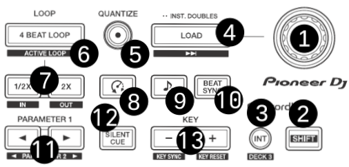
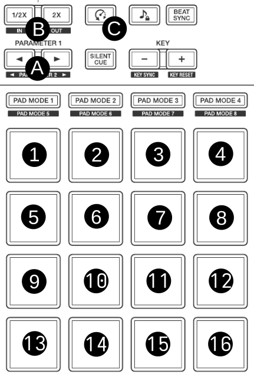
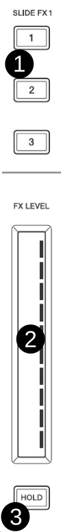

.. _pioneer-ddj-xp2:

###############
Pioneer DDJ-XP2
###############

.. sectionauthor::
   Rene Ejury <mixxx at absorb.it>

The Pioneer DDJ-XP2 is a 4 deck USB controller which has 2x 16 Pads accessible and a lot of functions.

-  `Manufacturer's Product Page <https://www.pioneerdj.com/en-gb/product/controller/ddj-xp2/black/overview/>`__
-  `Manufacturer's User Manual <http://docs.pioneerdj.com/Manuals/DDJ_XP2_DRI1634A_manual/>`__
-  `Mixxx User Forum <https://mixxx.discourse.group/t/new-mapping-for-pioneer-ddj-xp2/33094>`__

.. versionadded:: 2.5

.. _pioneer-ddj-xp2-main:

************
Main section
************

   Main section

===  ===================================================  ============================================================================================
No.  Control                                              Function
===  ===================================================  ============================================================================================
1    Encoder Rotate                                       Move Up and Down in Library.
1    :hwlabel:`SHIFT` + Encoder Rotate                    Move Left and Right in Library.
1    Encoder Press Button                                 Change Library Window.
2    :hwlabel:`SHIFT`                                     Allow access to Secondary Functions.
3    :hwlabel:`INT` or :hwlabel:`SHIFT` + :hwlabel:`INT`  Switch to alternate Deck.
4    :hwlabel:`LOAD`                                      Load selected Track to current Deck.
4    :hwlabel:`SHIFT` + :hwlabel:`LOAD`                   Load selected Track to Preview Deck and Play.
4    Double-Click :hwlabel:`LOAD`                         Clone previous Deck into current one.
5    :hwlabel:`QUANTIZE`                                  Aligns Hot-cues and Loop In & Out to the next beat from the current position.
6    :hwlabel:`4 BEAT LOOP`                               Start or Stop a 4-beat loop at current position.
7    :hwlabel:`1/2x`                                      Decrease the Loop size by 2, halve the Loop length.
7    :hwlabel:`2x`                                        Increase the Loop size by 2, double the Loop length.
8    :hwlabel:`⏱`                                         Enables reverse and slip mode.
9    :hwlabel:`♪`                                         Enable key-lock for the specified deck (rate changes only affect tempo, not key).
10   :hwlabel:`BEAT SYNC`                                 Syncs the tempo and phase (depending on quantize) to that of the other track.
10   :hwlabel:`SHIFT` + :hwlabel:`BEAT SYNC`              Sets deck as leader clock.
11   Parameter :hwlabel:`<` or Parameter :hwlabel:`>`     Action dependent on the selected Pad Mode.
12   :hwlabel:`SILENT CUE`                                Mutes the channel.
13   Key :hwlabel:`+`                                     Increase the pitch of the track.
13   :hwlabel:`SHIFT` + Key :hwlabel:`+`                  Reset the pitch of the track to the original value.
13   Key :hwlabel:`-`                                     Decrease the pitch of the track.
13   :hwlabel:`SHIFT` + Key :hwlabel:`-`                  Match the key to the another track.
===  ===================================================  ============================================================================================

.. _pioneer-ddj-xp2-pads:

************
Pads section
************

   Pads section

=====================  ===================================================
Pad Mode Button        Default Function
=====================  ===================================================
:hwlabel:`PAD MODE 1`  :ref:`Hot Cue <pioneer-ddj-xp2-hotcue-mode>`
:hwlabel:`PAD MODE 2`  :ref:`Quick Effect <pioneer-ddj-xp2-quickeffect-mode>`
:hwlabel:`PAD MODE 3`  :ref:`Beat Jump <pioneer-ddj-xp2-beatjump-mode>`
:hwlabel:`PAD MODE 4`  :ref:`Sampler <pioneer-ddj-xp2-sampler-mode>`
:hwlabel:`PAD MODE 5`  :ref:`Key Pad <pioneer-ddj-xp2-keypad-mode>`
:hwlabel:`PAD MODE 6`  :ref:`Equalizer Effect <pioneer-ddj-xp2-equalizereffect-mode>`
:hwlabel:`PAD MODE 7`  :ref:`Beat Loop <pioneer-ddj-xp2-beatloop-mode>`
:hwlabel:`PAD MODE 8`  :ref:`Key Shift <pioneer-ddj-xp2-keyshift-mode>`
=====================  ===================================================

Additional non-default modes:

- :ref:`Slicer <pioneer-ddj-xp2-slicer-mode>`
- :ref:`Slicer Roll <pioneer-ddj-xp2-slicerroll-mode>`

.. _pioneer-ddj-xp2-hotcue-mode:

Hotcue Mode
===========

You can choose to use 8, 12 or 16 Hotcue Buttons in Hotcue Pad Mode. Beside, if you are using less than 12 Hotcue Pads per Deck, you can also add some Row with additional Play and Cue buttons.

a) 8 Hot-Cues (default)
-----------------------

=========================================================  ============================================================================================
Control                                                    Function
=========================================================  ============================================================================================
:hwlabel:`PAD 1` to :hwlabel:`PAD 8`                       Set or Play Hot Cue.
:hwlabel:`SHIFT` + :hwlabel:`PAD 1` to :hwlabel:`PAD 8`    Remove Hot Cue.
:hwlabel:`PAD 9`                                           Beat Jump Backwards the configured distance.
:hwlabel:`PAD 10`                                          Decrease the Beat Jump size by 2 (halve).
:hwlabel:`PAD 11`                                          Increase the Beat Jump size by 2 (double).
:hwlabel:`PAD 12`                                          Beat Jump Forward the configured distance.
:hwlabel:`PAD 13` to :hwlabel:`PAD 16`                     Left Deck: Control Sampler 1-4, Right Deck: Control Sampler 5-8. Load or Play Sample.
:hwlabel:`SHIFT` + :hwlabel:`PAD 13` to :hwlabel:`PAD 16`  Left Deck: Control Sampler 1-4, Right Deck: Control Sampler 5-8. Stop or Unload Sample.
=========================================================  ============================================================================================

b) 12 Hot-Cues
--------------

=========================================================  ============================================================================================
Control                                                    Function
=========================================================  ============================================================================================
:hwlabel:`PAD 1` to :hwlabel:`PAD 12`                      Set or Play Hot Cue.
:hwlabel:`SHIFT` + :hwlabel:`PAD 1` to :hwlabel:`PAD 12`   Remove Hot Cue.
:hwlabel:`PAD 13` to :hwlabel:`PAD 16`                     Left Deck: Control Sampler 1-4, Right Deck: Control Sampler 5-8. Load or Play Sample.
:hwlabel:`SHIFT` + :hwlabel:`PAD 13` to :hwlabel:`PAD 16`  Left Deck: Control Sampler 1-4, Right Deck: Control Sampler 5-8. Stop or Unload Sample.
=========================================================  ============================================================================================

c) 16 Hot-Cues
--------------

========================================================  ============================================================================================
Control                                                   Function
========================================================  ============================================================================================
:hwlabel:`PAD 1` to :hwlabel:`PAD 16`                     Set or Play Hot Cue.
:hwlabel:`SHIFT` + :hwlabel:`PAD 1` to :hwlabel:`PAD 16`  Remove Hot Cue.
========================================================  ============================================================================================

d) Additional Play Line
-----------------------

You can choose to add some play controls, they will always be positioned in the top row above your Hot Cue pads. If you have only 8 Hot Cue pads, the 'Beat Jump' row will be removed. If you have 12 Hot Cue Pads, the 'Beat Jump' and the 'Sampler' rows are removed.

=====================================================  ============================================================================================
Control                                                Function
=====================================================  ============================================================================================
:hwlabel:`PAD 1`                                       Play or Stop Track.
:hwlabel:`PAD 2`                                       Go to Cue and start Playing or set Cue if unset.
:hwlabel:`PAD 3`                                       Go to start of the Track.
:hwlabel:`PAD 4`                                       Eject Track if not playing.
:hwlabel:`PAD 5` to ...                                Hot Cue Button 1 to ...
=====================================================  ============================================================================================

.. _pioneer-ddj-xp2-quickeffect-mode:

Quick Effect Mode
=================

=========================================================  ============================================================================================
Control                                                    Function
=========================================================  ============================================================================================
:hwlabel:`PAD 1` to :hwlabel:`PAD 16`                      Select QuickEffect by Number.
:hwlabel:`FX` Fader                                        Modify Effect intensity (super Knob). [1]_
=========================================================  ============================================================================================

.. [1] you can configure to use the Fader for the Quickeffect Pads in your :menuselection:`Preferences --> Controller --> Controller Setup`. Default is on for Quickeffect PADs.

.. _pioneer-ddj-xp2-beatjump-mode:

Beat Jump Mode
==============

=========================================================  ============================================================================================
Control                                                    Function
=========================================================  ============================================================================================
:hwlabel:`PAD 1` to :hwlabel:`PAD 11` (uneven Pads)        Jump backwards with increasing distance. [2]_
:hwlabel:`PAD 2` to :hwlabel:`PAD 12` (even Pads)          Jump forward with increasing distance. [2]_
:hwlabel:`PAD 13` to :hwlabel:`PAD 16`                     Left Deck: Control Sampler 1-4, Right Deck: Control Sampler 5-8. Load or Play Sample.
:hwlabel:`SHIFT` + :hwlabel:`PAD 13` to :hwlabel:`PAD 16`  Left Deck: Control Sampler 1-4, Right Deck: Control Sampler 5-8. Stop or Unload Sample.
`(A)` Parameter :hwlabel:`<`                               Decrease all Jump distances by 2 (halve).
`(A)` Parameter :hwlabel:`>`                               Increase all Jump distances by 2 (double).
=========================================================  ============================================================================================

.. [2] you can configure the minimal Jump distance in your :menuselection:`Preferences --> Controller --> Controller Setup`.

.. _pioneer-ddj-xp2-sampler-mode:

Sampler Mode
============

With the sampler PADs you can instantly access 16 Samplers. If this is not enough for you, you can acroll through four different sampler group giving you access to 64 Samplers. The current sampler group is indicated with a changing color of the PAD background.

=========================================================  ============================================================================================
Control                                                    Function
=========================================================  ============================================================================================
:hwlabel:`PAD 1` to :hwlabel:`PAD 16`                      Load or Play Sample 1 to 16 of current Sample group.
:hwlabel:`SHIFT` + :hwlabel:`PAD 1` to :hwlabel:`PAD 16`   Stop or Unload Sample 1 to 16 of current Sample group.
`(A)` Parameter :hwlabel:`<`                               Select previous Sample Group.
`(A)` Parameter :hwlabel:`>`                               Select next Sample Group.
=========================================================  ============================================================================================

.. _pioneer-ddj-xp2-keypad-mode:

Key Pad Mode
============

You can change the key of the track with half-tones in this mode.

=========================================================  ============================================================================================
Control                                                    Function
=========================================================  ============================================================================================
:hwlabel:`PAD 1` to :hwlabel:`PAD 12`                      Change the key of the current Track by a half-tone up or down.
:hwlabel:`PAD 13` to :hwlabel:`PAD 16`                     Left Deck: Control Sampler 1-4, Right Deck: Control Sampler 5-8. Load or Play Sample.
:hwlabel:`SHIFT` + :hwlabel:`PAD 13` to :hwlabel:`PAD 16`  Left Deck: Control Sampler 1-4, Right Deck: Control Sampler 5-8. Stop or Unload Sample.
:hwlabel:`SHIFT` + Key :hwlabel:`+`                        Reset the pitch of the track to the original value.
=========================================================  ============================================================================================

.. _pioneer-ddj-xp2-equalizereffect-mode:

Equalizer Effect Mode
=====================

=========================================================  ============================================================================================
Control                                                    Function
=========================================================  ============================================================================================
:hwlabel:`PAD 1` to :hwlabel:`PAD 8`                       load EffectChain preset 1 to 8.
:hwlabel:`PAD 9`                                           Beat Jump Backwards the configured distance.
:hwlabel:`PAD 10`                                          Decrease the Beat Jump size by 2 (halve).
:hwlabel:`PAD 11`                                          Increase the Beat Jump size by 2 (double).
:hwlabel:`PAD 12`                                          Beat Jump Forward the configured distance.
:hwlabel:`PAD 13` to :hwlabel:`PAD 16`                     Left Deck: Control Sampler 1-4, Right Deck: Control Sampler 5-8. Load or Play Sample.
:hwlabel:`SHIFT` + :hwlabel:`PAD 13` to :hwlabel:`PAD 16`  Left Deck: Control Sampler 1-4, Right Deck: Control Sampler 5-8. Stop or Unload Sample.
=========================================================  ============================================================================================

.. _pioneer-ddj-xp2-beatloop-mode:

Loop Mode
=========

=========================================================  ============================================================================================
Control                                                    Function
=========================================================  ============================================================================================
:hwlabel:`PAD 1` to :hwlabel:`PAD 12`                      Start or Stop Loop with increasing size. [3]_
:hwlabel:`PAD 13` to :hwlabel:`PAD 16`                     Left Deck: Control Sampler 1-4, Right Deck: Control Sampler 5-8. Load or Play Sample.
:hwlabel:`SHIFT` + :hwlabel:`PAD 13` to :hwlabel:`PAD 16`  Left Deck: Control Sampler 1-4, Right Deck: Control Sampler 5-8. Stop or Unload Sample.
`(A)` Parameter :hwlabel:`<`                               Move Loop one beat left. Only works if loop is enabled.
`(A)` Parameter :hwlabel:`>`                               Move Loop one beat right. Only works if loop is enabled.
`(B)` Parameter :hwlabel:`1/2x`                            Decrease the Loop size by 2 (halve size).
`(B)` Parameter :hwlabel:`2x`                              Increase the Loop size by 2 (double size).
`(C)` :hwlabel:`⏲`                                         Toggle Slip Mode (Loop Roll). Only works while no loop is enabled.
=========================================================  ============================================================================================

.. [3] you can configure the minimal Loop size in your :menuselection:`Preferences --> Controller --> Controller Setup`.

.. _pioneer-ddj-xp2-keyshift-mode:

Key Shift Mode
==============

You can change the pitch of the track with this mode.

=========================================================  ============================================================================================
Control                                                    Function
=========================================================  ============================================================================================
:hwlabel:`PAD 1` to :hwlabel:`PAD 12`                      change the pitch of the current Track up or down.
:hwlabel:`PAD 13` to :hwlabel:`PAD 16`                     Left Deck: Control Sampler 1-4, Right Deck: Control Sampler 5-8. Load or Play Sample.
:hwlabel:`SHIFT` + :hwlabel:`PAD 13` to :hwlabel:`PAD 16`  Left Deck: Control Sampler 1-4, Right Deck: Control Sampler 5-8. Stop or Unload Sample.
:hwlabel:`SHIFT` + Key :hwlabel:`+`                        Reset the pitch of the track to the original value.
`(A)` Parameter :hwlabel:`<`                               Change current Track pitch down by 0.1 on a scale 0 to -6.
`(A)` Parameter :hwlabel:`>`                               Change current Track pitch up by 0.1 on a scale 0 to 6.
=========================================================  ============================================================================================

.. _pioneer-ddj-xp2-slicer-mode:

Slicer Mode
===========

The Slicer mode will create a slicer Window dependent on your beatloop size settings. This window is split into 8 parts which can be activated as separate loops or as a bigger loop from first activated pad to last activated pad. If no pad is active, the window will move forward as the track continues playing.
The Slip mode (playback continues muted in the background - once disabled, the audible playback will resume where the track would have been) can be activated separately. The default setting of the slip mode can be configured in your :menuselection:`Preferences --> Controller --> Controller Setup`. If the chosen slip mode differs from you default selection, the color of the :hwlabel:`PAD MODE` button will indicate this change.

=========================================================  ============================================================================================
Control                                                    Function
=========================================================  ============================================================================================
:hwlabel:`PAD 1` to :hwlabel:`PAD 8`                       activate loop 1 to 8 of slicer.
:hwlabel:`PAD 9`                                           Beat Jump Backwards the configured distance.
:hwlabel:`PAD 10`                                          Decrease the Beat Jump size by 2 (halve).
:hwlabel:`PAD 11`                                          Increase the Beat Jump size by 2 (double).
:hwlabel:`PAD 12`                                          Beat Jump Forward the configured distance.
:hwlabel:`PAD 13` to :hwlabel:`PAD 16`                     Left Deck: Control Sampler 1-4, Right Deck: Control Sampler 5-8. Load or Play Sample.
:hwlabel:`SHIFT` + :hwlabel:`PAD 13` to :hwlabel:`PAD 16`  Left Deck: Control Sampler 1-4, Right Deck: Control Sampler 5-8. Stop or Unload Sample.
`(A)` Parameter :hwlabel:`<`                               Move Slicer Window left.
`(A)` Parameter :hwlabel:`>`                               Move Slicer Window right.
`(B)` Parameter :hwlabel:`1/2x`                            Decrease the Slicer Window size by 2 (halve size).
`(B)` Parameter :hwlabel:`2x`                              Increase the Slicer Window size by 2 (double size).
`(C)` :hwlabel:`⏲`                                         Toggle Slip Mode (Loop Roll).
=========================================================  ============================================================================================

.. _pioneer-ddj-xp2-slicerroll-mode:

Slicer Roll Mode
================

Slicer Roll mode will create a slicer Window dependent on your beatloop size settings and instantly start a loop over this window. This window is split into 8 parts which can be activated as separate loops oor as a bigger loop from first activated pad to last activated pad.
The Slip mode (playback continues muted in the background - once disabled, the audible playback will resume where the track would have been) can be activated separately. The setting of the slip mode can be configured in your :menuselection:`Preferences --> Controller --> Controller Setup` and can't be changed on the fly - because you will enter the loop immediately.

=========================================================  ============================================================================================
Control                                                    Function
=========================================================  ============================================================================================
:hwlabel:`PAD 1` to :hwlabel:`PAD 8`                       activate loop 1 to 8 of Slicer Roll.
:hwlabel:`PAD 9`                                           Beat Jump Backwards the configured distance.
:hwlabel:`PAD 10`                                          Decrease the Beat Jump size by 2 (halve).
:hwlabel:`PAD 11`                                          Increase the Beat Jump size by 2 (double).
:hwlabel:`PAD 12`                                          Beat Jump Forward the configured distance.
:hwlabel:`PAD 13` to :hwlabel:`PAD 16`                     Left Deck: Control Sampler 1-4, Right Deck: Control Sampler 5-8. Load or Play Sample.
:hwlabel:`SHIFT` + :hwlabel:`PAD 13` to :hwlabel:`PAD 16`  Left Deck: Control Sampler 1-4, Right Deck: Control Sampler 5-8. Stop or Unload Sample.
`(A)` Parameter :hwlabel:`<`                               Move Slicer Window left.
`(A)` Parameter :hwlabel:`>`                               Move Slicer Window right.
`(B)` Parameter :hwlabel:`1/2x`                            Decrease the Slicer Window size by 2 (halve size).
`(B)` Parameter :hwlabel:`2x`                              Increase the Slicer Window size by 2 (double size).
=========================================================  ============================================================================================

.. _pioneer-ddj-xp2-fxfader:

****************
FX Fader section
****************

   FX Fader section

The FX Fader section of the controller has three slide FX buttons. The hardware ensures that only one out of three can be active, by using this controller this setting applies to Mixxx as well. With these buttons you can activate FX1 to FX3 for each deck, FX4 is completely independent.

===  =====================================================  ============================================================================================
No.  Control                                                Function
===  =====================================================  ============================================================================================
1    :hwlabel:`1` :hwlabel:`2` :hwlabel:`3`                 Activate/Deactivate FX for current Deck
2    :hwlabel:`FX` Fader                                    If FX is activated, change intensity of this effect. [4]_
3    :hwlabel:`Hold`                                        Usually the Fader will go back to zero if it is not touched anymore. You can press this button to change this.
===  =====================================================  ============================================================================================

.. [4] you can configure to use the Fader for the Channel Volume or for your Quickeffect Pads in your :menuselection:`Preferences --> Controller --> Controller Setup`.
