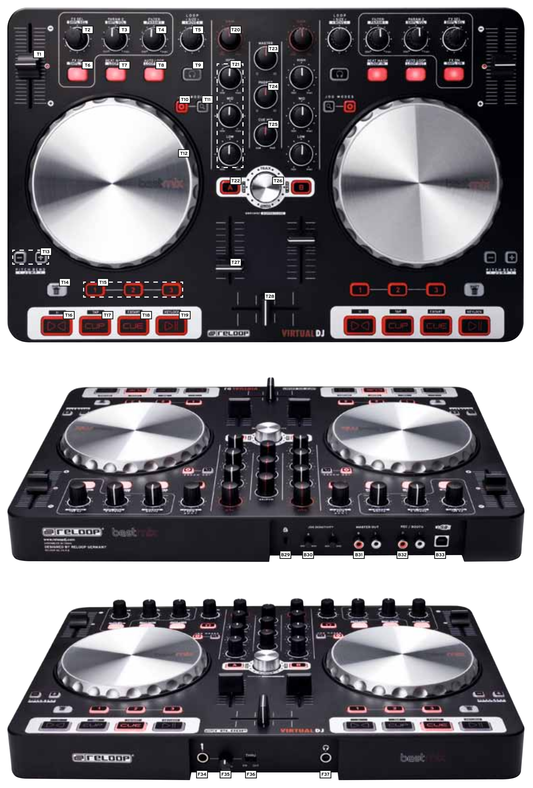

.. _reloop-beatmix:

Reloop Beatmix
==============

This is a compact sized two decker controller with two stereo audio outputs and a mic input on board.
It features two 14cm touch sensitive jogs with adjustable sensitivity, gain dials, filter/fx controls and mouseless library navigation dial.
Most of controls have a second function accessible through corresponding Shift buttons.

-  `Manufacturer’s product page <https://www.reloop.com/reloop-beatmix>`__
-  `Forum thread <https://mixxx.discourse.group/t/reloop-beatmix-1st-gen-mapping-implemented/28536>`__

.. versionadded:: 2.4

Audio
-----

This controller is a class complaint USB audio device. :term:`ASIO` driver for Windows based setups provided by manufacturer.

Deck Controls
-------------

* T1 - pitch slider
* T2 - **FX SEL** dial. It scrolls through FX presets on corresponding FX Unit. Clicking the knob will toggle FX panel visibility in Mixxx.
* T3 - **PARAM 2**. This one controls FX Super knob.
* T4 - **FILTER/PARAM1**. This knob controls quick filter pot. Also it controls FX crossfader when operated with **Shift** button (T14).
* T5 - **LOOP SIZE/MOVE**. Controls beatloop size. **Shift**-knob will adjust beatloop position. Clicking the knob will toggle samplers view.
* T6 - **FX ON**. FX unit on/off button.
* T7 - **BEAT MASH/LOOP IN**. Currently this button toggles Quantize mode off the corresponding deck. **Shift**-button acts as manual loop-in.
* T8 - **AUTO LOOP/LOOP OUT**. Toggles beatloop function. **Shift**-button sets manual loop-out point.
* T9 - **PFL** button. Toggles headphone monitoring of the corresponding deck.
* T10 - **SCRATCH MODE**. **Attention here!** This one left unimplemented due to its strange hardware handling. If you press this button the light will toggle but nothing else is going to happen. You may use it as some sort of switching mark. Scratch mode is controlled by Shift-T22 instead.
* T11 - **SEARCH**. Currently this button increase the jog sensitivity by 4 which makes it more suitable for searching through a loaded track. It also affects pitch control function of the jog, but not the scratch function.
* T12 - **Jog**. It is a two zone control wheel. Top plate is touch sensitive and it will cause a deck to scratch when touched if scratch mode is on. Rim is scratch-indifferent.
* T13 - Momentary **pitch up/down** buttons. Self explainatory i think. **Shift**-buttons will fast forward and rewind.
* T14 - **SHIFT** button is used to access all of second layer controls. Worth noticing, there is one SHIFT button for each side which affects its own side only. Except for a navigation dial. Both shift buttons deal the same way with the navigation dial.
* T15 - **HOTCUES**. Three hotcues are set/activated by pressing corresponding buttons and cleared by **Shift**-button.
* T16 - **SYNC**. Toggles sync mode of the corresponding deck. **Shift**-button will reverse the playback.
* T17 - **CUE PLAY**. Button set cue and start playing on release. **Shift**-button acts as a tap tempo.
* T18 - **CUE**. **Shift**-button toggles Fader Start feature. A note: fader start feature is only starting playback of the deck when corresponding fader is opened. It won't stop when you close the fader.
* T19 - **PLAY/PAUSE**. **Shift**-button toggles keylock mode.

Mixer
-----
Mixer section is self explainatory, just one thing worth noticing: master output control is pure hardware, it doesn't talk to software at all.

Navigation
----------
* T22 - **LOAD**. Loads a track into a corresponding deck. Button is only lit when deck is stopped and is safe to load. *Shift**-button toggles scratch mode as it was described above.
* T26 - **NAV DIAL**. The dial scrolls through a library. You can expand the library window by clicking on the dial. When operated with **Shift** key the dial will scroll through library tree and expand/collaps its entries.

Indication
----------
All buttons have status LEDs. Shift-action LEDs are visible when **SHIFT** is pressed.

Back
----
* B29 - Kensington lock.
* B30 - Jog sensitivity potentiometers.
* B31 - Master output. Channels 1-2 on USB audio device.
* B32 - Booth/rec output. Channels 3-4. These are also routed to internal headphone amp.
* B33 - USB port.

Front
-----
* F34 - Mic input. This might be turned off, routed to outputs or to a software.
* F35 - Mic gain potentiometer.
* F36 - Mic routing switch.
* F37 - Headphone output.

Known problems
--------------
Although top side controls have some samplers related labels no sampler controls are implemented at the moment.
