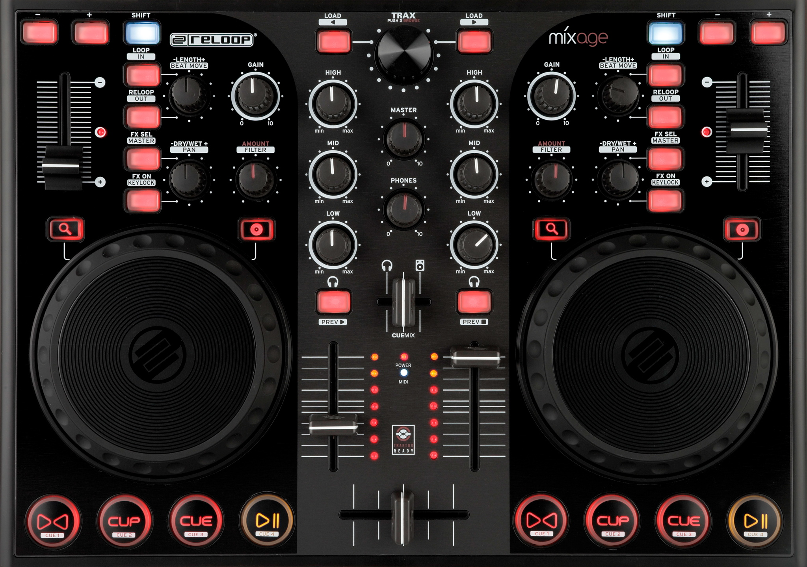
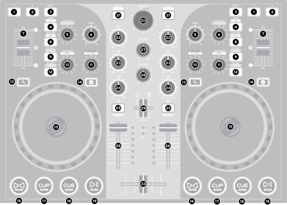

Reloop Mixage
=============

The Reloop Mixage line of controllers contains 2-channel DJ controller. It offers two jog wheels, line faders, a cross-fader, controls for looping, effects, equalizers and gain controls. The Interface Edition version comes with an integrated soundcard, headphone connection and microphone input and exists in version MK1 (unmarked) and MK2 (marked on back of device).

   Reloop Mixage top view (© Reloop, used with permission)

Audio
-----

This controller is a MIDI and audio class compliant device so it is compatible as-is with Linux, MacOS and Windows. On Windows, the manufacturer ships an :term:`ASIO` low-latency driver that can be found on the `manufacturer’s product
page <productpage_url_>`_.

The microphone :hwlabel:`🎤` input can be set to different modes. To make it usable in Mixxx, set it to **SW**. The :hwlabel:`MASTER` and :hwlabel:`PHONES` level controls work directly on the audio hardware and can't be mapped in Mixxx.

Control overview
----------------

   Reloop Mixage button overview.

All mapped controls use MIDI channel #1 (can be changed on the back of the device). Most functions on this controller are quite self-explanatory and mapped in that way (you might want to check the official manual too).

======  =========================================  ===========================================================================================================================================================================  ==============================================================================================================================================================================
#       Label                                      Function                                                                                                                                                                     SHIFT function
======  =========================================  ===========================================================================================================================================================================  ==============================================================================================================================================================================
1       :hwlabel:`-`                               Allows the temporary deceleration (counter-clockwise) of a track.                                                                                                            Adjust track key down.
2       :hwlabel:`+`                               Allows the temporary acceleration (clockwise) of a track.                                                                                                                    Adjust track key up.
3       :hwlabel:`SHIFT`                           When this button is pressed all controls have a different function. The assignment can be viewed in the SHIFT function column.
4       :hwlabel:`LOOP` / :hwlabel:`IN`            Set beatloop start at current play position and activate beatloop or turn it off if currently active.                                                                        Set loop in point.
5       :hwlabel:`-LENGTH+` / :hwlabel:`BEATMOVE`  Turn to halve/double loop length; Turn while pushing down to adjust beatjump size; Press shortly to clear any loop points.                                                   Turn to beatjump forward/backward. If a loop is active, move the loop forward/backward; Press shortly to enter/exit beatloop adjustment mode.
6       :hwlabel:`GAIN`                            Preamplication of a track/deck.                                                                                                                                              Same as non-shift function.
7       Pitchfader                                 Adjust the pitch or playback speed of the current deck. The LED lights up in the neutral position.                                                                           Same as non-shift function.
8       :hwlabel:`RELOOP` / :hwlabel:`OUT`         Toggle relooping on/off. Button is lit when a loop is active, blinks slowly if there's an inactive loop set and thus reloop is available.                                    Set loop out point.
9       :hwlabel:`FX SEL` / :hwlabel:`MASTER`      Select effect in effect unit N for adjustment. Button is lit if an effect slot is selected.                                                                                  Toggle if deck N is sync leader.
10      :hwlabel:`-DRY/WET+` / :hwlabel:`PAN`      Turn to control dry/wet for effect rack N; Turn whilst pushing down to select effect preset for effect rack N; Press shortly to toggle effect(s) in the effect rack on/off.  Select quick effect preset for deck N. Click to toggle quick effect on/off.
11      :hwlabel:`AMOUNT` / :hwlabel:`FILTER`      Control effect meta knob when an effect slot is selected; Controls the effect rack meta knob when no effect slot is selected.                                                Control quick effect super knob.
12      :hwlabel:`FX ON` / :hwlabel:`KEYLOCK`      Toggle effect rack on/off for deck N.                                                                                                                                        Toggle keylock (keep pitch on speed change) on/off.
13      :hwlabel:`🔍`                              Toggle to use jog wheel to scroll through deck.                                                                                                                              Same as non-shift function.
14      :hwlabel:`💿`                              Toggle to use jog wheel to scratch deck.                                                                                                                                     Same as non-shift function.
15      Jog wheel                                  Controls various functions depending on the jog wheel mode.                                                                                                                  Same as non-shift function.
16      :hwlabel:`⯈⯇` / :hwlabel:`CUE 1`           Beat-sync deck as follower (hold to sync lock).                                                                                                                              If hot cue 1 is set, go to hot cue 1, else set hot cue 1 at current position.
17      :hwlabel:`CUP` / :hwlabel:`CUE 2`          If at cue point, play when released. If not at cue point, sets a cue point.                                                                                                  If hot cue 2 is set, go to hot cue 2, else set hot cue 2 at current position.
18      :hwlabel:`CUE` / :hwlabel:`CUE 3`          If at cue point, plays until released. If not at cue point: If playing, goes to cue point and stops. If not playing, sets a cue point.                                       If hot cue 3 is set, go to hot cue 3, else set hot cue 3 at current position.
19      :hwlabel:`⏯` / :hwlabel:`CUE 4`            Play/pause deck. Hold the disc button :hwlabel:`💿` to soft start/brake the deck.                                                                                             If hot cue 4 is set, go to hot cue 4, else set hot cue 4 at current position.
20      :hwlabel:`TRAX`                            Turn to browse library. Press to play/pause track preview. Double-press to maximize/minimize library.                                                                        Turn to browse side pane.
21      :hwlabel:`LOAD` / :hwlabel:`⯇`             Load selected track from library into deck 1; LED lights up if deck is currently playing.                                                                                    Navigate left (close folder).
21      :hwlabel:`LOAD` / :hwlabel:`⯈`             Load selected track from library into deck 2; LED lights up if deck is currently playing.                                                                                    Navigate right (open folder).
22      :hwlabel:`HIGH`                            Controls the high EQ.                                                                                                                                                        Same as non-shift function.
23      :hwlabel:`MID`                             Controls the mid EQ.                                                                                                                                                         Same as non-shift function.
24      :hwlabel:`LOW`                             Controls the low EQ.                                                                                                                                                         Same as non-shift function.
25      :hwlabel:`🎧` / :hwlabel:`PREV ⯈`          Activate :term:`PFL <PFL>` for deck 1                                                                                                                                        Play preview deck.
25      :hwlabel:`🎧` / :hwlabel:`PREV ⏹`          Activate :term:`PFL <PFL>` for deck 2                                                                                                                                        Stop preview deck.
26      Linefader                                  Controls the respective channel's volume.                                                                                                                                    Same as non-shift function.
33      Crossfader                                 Crossfader between channel 1 and channel 2.                                                                                                                                  Same as non-shift function.
======  =========================================  ===========================================================================================================================================================================  ==============================================================================================================================================================================

The effect buttons and knobs on the left side apply to effect unit 1, the ones on the right to effect unit 2. The numbers from the overview correspond to the product manual and mapping XML file Txx numbers.

Jog wheel
---------

- With :hwlabel:`🔍` button active: Scroll through the track. While touching the top of the wheel scrolling is three times as fast.
- With :hwlabel:`💿` button active: Touch the side of the jog wheel to nudge the deck. Touch the top of the jog wheel to scratch (either deck playing or not).
- With the Beatloop adjust mode active: Adjusts the selected loop point.

Beatloop adjust mode
--------------------

When a beatloop has been set, press :hwlabel:`SHIFT` + :hwlabel:`-LENGTH+` / :hwlabel:`BEATMOVE` to enable beatloop adjust mode. The :hwlabel:`LOOP` / :hwlabel:`IN` and :hwlabel:`RELOOP` / :hwlabel:`OUT` buttons will blink. Now you can:

- Move the entire loop using the jog wheel, adjustment is three times as fast while the top of the jog wheel is touched.
- Press :hwlabel:`LOOP` / :hwlabel:`IN` to shift the loop in point using the jog wheel. The :hwlabel:`LOOP` / :hwlabel:`IN` will blink.
- Press :hwlabel:`RELOOP` / :hwlabel:`OUT` to shift the loop out point using the jog wheel. The :hwlabel:`RELOOP` / :hwlabel:`OUT` will blink.

Hold :hwlabel:`SHIFT` and press :hwlabel:`-LENGTH+` / :hwlabel:`BEATMOVE`, or press :hwlabel:`🔍` or :hwlabel:`💿` button to leave beatloop adjust mode.

User-adjustable script settings
-------------------------------

The `Reloop-Mixage.scripts.js` controller script provides the following settings:

-  `scratchByWheelTouch` (default `false`): change to `true` to get a more regular, turntable-like mode, i.e. scratch by touching the jog wheel instead of having to toggle the disc button. Note that the jog wheels are not very sensitive to touch though (sensitivity can be adjusted on the back of the controller in the MK1 version).
-  `scratchTicksPerRevolution` (default `620`): Change this to adjust the scratch speed. Smaller values mean "faster", higher mean "slower".
-  `jogWheelScrollSpeed` (default `1.0`): Adjust this to change the jog wheel scroll speed. The higher the values, the faster.

Controller diagnostic functions
-------------------------------

Turn off the controller and hold one of these buttons while turning on the controller:

-  Right :hwlabel:`SHIFT` to display the firmware version on the four deck play/cue buttons. The number is display in little-endian binary, e.g 0101 meaning 5.
-  Right :hwlabel:`⏯` to show jog wheel touch values. This can be used to adjust sensitivity on the MK1 version.
-  Left :hwlabel:`⯈⯇` to light up all LEDs. Can be helpful when repairing the controller or replacing the LEDs.

Links
-----

-  `Manufacturer's product page <productpage_url_>`_
-  `Forum thread <forum_url_>`_

.. _productpage_url: https://www.reloop.com/reloop-mixage-ie
.. _forum_url: https://mixxx.discourse.group/t/reloop-mixage-mapping/14779
