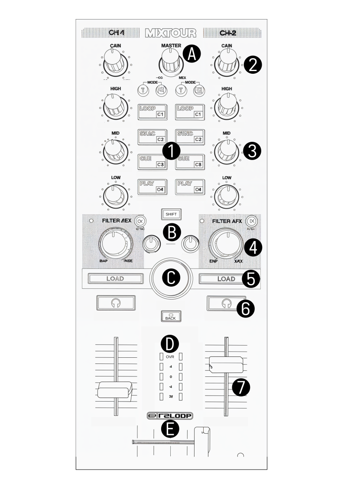

.. _reloop_mixtour:

Reloop Mixtour
==============

.. sectionauthor::
   Rene E <mixxx at absorb.it>

The Reloop Mixtour is a 2 deck USB DJ controller. You can configure it to be used for any two of your four decks [1]_ or, in the future, align automatically with the selected decks [2]_ .

-  `Manufacturer's Product Page <https://www.reloop.com/reloop-mixtour>`__
-  `Manufacturer's User Manual <https://www.reloop.com/media/custom/upload/Reloop-Mixtour_Quickstart_Guide.pdf>`__
-  `Mixxx User Forum <https://mixxx.discourse.group/t/new-mapping-for-reloop-mixtour/33093>`__

.. [1] Decks can be configured in your :menuselection:`Preferences --> Controller --> Controller Setup`.
.. [2] Depends on the implementation of Deck Highlighting in `Mixxx <https://github.com/mixxxdj/mixxx/pull/15438>`__ and in your controller configuration.

.. versionadded:: 2.5

Controller Mapping
------------------

   Controller Overview

.. _reloop_mixtour-main:

Main section
~~~~~~~~~~~~

===  ==========================     ============================================================================================
Id   Control                                            Function
===  ==========================     ============================================================================================
A    :hwlabel:`MASTER`              Control main output volume.
B    :hwlabel:`SHIFT`               Enable access to secondary Functions.
B    :hwlabel:`CUE VOL.`            Controls the headphone volume.
B    :hwlabel:`CUE MIX`             Adjust Headphone Mix between selected PFL channel and Main output.
C    Encoder                        Browse up and down in the Library.
C    :hwlabel:`SHIFT` + Encoder     Browse left and right in the Library.
C    Press Encoder                  Change active Library window.
D    :hwlabel:`Back`                Toggle maximized view of library section of the user interface.
D    LED Band                       Show PFL or Main output level. [3]_
E    Crossfader                     Fade between the Decks
===  ==========================     ============================================================================================

.. [3] Mode can be selected with a hard switch on the front left of the device.

.. _reloop_mixtour-pads:

Pad section
~~~~~~~~~~~

The Pad mode can be selected with the Buttons above the pads, :hwlabel:`T` or :hwlabel:`C`.

====  ===================================  ============================================================================================
Id    Control :hwlabel:`T`                               Function
====  ===================================  ============================================================================================
1(T)  :hwlabel:`LOOP`                      Start or End Loop (size is defined in mixxx UI).
1(T)  :hwlabel:`SHIFT` + :hwlabel:`LOOP`   Decrease the Loop size by 2. halve the size.
1(T)  :hwlabel:`SYNC`                      Synchronize the BPM to the other deck.
1(T)  :hwlabel:`SHIFT` + :hwlabel:`SYNC`   Increase the Loop size by 2, double the size.
1(T)  :hwlabel:`CUE`                       Play / set cue, dependent on your configured :ref:`Cue mode <interface-cue-modes>` settings.
1(T)  :hwlabel:`SHIFT` + :hwlabel:`CUE`    Unset cue.
1(T)  :hwlabel:`PLAY`                      Play or Pause the current Track.
1(T)  :hwlabel:`SHIFT` + :hwlabel:`PLAY`   Toggle Reverse Play mode.
====  ===================================  ============================================================================================

====  ================================  ============================================================================================
Id    Control :hwlabel:`C`                               Function
====  ================================  ============================================================================================
1(C)  :hwlabel:`Cx`                     Jump to the configured Hot-Cue point. If non is set, set one. [4]_
1(C)  :hwlabel:`SHIFT` + :hwlabel:`Cx`  Remove the configured Hot-Cue point. [4]_
====  ================================  ============================================================================================

.. [4] Cue Mode can be configured in your Mixxx Preferences Window.

.. _reloop_mixtour-mixer:

Mixer section
~~~~~~~~~~~~~

===  ======================================  ============================================================================================
Id   Control                                            Function
===  ======================================  ============================================================================================
2    :hwlabel:`GAIN` Knob                    Adjust input gain for the chosen Deck.
3    :hwlabel:`HIGH` Knob                    Top control for the selected Quickeffect Chain, default high frequencies in Filter mode.
3    :hwlabel:`MID` Knob                     Middle control for the selected Quickeffect Chain, default mid frequencies in Filter mode.
3    :hwlabel:`LOW` Knob                     Bottom control for the selected Quickeffect Chain, default low frequencies in Filter mode.
4    :hwlabel:`FX` Button                    Add Effect to the chosen Deck. [5]_
4    :hwlabel:`FX` Knob                      Super Knob to filter out High frequencies (turn left) or low frequencies (turn right). If :hwlabel:`FX` Button is active, Knob will control the Effect intensity.
4    :hwlabel:`FX` LED                       Light up when Super Knob is actively used as frequency filter.
5    :hwlabel:`LOAD`                         Load the current Track to the chosen Deck.
5    :hwlabel:`SHIFT` + :hwlabel:`LOAD`      Move left and right in your Library.
6    :hwlabel:`🎧`                           Monitor the current Deck via the Headphon e (PFL - Pre Fade Listener).
6    :hwlabel:`SHIFT` + :hwlabel:`🎧`        Loads selected Track into the preview Deck and starts playing it in preview mode.
7    Fader                                   Adjust channel volume.
7    :hwlabel:`SHIFT` + Fader zero to top    Fader Start, start the track from the current position.
7    :hwlabel:`SHIFT` + Fader top to zero    Fader Stop, stop playing the track and go back to cue point.
===  ======================================  ============================================================================================

.. [5] Effect number can be configured in your :menuselection:`Preferences --> Controller --> Controller Setup`.
