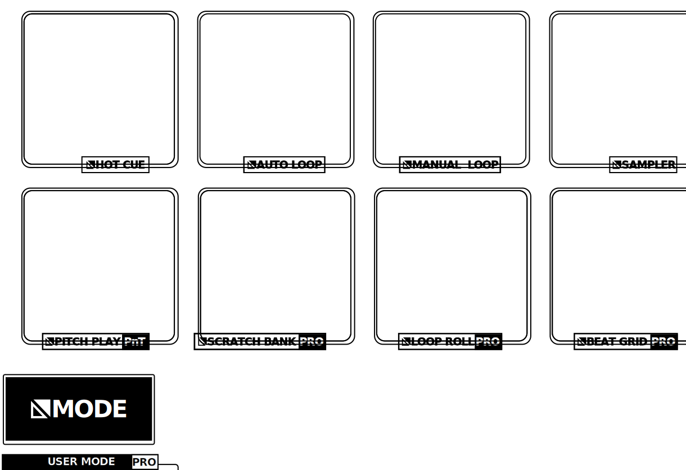

.. _reloop-ready:

Reloop Ready
=============

.. sectionauthor::
   Nikolaus Einhauser <nikolaus.einhauser@mixxx.org>

The Reloop Ready controller is an entry-level 2-Deck :term:`MIDI` controller
featuring a built-in 4-channel USB audio interface.

-  `Manufacturer’s product page <https://www.reloop.com/reloop-ready>`__
-  `Serato DJ Hardware Page <https://serato.com/dj/hardware/reloop-ready>`__
-  `Instruction Manual <https://www.reloop.com/media/catalog/product/pdf/2/4/3/243598_Reloop_IM.pdf>`__

..
    -  `Mapping Forum Thread <>`__ TODO

.. versionadded:: 2.5.1

Audio Setup
-----------

For the controllers internal Audio interface to interact properly with Mixxx,
the following channel assignments are required:

===================== ================
Output Channels       Assigned to
===================== ================
1-2                   Main
3-4                   Headphones
===================== ================

.. figure:: ../../_static/controllers/reloop_ready_front.svg
    :align: center
    :width: 100%
    :figwidth: 100%
    :alt: Reloop-Ready (schematic view)
    :figclass: pretty-figures

    Reloop-Ready (schematic view)

========  ==================================================  ==========================================
No.       Control                                             Function
========  ==================================================  ==========================================
1 & 2     :hwlabel:`GAIN`, :hwlabel:`High`, :hwlabel:`LOW`    Gain / EQ, controls the Eq depending on the chosen setting TODO
3         :hwlabel:`BROWSE` Encoder                           Navigate the library view up and down
3         :hwlabel:`BROWSE` Encoder Button                    See :mixxx:coref:`[Library],GoToItem`
3         :hwlabel:`SHIFT` + :hwlabel:`BROWSE` Encoder        Move the library Focus horizontally
3         :hwlabel:`SHIFT` + :hwlabel:`BROWSE` Encoder Knob   (Un-)maximize the Library
4         :hwlabel:`LOAD` Button                              Load the selected track onto the corresponding deck
4         :hwlabel:`SHIFT` + :hwlabel:`LOAD` Button           Unload the currently loaded track from the deck
5         :hwlabel:`FILTER` Knob                              QuickEffect superknob (filter by default, can be changed in the UI or the preferences)
6         :hwlabel:`CUE` Button                               Enable Deck output to headphone (:term:`PFL`)
7         :hwlabel:`SHIFT` Button                             Access alternative functionality of some buttons.
8         :hwlabel:`TEMPO` Fader                              Adjust the tempo of the Deck (direction can be changed in the Deck preferences)
9         Channel faders                                      Adjust the output level for each channel.
10        Crossfader                                          Fades between left and right deck. (make sure the orientation is set correctly in Mixxx)
12        Pads                                                See the PadSection (TODO)
13        :hwlabel:`VINYL` Button                             Toggle vinyl control mode (if enabled, touching the top of the platter stops the playback)
13        :hwlabel:`SHIFT` + :hwlabel:`VINYL` Button          Toggle Slip Mode
14        :hwlabel:`KEY LOCK` Button                          Toggle whether the pitch of the track should be immune to tempo changes
14        :hwlabel:`SHIFT` + :hwlabel:`KEY LOCK` Button       Change Deck Pitch to match currently playing deck
15        :hwlabel:`PARAMETER 1/2` Buttons                    See the PadSection (TODO)
16        :hwlabel:`LOOP` Encoder                             Change Loop size
16        :hwlabel:`LOOP` Button                              Set loop at the current play position / disable currently active loop
16        :hwlabel:`SHIFT` + :hwlabel:`LOOP` Button           Tap to set the track BPM
17        :hwlabel:`FX UNIT`                                  TODO
18        :hwlabel:`LEVEL`                                    EffectUnit Meta Knob
19        :hwlabel:`MODE`                                     See the PadSection (TODO)
20        :hwlabel:`SYNC` Button (short press)                Copy the Tempo from the other deck to this deck
20        :hwlabel:`SYNC` Button (long press)                 Make this deck a tempo follower
20        :hwlabel:`SHIFT` + :hwlabel:`SYNC` Button           No function!
21        :hwlabel:`CUE` Button                               Cue Button
22        :hwlabel:`CUE` Button                               Play Button
22        :hwlabel:`SHIFT` + :hwlabel:`CUE` Button            Censor (play in reverse then jump to were the track would've been)
========  ==================================================  ==========================================

    Reloop-Ready (schematic view)

========  ==================================================  ==========================================
No.       Control                                             Function
========  ==================================================  ==========================================
23        :hwlabel:`Master Out`                               `RCA Jack <https://en.wikipedia.org/wiki/RCA_connector>`_ Outputting the :term:`main output` at line Level. Connect this to your speaker/amplifier.
24        :hwlabel:`Master Vol`                               Output :term:`volume` of the :term:`main output`.
25        :hwlabel:`Cue Mix`                                  Ratio between :term:`main output` and cue/pfl signal. See :term:`cueing` and :term:`PFL`.
26        :hwlabel:`Cue Vol`                                  Volume of the :term:`PFL` signal (to your headphones).
27        :hwlabel:`🎧`                                       3.5mm (1/8") `Phone Jack <https://en.wikipedia.org/wiki/Phone_connector_(audio)>`_ outputting the :term:`PFL` signal.
========  ==================================================  ==========================================

    Reloop-Ready (schematic view)

========  ==================================================  ==========================================
No.       Control                                             Function
========  ==================================================  ==========================================
28        :hwlabel:`iOS` USB-A Port                           Used for connecting the Reloop Ready for DJ mobile-device DJ software (such as Algoriddim DJay Pro). See manufacturer manual.
29        :hwlabel:`PC iOS` Switch                            Specify controller Mode. Needs to be set to :hwlabel:`PC` for usage with Mixxx!
30        :hwlabel:`PC/Power` USB-B Port                      USB Port used for connecting the device to a laptop (and power in iOS mode).
31        :hwlabel:`🔒`                                       `Kensington Lock <https://en.wikipedia.org/wiki/Kensington_Security_Slot>`_
========  ==================================================  ==========================================

Pad Section
~~~~~~~~~~~

The Reloop Ready features 8 RGB Pads. Their respective assignment can be changed by holding down the :hwlabel:`MODE` button and then pressing one of the respective Pad.
The Mode being accessed is printed below each pad.
Most modes features :hwlabel:`Parameter 1` and :hwlabel:`Parameter 2` buttons. If the "use backlight" setting (TODO link) is used, those buttons will be backlit if they
have a function and fully off if they don't. If the backlight is turned off, there is no visual indication.

Hotcue Mode
^^^^^^^^^^^

========  ===========================================  ==========================================
No.       Control                                      Function
========  ===========================================  ==========================================
1 - 8     Hotcue Pad (unlit)                           Create :term:`hotcue` at the current playposition (TODO link term)
1 - 8     Hotcue Pad (lit and track playing)           Jump to hotcue position and continue playing
1 - 8     Hotcue Pad (lit and track stopped)           Jump to hotcue position and play until pad is released
1 - 8     :hwlabel:`SHIFT` + Hotcue Pad                Delete corresponding hotcue
9         :hwlabel:`Parameter 1`                       No function!
9         :hwlabel:`SHIFT` + :hwlabel:`Parameter 1`    Change color of the focused (most recently used) hotcue (TODO link color palettes)
========  ===========================================  ==========================================

Auto Loop Mode
^^^^^^^^^^^^^^

========  ===========================================  ==========================================
No.       Control                                      Function
========  ===========================================  ==========================================
1 - 8     Red Auto Loop Pad                            If no pads are lit, create a loop with the specified size at the current playposition. Pressing an unlit pad while a loop is already active resizes that loop. Pressing a lit pad deactivates that loop. Create a loop at the current playposition of the specified size,  (TODO link to settings for base size, )
9         :hwlabel:`Parameter 1`                       Double/Halve Loop size of each Pad
9         :hwlabel:`SHIFT` + :hwlabel:`Parameter 1`    No Function!
========  ===========================================  ==========================================

Manual Loop Mode
^^^^^^^^^^^^^^

========  ===========================================  ==========================================
No.       Control                                      Function
========  ===========================================  ==========================================
1         Blue Pad                                     Set Loop In position at current playposition
2         Blue Pad                                     Set Loop Out position at current playposition
3         Red Pad                                      Reactivate a deactivated loop or if none exists create one at the current playposition
4         Red Pad                                      Seek to Loop In point
5         Green Pad                                    Halve size of currently active loop
6         Green Pad                                    Double size of currently active loop
7         Cyan Pad                                     Move Loop backwards by some beats (default: 4 beats)
7         :hwlabel:`SHIFT` + Cyan Pad                  Move Loop backwards by the current loopsize
8         Cyan Pad                                     Move Loop forwards by some beats (default: 4 beats)
8         :hwlabel:`SHIFT` + Cyan Pad                  Move Loop forwards by the current loopsize
9         :hwlabel:`Parameter 1`                       Half the size moved by the Cyan Pads
9         :hwlabel:`Parameter 1`                       Double the size moved by the Cyan Pads
========  ===========================================  ==========================================

Sampler Mode
^^^^^^^^^^^^^^

========  ================================================  ==========================================
No.       Control                                           Function
========  ================================================  ==========================================
1 - 8     Sampler Pad (unlit)                               Load Currently selected track into corresponding sampler
1 - 8     Sampler Pad (lit white)                           Play sample from the :term:`cue`
1 - 8     :hwlabel:`SHIFT` + Sampler Pad (sample playing)   Stop sample
1 - 8     :hwlabel:`SHIFT` + Sampler Pad (sample stopped)   unload/eject sample
========  ================================================  ==========================================
Pitch Play Mode
^^^^^^^^^^^^^^

TODO

========  ================================================  ==========================================
No.       Control                                           Function
========  ================================================  ==========================================

========  ================================================  ==========================================

Scratch Bank (Beat Jump) Mode
^^^^^^^^^^^^^^

TODO

========  ================================================  ==========================================
No.       Control                                           Function
========  ================================================  ==========================================
1 - 4     Cyan Top Row Pads                                 Jump the specified beats forward (TODO link settings)
5 - 8     Cyan Bottom Row Pads                              Jump the specified beats backwards (TODO link settings)
9         :hwlabel:`Parameter 1`                            Double/Half the size of each Pad
========  ================================================  ==========================================

Loop Roll Mode
^^^^^^^^^^^^^^
========  ================================================  ==========================================
No.       Control                                           Function
========  ================================================  ==========================================
1 - 8     Green Loop Roll Pad                               Do a loop roll (TODO link) for the corresponding length (depending on which Pad was pressed)
9         :hwlabel:`Parameter 1`                            Double/Half the size of each Pad
========  ================================================  ==========================================

Beat Grid Mode
^^^^^^^^^^^^^^
========  ================================================  ==========================================
No.       Control                                           Function
========  ================================================  ==========================================

========  ================================================  ==========================================

TODO

TODO remaining hotcue pads

TODO settings
