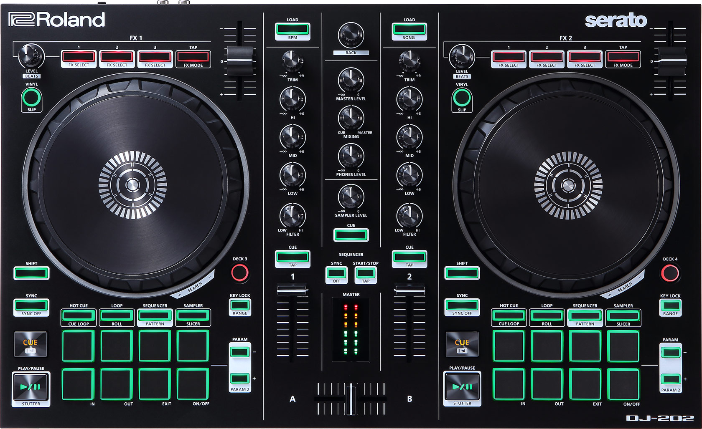

Roland DJ-202
=============

-  `Manufacturer’s product page <https://www.roland.com/global/products/dj-202/>`__
-  `Forum thread <https://mixxx.discourse.group/t/mapping-the-roland-rj-202/17099>`__

   The Roland DJ-202 is an all-in-one USB MIDI controller with a built in sound card. It has controls for 2 decks that can be toggled between decks to play with 4 decks. As a special feature it’s got an in-built sequencer with 8 sounds from the TR-808 and the TR-909 drum machines (TR-606 and TR-707 are available via firmware update).

Drivers
-------

*Windows & MacOS*

You can download the latest drivers and firmware from https://www.roland.com/global/products/dj-202/downloads/.

**Linux**
   The DJ-202 is a USB class compliant MIDI and audio device, so it’s
   plug-and-play on Linux.

**Enabling generic mode**
   If the device is not properly detected as a MIDI device, you need to enable generic mode in the system settings:

1. Hold [LOAD] Button when plugging in the USB cable until the sequencer
   start/stop button blinks
2. Press [R channel performance pad 1]
3. Turn the rotary selector left, so only the upper left corner of the master level indicator is lit
4. Press the blinking start/stop button
5. Wait until all pads light up, then disconnect USB cable

**Mapping**
   mapping is currently being developed, see
   `Github <https://github.com/Lykos153/mixxx/tree/Mapping-DJ-202>`__

Pitch control
-------------

======================= =============================
``Tempo Fader Up/Down`` Adjust pitch continuously
======================= =============================
``Shift + Tempo Fader`` Toggle between different keys
======================= =============================

Jog wheels
----------

================================================== ============================================
Control                                            Function
================================================== ============================================
``Jog wheel +/- from the side while playing``      Temporarily increase/decrease playback speed
``Jog wheel +/- from the side while not playing``  Slowly navigate in track
``Jog wheel +/- from the surface``                 Scratching
``Shift + jog wheel +/-``                          Strip search
================================================== ============================================

**FX**

==================================== ============================================
Control                              Function
==================================== ============================================
 ``FX1-3`` (long)                    Focus FX1-3
 ``FX1-3`` (short)                   Toggle effect 1-3 on/off
 ``Shift + FX tap``                  Cycle focused effect forward/backward
 ``FX level``                        Set FX meta depth
 ``Shift + FX-level``                Set effects rack dry/wet
 ``Shift + FX1-3``                   Routing mode - toggle sending respective deck output to fx1 on/off, fx2 on/off, headphones on/off
==================================== ============================================

General
-------

==================================== ============================================
Control                              Function
==================================== ============================================
 ``Shift + Sync``                    Toggle quantize on/off
 ``Slip`` (hold)                     Toggle slip mode temporarily
 ``Slip`` (double tap)               Latch slip mode
 ``Shift + Slip``                    Toggle vinyl (scratch) mode
 ``Deck 3/4`` (hold)                 Toggle other deck temporarily, return to
 ``Deck 3/4`` (press)                Toggle other deck
 ``Key lock + Param+/-``             Shift pitch up/down
 ``Key lock + Param+-Param``         Reset pitch
 ``Shift + cue`` (long)              Align beatgrid to other deck’sgrid
 ``Shift + cue`` (once)              Align beatgrid to current play position
 ``Shift + cue`` (tap multiple)      tap BPM
 ``Sync`` (quick tap)                Reset BPM
 ``Sync`` (long  tap)                Sync lock
 ``Play``                            Plays the track
 ``Shift + Play`` (keep pressed)     Reverse plays the track
 ``Cue``                             During play : goes back to Cue Without playing : defines Cue
==================================== ============================================

Central knobs
-------------

==================================== ============================================
Control                              Function
==================================== ============================================
 ``Master Level``                  | Adjust Master gain
 ``Mixing``                        | Adjust Headphones Mix
 ``Phones Level``                  | Adjust Headphones gain
 ``Sampler Level``                 | Adjust Samplers gain
==================================== ============================================

EQ knobs
--------

==================================== ============================================
Control                              Function
==================================== ============================================
 ``Hi``                              Adjust high frequencies level
 ``Mid``                             Adjust medium frequencies level
 ``Low``                             Adjust low frequencies level
 ``Filter``                          High/Low Pass Filter (or other effects)|
==================================== ============================================

Performance pad modes
---------------------

Hot cue mode
------------

==================================== ============================================
Control                              Function
==================================== ============================================
 ``Param+/-``                        Beat jump forward/backward
 ``Shift + Param+/-``                Increment/decrement beat jump
                                     distance
 ``Pad 1-8``                         Save/jump to hot cue
 ``Shift + Pad 1-8`` (while playing) Save hot cue (overwrite existing)
 ``Shift + Pad 1-8`` (while stopped) Delete hot cue
==================================== ============================================

Cue Loop mode (Press Shift + HOT CUE to enter Cue Loop mode)
------------------------------------------------------------

==================== =============================================================
``Pad 1-8``          Define hot cue 1 to 8 and toggle beatloop of length 2 from it
``Shift + Pad 1-8``  Redefine hot cue 1 to 8
==================== =============================================================

Loop mode
---------

==================== ============================================
Control              Function
==================== ============================================
``Param+/-``         Move beatloop forward/backward
``Shift + Param+/-`` Double/halve beatloop size
``Pad 1-4``          Toggle beatloop of length 1,2,4,8
``Pad 5-8``          Manual loop controls (in, out, exit, on/off)
==================== ============================================

Roll mode (Press Shift + LOOP to enter Roll mode)
-------------------------------------------------

==================== ==========================================
Control              Function
==================== ==========================================
``Pad 1-4``          Toggle beatrool of length 1, 1/2, 1/4, 1/8
``Pad 5-6``          Define loop-in and loop-out
``Pad 7``            Loop exit
``Pad 8``            Loop ON/OFF
==================== ==========================================

Sampler mode
------------

========================= =============================
Control                   Function
========================= =============================
``Pad 1-8 (left deck)``   Play samplers 1-8 from start
``Pad 9-16 (right deck)`` Play samplers 9-16 from start
========================= =============================

Sequencer mode & Pattern mode
-----------------------------

===============================================================================================
These are special features of the controller that do not interact directly with Mixxx. You are welcome to read about them in the manufacturer's official manual.
===============================================================================================

.. Authors - Sébastien Guyot (BSDguy389), Jhade Williamson (evoixmr)
