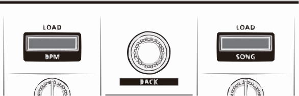
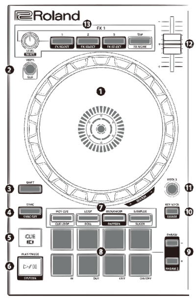
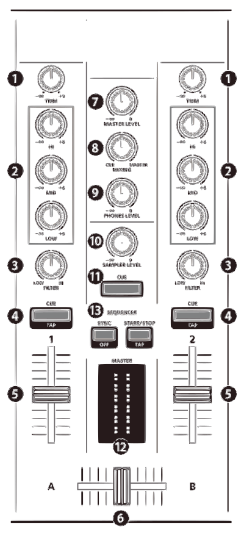

Roland DJ-202
=============

.. figure:: ../../_static/controllers/roland_dj_202.jpg
   :align: center
   :width: 100%
   :figwidth: 100%
   :alt: Roland DJ-505 (schematic view)
   :figclass: pretty-figures

-  `Manufacturer’s product page <https://www.roland.com/global/products/dj-202/>`__
-  `Forum thread <https://mixxx.discourse.group/t/mapping-the-roland-rj-202/17099>`__

   The Roland DJ-202 is an all-in-one USB MIDI controller with a built in sound card. It has controls for 2 decks that can be toggled between decks to play with 4 decks. As a special feature it’s got an in-built sequencer with 8 sounds from the TR-808 and the TR-909 drum machines (TR-606 and TR-707 are available via firmware update).

Drivers
-------

*Windows & MacOS*

You can download the latest drivers and firmware from https://www.roland.com/global/products/dj-202/downloads/.

**Linux**
   The DJ-202 is a USB class compliant MIDI and audio device, so it’s
   plug-and-play on Linux.

**Enabling generic mode**
   If the device is not properly detected as a MIDI device, you need to enable generic mode in the system settings:

1. Hold [LOAD] Button when plugging in the USB cable until the sequencer
   start/stop button blinks
2. Press [R channel performance pad 1]
3. Turn the rotary selector left, so only the upper left corner of the master level indicator is lit
4. Press the blinking start/stop button
5. Wait until all pads light up, then disconnect USB cable

**Mapping**
   mapping is currently being developed, see
   `Github <https://github.com/Lykos153/mixxx/tree/Mapping-DJ-202>`__

Browser Section
~~~~~~~~~~~~~~~

..

========  ==================================================  ==========================================
No.       Control                                             Function
========  ==================================================  ==========================================
1         :hwlabel:`LOAD` buttons                             Load song into deck.
1         :hwlabel:`SHIFT` + :hwlabel:`LOAD` button (left)    Sort library by BPM (press repeatedly to toggle ascending/descending order).
1         :hwlabel:`SHIFT` + :hwlabel:`LOAD` button (right)   Sort library by key (press repeatedly to toggle ascending/descending order).
2         Rotary Selector                                     Turn to move tracklist cursor up/down. Press to load and play/pause currently selected track on preview deck. Hold and turn to seek in track on preview deck.
2         :hwlabel:`SHIFT` + Rotary Selector                  Turn to move sidebar cursor up/down. Hold and turn to change track color of currently selected track.
3         :hwlabel:`BACK` button                              *Not yet mapped.*
3         :hwlabel:`SHIFT` + :hwlabel:`BACK` button           Sort library by title (press repeatedly  to toggle ascending/descending order).
========  ==================================================  ==========================================

Deck Section
~~~~~~~~~~~~

**Pitch control**

========  =======================  =============================
No.       Control                  Function
========  =======================  =============================
12        ``Tempo Fader Up/Down``  Adjust pitch continuously
12        ``Shift + Tempo Fader``  Toggle between different keys
========  =======================  =============================

**Jog wheels**

========  ==================================================  ============================================
No.       Control                                             Function
========  ==================================================  ============================================
1         ``Jog wheel +/- from the side while playing``       Temporarily increase/decrease playback speed
1         ``Jog wheel +/- from the side while not playing``   Slowly navigate in track
1         ``Jog wheel +/- from the surface``                  Scratching
1         ``Shift + jog wheel +/-``                           Strip search
========  ==================================================  ============================================

**FX**

========  ====================================  ============================================
No.       Control                               Function
========  ====================================  ============================================
13        ``FX1-3`` (long)                      Focus FX1-3
13        ``FX1-3`` (short)                     Toggle effect 1-3 on/off
13        ``Shift + FX tap``                    Cycle focused effect forward/backward
13        ``FX level``                          Set FX meta depth
13        ``Shift + FX-level``                  Set effects rack dry/wet
13         ``Shift + FX1-3``                     Routing mode - toggle sending respective deck output to fx1 on/off, fx2 on/off, headphones on/off
========  ====================================  ============================================

General
-------

========  ====================================  ============================================
No.       Control                               Function
========  ====================================  ============================================
4         ``Shift + Sync``                      Toggle quantize on/off
2         ``Slip`` (hold)                       Toggle slip mode temporarily
2         ``Slip`` (double tap)                 Latch slip mode
2         ``Shift + Slip``                      Toggle vinyl (scratch) mode
11        ``Deck 3/4`` (hold)                   Toggle other deck temporarily, return to
11        ``Deck 3/4`` (press)                  Toggle other deck
10        ``Key lock + Param+/-``               Shift pitch up/down
10        ``Key lock + Param+-Param``           Reset pitch
5         ``Shift + cue`` (long)                Align beatgrid to other deck’sgrid
5         ``Shift + cue`` (once)                Align beatgrid to current play position
5         ``Shift + cue`` (tap multiple)        tap BPM
4         ``Sync`` (quick tap)                  Reset BPM
4         ``Sync`` (long  tap)                  Sync lock
6         ``Play``                              Plays the track
6         ``Shift + Play`` (keep pressed)       Reverse plays the track
5         ``Cue``                               During play : goes back to Cue Without playing : defines Cue
========  ====================================  ============================================

Mixer Section
~~~~~~~~~~~~~

**Central knobs**

========  ====================================  ============================================
No.       Control                               Function
========  ====================================  ============================================
7         ``Master Level``                      | Adjust Master gain
8         ``Mixing``                            | Adjust Headphones Mix
9         ``Phones Level``                      | Adjust Headphones gain
10         ``Sampler Level``                     | Adjust Samplers gain
========  ====================================  ============================================

**EQ knobs**

========  ====================================  ============================================
No.       Control                               Function
========  ====================================  ============================================
2         ``Hi``                                Adjust high frequencies level
2         ``Mid``                               Adjust medium frequencies level
2         ``Low``                               Adjust low frequencies level
3         ``Filter``                            High/Low Pass Filter (or other effects)
========  ====================================  ============================================

Performance pad modes
---------------------

**Hot cue mode**

====================================  ============================================
Control                               Function
====================================  ============================================
``Param+/-``                          Beat jump forward/backward
``Shift + Param+/-``                  Increment/decrement beat jump
                                      distance
``Pad 1-8``                           Save/jump to hot cue
``Shift + Pad 1-8`` (while playing)   Save hot cue (overwrite existing)
``Shift + Pad 1-8`` (while stopped)   Delete hot cue
====================================  ============================================

**Cue Loop mode (Press Shift + HOT CUE to enter Cue Loop mode)**

==================== =============================================================
``Pad 1-8``          Define hot cue 1 to 8 and toggle beatloop of length 2 from it
``Shift + Pad 1-8``  Redefine hot cue 1 to 8
==================== =============================================================

**Loop mode**

====================  ============================================
Control               Function
====================  ============================================
``Param+/-``          Move beatloop forward/backward
``Shift + Param+/-``  Double/halve beatloop size
``Pad 1-4``           Toggle beatloop of length 1,2,4,8
``Pad 5-8``           Manual loop controls (in, out, exit, on/off)
====================  ============================================

**Roll mode (Press Shift + LOOP to enter Roll mode)**

====================  ==========================================
Control               Function
====================  ==========================================
``Pad 1-4``           Toggle beatrool of length 1, 1/2, 1/4, 1/8
``Pad 5-6``           Define loop-in and loop-out
``Pad 7``             Loop exit
``Pad 8``             Loop ON/OFF
====================  ==========================================

**Sampler mode**

=========================  =============================
Control                    Function
=========================  =============================
``Pad 1-8 (left deck)``    Play samplers 1-8 from start
``Pad 9-16 (right deck)``  Play samplers 9-16 from start
=========================  =============================

**Sequencer mode & Pattern mode**

These are special features of the controller that do not interact directly with Mixxx. You are welcome to read about them in the manufacturer's official manual.

.. Authors - Sébastien Guyot (BSDguy389), Jhade Williamson (evoixmr)
