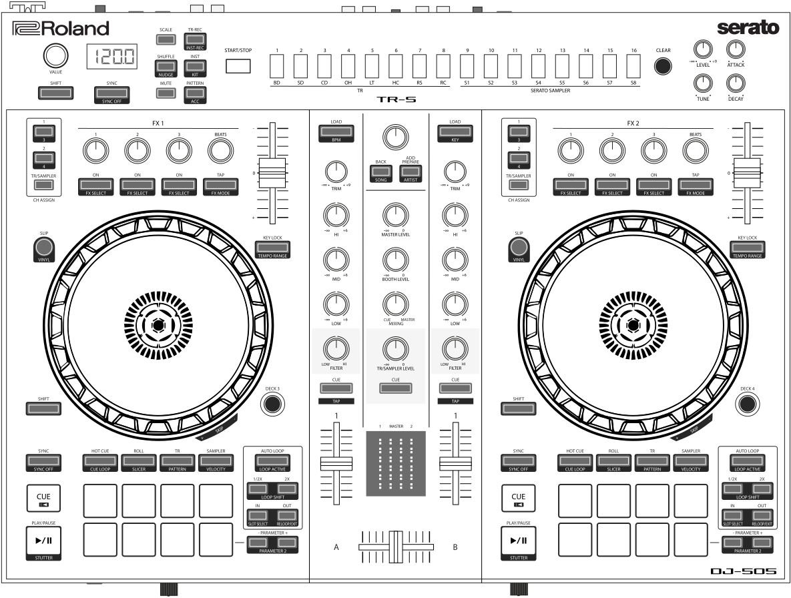

Roland DJ-505
=============

.. sectionauthor::
   Jan Holthuis <jholthuis@mixxx.org>

   Roland DJ-505 (schematic view)

The Roland DJ-505 is an all-in-one USB :term:`MIDI` controller with an integrated audio interface.
It has controls for 2 decks that can be toggled between decks to play with 4 decks.
It also features a TR-S step sequencer with sounds from the TR-808 and the TR-909 drum machines
(TR-606 and TR-707 are available via firmware update).

-  `Manufacturer’s product page <https://www.roland.com/global/products/dj-505/>`__
-  `Serato DJ Hardware Page <https://serato.com/dj/hardware/roland-dj-505>`__
-  `Owner’s Manual <https://www.roland.com/global/support/by_product/dj-505/owners_manuals/>`__
-  `Driver/Firmware/TR-S Samples Download Page <https://www.roland.com/global/products/dj-505/downloads>`__
-  `Mapping Forum Thread <https://mixxx.discourse.group/t/roland-dj-505/17916>`__

Drivers
-------

You can download the latest Windows & MacOS drivers and firmware from the `manufacturer’s website <https://www.roland.com/global/products/dj-505/downloads/>`__.
Since the DJ-505 is a USB class compliant MIDI and audio device, the device is plug-and-play on Linux.

Audio Setup
-----------

The mapping relies on the following channel assignments (for line/phono
input support, applying effects to the TR-S output, etc.):

===================== ================
Output Channels       Assigned to
===================== ================
1-2                   Master
3-4                   Headphones
===================== ================

===================== ================
Input Channels        Assigned to
===================== ================
1-2 (CH 1 Line/Phono) Vinyl Control 1
3-4 (CH 2 Line/Phono) Vinyl Control 2
5-6 (Mix)             Record/Broadcast
7-8 (TR-S output)     Auxiliary 1
===================== ================

The microphone, TR-S drum machine, and external inputs are mixed
together in input channels 5-6, so Mixxx can record and broadcast them.

The knobs for :hwlabel:`MASTER LEVEL`, :hwlabel:`BOOTH LEVEL`, :hwlabel:`PHONES VOLUME`, :hwlabel:`MIC LEVEL`, :hwlabel:`TR/SAMPLER LEVEL` and :hwlabel:`CUE/MASTER MIXING` are controlling the hardware mixer of the built-in audio interface.
Hence, turning the knobs will not change values in the Mixxx :term:`GUI` and you’ll need to set the Mixxx knobs to their default values when using the controller:

- Set the master/booth/headphones/microphone/aux channel levels to 100% (knob center position)
- Set cue/master mixing to cue-only (leftmost position)

.. note::
   You should assign the :guilabel:`Vinyl Control` input channels even if you do not intend to use timecode vinyl.
   These channel assignments are also needed to make the :hwlabel:`CH 1/2 PC/LINE/PHONO` switches work (i. e. passing through line or phono input to the left/right deck).

Controller Mapping
------------------

The control numbering in the schematic drawings matches the those found on the
specified page in the Owner’s Manual.

Browser Section (p. 4)
~~~~~~~~~~~~~~~~~~~~~~

   Roland DJ-505 (browser section)

========  ==================================================  ==========================================
No.       Control                                             Function
========  ==================================================  ==========================================
1         :hwlabel:`LOAD` buttons                             Load song into deck.
1         :hwlabel:`SHIFT` + :hwlabel:`LOAD` button (left)    Sort library by BPM (press repeatedly to toggle ascending/descending order).
1         :hwlabel:`SHIFT` + :hwlabel:`LOAD` button (right)   Sort library by key (press repeatedly to toggle ascending/descending order).
2         Rotary Selector                                     Turn to move tracklist cursor up/down. Press to toggle the selected item.
2         :hwlabel:`SHIFT` + Rotary Selector                  Turn to move sidebar cursor up/down.
3         :hwlabel:`BACK` button                              *Not yet mapped.*
3         :hwlabel:`SHIFT` + :hwlabel:`BACK` button           Sort library by title (press repeatedly  to toggle ascending/descending order).
4         :hwlabel:`ADD PREPARE` button                       (Un-)Maximizes the library view.
4         :hwlabel:`SHIFT` + :hwlabel:`ADD PREPARE` button    Sort library by artist (press repeatedly to toggle ascending/descending order).
========  ==================================================  ==========================================

Deck Section (p. 5-6)
~~~~~~~~~~~~~~~~~~~~~

   Roland DJ-505 (deck section)

========  ===============================================================  ==========================================
No.       Control                                                          Function
========  ===============================================================  ==========================================
1         Jog Wheel (top surface)                                          Perform scratch operation.
1         Jog Wheel (outer edge)                                           Rotate to lower/raise playback speed and pitch if key lock is off).
1         :hwlabel:`SHIFT` + Jog Wheel (top surface)                       Search fast through the track location.
2         :hwlabel:`SLIP` button                                           Hold to turn on slip mode temporarily or double press to turn it on permanently.
2         :hwlabel:`SHIFT` + :hwlabel:`SLIP` button                        Toggle vinyl control mode.
3         :hwlabel:`SHIFT` button                                          Hold down to access other functions.
4         :hwlabel:`SYNC` button                                           Match tempo and phase of other deck. Long press to set Deck as Sync Leader.
4         :hwlabel:`SHIFT` + :hwlabel:`SYNC` button                        Disables Sync mode.
5         :hwlabel:`CUE` button                                            Specifies, plays or recalls temporary cue point.
5         :hwlabel:`SHIFT` + :hwlabel:`CUE` button                         Returns to the beginning of the song.
6         :hwlabel:`PLAY/PAUSE` button                                     Plays or pause the song.
6         :hwlabel:`SHIFT` + :hwlabel:`PLAY/PAUSE` button                  Hold to play backwards.
7         Pad Mode Select                                                  See :ref:`Performance Pads <roland-dj-505-performancepads>`.
8         Performance Pads                                                 See :ref:`Performance Pads <roland-dj-505-performancepads>`.
9         :hwlabel:`PARAMETER` area                                        See :ref:`Performance Pads <roland-dj-505-performancepads>`.
10        :hwlabel:`LOOP` area: :hwlabel:`AUTO  LOOP` button               Turns auto loop on/off.
10        :hwlabel:`LOOP` area: :hwlabel:`1/2X`/:hwlabel:`2X` buttons      Set the loop playback length to half/double.
10        :hwlabel:`LOOP` area: :hwlabel:`SHIFT` + :hwlabel:`1/2X` button  Move the loop by it’s length toward the left.
10        :hwlabel:`LOOP` area: :hwlabel:`SHIFT` + :hwlabel:`2X` button    Move the loop by it’s length toward theright.
10        :hwlabel:`LOOP` area: :hwlabel:`IN`/:hwlabel:`OUT` button        Specify loop-in/loop-out points.
10        :hwlabel:`LOOP` area: :hwlabel:`SHIFT` + :hwlabel:`IN` button    Toggle beats quantization.
10        :hwlabel:`LOOP` area: :hwlabel:`SHIFT` + :hwlabel:`OUT` button   Cancels loop playback, go to loop-in point and resume playback.
11        :hwlabel:`DECK 3`/:hwlabel:`DECK  4` buttons                     Switches the deck (left: decks 1 and 3, right: decks 2 and 4)
12        :hwlabel:`KEY LOCK`                                              Toggle key lock.
12        :hwlabel:`SHIFT` + :hwlabel:`KEY LOCK`                           Cycles through tempo slider range (8%, 16%, 50%).
13        Tempo slider                                                     Adjust song playback speed (and pitch if key lock if off).
========  ===============================================================  ==========================================

Mixer Section (p. 7)
~~~~~~~~~~~~~~~~~~~~

.. figure:: ../../_static/controllers/roland_dj_505_mixer.svg
   :align: center
   :width: 50%
   :figwidth: 100%
   :alt: Roland DJ-505 (mixer section)
   :figclass: pretty-figures

   Roland DJ-505 (mixer section)

========  ===============================================================  ==========================================
No.       Control                                                          Function
========  ===============================================================  ==========================================
1         :hwlabel:`TRIM` knobs                                            Adjust the deck gain (prefader)
2         :hwlabel:`HI`/:hwlabel:`MID`/:hwlabel:`LOW` knobs                Adjust the high/mid/low-frequency regions of the song.
3         :hwlabel:`FILTER` knobs                                          QuickEffect superknob (filter by default, can be changed to a different effect in Mixxx preferences)
4         Channel :hwlabel:`CUE` buttons                                   Toggle PFL for each channel.
4         :hwlabel:`SHIFT` + :hwlabel:`CUE` buttons (short press)          Adjust beatgrid so that the closest beat is set to the current cursor position.
4         :hwlabel:`SHIFT` + :hwlabel:`CUE` buttons (long press)           Adjust beatgrid to match another playing deck.
4         :hwlabel:`SHIFT` + :hwlabel:`CUE` buttons (tap repeatedly)       Set tempo by tapping on each beat.
5         Channel faders                                                   Adjust the output level for each channel.
6         Cross fader                                                      Fades between left and right deck.
7         :hwlabel:`MASTER LEVEL` knob                                     Adjusts the master output level.
8         :hwlabel:`BOOTH LEVEL` knob                                      Adjusts the output level of the :hwlabel:`BOOTH OUT` jacks.
9         :hwlabel:`MIXING` knob                                           Fades between PFL and master output in headphones
10        :hwlabel:`TR/SAMPLER LEVEL` knob                                 Adjusts output of the TR-S (Aux 3) and Samplers 1-16.
11        :hwlabel:`TR/SAMPLER CUE` button                                 Toggle PFL of the TR-S (Aux 3) and Samplers 1-16.
12        Level indicator                                                  Indicate the output level of each channel and master.
========  ===============================================================  ==========================================

Effects Section (p. 7)
~~~~~~~~~~~~~~~~~~~~~~

.. figure:: ../../_static/controllers/roland_dj_505_effects.svg
   :align: center
   :width: 60%
   :figwidth: 100%
   :alt: Roland DJ-505 (effects section)
   :figclass: pretty-figures

   Roland DJ-505 (effects section)

========  ===============================================================  ==========================================
No.       Control                                                          Function
========  ===============================================================  ==========================================
1         :hwlabel:`CH ASSIGN` area                                        Toggle effect units 1/2 for decks 1/2 (3/4 if :hwlabel:`SHIFT` is pressed) or the TR-S (Aux 3) and Samplers 1-16.
2-5       *Various*                                                        See `Standard Effects Mapping <https://github.com/mixxxdj/mixxx/wiki/Standard-Effects-Mapping>`__.
========  ===============================================================  ==========================================

TR-S Section (p. 8)
~~~~~~~~~~~~~~~~~~~

   Roland DJ-505 (TR-S section)

========  ===============================================================  ==========================================
No.       Control                                                          Function
========  ===============================================================  ==========================================
1         :hwlabel:`VALUE` knob                                            *See Owner’s Manual.*
2         :hwlabel:`SHIFT` button                                          Hold down to access other functions.
3         Display                                                          *See Owner’s Manual.*
4         :hwlabel:`SYNC` button                                           Match tempo of playing deck (phase matching is not implemented yet, use the :hwlabel:`NUDGE` button instead).
4         :hwlabel:`SHIFT` + :hwlabel:`SYNC` button                        *Currently not mapped.*
5-17      *Various*                                                        *See Owner’s Manual.*
========  ===============================================================  ==========================================

Front Panel (p. 8)
~~~~~~~~~~~~~~~~~~

========  ===============================================================  ==========================================
No.       Control                                                          Function
========  ===============================================================  ==========================================
1         :hwlabel:`PHONES` jacks                                          Connect headphones here.
2         :hwlabel:`VOLUME` knob                                           Adjust the volume of the headphones.
3         :hwlabel:`CROSS FADER` switch                                    Switch the cross fader response curve.
4         :hwlabel:`REVERSE` switch                                        Switch cross fader reverse (hamster) mode on/off.
5         :hwlabel:`CH1`/:hwlabel:`CH 2` switches: :hwlabel:`PC`           Selects Mixxx deck as input source (Unmute the Mixxx deck and mute Aux 1/2).
5         :hwlabel:`CH1`/:hwlabel:`CH 2` :hwlabel:`LINE/PHONO`             Selects Line/Phono input source (Mute the Mixxx deck and unmute Aux 1/2).
6         :hwlabel:`MIC LEVEL` knob                                        Adjust the microphone volume.
========  ===============================================================  ==========================================

.. _roland-dj-505-performancepads:

Performance Pads
~~~~~~~~~~~~~~~~

You can use the Pad Mode Select buttons to select a mode for the
performance pads.

==========================================================  =====================  ==========
Control                                                     Mode                   LED Color
==========================================================  =====================  ==========
:hwlabel:`HOT CUE` button                                   Hot Cue Mode           White
:hwlabel:`SHIFT` + :hwlabel:`HOT CUE` button                Cue Loop Mode          Blue
:hwlabel:`SHIFT` + :hwlabel:`HOT CUE` button (press twice)  Prepare Mode           Red
:hwlabel:`ROLL` button                                      Roll Mode              Light blue
:hwlabel:`ROLL` button (press twice)                        Loop Mode              Green
:hwlabel:`TR` button                                        TR Mode                Red
:hwlabel:`SHIFT` + :hwlabel:`TR` button                     Pattern Mode           Green
:hwlabel:`TR` button (press twice)                          TR Velocity Mode       Orange
:hwlabel:`SAMPLER` button                                   Sampler Mode           Magenta
:hwlabel:`SHIFT` + :hwlabel:`SAMPLER` button                Velocity Sampler Mode  Purple
:hwlabel:`SAMPLER` button (press twice)                     Pitch Play Mode        Green
==========================================================  =====================  ==========

Most pad modes are similar to those found when used with Serato. A
notable exception is the Loop Mode, which replaces the Serato’s Saved
Loop Mode. In this mapping, the Loop Mode is similar to the Roll mode,
but sets a non-rolling beatloop instead.

Modes that are described in the owner’s manual (Slicer, Slicer
Loop, Saved Loop, Flip) but not listed below are currently not mapped.

Hot Cue Mode
^^^^^^^^^^^^

   Roland DJ-505 (performance pads)

Bookmark positions in the track and jump to them.

========  ===============================================================  ==========================================
No.       Control                                                          Function
========  ===============================================================  ==========================================
1-8       Pad (unlit)                                                      Save current position as hot cue.
1-8       Pad (lit)                                                        Jump to hot cue. If the track is stopped, holding the pad will preview the hot cue until the pad is released.
1-8       :hwlabel:`SHIFT` + Pad (lit)                                     Clear hot cue.
9         :hwlabel:`PARAMETER -` button                                    Change color of last used hotcue to the previous color in the palette.
10        :hwlabel:`PARAMETER +` button                                    Change color of last used hotcue to the next color in the palette.
9         :hwlabel:`SHIFT` + :hwlabel:`PARAMETER -` button                 Move beatgrid left.
10        :hwlabel:`SHIFT` + :hwlabel:`PARAMETER +` button                 Move beatgrid right.
========  ===============================================================  ==========================================

Cue Loop Mode
^^^^^^^^^^^^^

   Roland DJ-505 (performance pads)

Set beatloop from a hot cue point.

========  ===============================================================  ==========================================
No.       Control                                                          Function
========  ===============================================================  ==========================================
1-8       Pad (lit)                                                        Set a beatloop at the position of the hotcue and jump to it.
1-8       Pad (unlit)                                                      Save the current position as hot cue and set a beatloop.
9         :hwlabel:`PARAMETER -` button                                    Halve the size of the current loop.
9         :hwlabel:`PARAMETER +` button                                    Double the size of the current loop.
9-10      :hwlabel:`SHIFT` + :hwlabel:`PARAMETER -/+` buttons              *Currently not mapped*.
========  ===============================================================  ==========================================

Prepare Mode
^^^^^^^^^^^^

   Roland DJ-505 (performance pads)

This mode allow you to prepare tracks by setting intro/outro cues.

========  ===============================================================  ==========================================
No.       Control                                                          Function
========  ===============================================================  ==========================================
1         Pad (unlit)                                                      Set current position as intro start.
1         Pad (lit)                                                        Jump to intro start position.
2         Pad (unlit)                                                      Set current position as intro end.
2         Pad (lit)                                                        Jump to intro end position.
3         Pad (unlit)                                                      Set current position as outro start.
3         Pad (lit)                                                        Jump to outro start position.
4         Pad (unlit)                                                      Set current position as outro end.
4         Pad (lit)                                                        Jump to outro end position.
5-8       Pad                                                              *Currently not mapped*.
9-10      :hwlabel:`SHIFT` + :hwlabel:`PARAMETER -/+` buttons              *Currently not mapped*.
========  ===============================================================  ==========================================

.. note:: This mode has been added by the Mixxx developers and is not available in
          Serato.

Roll Mode
^^^^^^^^^

   Roland DJ-505 (performance pads)

The Roll Mode provides quick access to rolling loops and beatjumps.

========  ===============================================================  ==========================================
No.       Control                                                          Function
========  ===============================================================  ==========================================
1-4       Pad (hold)                                                       Play a rolling loop with the beatlength that is assigned to the pad.
5         Pad (press)                                                      Beatjump left.
6         Pad (press)                                                      Decrease beatjump size.
7         Pad (press)                                                      Increase beatjump size.
8         Pad (press)                                                      Beatjump right.
9         :hwlabel:`PARAMETER -` button                                    Halve the size of the current loop.
9         :hwlabel:`PARAMETER +` button                                    Double the size of the current loop.
9-10      :hwlabel:`SHIFT` + :hwlabel:`PARAMETER -/+` buttons              *Currently not mapped*.
========  ===============================================================  ==========================================

TR/Pattern/TR Velocity Modes
^^^^^^^^^^^^^^^^^^^^^^^^^^^^

These modes are hardcoded in the device firmware, so they work exactly as
described in the Owner’s Manual.

Sampler/Velocity Sampler Play Modes
^^^^^^^^^^^^^^^^^^^^^^^^^^^^^^^^^^^

   Roland DJ-505 (performance pads)

The sampler modes allow you to load, play and stop samples in the first 8 sample slots.

========  ===============================================================  ==========================================
No.       Control                                                          Function
========  ===============================================================  ==========================================
1-8       Pad (unlit)                                                      Load currently selected track into the sample slot associated with the pad.
1-8       :hwlabel:`SHIFT` + Pad (lit)                                     If the sample is playing, stop the playback. If the sample is not playing, eject the sample from the sample slot.
1-8       Pad (lit)                                                        Play the sample in the sample slot associated with the pad. *Velocity Sampler Mode*: The playback volume of the sample depends on the pressure (velocity).
9-10      :hwlabel:`PARAMETER -/+` buttons                                 *Currently not mapped*.
========  ===============================================================  ==========================================

Pitch Play Mode
^^^^^^^^^^^^^^^

   Roland DJ-505 (performance pads)

Play the track from a hot cue position and change the pitch in semitone steps.
Pads right of the white lit pad raise the pitch, pads left of it lower it.

========  ===============================================================  ==========================================
No.       Control                                                          Function
========  ===============================================================  ==========================================
1-8       Pad                                                              Play currently selected hotcue with modified pitch.
1-8       :hwlabel:`SHIFT` + Pad (dimly lit)                               Select hot cue for pitch play. The pad of the currently selected hotcue pad is lit.
9-10      :hwlabel:`PARAMETER -/+` buttons                                 Cycles through semitone ranges (Up, Mid, Down).
========  ===============================================================  ==========================================

Known Issues
------------

-  TR-S Syncing currently works at the :term:`BPM` level, but phase syncing is not implemented yet.
   As a workaround, the :hwlabel:`NUDGE` button can be used to adjust the phase.
   This depends on :term:`MIDI` clock I/O (`Launchpad Bug #682221 <https://bugs.launchpad.net/mixxx/+bug/682221>`__).
-  Some performance pad modes are missing
   (Slicer [`Launchpad Bug #1828886 <https://bugs.launchpad.net/mixxx/+bug/1828886>`__],
   Slicer Loop,
   Saved Loop [`Launchpad Bug #1367159 <https://bugs.launchpad.net/mixxx/+bug/1367159>`__, `PR #2194 <https://github.com/mixxxdj/mixxx/pull/2194>`__ ],
   Flip [`Launchpad Bug #1768113 <https://bugs.launchpad.net/mixxx/+bug/1768113>`__])
-  Some buttons are not mapped yet (e.g. :hwlabel:`BACK`)
-  LEDs on :hwlabel:`BACK`/:hwlabel:`ADD PREPARE` do not work
   (this seems to be a hardware/firmware bug and does not work in Serato either)
-  Controller does not send current cross fader value on Serato SysEx Message
   (this seems to be a hardware/firmware bug and does not work in Serato either)
