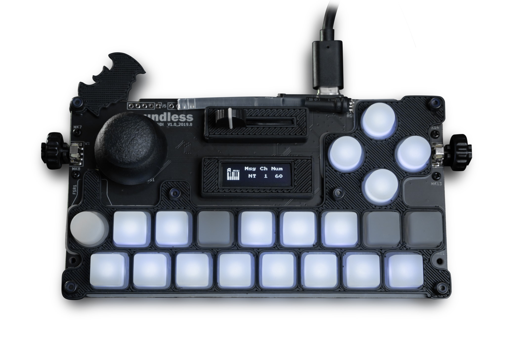
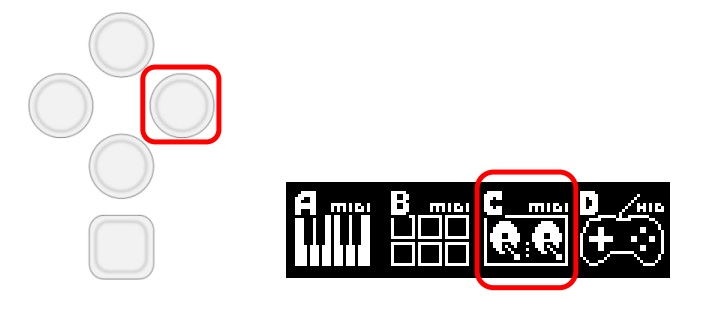
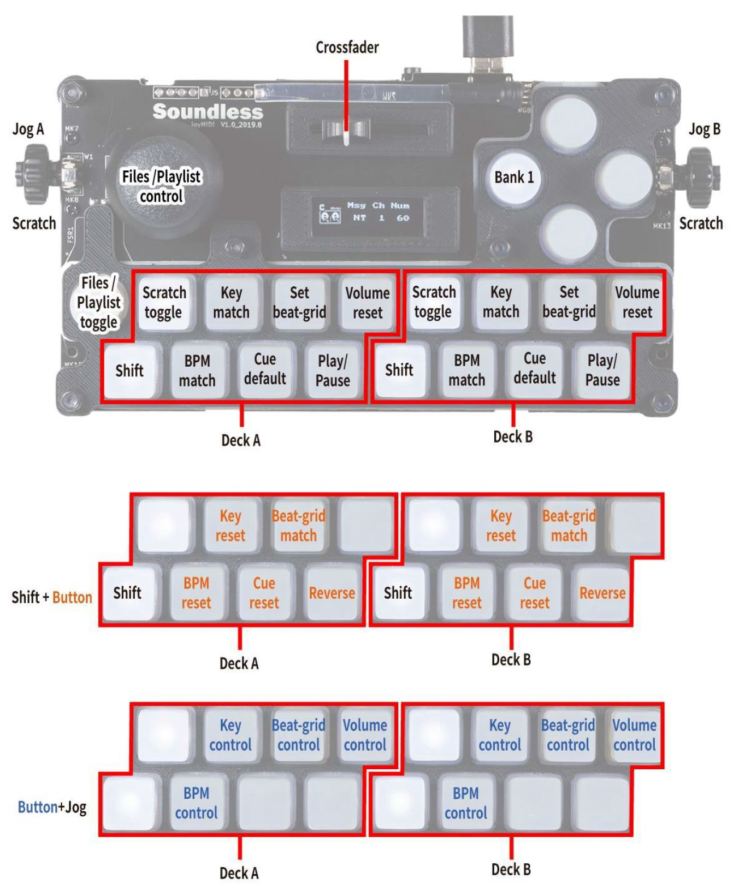
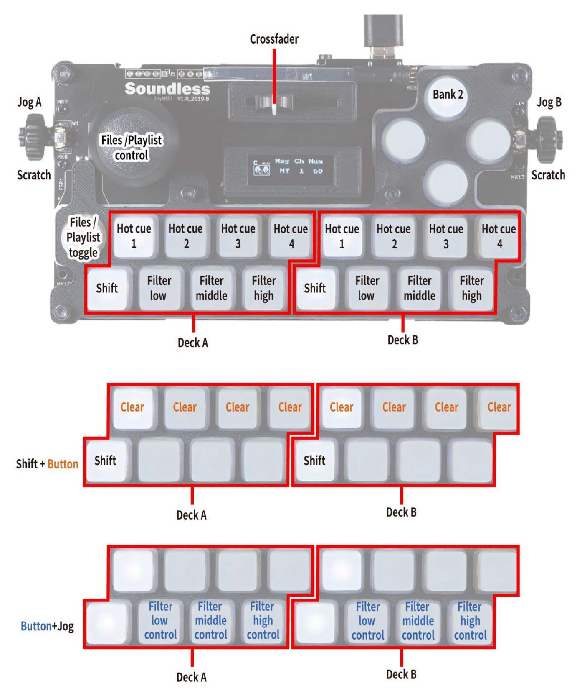
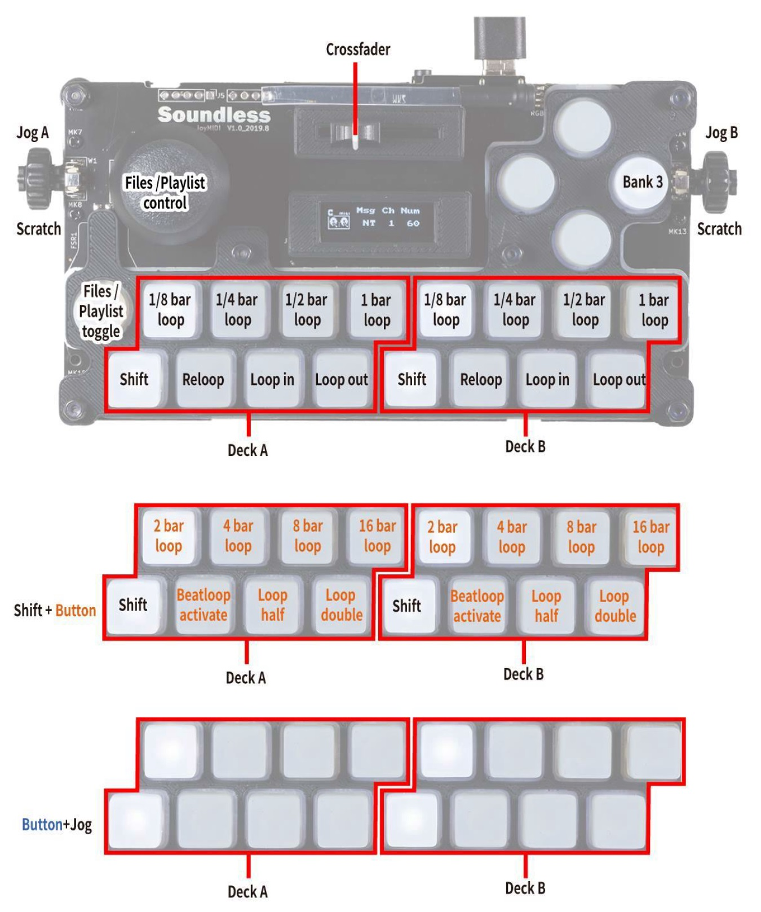
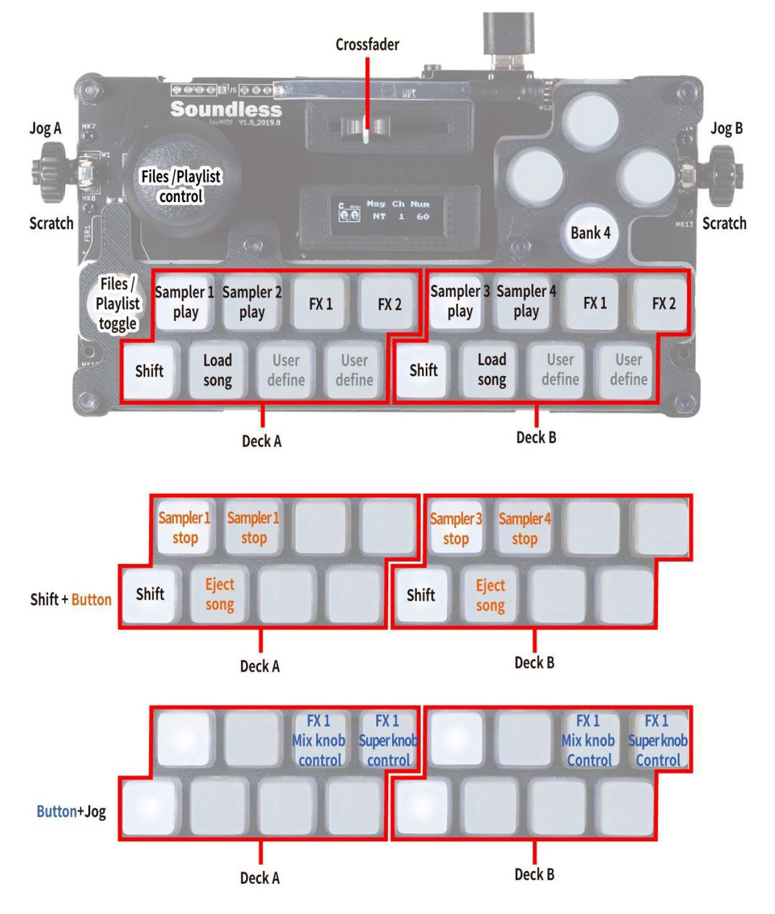

# Soundless Studio joyMIDI


```{figure-md}
:align: center




Soundless Studio joyMIDI (top view)
```
The joyMIDI is a portable 4-in-1 MIDI controller with 4 operating modes: Keyboard (MIDI), DrumPad (MIDI), DJ (MIDI) and GamePad (HID joystick). The case is 3D printed and the design files are open source on [Onshape](https://cad.onshape.com/documents/c5f92a07a4d54ab29d262073/w/195dd1080bfce9ec5ba8b2bb/e/f9290828ff0d2bcdf7fc0cec).

-  [User Manual](https://984bf1a1-5190-4ce1-b1ac-4b857c6baad7.filesusr.com/ugd/fb7f0b_5a2a82c2d00747fda3deb592ef0747f1.pdf)
   (See the chapter 7.3 , DJ controller mode)
-  [Forum thread](https://mixxx.discourse.group/t/soundless-joymidi/18265)

:::{versionadded} 2.2.4
:::
## Mapping Description


After powering on the device, press the right button to enter the DJ controller mode.

```{figure-md}
:align: center




Entering the DJ controller mode on the joyMIDI.
```
### Bank 1


```{figure-md}
:align: center




Soundless Studio joyMIDI (bank 1)

```
### Bank 2


```{figure-md}
:align: center




Soundless Studio joyMIDI (bank 2)

```
### Bank 3


```{figure-md}
:align: center




Soundless Studio joyMIDI (bank 3)

```
### Bank 4


```{figure-md}
:align: center




Soundless Studio joyMIDI (bank 4)
```
