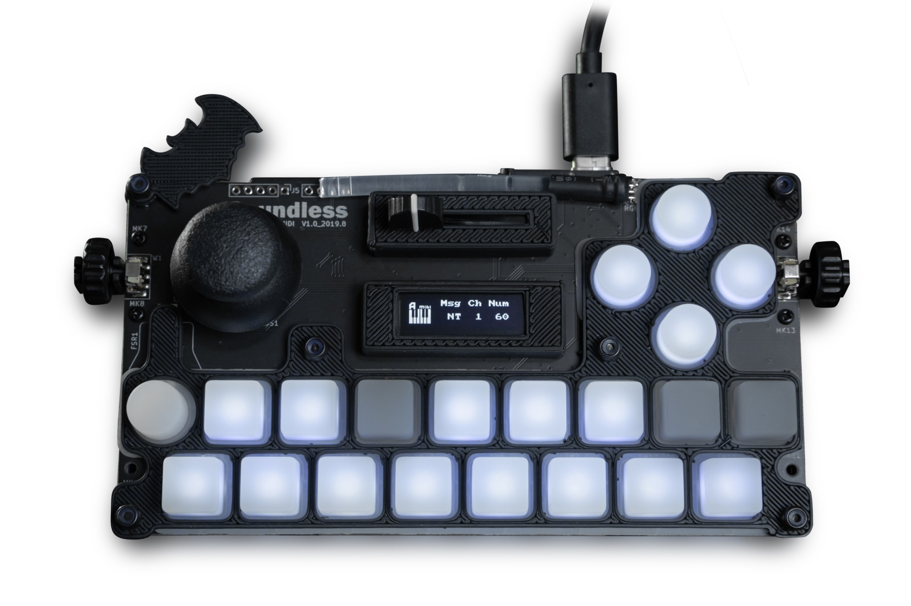
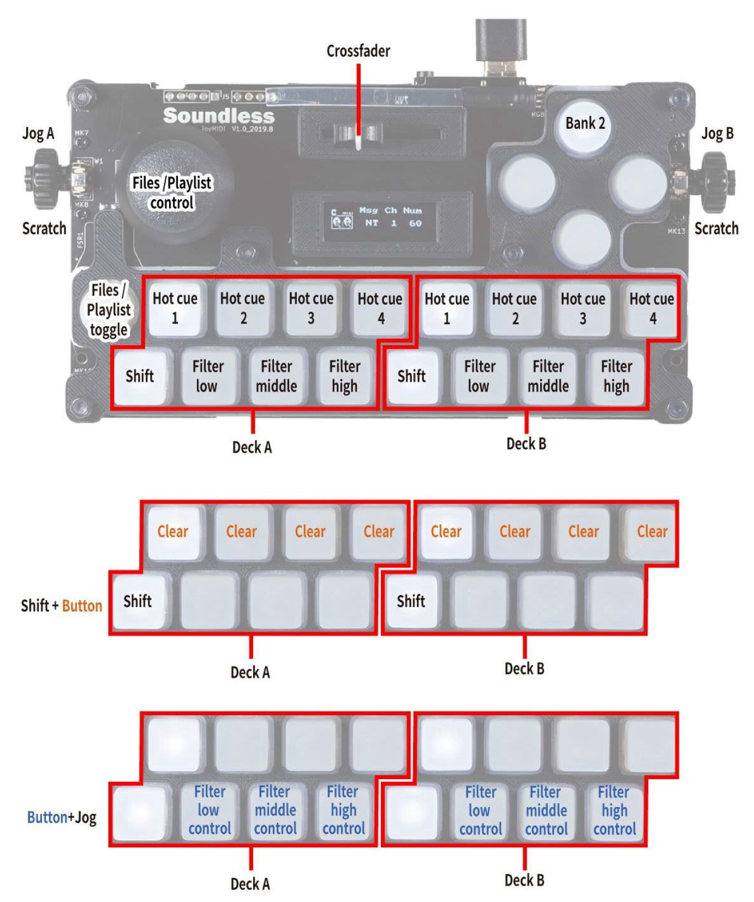
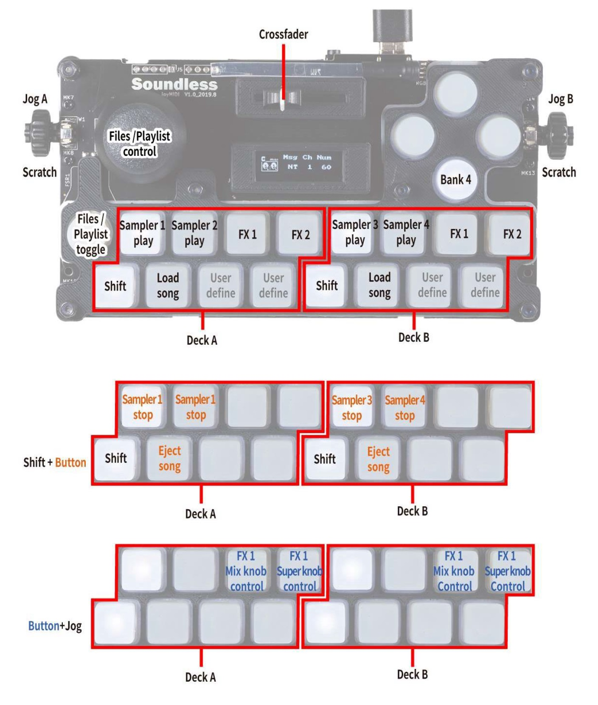

Soundless Studio joyMIDI
========================

   Soundless Studio joyMIDI (top view)

The joyMIDI is a portable 4-in-1 MIDI controller with 4 operating modes: Keyboard (MIDI), DrumPad (MIDI), DJ (MIDI) and GamePad (HID joystick). The case is 3D printed and the design files are open source on `Onshape <https://cad.onshape.com/documents/c5f92a07a4d54ab29d262073/w/195dd1080bfce9ec5ba8b2bb/e/f9290828ff0d2bcdf7fc0cec>`__.

-  `Manufacturer’s product page <https://www.sndlss.com/?lang=en>`__
-  `User Manual <https://984bf1a1-5190-4ce1-b1ac-4b857c6baad7.filesusr.com/ugd/fb7f0b_5a2a82c2d00747fda3deb592ef0747f1.pdf>`__
   (See the chapter 7.3 , DJ controller mode)
-  `Forum thread <https://www.mixxx.org/forums/viewtopic.php?f=7&t=13166&p=43644#p43644>`__

Mapping Description
-------------------

After powering on the device, press the right button to enter the DJ controller mode.

.. figure:: ../../_static/controllers/soundless_studio_joymidi_enterdj.jpg
   :align: center
   :width: 100%
   :figwidth: 100%
   :alt: Entering the DJ controller mode on the joyMIDI.
   :figclass: pretty-figures

   Entering the DJ controller mode on the joyMIDI.

Bank 1
~~~~~~

.. figure:: ../../_static/controllers/soundless_studio_joymidi_bank1.jpg
   :align: center
   :width: 100%
   :figwidth: 100%
   :alt: Soundless Studio joyMIDI (bank 1)
   :figclass: pretty-figures

   Soundless Studio joyMIDI (bank 1)

Bank 2
~~~~~~

   Soundless Studio joyMIDI (bank 2)

Bank 3
~~~~~~

.. figure:: ../../_static/controllers/soundless_studio_joymidi_bank3.jpg
   :align: center
   :width: 100%
   :figwidth: 100%
   :alt: Soundless Studio joyMIDI (bank 3)
   :figclass: pretty-figures

   Soundless Studio joyMIDI (bank 3)

Bank 4
~~~~~~

   Soundless Studio joyMIDI (bank 4)
