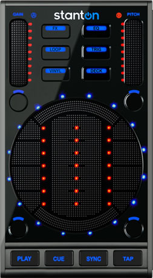
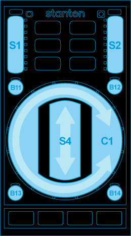

.. _stanton-scs-3d:

Stanton SCS.3d “DaScratch”
==========================

-  `Manufacturer’s product page <http://www.stantondj.com/stanton-controllers-systems/scs3d.html>`__
-  `Walk-through video! <http://www.youtube.com/watch?v=8DUpTikA8u0>`__

.. versionadded:: 1.7

Default Mapping
---------------

   Stanton SCS.3d (layout)

**Easy customization:** We have provided the following customization variables
at the top of the script you can set to your liking:

-  **pitchRanges** - Set the pitch slider range when the Pitch LED is off, blue,
   purple and red (in decimal values. E.g. 0.08 = 8%, 0.5 = 50%)
-  **fastDeckChange** - If set to true, changes decks instantly by skipping the
   flashing lights. Useful for beat juggling on one unit.
-  **spinningPlatter** - If set to true, uses the circle LEDs to *accurately*
   (*no sticker drift!*) show the track position in record revolutions, also
   useful for juggling.
-  **spinningPlatterOnlyVinyl** - If set to true, only shows the spinning
   platter LED in vinyl modes. Otherwise shows in all modes except Loop, Instant
   Pitch Change and TRIG (because they’re used for other things in those modes.)
-  **spinningLights** - The number of lights used for the spinning platter
   effect, 1 or 2. (1 is best for juggling.)
-  **VUMeters** - If set to true, shows a VU meter in the circular area for the
   currently selected deck when in vinyl mode. (Left for deck 1, right for deck
   2.)
-  **markHotCues** - Set to ``"blue"`` or ``"red"`` (with quotes) to choose
   which LEDs mark the stored positions in TRIG & LOOP modes
-  **jogOnLoad** - If true, the unit will automatically change to Vinyl (jog)
   mode after loading a track (from Track Select mode)
-  **globalMode** - If true, the unit will stay in the current mode on deck
   changes (instead of switching to the mode you were in the last time you
   controlled that deck.)
-  **singleDeck** - If you’ve got more than one MIDI controller, set this to
   true to have the SCS.3d stay on one deck and make Deck mode non-temporary.
   `More on this here <#deck-mode>`__.
-  **deckChangeWait** - Time in milliseconds to hold the DECK button down to
   avoid changing decks
-  **pitchAdjustment** - Adjusts the coarseness of the pitch slider (1=coarse,
   3=normal, 5=fine)
-  **finePitchAdjustment** - Adjusts the coarseness of the pitch slider in fine
   mode (1=coarser, 3=normal, 5=finer)
-  **finePitchDefault** - If true, swaps normal and fine pitch modes so you can
   use fine pitch mode unshifted

Just open the ``controllers/Stanton-SCS3d-scripts.js`` file in your favorite
text editor and you’ll see these variables right near the top. Edit & save.

Mode buttons
~~~~~~~~~~~~

.. figure:: ../../_static/controllers/stanton_scs3d_modebuttons.jpg
   :align: center
   :figwidth: 100%
   :alt: Stanton SCS.3d (mode buttons)
   :figclass: pretty-figures

   Stanton SCS.3d (mode buttons)

-  FX - Adjust & toggle Flanger effect, toggle reverse effect
-  EQ - Adjust channel EQ parameters
-  Loop - Loop controls and Instant pitch changes
-  Trig - Hot cues
-  Vinyl - Toggle between pitch bend, vinyl manipulation & scratching, and track
   selection
-  Deck - Adjust global controls and switch to another virtual deck

Common to all modes:
^^^^^^^^^^^^^^^^^^^^

(except where noted)

-  Gain slider (S1) adjusts deck volume
-  Pitch slider (S2) adjusts deck pitch control
-  B11 toggles headphone cue
-  B12 toggles pitch range (black=8%, blue=12%, purple=50%, red=100%)
-  B13 Rewind (REW)
-  B14 Fast Forward (FFWD)
-  PLAY starts or pauses track playback.
-  CUE will jump to the cue point or set it, depending on your settings and
   whether the track is playing.
-  SYNC synchronizes the tempo of the current deck to another. Holding SYNC for
   more than 1/3 of a second will enable Master SYNC lock. (Press SYNC again to
   disable it.)
-  Pressing TAP repeatedly will change the speed of the current deck to match
   your tap tempo (useful for synchronizing with an external music source.)

**While holding down the current mode button:**

-  Gain slider (S1) adjusts pre-fader gain
-  Pitch slider (S2) finely adjusts pitch control
-  B11 resets pre-fader gain to center
-  B12 resets pitch to center 0%
-  SYNC toggles the :term:`Quantize <quantization>`
   function (where Cue and Loop points snap to the nearest beat and triggering
   them happens in time with the beat.)

FX Modes
~~~~~~~~

These modes let you adjust the effect unit parameters. The FX button will be red
when adjusting effect unit 1, purple for unit 2, and black for unit 3. (In Mixxx
versions below 2.0.1, there is only one mode that adjusts the Flanger effect.)

.. figure:: ../../_static/controllers/stanton_scs3d_slidermode.jpg
   :align: center
   :figwidth: 100%
   :alt: Stanton SCS.3d (slider mode)
   :figclass: pretty-figures

   Stanton SCS.3d (slider mode)

-  Left slider (S3) adjusts the first effect parameter
-  Center slider (S4) adjusts the second effect parameter
-  Right slider (S5) adjusts the third effect parameter
-  B11 performs a reverse-roll (censor) while held down
-  B12 toggles this effect on the current deck

Hold the FX button down and touch any slider to reset it to center.

EQ Mode
~~~~~~~

.. figure:: ../../_static/controllers/stanton_scs3d_slidermode.jpg
   :align: center
   :figwidth: 100%
   :alt: Stanton SCS.3d (slider mode)
   :figclass: pretty-figures

   Stanton SCS.3d (slider mode)

-  Left slider (S3) adjusts low frequency equalizer
-  Center slider (S4) adjusts mid frequency equalizer
-  Right slider (S5) adjusts high frequency equalizer

Hold the EQ button down and touch any slider to reset it to center.

Loop mode (red)
~~~~~~~~~~~~~~~

The surface is configured as 11 buttons:

============= =========== ============
Left          Middle      Right
============= =========== ============
1/8-beat loop Loop In     2-beat loop
1/4-beat loop Reloop/Exit 4-beat loop
1/2-beat loop Reloop/Exit 8-beat loop
1-beat loop   Loop Out    16-beat loop
============= =========== ============

**Mixxx v2.0.1 and above** have the left column flipped so you can adjust the
loop size sequentially when moving along the circle:

============= =========== ============
Left          Middle      Right
============= =========== ============
1-beat loop   Loop In     2-beat loop
1/2-beat loop Reloop/Exit 4-beat loop
1/4-beat loop Reloop/Exit 8-beat loop
1/8-beat loop Loop Out    16-beat loop
============= =========== ============

The Reloop/Exit button lights up when a loop is active. If it happens to be an
exact number of beats, the corresponding beat loop button will light up as well.

Also:

-  **B11** (under the Gain slider) halves the length of the current loop
-  **B12** (under the Pitch slider) doubles the length of the current loop

You can exit any loop by pressing Reloop/Exit (or a lit beat loop button.)

Instant-pitch change modes (Loop button)
----------------------------------------

This offers instant pitch change buttons in the following arrangements:

**Key change (purple)** - Center buttons are one semitone away from their
vertical neighbors and the outside ones are three semitones away (for harmonic
key changes.)

**Notes (black)** - Buttons correspond to major scale notes (ala Vestax
Controller One.) This is most useful with a constant-pitch sound or chord. (You
can generate one in Audacity.)

Remember you can return to the original pitch (tonic) by pressing B12 (under the
pitch slider.)

Note that when you use one of these buttons, the pitch range is automatically
set to 100% in order for the values to be set correctly.

*Key change and Note modes were tuned with respect to 440Hz A (above middle C.)*

**1.7 also offered the following** since looping was not available:

**Fixed increment (red)** - Each button sets the pitch 3.33% above or below its
vertical neighbors.

Trig Modes
~~~~~~~~~~

These modes configure the surface as three separate banks of 12 buttons (lit up
dim red for visibility) giving you a total of THIRTY-SIX hot cues! (Mixxx
1.8.0-1.9.0 internally supports just 32, so the center 4 buttons and the lower
right one in the third bank (black) are inoperative. Mixxx 1.9.1+ supports 36
again.) The TRIG button will be red in bank 1, purple in bank 2, and black in
bank 3.

The red LEDs flash when you press the corresponding button. The outer blue LEDs
light when a cue point is set on that button. (Changeable with the
**markHotCues** option mentioned at the top of this page.)

-  To set a cue, just press a free button at the desired time.
-  To recall a cue, just press a button that has a cue point set
-  To erase a cue, hold TRIG while pressing the button(s) you want to erase

Vinyl Modes
-----------

   Stanton SCS.3d (circle mode)

**Vinyl mode (red)**

-  Outer circle (C1) and Center slider (S4) allow you to bend the song’s pitch,
   akin to dragging your finger on the record

**Vinyl2 Mode (purple)**

-  Outer circle (C1) allows you to “scratch” the song and perform juggles
-  Center slider (S4) allows you to “scratch” the song
-  Scratch & cue toggle: Hold the VINYL button and press CUE when in Vinyl2 mode
   to toggle recalling the cue point when you touch either C1 or S4. This makes
   juggling really easy since you don’t have to back-cue.

**Track Select Mode (black)**

-  Outer circle (C1) allows you to scroll through your Library
-  Center button (anywhere on S4) loads the currently highlighted song into the
   current deck, as long as it’s not live (playing to the master output.)
-  B11 selects backward between Library, Playlist, Browse, etc. views
-  B12 selects forward between Library, Playlist, Browse, etc. views
-  B13 moves the highlight up one item
-  B14 moves the highlight down one item

Deck Mode
~~~~~~~~~

.. figure:: ../../_static/controllers/stanton_scs3d_slidermode.jpg
   :align: center
   :figwidth: 100%
   :alt: Stanton SCS.3d (slider mode)
   :figclass: pretty-figures

   Stanton SCS.3d (slider mode)

You are in this mode only **while holding down the Deck button**, unless the controller is in single-deck mode:

-  Gain slider (S1) adjusts master volume
-  Pitch slider (S2) adjusts master balance (pan)
-  B11 resets master volume knob to the middle
-  B12 resets master balance to center
-  Left slider (S3) adjusts the cue/main headphone mix
-  Center slider (S4) adjusts the cross-fader
-  Right slider (S5) adjusts the headphone volume
-  TAP resets cross-fader to center position (only in multi-deck mode)
-  Press Deck + Sync together to toggle between multi- and single-deck modes
-  In single-deck mode:
-  Hold the Deck button down and touch any slider to reset it to its default
   value
-  Press Deck + Play together to change the active deck

Alternate mapping
-----------------

An alternate preset was provided by a member of the community for Mixxx 2.0. It
has many more visual effects (flashing lights) and behaves somewhat differently
from the official preset above. To use this alternate preset in Mixxx 2.0,
select the preset labeled **Stanton SCS.3d (alternate)** from the drop down menu
in the controller preferences.

General controls
~~~~~~~~~~~~~~~~

.. figure:: ../../_static/controllers/stanton_scs3d_slidermode.jpg
   :align: center
   :figwidth: 100%
   :alt: Stanton SCS.3d (slider mode)
   :figclass: pretty-figures

   Stanton SCS.3d (slider mode)

Unless otherwise noted, the following controls have the same function in all
modes.

-  S1 controls volume of currently active deck.
-  S2 changes rate or pitch depending on current mode, see VINYL-mode for
   discussion.
-  PLAY starts or pauses the track. When a track is ready to play the button
   blinks.
-  CUE will jump to the cue point or set it, depending on your settings and
   whether the track is playing.
-  SYNC syncs the active deck to another deck. Holding SYNC for more than one
   second will enable SYNC lock.
-  Pressing TAP repeatedly will adjust track BPM.

The currently active deck/channel is shown by lighting one of B11 through B14
red (except for FX-mode where the selected FX chain is shown). B11 lights red
for deck 1, B12 for deck 2, B13 for deck 3 and B14 for deck 4. See DECK and FX
modes on how to control this.

A light spinning around the circle shows the track is playing. When the track
nears its end (at -30 seconds), a blinking light will detach and run slower.
When the spinning light reaches the blinking light, the track ends.

By touching one of the six mode buttons, you switch to that mode. Some modes
have alternate overlays, you can switch to those by touching the mode again. The
first overlay is red, the second blue, the third is purple. The following
mode-overlays are available:

.. figure:: ../../_static/controllers/stanton_scs3d_modebuttons.jpg
   :align: center
   :figwidth: 100%
   :alt: Stanton SCS.3d (mode buttons)
   :figclass: pretty-figures

   Stanton SCS.3d (mode buttons)

-  FX: (red) Control effect device; (blue) Control deck superknob
-  EQ: (red) Control deck EQ
-  LOOP: (red) Set/release beat-loops; (blue) Rolling-loops
-  TRIG: (red) cue points 1 through 5; (blue) cue points 6 through 10; (pink)
   cue points 11 through 15;
-  VINYL: (red) jog wheel; (blue) scratch
-  DECK: (red) library scan & load

Modes are remembered per-deck. When you switch the deck, the mode last active
for that deck will be selected.

By holding a mode button, a mode is enabled temporarily in hold-mode. When the
button is released again, the device switches back to the previously selected
mode. Some hold-modes enable alternative, often disruptive functionality. Most
of the time you won’t want to use the hold-modes on live decks (e.g. needledrop
in VINYL) or you must be very cautious (assigning effect chains with FX).

Each mode will be explained in detail below.

FX mode
~~~~~~~

.. figure:: ../../_static/controllers/stanton_scs3d_slidermode.jpg
   :align: center
   :figwidth: 100%
   :alt: Stanton SCS.3d (slider mode)
   :figclass: pretty-figures

   Stanton SCS.3d (slider mode)

FX mode allows you to control effects. Slider S2 controls the wet/dry mix of the
current effect. Sliders S3, S4, and S5 control the first three effect knobs on
the effect unit. (Specifically, the first effect of one of the four effect
chains is controlled.)

The device remembers the selected effect per deck, so if you switch decks you
also switch to the previously selected effect on that deck. Initially, effect
slot 1 is selected for deck 1, slot 2 for deck 2 and so on.

To control another effect, buttons B11 through B14 allow you to switch. The
currently active effect is shown in red where button B11 lights red when the
first effect chain is selected, B12 for the second chain, B13 for chain 3, and
B14 for chain 4. The buttons turn blue when the active deck is assigned to this
effect chain. If the active effect is assigned to the current deck, the
corresponding button will appear purple. If you don’t see purple it means that
the effect you’re controlling is not assigned to the current deck.

For example, if the controller is on deck 2, has effect slot 2 selected, and
effects 2 and 3 assigned, the four buttons would be lit as follows:

-  B11: black
-  B12: purple
-  B13: blue
-  B14: black

Holding FX
~~~~~~~~~~

By holding FX, you can toggle assignment of the current deck to effect chains
with buttons B11 through B14. B11 assigns effect chain 1, B12 assigns effect
chain 2, B13 assigns chain 3, and B14 assigns chain 4 to the active deck. The
effects that have the current deck assigned are shown in blue. While FX is held,
S2 can be used to scroll through different effects. To load the next effect,
touch top half of the slider and touch the bottom half to load the previous
effect into the currently active effect slot.

When FX is held, the button for the active deck is shown in red. So if you want
to assign the active effect to the active deck, press the button that is red. If
the button is purple, pressing it would deactivate the active effect on the
active deck.

Example on how to load an echo effect into chain 3 and assign it to channel 2:

1. Press DECK-B12 to switch to deck 2
2. Press FX to switch to FX mode
3. Press B13 to select effect chain 3
4. Slide S2 to the bottom to bypass chain 3 (precautionary measure)
5. Hold FX and touch S2 above the middle to select the next effect (will select
   echo if no effect was selected previously)
6. Hold FX and press B13 to assign effect chain 3 to deck 2
7. Adjust echo parameters with sliders S3, S4, S5
8. Slide S2 upwards to bring the effect in

.. _eq-mode-1:

EQ mode
~~~~~~~

In EQ mode, the central sliders S3, S4, S5 control low/mid/high EQs. Hold EQ to
control pre-gain on S1 instead of volume. The other controls
(low/mid/high/pitch) are reset to center when the control is touched while EQ is
held.

LOOP mode
~~~~~~~~~

   Stanton SCS.3d (circle mode)

By touching the circle you activate a loop over a certain number of beats.
Touching on the right side will activate a beat-loop over 1, 2, 4, 8 etc beats,
starting from the top. On the left side you get fractions 1/2, 1/4, 1/8 etc
loops starting from the top. To leave the loop, touch center.

By touching the LOOP mode button again, the ‘rolling’ overlay comes on and the
LOOP button turns blue. In rolling mode, the loop will be released as soon as
you take your finger off the circle and the track will resume where it would
have been without looping.

TRIG mode
~~~~~~~~~

You can set hotcues and jump to hotcues in this mode. The circle is split into
five fields (1: top left, 2: bottom left, 3: top right, 4: bottom right, 5:
center) where touching the area will either set the hotcue if it was unset, or
trigger the hotcue if it was set. When a hotcue is set, the blue lights next to
it will light.

To clear a hotcue, hold TRIG and touch the corresponding field.

The first TRIG overlay (red light) controls hotcues 1 to 5, touching TRIG will
switch to overlay two, controlling hotcues 6 to 10 (blue light), then overlay
three, for cue points 11 to 15 (purple light).

VINYL mode
~~~~~~~~~~

   Stanton SCS.3d (circle mode)

The circle C1 functions as a jog-wheel, slide clockwise to speed-up the track.
The center slider S4 can be used to raise and lower speed by holding it above or
below center, respectively.

B11 jumps back one beat, B12 jumps forward. B13 and B14 control fast-reverse,
fast-forward.

While VINYL is held, B11 through B14 set the pitch slider mode. The currently
active mode lights blue. The different pitch slider modes are:

-  B11 Absolute rate: The pitch slider directly sets the rate in a wide range
-  B12 Discrete Pitch: Change pitch up or down by touching upper or lower part
   of slider
-  B13 Rate: Change the rate up or down by holding the slider off-center. The
   further from the center you hold the slider, the faster the rate changes.
-  B14 Relative pitch: slide to change pitch up or down

When VINYL is held, the SYNC button adjusts the beatgrid. When the track is not
playing, the beatgrid is moved to the current track position. When the track is
playing, the beatgrid is aligned with the other track’s beatgrid.

A second overlay to VINYL (blue) enables scratching on the pad. Both the circle
and the center slider (S4) can be used to scratch.

.. _deck-mode-1:

DECK mode
---------

This mode is used to load tracks. When the current deck is not playing, an arrow
pattern indicates that the currently selected track can be loaded into the deck
by pressing the central field S4. Sliding on the circle C1 will scroll through
the library.

B11 and B13 allow you to switch up and down between the library categories,
while B12, B14 allow stepping through the library list one-by-one (the slider
allows only coarse control).

When holding DECK, you can switch channels.

-  B11: deck 1; B12: deck 2
-  B13: deck 3; B14: deck 4

The corresponding button turns red. The active deck is shown on the buttons in
all modes except FX.

The controller keeps its mode per deck. So when changing deck, the mode will
switch to the mode previously used on that deck.

Note that the active deck is synced with the :ref:`Stanton SCS.3m <stanton-scs-3m>`, so when switching between decks 1 and 3, or 2 and 4 the other device changes as well.

*Images courtesy of Stanton Magnetics, Inc.*
