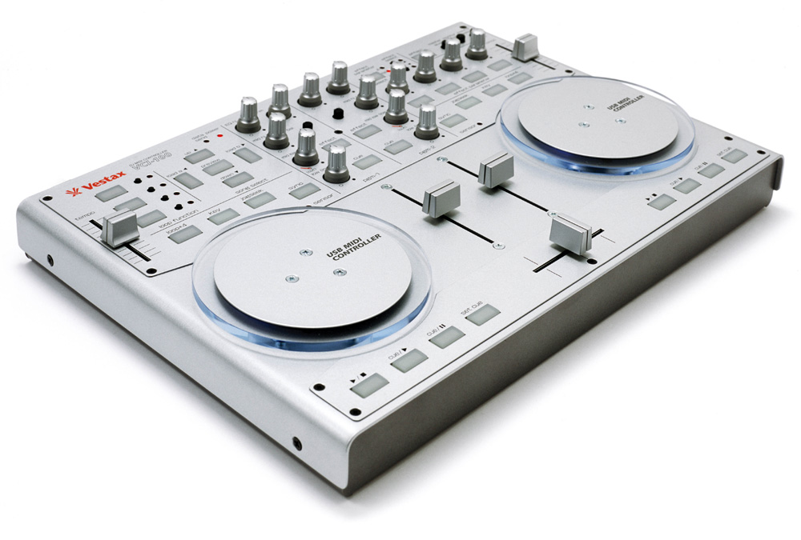

# Vestax VCI-100 MKI

The Vestax VCI-100 was one of the first commercially successful DJ-specific MIDI controllers, released in 2006.
This controller has been discontinued as Vestax went out of business in 2014.

:::{versionadded} 1.6
:::
## Firmware versions

- **1.1 Firmware**: Stock firmware from manufacturer. Has "ramp up problem".
- **1.2 Firmware**: Stock firmware from manufacturer. VCI-100s with a green sticker on the back are firmware version 1.2. Solved the ramp up problem but still has several bugs including the fourth FX buttons sending the same MIDI message as the right headphone cue button. **Supported by Mixxx community.**
- **1.3 Firmware**: DJ Techtools firmware shipped on the DJ Techtools VCI-100SE. Not currently supported by Mixxx community.
- **1.4 Firmware**: VCI-100 unofficial firmware 1.4 by DaveX (from DJ Techtools). Not currently supported by Mixxx community.

:::{note}
Only Firmware version 1.2 is supported by Mixxx.
:::
:::{note}
Unfortunately a detailed description of this controller mapping is still missing.
If you own this controller, please consider
[contributing one](https://github.com/mixxxdj/mixxx/wiki/Contributing-Mappings#user-content-documenting-the-mapping).
:::
